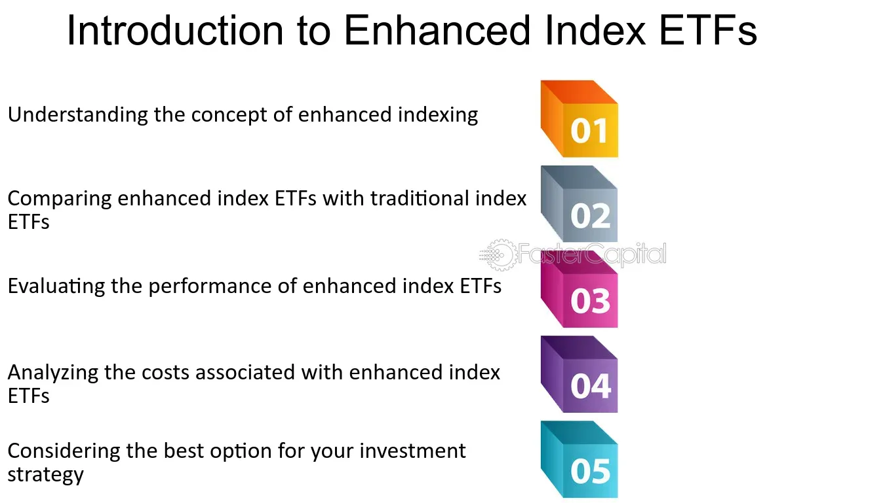

## Table of Contents

## What is an Enhanced Index Fund?

An Enhanced Index Fund is a type of investment fund that aims to beat the performance of a specific market index, like the S&P 500, while still closely tracking it. Unlike a traditional index fund, which simply tries to match the performance of an index by holding all the stocks in the same proportions as the index, an enhanced index fund uses various strategies to try to do a bit better. These strategies might include things like focusing on certain stocks within the index that the fund managers think will do better, or using computer models to make small adjustments to the fund's holdings.

The main goal of an enhanced index fund is to provide investors with slightly higher returns than a regular index fund, without taking on too much more risk. This can be appealing to investors who want to stay closely tied to the overall market's performance but are looking for a little extra boost. However, it's important to remember that while these funds aim to outperform the index, there's no guarantee they will succeed, and the extra strategies they use can sometimes lead to higher costs for investors.

## How does an Enhanced Index Fund differ from a traditional index fund?

An Enhanced Index Fund and a traditional index fund both aim to follow a specific market index, like the S&P 500. But they do this in different ways. A traditional index fund tries to match the performance of the index exactly. It does this by holding all the same stocks as the index, in the same amounts. This means if the index goes up or down, the traditional index fund will do the same.

An Enhanced Index Fund, on the other hand, tries to do a bit better than the index. It still follows the index closely, but it uses special strategies to try to get a little extra return. For example, it might pick certain stocks from the index that it thinks will do better, or it might use computer models to make small changes to what it owns. This means an Enhanced Index Fund might go up more than the index if its strategies work well, but it also might cost a bit more because of the extra work involved.

## What are the main objectives of an Enhanced Index Fund?

The main goal of an Enhanced Index Fund is to do better than a regular index fund while still staying close to the performance of a specific market index, like the S&P 500. It tries to beat the index by using smart strategies, like [picking](/wiki/asset-class-picking) certain stocks from the index that it thinks will do well or using computer models to make small changes to its investments. This way, it aims to give investors a bit more return without taking on too much extra risk.

However, there's no guarantee that an Enhanced Index Fund will actually beat the index. Sometimes the strategies might not work as planned, and the fund might not do any better than a regular index fund. Also, because it uses these extra strategies, an Enhanced Index Fund might cost a bit more for investors to own. So, while it tries to offer a little extra boost, it's important for investors to understand the risks and costs involved.

## What strategies do Enhanced Index Funds use to outperform the market?

Enhanced Index Funds use different strategies to try to do better than the market. One common strategy is stock selection. This means the fund picks certain stocks from the index that it thinks will do better than others. For example, if the fund believes that tech companies will grow faster, it might put more money into tech stocks than the index does. Another strategy is called quantitative modeling. This involves using computers and math to figure out which stocks to buy or sell. The fund might use these models to make small changes to its investments, hoping to get a better return.

Another strategy Enhanced Index Funds might use is called risk management. This involves trying to reduce the chance of losing money by adjusting the fund's investments. For instance, if the fund thinks the market might go down, it might sell some stocks or buy safer investments. Lastly, some Enhanced Index Funds use a strategy called [factor](/wiki/factor-investing) investing. This means they focus on certain characteristics of stocks, like how big the company is, how much it's growing, or how cheap its stock price is compared to its earnings. By focusing on these factors, the fund tries to pick stocks that will do better than the overall market.

All these strategies aim to give investors a bit more return than a regular index fund, but they also come with extra costs and risks. The fund might not always pick the right stocks or make the best decisions, so there's no guarantee it will beat the market. But if the strategies work well, an Enhanced Index Fund can offer a nice boost over just following the market closely.

## What are the common benchmarks used by Enhanced Index Funds?

Enhanced Index Funds usually try to do better than well-known market indexes. The most common benchmark is the S&P 500, which is a big index that tracks the performance of 500 large companies in the United States. Many Enhanced Index Funds aim to beat this index because it's a good way to measure how the overall U.S. stock market is doing. Another common benchmark is the Dow Jones Industrial Average, which follows 30 big U.S. companies. This index is also popular because it gives a snapshot of how some of the biggest and most important companies in the U.S. are doing.

Other benchmarks used by Enhanced Index Funds include the Nasdaq Composite, which focuses on technology and internet companies, and the Russell 2000, which tracks small U.S. companies. These indexes help Enhanced Index Funds show that they can do better than specific parts of the market. By choosing a benchmark that matches their strategy, Enhanced Index Funds can show investors how well they're doing compared to the market they're trying to beat.

## How is risk managed in an Enhanced Index Fund?

Enhanced Index Funds try to manage risk by making smart choices about which stocks to buy and sell. They might use computer models to figure out which stocks are safer or more likely to do well. If the fund thinks the market might go down, it could sell some stocks or buy safer investments like bonds. This way, the fund tries to protect the money investors have put in, even if the market goes through a rough patch.

Another way Enhanced Index Funds manage risk is by using something called factor investing. This means they look at certain things about stocks, like how big the company is or how fast it's growing. By focusing on these factors, the fund tries to pick stocks that are less likely to lose money. This can help the fund do better than the market while also keeping the risk under control. But even with these strategies, there's always some risk involved, so the fund can't promise it will always beat the market or avoid losses.

## What are the typical costs associated with Enhanced Index Funds?

Enhanced Index Funds usually have higher costs than regular index funds. This is because they use special strategies to try to do better than the market. These strategies can involve a lot of research and computer work, which costs money. So, the fees for Enhanced Index Funds can be higher. The most common fee is called the expense ratio, which is a percentage of your money in the fund that goes to pay for running the fund. For Enhanced Index Funds, this expense ratio might be around 0.2% to 0.5% a year, but it can be higher or lower depending on the fund.

Another cost to think about is the trading costs. Because Enhanced Index Funds are always trying to beat the market, they might buy and sell stocks more often than a regular index fund. Every time they trade, there's a cost, and these costs can add up. These trading costs are not always easy to see because they're not part of the expense ratio, but they can still affect how much money you make from the fund. So, even though Enhanced Index Funds try to do better than the market, the higher costs can make it harder for them to actually beat a regular index fund after all the fees are taken out.

## How do Enhanced Index Funds select and weight their securities?

Enhanced Index Funds pick and weigh their stocks in a smart way to try to do better than the market. They start by choosing stocks from the same index they are trying to beat, like the S&P 500. But instead of just buying all the stocks in the same amounts as the index, they use special strategies to pick certain stocks they think will do well. For example, they might use computer models to figure out which stocks are likely to grow faster or be safer. They might also focus on stocks that have certain features, like being cheaper than other stocks or coming from companies that are growing quickly.

After picking the stocks, Enhanced Index Funds decide how much to invest in each one. This is called weighting. Instead of just copying the index's weights, they might put more money into the stocks they think will do the best. For example, if they believe tech stocks will do well, they might put a bigger part of the fund's money into those stocks than the index does. They might also use their computer models to change how much they invest in each stock over time, trying to get a better return. This way, they hope to beat the market while still staying close to the index's performance.

## What are the performance metrics used to evaluate Enhanced Index Funds?

Enhanced Index Funds are evaluated using several performance metrics to see how well they are doing compared to the market. One important metric is the fund's return, which shows how much money the fund has made over a certain time. This is compared to the return of the benchmark index, like the S&P 500, to see if the fund is beating the market. Another key metric is the fund's risk-adjusted return, which looks at how much return the fund is getting for the amount of risk it's taking. This is often measured using something called the Sharpe Ratio, which helps investors understand if the extra return is worth the extra risk.

Another important metric is tracking error, which measures how closely the fund follows its benchmark index. A lower tracking error means the fund is staying closer to the index, while a higher tracking error means it's straying further away. This can show how much the fund's strategies are affecting its performance. Finally, investors also look at the fund's alpha, which measures the fund's performance compared to what would be expected given its level of risk. A positive alpha means the fund is doing better than expected, while a negative alpha means it's doing worse. These metrics help investors decide if an Enhanced Index Fund is a good choice for their money.

## How do Enhanced Index Funds handle market volatility?

Enhanced Index Funds try to handle market [volatility](/wiki/volatility-trading-strategies) by using smart strategies. They might use computer models to figure out which stocks are safer to invest in during times when the market is going up and down a lot. If the fund thinks the market might go down, it could sell some stocks or buy safer investments like bonds. This way, the fund tries to protect the money investors have put in, even if the market is having a rough time.

Another way Enhanced Index Funds deal with market volatility is by focusing on certain things about stocks, like how big the company is or how fast it's growing. By picking stocks that are less likely to lose a lot of money during market swings, the fund tries to keep the risk under control. Even with these strategies, there's always some risk involved, so the fund can't promise it will always avoid losses when the market is volatile.

## What are the tax implications of investing in Enhanced Index Funds?

When you invest in an Enhanced Index Fund, you need to think about taxes. These funds often buy and sell stocks more often than regular index funds. Every time they sell a stock for more than they paid for it, they might have to pay capital gains tax. This tax can be passed on to you, the investor. So, if the fund does a lot of trading, you might end up with a bigger tax bill at the end of the year.

Another thing to keep in mind is that the dividends you get from the stocks in the fund are also taxable. If the fund holds stocks that pay dividends, those dividends are usually passed on to you. Depending on how much you make and where you live, you might have to pay taxes on those dividends. So, even though Enhanced Index Funds try to beat the market, the extra trading and dividends can lead to higher taxes for you.

## How do regulatory environments affect the operation of Enhanced Index Funds?

Regulatory environments can have a big impact on how Enhanced Index Funds work. Different countries have rules that funds need to follow. These rules can affect what the fund can invest in, how much risk it can take, and how it has to report its activities. For example, in the United States, the Securities and Exchange Commission (SEC) has rules that funds must follow to make sure they are being fair and honest with investors. If the rules change, the fund might need to change how it picks stocks or how often it trades, which can affect its performance.

These regulations also aim to protect investors. They make sure that funds are clear about what they are doing and that they don't take too much risk. For example, funds might need to show how they are trying to beat the market and what strategies they are using. If a fund doesn't follow the rules, it could get in trouble and might even have to pay fines. So, the regulatory environment can shape how Enhanced Index Funds operate and try to do better than the market.

## What is the evolution of Enhanced Index Funds?

Enhanced index funds represent an evolution from traditional index funds by integrating active management strategies to potentially outperform the standard benchmarks. Unlike conventional index funds that strictly track a given market index, enhanced index funds employ a combination of passive and active management approaches. This strategy seeks to retain the low-cost benefits of passive investing while introducing elements of active management to optimize performance.

One of the key features of enhanced index funds is their use of qualitative and quantitative analyses to adjust stock weightings within the portfolio. This involves sophisticated modeling techniques to identify securities that are expected to perform better than those in the traditional index. By adjusting the weights of these securities, fund managers aim to generate higher returns than a purely passive index-tracking approach.

Enhanced index funds also utilize tools such as leverage and derivatives to further augment returns. Leverage involves borrowing capital to increase the size of the investment position, which, while potentially amplifying returns, also increases risk exposure. Similarly, derivatives such as options and futures can be used to hedge risks or speculate on market movements. These strategies introduce additional complexity and risks, including potential losses greater than the initial investment.

The primary objective of enhanced index funds is to achieve superior risk-adjusted returns compared to traditional index funds. This involves striving for higher returns without proportionally increasing risk. To evaluate the performance of enhanced index funds, metrics like the Sharpe ratio can be useful, as they consider both return and risk. The formula for the Sharpe ratio is:

$$
\text{Sharpe Ratio} = \frac{E[R_i] - R_f}{\sigma_i}
$$

Where $E[R_i]$ is the expected return of the investment, $R_f$ is the risk-free rate, and $\sigma_i$ is the standard deviation of the investment's excess return.

In conclusion, enhanced index funds blend the attributes of traditional passive strategies with active management techniques to seek improved investment outcomes. While these funds offer the potential for higher returns, they require careful management of the additional risks intrinsic to their strategies.

## References & Further Reading

[1]: Investment Company Institute. (2022). ["Equity and Bond Ownership in America."](https://icifactbook.org/2022/21-research.html)

[2]: Lopez de Prado, M. (2018). ["Advances in Financial Machine Learning"](https://www.amazon.com/Advances-Financial-Machine-Learning-Marcos/dp/1119482089). Wiley.

[3]: Aronson, D. R. (2007). ["Evidence-Based Technical Analysis: Applying the Scientific Method and Statistical Inference to Trading Signals"](https://onlinelibrary.wiley.com/doi/book/10.1002/9781118268315). Wiley.

[4]: Jansen, S. (2020). ["Machine Learning for Algorithmic Trading: Predictive Models to Extract Signals from Market and Alternative Data for Systematic Trading Strategies with Python"](https://github.com/stefan-jansen/machine-learning-for-trading). Packt Publishing.

[5]: Chan, E. P. (2008). ["Quantitative Trading: How to Build Your Own Algorithmic Trading Business"](https://github.com/ftvision/quant_trading_echan_book). Wiley.