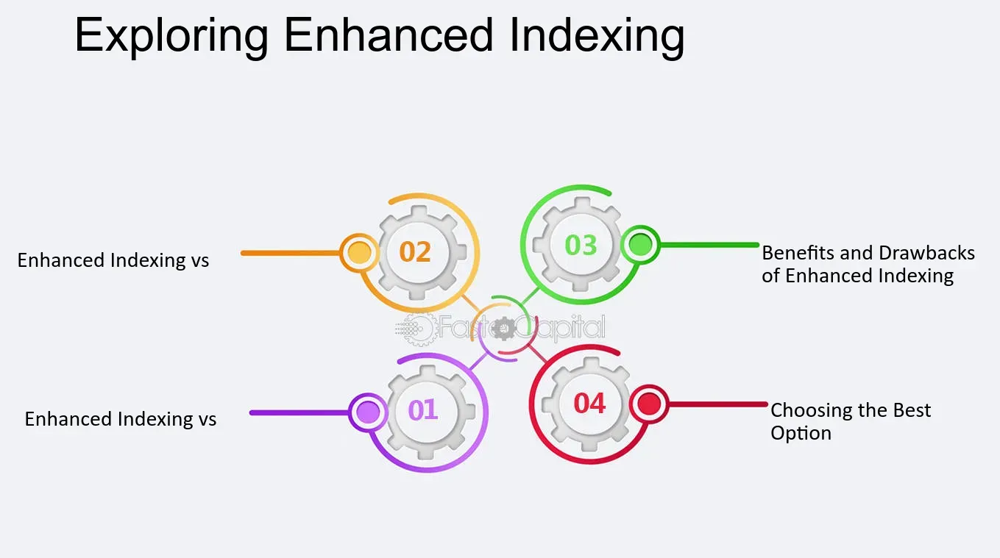

## Table of Contents

## What is enhanced indexing?

Enhanced indexing is a way to invest money that tries to do a bit better than just following a market index, like the S&P 500. It's kind of like a mix between two other ways to invest: passive investing, where you just follow an index, and active investing, where someone picks stocks they think will do well. With enhanced indexing, the goal is to beat the index by a little bit, but without taking too much risk.

To do this, people who manage enhanced index funds might use some smart tricks. They might slightly change the weights of the stocks in the index, or they might use computer models to pick stocks that are likely to do a bit better than the average. The idea is to get a small boost in returns without straying too far from the safety of the index. This way, investors can hopefully get a bit more money without taking on too much extra risk.

## How does enhanced indexing differ from traditional indexing?

Enhanced indexing and traditional indexing are two ways to invest money, but they have some key differences. Traditional indexing, also known as passive investing, means you simply buy all the stocks in a market index, like the S&P 500, in the same amounts as they are in the index. The goal is to match the performance of the index, not to beat it. This is a straightforward and low-cost way to invest, but it won't give you returns that are better than the market average.

Enhanced indexing, on the other hand, tries to do a bit better than the market index. People who manage enhanced index funds use some smart strategies to slightly change the mix of stocks or use computer models to pick stocks that might do a little better. The idea is to get a small boost in returns without taking on too much extra risk. So, while traditional indexing aims to match the market, enhanced indexing aims to beat it by a small margin, offering a middle ground between passive and active investing.

## What are the main types of enhanced indexing strategies?

Enhanced indexing strategies come in different forms, but they all aim to do a bit better than just following a market index. One common strategy is called "tilting," where the fund manager slightly changes the weights of the stocks in the index. For example, they might put a bit more money into stocks that they think will do better than average. Another strategy is called "quantitative modeling," where the manager uses computer models to pick stocks based on certain data and patterns. These models look at things like a company's financial health or how the stock has been doing in the past to make their picks.

Another type of enhanced indexing strategy is "risk-controlled" investing. This means the manager tries to reduce risk by using techniques like hedging, where they might buy or sell other investments to protect against losses. They might also use something called "sector rotation," where they shift money from one part of the market to another based on where they think the best opportunities are. All these strategies aim to give investors a little extra return without straying too far from the safety of the index.

## Can you explain factor-based enhanced indexing?

Factor-based enhanced indexing is a way to try to do a bit better than the market by focusing on certain things, called "factors," that can help pick stocks that might do well. These factors are like special qualities that some stocks have, like being cheaper than others, or growing faster, or being less risky. When someone uses [factor](/wiki/factor-investing)-based enhanced indexing, they look at these qualities and pick stocks that have them, hoping that these stocks will do better than the average stock in the market.

For example, one common factor is "value," which means [picking](/wiki/asset-class-picking) stocks that are cheaper than others. Another factor is "[momentum](/wiki/momentum)," which means picking stocks that have been going up in price recently. By focusing on these factors, the person managing the fund can change the mix of stocks a little bit from what's in the regular index. The goal is to get a small boost in returns without taking on too much extra risk, by using these special qualities to guide their choices.

## What is smart beta and how does it relate to enhanced indexing?

Smart beta is a way to invest money that tries to do better than just following a market index, like the S&P 500. Instead of just buying all the stocks in the index the same way, smart beta looks at certain qualities, or "factors," that can help pick stocks that might do well. These factors could be things like how cheap a stock is, how fast a company is growing, or how steady its price is. By focusing on these factors, smart beta tries to get a bit more return than you would get from just following the index.

Smart beta is closely related to enhanced indexing because both aim to beat the market by a little bit, without taking on too much extra risk. Enhanced indexing uses different strategies to slightly change the mix of stocks in the index, and smart beta is one of those strategies. It's like a specific type of enhanced indexing that uses these special factors to guide its choices. So, if you're using smart beta, you're also using enhanced indexing, but you're doing it in a way that focuses on these important qualities of stocks.

## How do fundamental indexing strategies work in enhanced indexing?

Fundamental indexing is a way to pick stocks for an enhanced indexing strategy by looking at things other than just how big a company is. Instead of using a company's size, or "market capitalization," to decide how much of it to buy, fundamental indexing looks at things like how much money a company makes, how much it owns, or how much it pays out to its owners. The idea is to find stocks that might be a better value or have better long-term growth, by focusing on these "fundamentals" of the company.

By using fundamental indexing, people managing an enhanced index fund can change the mix of stocks to hopefully do a bit better than the market. They might put more money into companies that have strong fundamentals, even if those companies are not the biggest ones in the index. This way, they can try to beat the market a little bit, without taking on too much extra risk. Fundamental indexing is just one of the smart ways to try to get a small boost in returns when using enhanced indexing strategies.

## What are the potential benefits of using enhanced indexing over passive indexing?

Enhanced indexing can offer a few advantages over passive indexing. The main benefit is that it tries to do a little better than just following the market. By using smart strategies like tilting the weights of stocks or using computer models, enhanced indexing aims to get a small boost in returns. This means you might make a bit more money than you would if you just stuck to a regular index fund.

Another benefit is that enhanced indexing can still be safer than fully active investing. While it tries to beat the market, it doesn't take on as much risk as someone picking stocks on their own. Enhanced indexing stays close to the index, so it's less likely to have big losses. This makes it a good middle ground for people who want a bit more return but don't want to take on too much extra risk.

## What are the common disadvantages of enhanced indexing?

One common disadvantage of enhanced indexing is that it might not always beat the market. Even though it tries to do a bit better, it can still end up doing the same or worse than just following the index. This means you might not get the extra return you were hoping for, and you could be disappointed if the strategy doesn't work out.

Another disadvantage is that enhanced indexing can be more expensive than passive indexing. Because it uses more complicated strategies, like tilting the weights of stocks or using computer models, it can cost more to manage. These higher fees might eat into any extra returns you get, making it less worthwhile in the end.

## How does enhanced indexing impact portfolio risk and return?

Enhanced indexing tries to give you a bit more return than just following the market, but it also changes the risk in your portfolio. By using smart strategies like tilting the weights of stocks or using computer models, enhanced indexing aims to beat the market a little bit. This can mean you might make a bit more money than if you stuck to a regular index fund. But, because it's trying to do better than the market, there's also a chance it might not work out, and you could end up with the same or even worse returns.

At the same time, enhanced indexing tries to keep the risk lower than fully active investing. It stays close to the index, so it's less likely to have big losses. This makes it a good middle ground if you want a bit more return but don't want to take on too much extra risk. Still, the strategies used in enhanced indexing can be more expensive, and these higher fees might eat into any extra returns you get. So, while enhanced indexing can help with both risk and return, it's important to think about the costs and the chance that it might not always beat the market.

## What are the costs associated with implementing an enhanced indexing strategy?

Implementing an enhanced indexing strategy can be more expensive than sticking with a regular index fund. This is because enhanced indexing uses more complicated strategies, like tilting the weights of stocks or using computer models to pick stocks. These strategies need more work and smarter tools, which means the people managing the fund might charge higher fees. These fees can eat into any extra returns you might get from enhanced indexing, making it less worthwhile if the costs are too high.

On top of the management fees, there can be other costs too. For example, if the fund manager is buying and selling stocks more often to try to beat the market, there might be more trading costs. These costs can add up over time and also take away from your returns. So, while enhanced indexing can try to give you a bit more money than a regular index fund, you need to think about all these costs and see if the extra return is worth it.

## How can enhanced indexing be tailored to specific investment goals?

Enhanced indexing can be tailored to meet specific investment goals by adjusting the strategies used to pick and weight stocks. For example, if your goal is to focus on growth, the fund manager might use a strategy that tilts the portfolio toward stocks with high growth potential. This could mean using factors like earnings growth or revenue growth to pick stocks that are expected to do well in the future. On the other hand, if your goal is to reduce risk, the manager might use a risk-controlled strategy, where they use hedging techniques or shift money into less risky parts of the market. By choosing the right strategies, enhanced indexing can be customized to fit what you want to achieve with your investments.

Another way to tailor enhanced indexing is by focusing on specific sectors or themes that align with your investment goals. If you're interested in technology or healthcare, for example, the fund manager can adjust the portfolio to have more stocks from those sectors. This way, you can benefit from the potential growth in areas you believe in. Additionally, if you want to invest in a socially responsible way, the manager can use [ESG](/wiki/esg-investing) (Environmental, Social, and Governance) factors to pick stocks that match your values. By customizing the approach, enhanced indexing can help you meet your unique investment goals while still trying to do a bit better than the market.

## What advanced techniques are used in expert-level enhanced indexing strategies?

Expert-level enhanced indexing strategies use some very smart techniques to try to beat the market a little bit. One of these techniques is called "multi-factor modeling." This means the fund manager uses several different factors, like how cheap a stock is, how fast it's growing, or how steady its price is, all at the same time. By looking at these different factors together, the manager can pick stocks that have a good mix of these qualities, hoping to get better returns. Another technique is "dynamic asset allocation," where the manager keeps changing the mix of stocks based on what's happening in the market. If they think one part of the market will do better soon, they might put more money into those stocks.

Another advanced technique is "[machine learning](/wiki/machine-learning)." This is where the manager uses computers to learn from past data and find patterns that can help pick stocks. The computer looks at lots of information and tries to figure out what worked well before, so it can make better choices in the future. Lastly, some expert-level strategies use "[alternative data](/wiki/best-alternative-data)," like information from social media or satellite images, to get an edge. By using all these smart techniques, expert-level enhanced indexing tries to do a bit better than the market, but it's still important to remember that these strategies can be more expensive and might not always work out.

## What are the disadvantages of traditional indexing?

Traditional indexing, as a passive investment strategy, fundamentally seeks to replicate the performance of a specific market index. While this method offers several benefits, it is not without its disadvantages. A notable limitation of traditional indexing is the intrinsic inability to outperform the market since index funds merely aim to track the designated index. This inherent performance cap can be a drawback for investors seeking to achieve superior returns.

Index funds are inherently subject to market risk. Because these funds are directly tied to the performance of their respective indices, they are vulnerable to significant losses during market downturns. This susceptibility means that in bear markets, investors may face substantial declines in portfolio value, undermining the perceived stability of their investments.

Another challenge associated with traditional indexing is tracking error. This refers to the divergence between the actual performance of an index fund and the benchmark index it aims to follow. Tracking error can arise from various factors, such as fund management costs, cash drag (holding cash instead of investing it), and the inefficiencies in replicating the exact index due to [liquidity](/wiki/liquidity-risk-premium) constraints or regulatory restrictions. Tracking error is quantified as follows: 

$$
\text{Tracking Error} = \sqrt{\frac{1}{N-1} \sum_{i=1}^{N} (R_i - B_i)^2}
$$

where $R_i$ is the return of the fund, $B_i$ is the return of the benchmark index, and $N$ is the number of return observations.

In conclusion, while traditional indexing offers a straightforward and cost-effective means for investors to gain diversified market exposure, its disadvantages stem from its lack of outperforming capability, susceptibility to market downturns, and the presence of tracking error. Investors must carefully weigh these factors when considering index funds as part of their portfolio strategy.

## References & Further Reading

[1]: ["A Random Matrix Theory Approach to Denoise Covariance Matrices in Portfolio Optimization"](https://portfoliooptimizer.io/blog/correlation-matrices-denoising-results-from-random-matrix-theory/) by Romain Couillet and Marco S. Zuluaga, Journal of Investment Strategies.

[2]: ["Winning the Loser's Game: Timeless Strategies for Successful Investing"](https://www.amazon.com/Winning-Losers-Game-Strategies-Successful/dp/1264258461) by Charles D. Ellis

[3]: ["Indexing Theory and Methodology"](https://onlinelibrary.wiley.com/doi/abs/10.1002/9781118541555.wbiepc180), CFA Institute Research Foundation

[4]: ["Algorithmic Trading and DMA: An Introduction to Direct Access Trading Strategies"](https://archive.org/details/algorithmictradi0000john) by Barry Johnson

[5]: ["Understanding Cryptocurrencies and the Future of Money"](https://www.ie.edu/cgc/research/cryptocurrencies-future-money/) by Paul Vigna and Michael J. Casey