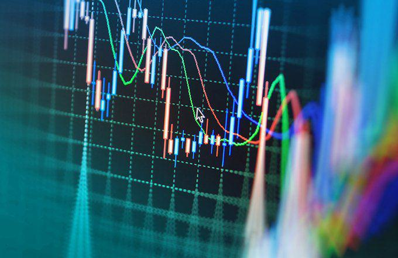

Indexing in investments involves replicating the performance of a specific market index, such as the S&P 500 or the Dow Jones Industrial Average. This strategy is integral to portfolio management, allowing investors to align their investments with the broader market's performance. Indexing serves as a cornerstone in investment management, providing a framework for varied investment strategies that aim to mimic the market return rather than outperform it. 

This approach encapsulates several critical facets, including types of indexing, advantages, and challenges. Traditional indexing, characterized by its passive investment strategy, offers benefits like lower fees and diversification but comes with its drawbacks such as market risk and tracking error. Conversely, enhanced indexing attempts to strike a balance between passive and active management, aiming to surpass the benchmark with strategies involving sectoral adjustments and optimized trading techniques.



An understanding of indexing extends to the intricate role of algorithmic trading, which facilitates efficient trade executions based on complex algorithms. This aspect is particularly relevant to enhanced indexing methods, which leverage technology to optimize returns by exploiting market inefficiencies. By exploring these components, investors can better navigate the complex landscape of financial markets to manage and optimize their portfolios effectively.

## Table of Contents

## Understanding Indexing

Indexing is a fundamental investment strategy designed to mirror the performance of a specific market index, such as the S&P 500 or the Dow Jones Industrial Average. This strategy operates on the principle of passive management, which entails constructing a portfolio that matches the constituents and weighting of a chosen index. The primary objective is to track the index's returns as closely as possible, without the frequent buying and selling of securities that active management would require.

The benefits of indexing are numerous, particularly in terms of cost-effectiveness and diversification. Since index funds or exchange-traded funds (ETFs) are not actively managed, they incur lower management fees compared to actively managed funds. Management fees are a significant consideration for investors, as lower fees translate directly into higher net returns over time. Additionally, by holding a diversified set of securities that make up a broad index, investors diversify their risk across various industries and sectors, which may reduce the impact of any single security's poor performance on the overall portfolio.

Despite its advantages, traditional indexing does present certain drawbacks. While the goal is to closely follow the index, index funds do not possess the flexibility to outperform it. They are designed to neither outperform nor underperform the index, which might frustrate investors seeking to achieve higher returns. Moreover, traditional index funds are not immune to market fluctuations and inherent market risks. Since they follow the index, they can decline in value as much as the market itself during downturns.

Tracking error is another consideration in the context of traditional indexing. It refers to the variability in the difference between the portfolio's returns and the index's returns. A perfect replica index fund would have a tracking error of zero, but various factors such as transaction costs, management fees, and the fund's cash holdings can lead to tracking errors. Although typically small, these discrepancies can impact the extent to which an investor's returns match the index.

## Disadvantages of Traditional Indexing

Traditional indexing, as a passive investment strategy, fundamentally seeks to replicate the performance of a specific market index. While this method offers several benefits, it is not without its disadvantages. A notable limitation of traditional indexing is the intrinsic inability to outperform the market since index funds merely aim to track the designated index. This inherent performance cap can be a drawback for investors seeking to achieve superior returns.

Index funds are inherently subject to market risk. Because these funds are directly tied to the performance of their respective indices, they are vulnerable to significant losses during market downturns. This susceptibility means that in bear markets, investors may face substantial declines in portfolio value, undermining the perceived stability of their investments.

Another challenge associated with traditional indexing is tracking error. This refers to the divergence between the actual performance of an index fund and the benchmark index it aims to follow. Tracking error can arise from various factors, such as fund management costs, cash drag (holding cash instead of investing it), and the inefficiencies in replicating the exact index due to [liquidity](/wiki/liquidity-risk-premium) constraints or regulatory restrictions. Tracking error is quantified as follows: 

$$
\text{Tracking Error} = \sqrt{\frac{1}{N-1} \sum_{i=1}^{N} (R_i - B_i)^2}
$$

where $R_i$ is the return of the fund, $B_i$ is the return of the benchmark index, and $N$ is the number of return observations.

In conclusion, while traditional indexing offers a straightforward and cost-effective means for investors to gain diversified market exposure, its disadvantages stem from its lack of outperforming capability, susceptibility to market downturns, and the presence of tracking error. Investors must carefully weigh these factors when considering index funds as part of their portfolio strategy.

## Types of Indexing

Indexing techniques vary widely, and investors can choose from several strategies, including market capitalization indexing, equal-weight indexing, and fundamental indexing. Each of these methods provides distinct advantages and is tailored to different investor profiles, taking into consideration factors such as cost, risk tolerance, and investment objectives.

**Market Capitalization Indexing** is the most widely-used indexing method. It involves weighting securities in an index in proportion to their market capitalization. This approach typically reflects the way broad market indices, such as the S&P 500, are structured. A key advantage of market capitalization indexing is its simplicity and the fact that it naturally adjusts to changes in market valuation; larger companies have more influence on the index. However, this strategy can also lead to over-concentration in a few large stocks, potentially increasing exposure to company-specific risks.

**Equal-Weight Indexing** assigns identical weights to all constituents in the index, ensuring that each security has an equal impact on the index's performance. This method can help mitigate the risk of over-concentration and offer greater exposure to smaller securities, often resulting in higher diversification. However, maintaining an equal-weight index typically incurs higher transaction costs due to the need for regular rebalancing to maintain equal weights, which can affect overall returns.

**Fundamental Indexing** takes a different approach by weighting securities based on fundamental measures such as earnings, dividends, sales, or book value, rather than market capitalization. This strategy aims to provide a more stable and economically sound portfolio by aligning the index more closely with the fundamentals of the underlying securities. Fundamental indexing is designed to avoid some of the limitations of cap-weighted indices, such as the overvaluation risk associated with large-cap stocks. However, this method can introduce complexity and higher costs because of the need for detailed fundamental analysis.

The choice of indexing strategy depends significantly on an investor's goals. For instance, an investor looking for lower costs and ease of management might prefer market capitalization indexing, while another seeking greater diversification may opt for equal-weight indexing. Conversely, fundamental indexing could be more suited for those focused on long-term growth aligned with economic fundamentals. Each strategy carries its own set of risks and benefits, and investors should carefully evaluate their objectives and risk tolerance before deciding on a preferred indexing methodology.

## Enhanced Indexing Explained

Enhanced indexing is a sophisticated investment strategy that bridges the gap between passive and active fund management. It is designed to outperform traditional market indices while still maintaining reduced costs and risks comparable to passive investment strategies. This approach optimizes portfolio performance by employing strategic deviations from standard index definitions.

The primary objective of enhanced indexing is to generate superior returns over a benchmark index without substantially increasing risk or costs. Unlike pure index tracking, which mirrors an index as closely as possible, enhanced indexing introduces selective adjustments to the portfolio. These adjustments could include overweighting or underweighting certain sectors, incorporating securities that are not part of the index, or timing market entry and exits to exploit price movements.

Several strategies fall under enhanced indexing:

1. **Enhanced Cash**: This strategy involves maintaining a position in cash equivalents that are managed proactively to incrementally increase return potential. Instead of holding a traditional cash buffer, these funds are deployed into higher-yielding short-term instruments, seeking returns superior to the standard returns on cash.

2. **Trading Enhancements**: This method focuses on optimizing the trading process, possibly through algorithmic trading techniques. By refining how and when trades are executed, enhanced indexing can minimize costs and benefit from transient market inefficiencies. For example, minor price discrepancies can be exploited through rapid trade execution, often managed by sophisticated trading algorithms.

3. **Tax-Managed Gains**: Within this framework, enhanced indexing attempts to improve after-tax returns by strategically buying and selling securities to minimize tax liabilities. This includes harvesting tax losses to offset gains, thus optimizing the tax efficiency of the portfolio. Tax-aware strategies involve sophisticated calculations to balance the timing of asset sales in relation to an investor's tax circumstances.

Overall, while enhanced indexing offers potential for better returns and varied benefits through strategic positioning, it also incorporates complexities and costs linked to active fund management. It requires refined analysis and execution, usually supported by advanced financial tools and technologies, to manage the delicate balance between risk, return, and cost.

## Advantages and Disadvantages of Enhanced Indexing

Enhanced indexing combines strategies from both active and passive investment management with the aim of achieving better returns while maintaining the lower costs typically associated with index investing. By strategically deviating from the benchmark index, enhanced indexing seeks to capitalize on investment opportunities that may not be fully realized by traditional indexing methods.

One of the primary advantages of enhanced indexing is its potential for increased profitability. This is often achieved through strategic sector positioning and precise market timing. By selectively tilting the portfolio towards sectors expected to outperform, or by adjusting allocations based on market conditions, enhanced indexing strategies can potentially generate higher returns than standard index funds. For example, if an investor anticipates that technology stocks will outperform the general market, an enhanced indexing strategy might allocate a greater proportion of the portfolio to technology stocks. This targeted approach can lead to improved performance compared to a conventional index-tracking investment.

Enhanced indexing can utilize techniques such as enhanced cash management and trading efficiencies to further boost returns. Enhanced cash strategies involve optimizing cash holdings or using instruments like short-term bonds to increase returns without significantly increasing risk. Trading enhancements might focus on minimizing transaction costs or improving execution, thereby enhancing the overall return of the index strategy.

However, these strategies are not without their disadvantages. Enhanced indexing inherently involves higher costs than purely passive indexing, primarily due to its active management component. Management fees may be higher because of the research, analysis, and frequent trading required to implement the strategic deviations from the index. While these costs can be justified if the strategy outperforms the benchmark, they can erode returns if the enhanced indexing strategy does not perform as expected.

Additionally, the incorporation of active management elements introduces greater risk. Strategic sector positioning and market timing require accurate predictions about market movements and sector performance, which are inherently uncertain. Poor predictions or misaligned strategies can lead to underperformance relative to traditional index funds. Investors must also consider potential tracking error, which is the degree to which the performance of the enhanced index fund deviates from its benchmark.

In conclusion, while enhanced indexing offers the possibility of increased returns through strategic deviations and active management techniques, it also requires investors to shoulder higher costs and accept greater risks than traditional index investing. Therefore, it's essential for investors to weigh these factors carefully and align their choices with their investment goals and risk tolerance.

## Role of Algo Trading in Enhanced Indexing

Algorithmic trading, often referred to as algo trading, is pivotal in enhanced indexing due to its capacity to execute complex trading strategies quickly and efficiently. Enhanced indexing, which seeks to deliver returns that outperform a benchmark index while retaining characteristics of systematic investing, relies heavily on the use of algorithms to manage and optimize portfolios.

Algo trading involves utilizing computer programs to automatically execute trades according to predefined strategies and criteria. By leveraging these algorithms, investors can ensure trades are executed at the best possible prices, reduce manual errors, and maintain consistency across portfolios. This efficiency is especially beneficial in enhanced indexing, where the aim is not merely to track an index, but to strategically deviate from it to enhance returns.

A significant advantage of [algorithmic trading](/wiki/algorithmic-trading) in this context is its ability to exploit market inefficiencies. For instance, algorithms can be programmed to identify [arbitrage](/wiki/arbitrage) opportunities or capitalize on short-term market trends faster than human traders. This is achieved through rapid data analysis and executing orders based on quantitative models that [factor](/wiki/factor-investing) in price movements, market sentiment, and other relevant metrics.

Here's a simplistic example of how a basic algorithm might be structured for enhanced indexing:

```python
# Example of a basic trading algorithm structure
import pandas as pd

def enhanced_index_strategy(data):
    # Assuming 'data' is a pandas DataFrame with historical price information
    signals = pd.DataFrame(index=data.index)
    signals['signal'] = 0.0

    # Example strategy component: moving average crossover
    short_window = 40
    long_window = 100

    # Creating short simple moving average
    signals['short_mavg'] = data['price'].rolling(window=short_window, min_periods=1, center=False).mean()

    # Creating long simple moving average
    signals['long_mavg'] = data['price'].rolling(window=long_window, min_periods=1, center=False).mean()

    # Generating signals: 1 when short_mavg > long_mavg, 0 otherwise
    signals['signal'][short_window:] = np.where(signals['short_mavg'][short_window:] > signals['long_mavg'][short_window:], 1.0, 0.0)

    # Calculating positions based on signals
    signals['positions'] = signals['signal'].diff()

    return signals

# Assuming 'market_data' is fetched from an API or a data source
# signals = enhanced_index_strategy(market_data)
```

This hypothetical strategy could help an enhanced index fund adjust its position dynamically, based on moving average crossovers of the indexed securities, potentially improving portfolio returns.

Furthermore, algorithmic trading systems can backtest enhanced indexing strategies using historical data to verify their effectiveness before implementation. By simulating how a strategy would have performed in the past, investors can assess risk and potential profitability, allowing for more informed decision-making.

In summary, algorithmic trading serves as a cornerstone in implementing enhanced indexing strategies, facilitating precise and timely order execution while leveraging market inefficiencies to potentially increase investor returns. As technology continues to advance, the role of algo trading in enhanced indexing is likely to become even more integral, offering sophisticated tools for portfolio management and optimization.

## Conclusion

Indexing offers diverse strategies for investors looking to efficiently manage their portfolios. By understanding the nuances of both traditional and enhanced indexing, investors can align their choices with their personal financial goals. Traditional indexing provides a straightforward, low-cost way to mirror market index performance, appealing to those who prefer stable and predictable returns. Conversely, enhanced indexing offers the potential for higher returns by incorporating active management elements, albeit with increased costs and risks.

Selecting the appropriate strategy requires a comprehensive evaluation of one's risk tolerance and investment objectives. For example, an investor with a low-risk preference might prioritize the cost efficiency and diversification benefits of traditional indexing. In contrast, an investor seeking higher returns, willing to assume more risk, might explore enhanced indexing strategies and leverage algorithmic trading to optimize performance.

Ultimately, thorough research is essential before committing to an indexing strategy. Investors should consider factors such as market conditions, available financial products, and any costs associated with implementing these strategies. By assessing these elements, investors can make informed decisions that align with their financial ambitions and risk tolerances, ensuring a strategy that supports their long-term investment success.

## References & Further Reading

[1]: ["A Random Matrix Theory Approach to Denoise Covariance Matrices in Portfolio Optimization"](https://portfoliooptimizer.io/blog/correlation-matrices-denoising-results-from-random-matrix-theory/) by Romain Couillet and Marco S. Zuluaga, Journal of Investment Strategies.

[2]: ["Winning the Loser's Game: Timeless Strategies for Successful Investing"](https://www.amazon.com/Winning-Losers-Game-Strategies-Successful/dp/1264258461) by Charles D. Ellis

[3]: ["Indexing Theory and Methodology"](https://onlinelibrary.wiley.com/doi/abs/10.1002/9781118541555.wbiepc180), CFA Institute Research Foundation

[4]: ["Algorithmic Trading and DMA: An Introduction to Direct Access Trading Strategies"](https://archive.org/details/algorithmictradi0000john) by Barry Johnson

[5]: ["Understanding Cryptocurrencies and the Future of Money"](https://www.ie.edu/cgc/research/cryptocurrencies-future-money/) by Paul Vigna and Michael J. Casey