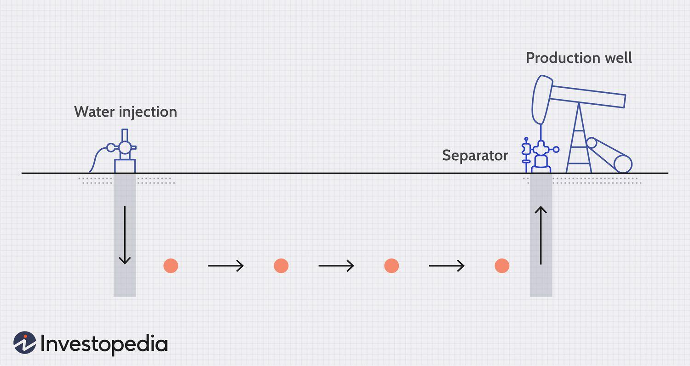

The energy industry is continuously evolving, with Enhanced Oil Recovery (EOR) techniques representing a significant advancement in the extraction of oil beyond traditional methods. EOR, commonly referred to as tertiary recovery, is crucial for prolonging the operational life of oil reservoirs and maximizing resource extraction. This technique is essential for accessing the remaining oil that cannot be efficiently recovered through primary and secondary methods, which rely mainly on natural reservoir energy and water flooding, respectively.

EOR has transformed the oil industry by introducing advanced methodologies that modify the physical and chemical properties of the reservoir to improve oil flow. As a result, these techniques have become vital in maintaining the viability of mature oil fields, thus supporting the steady supply of oil in response to global demand. The adoption of EOR has implications for the economy, as it influences the profitability of oil fields by allowing extraction from previously non-economical sites. Additionally, the environmental impact of these techniques is a critical consideration, particularly with the deployment of methods that involve chemical and gas injections.

Furthermore, the integration of algorithmic trading in EOR-related investments highlights the intersection of financial market strategies and technological advancements in oil recovery. Algorithmic trading plays a significant role in optimizing investment decisions, leveraging complex algorithms to analyze market data and enhance investment strategies in the oil sector.

This article investigates various EOR techniques, their importance in the oil industry, and their economic and environmental impacts. Additionally, it examines how algorithmic trading can optimize investments in EOR processes, emphasizing the interconnectedness of technological and financial advancements in the energy sector.

## Table of Contents

## Understanding Enhanced Oil Recovery (EOR)

Enhanced Oil Recovery (EOR) represents an advanced set of techniques aimed at extracting oil that primary and secondary methods leave untapped. The primary recovery utilizes natural reservoir pressure or artificial lift techniques to bring petroleum to the surface, capturing roughly 10-20% of the original oil in place. Secondary methods, typically water flooding, augment recovery rates to about 20-40%. However, further extraction necessitates the advent of EOR strategies, targeting the substantial proportion of oil remaining.

EOR modifies the chemical and physical properties of oil to enhance its flow from the reservoir through alterations in viscosity, interfacial tensions, or reservoir pressure. This necessity emerges predominantly due to the decreasing pressure within reservoirs over time, impeding traditional extraction efficiencies. As reservoirs mature, the natural ability to push oil out diminishes, hence the transition to EOR.

EOR technologies can be categorized primarily into three techniques: chemical, thermal, and gas injection methods. Chemical EOR involves the injection of substances such as polymers or surfactants. These chemicals aim to decrease the oil-water interfacial tension and increase the sweep efficiency, improving oil mobilization. Despite its potential effectiveness, the cost of chemicals and complex implementation processes may deter its widespread use.

Thermal EOR, including steam injection and cyclic steam stimulation, utilizes heat to reduce oil viscosity. Thermal methods are particularly effective in heavy oil reservoirs, where high viscosity poses significant challenges to extraction. By heating the oil, its flow towards the production wells becomes more manageable, thereby enhancing recovery rates.

Gas injection techniques utilize gases, notably carbon dioxide (CO2), to improve oil displacement efficiency. Injected gas can dissolve in the oil, swelling it and lowering its viscosity, or it can maintain or increase reservoir pressure. Gas injection is versatile, applicable in a greater range of reservoir conditions compared to other EOR methods.

While EOR methods showcase potential, they are often economically and technically challenging. The costs involved in implementing these technologies, coupled with fluctuating oil prices, can affect the feasibility of projects. Therefore, EOR is commonly employed when other recovery methods are fully utilized or when economic conditions, such as higher oil prices, justify such investments.

As the pursuit of maximizing oil recovery continues, the intricate design and application of EOR techniques are integral to sustaining the viability of mature oil fields. Continuous advancements in technology and economic models that efficiently manage the associated costs may pave the way for broader EOR adoption.

## Types of EOR Techniques

### Gas Injection

Gas injection is an Enhanced Oil Recovery (EOR) method that involves injecting gases, such as carbon dioxide (CO2), nitrogen (N2), or natural gas, into oil reservoirs to improve oil recovery. The primary mechanism by which gas injection enhances oil recovery is by increasing the pressure within the reservoir and reducing the viscosity of the [crude oil](/wiki/crude-oil), facilitating its flow towards production wells. CO2 injection, in particular, is widely used due to its ability to mix with oil and reduce its viscosity, thus improving the displacement efficiency. This technique is particularly effective in reservoirs with low pressure or those containing heavy oils.

### Thermal Recovery

Thermal recovery techniques are employed to reduce the viscosity of heavy oil and bitumen by increasing the temperature of the reservoir oil. The most common thermal methods are steam injection, cyclic steam stimulation (CSS), and in-situ combustion (fire flooding). Steam injection involves the introduction of steam into the reservoir, heating the oil and allowing it to flow more easily to the production wells. In-situ combustion, another thermal method, involves igniting a portion of the oil in the reservoir, generating heat to reduce oil viscosity. These methods are particularly effective for reservoirs with viscous crudes and require careful management of heat distribution.

### Chemical Injection

Chemical injection involves the use of chemical [agents](/wiki/agents) such as polymers, surfactants, and alkalis to improve oil recovery. Polymers are used to increase the viscosity of the injected water, improving sweep efficiency and ensuring a more uniform displacement of oil. Surfactants reduce the interfacial tension between oil and water, allowing trapped oil to be mobilized. However, chemical injection can be cost-prohibitive due to the high cost of chemicals and the need for precise formulation and distribution, which makes this method less commonly used compared to gas and thermal methods.

### Plasma Pulsing

Plasma pulsing is an emerging technique in EOR that utilizes low-energy plasma emissions to enhance oil recovery. This method involves generating plasma pulses in the reservoir, which can alter the physical properties of the oil, reducing its viscosity and enabling easier flow. Plasma pulsing is considered to be environmentally friendly as it requires no harmful chemicals and uses less energy compared to traditional methods. Although still in the research and development phase, plasma pulsing holds promise as a sustainable alternative in oil recovery processes.

Each EOR technique is selected based on specific reservoir conditions, economic feasibility, and environmental considerations. The choice of method depends on factors such as the type of oil in the reservoir, its temperature and pressure conditions, and the overall cost-benefit analysis of implementing these techniques in a given reservoir. The application of these techniques aims to maximize oil recovery while minimizing environmental impact.

## Economic and Environmental Impact

Enhanced Oil Recovery (EOR) techniques hold substantial promise for boosting oil recovery rates, offering the potential to transform marginally profitable or even non-viable oil reservoirs into economically attractive ventures. By extending the productive life of oil fields, EOR technologies can play a pivotal role in meeting global energy demands. However, several economic and environmental considerations influence the implementation and effectiveness of these technologies.

One of the primary economic factors affecting the feasibility of EOR projects is the fluctuation in oil prices. When oil prices are high, investing in EOR becomes more appealing, as the potential returns on extracted oil justify the significant capital and operational expenses involved in employing these advanced recovery methods. Conversely, low oil prices may deter such investments, as the costs may outweigh the potential benefits. Investors and oil companies must constantly evaluate market conditions and oil price forecasts to make informed decisions about deploying EOR technologies.

Another critical economic consideration is the cost of the specific EOR method employed. Techniques such as gas injection, thermal recovery, and chemical injection vary in their operational requirements and expenses. For example, gas injection, particularly with carbon dioxide (CO2), can be cost-effective under specific conditions, yet it may require substantial infrastructure investments. Thermal recovery methods demand large energy inputs, while chemical injection can be prohibitively expensive due to the cost of chemicals like polymers and surfactants. Innovations aimed at reducing these costs, such as plasma pulsing, are emerging and may alter the cost dynamics in the future.

On the environmental front, EOR methods, especially those utilizing gas injection, present notable challenges. The use of CO2 in gas injection raises concerns about greenhouse gas emissions and potential risks of leakage, contributing to environmental and regulatory scrutiny. The search for environmentally sustainable and less intrusive EOR methods is gaining [momentum](/wiki/momentum), driven by societal pressures and the industry's evolving commitment to reducing its carbon footprint.

One promising innovation is plasma pulsing, which involves using low-energy emissions to alter the physical properties of the oil and reservoir. This technique may offer a more environmentally friendly alternative to conventional methods, potentially reducing the ecological risks associated with EOR.

Ultimately, achieving a balance between economic gains and environmental protection constitutes a significant challenge in the deployment of EOR techniques. Oil companies and policymakers must strive to develop and implement strategies that maximize recovery while minimizing environmental impact. This dual focus is crucial to ensure the sustainable advancement of EOR technologies in the energy landscape.

## The Role of Algorithmic Trading in EOR Investments

Algorithmic trading has revolutionized investment strategies across various sectors, including the oil recovery industry, by employing sophisticated algorithms to execute trades and optimize investment decisions. In the context of Enhanced Oil Recovery (EOR) projects, which necessitate substantial capital commitments, [algorithmic trading](/wiki/algorithmic-trading) plays a critical role in enhancing investment outcomes.

EOR investments are heavily influenced by fluctuations in oil prices, operational costs, and market dynamics. Algorithmic trading systems can process vast amounts of market data to identify trends and patterns that may be imperceptible to human analysts. For instance, these systems utilize high-frequency trading algorithms that can analyze financial metrics and market conditions nearly instantaneously, enhancing decision-making speed. An algorithm might evaluate a combination of parameters such as moving averages, trading volumes, and historical price data to predict potential market movements and adjust investment portfolios accordingly.

These algorithms can perform complex calculations and probabilistic evaluations to assess risk factors and potential returns, providing investors with data-driven insights that assist in making well-informed choices. Furthermore, they can simulate various scenarios, offering predictions on how specific EOR investments might perform under different market conditions.

Another advantage of algorithmic trading is its ability to improve risk management in the inherently volatile energy markets. By continuously monitoring and analyzing real-time data, these algorithms are capable of identifying potential risks and recommending preemptive actions. For example, [machine learning](/wiki/machine-learning) models might be trained to recognize patterns associated with price [volatility](/wiki/volatility-trading-strategies) due to geopolitical events or shifts in supply and demand, enabling investors to mitigate risks proactively.

As the EOR industry continues to advance, the integration of algorithmic trading with oil recovery technologies is expected to deepen. This synergy will assist in aligning operational advancements with market strategies, ensuring that investments are not only economically viable but also resilient to the dynamic nature of global energy markets.

In conclusion, algorithmic trading is a vital tool in the strategic planning and execution of EOR investments. It enhances efficiency, optimizes resource allocation, and offers robust risk management capabilities. As both EOR techniques and trading algorithms evolve, their convergence will be instrumental in responding to the ever-changing landscape of the energy sector.

## Conclusion

Enhanced Oil Recovery (EOR) techniques are critical for optimizing oil extraction from mature fields, presenting both economic opportunities and inherent challenges. These advanced methods not only extend the productive lifespan of oil wells but also stimulate additional hydrocarbon extraction beyond what conventional methods can achieve. Although EOR practices can significantly boost oil recovery efficiency, their environmental implications, such as potential greenhouse gas emissions and ecological disruption, require careful consideration. As the industry seeks to reduce its environmental footprint, balancing these methods with sustainable practices is crucial.

The financial aspects of EOR implementations are equally intricate, necessitating substantial capital investments that can fluctuate with oil market dynamics. In this context, algorithmic trading has emerged as an invaluable tool for navigating the financial complexities associated with EOR investments. By leveraging sophisticated algorithms and data analytics, investors can optimize resource allocation, manage risks more effectively, and make informed decisions in a volatile energy market. For example, algorithmic trading can analyze market trends and financial metrics to provide insights into potential returns and risk assessments.

Looking forward, the future of EOR hinges on the integration of technological innovation and environmentally conscious practices. As emerging technologies like plasma pulsing and advancements in chemical injections offer more efficient and potentially greener alternatives, ongoing research and development will play a pivotal role. The industry's ability to align these technological advancements with smart investment strategies will be essential for achieving dual goals: maximizing oil extraction efficiency and ensuring environmental stewardship. 

The need for continued exploration and innovation cannot be overstated as these factors collectively shape the sustainable trajectory of EOR practices in the evolving energy landscape.

## References & Further Reading

[1]: Green, D. W., & Willhite, G. P. (1998). ["Enhanced Oil Recovery."](https://books.google.com/books/about/Enhanced_Oil_Recovery.html?id=y1KJtgEACAAJ) Society of Petroleum Engineers.

[2]: Lake, L. W. (1989). ["Enhanced Oil Recovery."](https://www.osti.gov/biblio/5112525) Prentice Hall.

[3]: Thomas, S. (2008). ["Enhanced Oil Recovery - An Overview."](https://www.semanticscholar.org/paper/Enhanced-Oil-Recovery-An-Overview-Thomas/3e23310b5fb2b142342de4118accd733c4618d61) Oil & Gas Science and Technology, 63(1), 9-19.

[4]: Ortega, J. M., & Khashanah, K. (2014). ["Handbook of High-Frequency Trading."](https://onlinelibrary.wiley.com/doi/abs/10.1002/for.2270) Wiley.

[5]: Mishra, S., Rudra, T., & Moorthi, S. (2010). ["Algorithmic Trading & DMA: An Introduction to Direct Access Trading Strategies."](https://archive.org/details/algorithmictradi0000john) Harriman House.

[6]: Alvarado, V., & Manrique, E. (2010). ["Enhanced Oil Recovery: An Update Review."](https://www.researchgate.net/publication/45945619_Enhanced_Oil_Recovery_An_Update_Review) Energies, 3(9), 1529-1550.