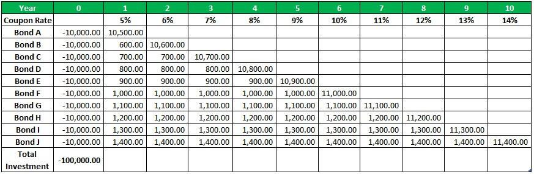

An investment strategy refers to the systematic approach an individual or entity adopts to allocate resources across various types of investments with the aim of achieving financial goals. This strategy is a crucial component of personal finance as it not only determines the potential for wealth accumulation but also manages risks, ensuring long-term financial stability. Within personal finance frameworks, it is essential to identify opportunities that efficiently balance risk and reward, often requiring the diversification of assets among stocks, bonds, real estate, and other investment vehicles.

A bond ladder is an investment strategy that involves purchasing bonds with varying maturity dates. This structured approach aims at reducing interest rate risk while securing a steady cash flow over time. By spreading out bond maturities, investors can reinvest proceeds from maturing bonds at potentially higher interest rates in the future, thus achieving a balance between liquidity and yield stability. The laddered structure provides the advantage of periodic income, as parts of the investment mature at regular intervals, offering a mechanism to manage interest rate fluctuations and reinvest in bonds with more favorable rates.



At the intersection of traditional investment strategies and modern technological advancements lies the merger of bond ladders with algorithmic trading. Algorithmic trading in financial markets is the use of computer programs to automatically execute trades according to predetermined criteria. This form of trading enhances precision and speed, conducting transactions with minimal human intervention. Integrating algorithmic trading into the bond ladder strategy can significantly boost investment returns by optimizing the timing and selection of bond purchases and sales.

The fusion of algorithmic trading with bond ladders offers efficiencies that are hard to achieve manually. Algorithms can sift through large datasets of bond prices, interest rates, and market trends to identify optimal transactions with greater accuracy and speed than human traders. These technological advancements also offer the potential to continuously monitor and adjust bond ladders in response to market changes, providing a dynamic and responsive investment strategy.

This introduction sets the foundation for a deeper exploration of detailed strategies, benefits, and challenges associated with bond ladders and algorithmic trading. This investigation will outline how algorithmic trading introduces efficiency to bond ladder investing, offering a modern approach to enhancing returns and managing risks in a rapidly evolving financial landscape.

## Table of Contents

## Understanding Bond Laddering

A bond ladder is a structured financial strategy aimed at managing bond investments by staggering the maturity dates of different bonds, thereby creating a sequence of fixed income sources over time. The primary structure of a bond ladder involves purchasing bonds with varying maturities—say, one, two, three, and four years—so that as shorter-term bonds mature, the proceeds can be reinvested into new longer-term bonds to maintain the ladder. This cyclic process helps in smoothing income streams and mitigating risks associated with interest rate fluctuations.

The advantages of bond laddering are multifaceted. Diversification is a core benefit; by investing in bonds with different maturities and potentially from different issuers, investors reduce their exposure to the risk that a single bond might present. Additionally, bond ladders help manage [interest rate](/wiki/interest-rate-trading-strategies) risk. For instance, in a rising interest rate environment, the maturing bonds can be reinvested into higher-yielding bonds, helping investors preserve their investment's purchasing power.

Furthermore, bond ladders inherently provide periodic income through the structured staggering of maturity dates. This means an investor will receive cash flow regularly as each bond matures at different times. Such periodic income can be a steady source for meeting financial obligations or reinvesting into other opportunities.

Different types of bonds can be utilized in laddering strategies, each with its own characteristics and benefits. Government bonds, including U.S. Treasury bonds, are often chosen for their relative safety and reliability of income. These bonds are backed by the government's credit, making them a lower-risk option. Corporations also issue bonds, which tend to offer higher yields than government bonds but come with increased risk factors, such as credit risk and market [volatility](/wiki/volatility-trading-strategies). Investors might also consider municipal bonds, which offer tax advantages, or even international bonds, for those willing to embrace additional [forex](/wiki/forex-system) risks.

Creating an effective bond ladder strategy requires careful selection and timing, ensuring that the portfolio is balanced to achieve the desired income and risk profile. As such, understanding the nuances of different bonds and aligning them with investment objectives is crucial when constructing a bond ladder.

## The Role of Algorithmic Trading in Investment Strategies

Algorithmic trading refers to the use of computer algorithms to automatically make trading decisions, execute orders, and manage portfolios in financial markets. These algorithms are driven by complex mathematical models and statistical analyses that assess market data to identify trading opportunities, often executing trades at speeds and frequencies beyond human capability. As financial markets have evolved, [algorithmic trading](/wiki/algorithmic-trading) has become increasingly prevalent, accounting for a significant portion of trading [volume](/wiki/volume-trading-strategy) on exchanges worldwide. By leveraging technology, algorithmic trading enhances efficiency, reduces costs, and increases the precision of investment strategies.

The primary benefits of utilizing algorithms in investment strategies include speed, accuracy, and the ability to handle large volumes of data that human traders might find overwhelming. Speed is a crucial advantage, as algorithms can execute trades in milliseconds, responding instantly to market conditions. This rapid execution allows traders to capitalize on fleeting opportunities and achieve more favorable entry and [exit](/wiki/exit-strategy) points, potentially enhancing returns.

Accuracy is another key benefit, as algorithmic trading eliminates human errors related to emotions and fatigue. Algorithms follow predefined rules without deviation, ensuring consistency in trade execution. They can analyze complex datasets to identify patterns and trends that may not be immediately apparent to human traders, thus enabling more informed decision-making.

Incorporating algorithmic trading into traditional investment methods, such as bond ladders, can lead to enhanced performance and additional revenue streams. A bond ladder is a strategy used by investors to manage bond investments by purchasing bonds with staggered maturities. This approach helps manage interest rate risk and provides a steady income stream. Algorithms can optimize bond selection and timing within a bond ladder framework by considering factors such as yield curves, credit risk, and market trends.

For instance, an algorithm designed to manage a bond ladder might execute the following steps:

1. **Data Collection**: Gather real-time and historical data on available bonds, including prices, interest rates, and credit ratings.
2. **Bond Selection**: Use mathematical models to evaluate which bonds offer the best risk-adjusted returns, considering the investor’s specific criteria.
3. **Execution**: Automatically purchase bonds that fit the strategy, ensuring the ladder is constructed with the intended maturity dates and yield spreads.
4. **Rebalancing**: Continuously monitor the bond portfolio and, as bonds mature or market conditions change, make adjustments to maintain the desired ladder structure and optimize returns.

A Python example could involve using libraries such as `pandas` and `numpy` for data analysis and `alpaca-trade-api` for execution:

```python
import pandas as pd
import numpy as np
from alpaca_trade_api import REST

# Initialize API
api = REST('API_KEY', 'API_SECRET', base_url='https://paper-api.alpaca.markets')

# Define bond selection criteria
def select_bonds(bond_df):
    # Example: select bonds based on yield and credit rating
    return bond_df[(bond_df['yield'] > 0.02) & (bond_df['credit_rating'] >= 'BBB')]

# Collect bond market data
bond_market_data = api.get_bond_data()

# Analyze and select bonds
selected_bonds = select_bonds(pd.DataFrame(bond_market_data))

# Execute trades to construct the bond ladder
for bond in selected_bonds.itertuples():
    api.submit_order(
        symbol=bond.symbol,
        qty=10,  # number of bonds
        side='buy',
        type='limit',
        limit_price=bond.price
    )
```

In conclusion, the integration of algorithmic trading within bond laddering strategies exemplifies the potential for traditional investment approaches to be redefined and optimized. Through automation and precision, these enhanced methods hold promise for boosting returns while effectively managing risk.

## Integrating Bond Ladder and Algo Trading for Maximum Returns

Bond laddering and algorithmic trading together present a powerful strategy for optimizing returns while managing risks. A bond ladder is a portfolio of bonds that mature at staggered intervals over time, aiming to provide consistent income and mitigate interest rate risk. Integrating algorithmic trading into this approach enhances the efficiency of bond selection, allocation, and rebalancing processes, ultimately maximizing returns.

### Automating Bond Ladders with Algorithms

Algorithms facilitate the automation of creating and maintaining bond ladders by systematically selecting bonds based on specific criteria such as yield, credit rating, and maturity dates. Automated processes enable investors to react swiftly to market changes and reallocate their portfolio without manual intervention. For example, algorithms can be written in Python to select bonds using the NumPy and pandas libraries to optimize ladder structures:

```python
import pandas as pd
import numpy as np

# Sample bond data
data = {
    'Bond': ['Bond A', 'Bond B', 'Bond C'],
    'Maturity': [1, 3, 5],
    'Yield': [2.5, 3.0, 3.5]
}

df = pd.DataFrame(data)

# Function to select bonds for ladder based on maturity
def create_bond_ladder(df, total_years):
    ladder = df[df['Maturity'] <= total_years]
    return ladder.sort_values(by='Maturity')

ladder = create_bond_ladder(df, 5)
print(ladder)
```

### Risk Management Techniques

Risk management in algorithmic bond ladder trading involves assessing the impact of interest rate fluctuations and credit risk on bond portfolios. Techniques such as Value at Risk (VaR), scenario analysis, and stress testing can be applied. Algorithms can monitor key indicators and implement hedging strategies automatically, such as interest rate swaps, to protect against adverse movements. Furthermore, [backtesting](/wiki/backtesting) algorithms on historical data assesses the effectiveness and resilience of strategies under various market conditions.

### Real-life Examples and Case Studies

A notable example of the successful integration of bond laddering with algorithmic trading is the use of robo-advisors by financial institutions. These platforms use sophisticated algorithms to diversify and manage large bond portfolios cost-effectively. For instance, Wealthfront, a prominent robo-advisor, employs algorithms to create bond ladders that align with investors' risk tolerance and time horizons, consistently optimizing for tax efficiency and yield potential.

Another case is the adoption of algorithmic trading by pension funds, where the integration of this technology has resulted in improved asset-liability matching, thus enhancing returns while ensuring payment obligations are met. The Public Employees Retirement Association of New Mexico serves as such an example, utilizing algorithms to dynamically adjust its bond ladder positions in response to market conditions, which has resulted in a stable income stream and improved portfolio performance.

These examples illustrate that combining bond ladders with algorithmic trading not only streamlines investment processes but also results in increased adaptability and resilience in the face of market changes.

## Challenges and Considerations

Implementing a bond ladder strategy using algorithmic trading presents several challenges and considerations that investors must address to ensure effective execution and risk management. 

One primary challenge is associated with technical failures. Algorithmic trading systems rely heavily on technology, meaning system malfunctions or hardware failures can have significant impacts. Issues such as network outages, software bugs, or hardware defects can disrupt trading operations, leading to potential financial losses. Therefore, it is crucial to have robust technical infrastructure and backup systems in place to mitigate these risks. Regular maintenance, software updates, and redundancy frameworks like failover systems are necessary to ensure smooth operation.

Market volatility poses another significant risk. While algorithms can process data faster and enable quicker reactions to market changes than human traders, extreme market conditions can lead to unexpected outcomes. Algorithms may fail to adapt to rapid shifts, resulting in trades executed at undesirable prices. To manage this, implementing real-time monitoring and setting predefined thresholds for executing trades can help control exposure to volatile market conditions.

A deeper understanding of coding and financial software tools is essential for managing and customizing algorithmic trading systems effectively. Developing algorithms that align with specific investment goals involves proficiency in programming languages such as Python, R, or C++. Investors may need to learn these skills or collaborate with specialists to create and refine their trading algorithms. Here is a simple Python snippet demonstrating how an algorithm might evaluate bond ladder opportunities based on yield:

```python
def evaluate_bond_ladder(bonds):
    selected_bonds = []
    for bond in bonds:
        if bond['yield'] > threshold:
            selected_bonds.append(bond)
    return selected_bonds

# Example usage
bonds = [{'name': 'Bond A', 'yield': 2.5}, {'name': 'Bond B', 'yield': 3.0}]
threshold = 2.75
optimal_ladder = evaluate_bond_ladder(bonds)
```

Managing these challenges requires comprehensive testing and monitoring systems. Conducting thorough backtesting using historical data can help identify how algorithms will perform under different market conditions. Stress testing further ensures that the system can handle high volumes of trades and market anomalies. Regular audits of the algorithmic trading system help maintain its alignment with evolving market dynamics and investor objectives.

Furthermore, implementing detailed logging mechanisms within the trading system can facilitate effective monitoring, offering insights into trading patterns, system performance, and potential errors. This proactive oversight can help promptly identify and resolve issues, reducing the risk of major disruptions.

Finally, due diligence in terms of compliance with regulatory frameworks governing algorithmic trading is indispensable. Meeting these requirements prevents legal repercussions and promotes transparency and trust in automated trading processes. By addressing these challenges and being equipped with effective management strategies, investors can maximize the potential benefits of integrating algorithmic trading into a bond ladder investment approach.

## Conclusion

Combining bond ladders with algorithmic trading presents a powerful strategy for enhancing investment outcomes. By structuring investments in a bond ladder, investors can achieve diversification and manage interest rate risks while maintaining a steady income stream from staggered bond maturities. When this traditional approach is integrated with the precision and speed of algorithmic trading, the potential returns can be significantly boosted.

Algorithmic trading offers an edge through its ability to quickly analyze vast amounts of market data and execute trades with high accuracy. This minimizes human error and emotions that could otherwise affect decision-making, providing a more disciplined approach to investing. Algorithms can be employed to optimize bond selection, timing, and even the restructuring of bond ladders in response to changing market conditions. For instance, an algorithm might continuously monitor market interest rates and adjust the ladder structure accordingly to maximize returns.

Investors are encouraged to explore the world of algorithmic strategies and consider the advantages they offer. Consulting with experts who are proficient in both financial markets and computational techniques can provide valuable insights and guidance. This is especially important in effectively implementing and maintaining an integrated bond ladder and algorithmic trading strategy.

In the rapidly advancing financial landscape, continual learning and adaptation are crucial. As technology evolves, so do the tools and strategies available to investors. Those willing to embrace these changes and invest in their education are more likely to benefit from optimized returns, greater efficiency, and improved risk management. Emphasizing ongoing education and openness to innovative investment strategies is key to staying ahead in the market.

## References & Further Reading

[1]: ["Fixed Income Analysis"](https://en.wikipedia.org/wiki/Fixed_income_analysis) by Barbara S. Petitt and Jerald E. Pinto, CFA Institute Investment Series

[2]: ["The Bond Book: Everything Investors Need to Know About Treasuries, Municipals, GNMAs, Corporates, Zeros, Bond Funds, Money Market Funds, and More"](https://www.amazon.com/Bond-Book-Third-Everything-Treasuries/dp/007166470X) by Annette Thau

[3]: ["Advances in Financial Machine Learning"](https://www.amazon.com/Advances-Financial-Machine-Learning-Marcos/dp/1119482089) by Marcos Lopez de Prado

[4]: ["Algorithmic Trading: Winning Strategies and Their Rationale"](https://www.wiley.com/en-us/Algorithmic+Trading%3A+Winning+Strategies+and+Their+Rationale-p-9781118460146) by Ernest P. Chan

[5]: ["Machine Learning for Asset Managers"](https://www.cambridge.org/core/elements/machine-learning-for-asset-managers/6D9211305EA2E425D33A9F38D0AE3545) by Marcos Lopez de Prado