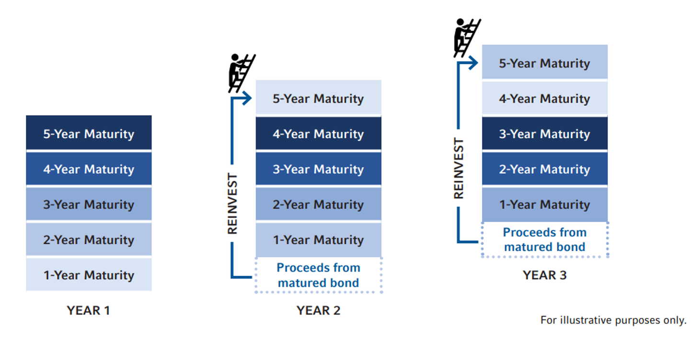

## Table of Contents

## What is a bond ladder and how does it work?

A bond ladder is a way to invest in bonds that helps you spread out the risk and get regular income. It's like having a ladder where each step is a bond that matures at a different time. You buy bonds that mature at different times, like one year, two years, three years, and so on. This way, you don't have all your money tied up in bonds that mature at the same time.

When a bond at the bottom of the ladder matures, you get your money back and can use it to buy a new bond at the top of the ladder. This helps you keep getting income regularly and also lets you take advantage of different interest rates over time. If interest rates go up, you can buy new bonds with higher rates. If rates go down, you still have the old bonds with higher rates. It's a smart way to manage your investments and keep your money working for you.

## Why might someone choose to use a bond ladder for their investment strategy?

Someone might choose to use a bond ladder because it helps them manage risk and get a steady income. When you spread out the times when your bonds mature, you don't have to worry about all your money coming due at once. If interest rates change, you won't be stuck with all your money in bonds that might not be as good as new ones. This way, you can keep your investments safe and still make money regularly.

Another reason is flexibility. With a bond ladder, you can take advantage of changing interest rates. When a bond matures, you can use that money to buy a new bond with a better rate if rates have gone up. If rates go down, you still have some bonds with the old, higher rates. This gives you a chance to adjust your investments without having to sell everything at once. It's a smart way to keep your money growing over time.

## How can bond ladders help in managing interest rate risk?

Bond ladders help manage [interest rate](/wiki/interest-rate-trading-strategies) risk by spreading out when your bonds mature. Instead of having all your bonds come due at the same time, you have them mature at different times, like every year or every few years. This way, if interest rates go up, you can use the money from the bonds that mature to buy new bonds with higher rates. If rates go down, you still have some bonds with the old, higher rates, so you're not stuck with all your money in lower-rate bonds.

This strategy gives you a chance to adjust to changing interest rates without having to sell all your bonds at once. It's like having a safety net. If rates change, you can slowly move your money into new bonds that fit the new rates. This helps keep your investment steady and lets you take advantage of better opportunities as they come up.

## What are the steps to build a basic bond ladder?

To build a basic bond ladder, start by deciding how much money you want to invest and how long you want the ladder to last. Let's say you have $10,000 and want a five-year ladder. You would divide your money into five equal parts, so $2,000 for each year. Then, you buy bonds that mature in one year, two years, three years, four years, and five years. For example, you might buy a $2,000 bond that matures in one year, another $2,000 bond that matures in two years, and so on until you have bonds for each year up to five years.

Once you have your ladder set up, you wait for the bonds to mature. When the one-year bond matures, you get your $2,000 back. You can then use that money to buy a new bond that matures in five years, which keeps your ladder going. Every year, as each bond matures, you repeat this process. This way, you always have bonds maturing and you can keep adjusting to new interest rates. It's a simple way to keep your money working for you over time.

## How do you select the right bonds for a ladder?

When you're [picking](/wiki/asset-class-picking) bonds for your ladder, start by looking at how long you want your ladder to last and how much risk you're okay with. If you want a safe ladder, you might choose government bonds like U.S. Treasury bonds because they are very secure. If you're okay with a bit more risk for a chance at higher returns, you might look at corporate bonds. Also, think about the interest rates of the bonds. You want a mix of bonds with different rates to balance your ladder.

Next, decide on the timing of the bonds. If you're building a five-year ladder, you'll need bonds that mature each year for five years. Make sure to spread your money evenly across these bonds. For example, if you have $10,000, you might put $2,000 into a bond that matures in one year, $2,000 into a bond that matures in two years, and so on. This way, you'll have bonds maturing every year, giving you regular income and the chance to reinvest at new rates.

Lastly, keep an eye on the bond's credit rating. A higher credit rating means the bond is less risky, but it might also mean a lower interest rate. You can use a mix of bonds with different ratings to balance risk and reward. By carefully choosing the right bonds, you can build a ladder that fits your financial goals and helps you manage your money wisely.

## What are the considerations for choosing the duration of each rung in the ladder?

When you're picking how long each rung in your bond ladder should last, think about your money goals and how long you want to keep your money invested. If you need money every year, you might choose a ladder where bonds mature every year. If you're okay waiting longer, you might pick a ladder with bonds that mature every two or three years. It's all about matching the ladder to when you need the money. Also, consider how much risk you're okay with. Shorter rungs mean less risk because you get your money back sooner, but they might give you lower returns. Longer rungs can give you higher returns but come with more risk because you have to wait longer to get your money.

Another thing to think about is what's happening with interest rates. If you think rates might go up, you might want shorter rungs so you can quickly buy new bonds with higher rates. If you think rates will stay the same or go down, longer rungs might be better because you can lock in the current rates for a longer time. It's a balancing act between getting regular money and trying to make more money over time. By choosing the right duration for each rung, you can make sure your bond ladder fits your needs and helps you manage your money well.

## How does reinvestment risk affect bond ladders and how can it be mitigated?

Reinvestment risk is the chance that when your bonds mature, you won't be able to buy new bonds with the same or better interest rates. With a bond ladder, this risk shows up every time a bond at the bottom of the ladder matures. If interest rates have gone down since you bought your original bonds, you'll have to reinvest the money from the matured bond into new bonds that pay less. This can mean less money coming in over time, which might mess up your plans for income or growth.

To lower reinvestment risk with a bond ladder, you can spread out the times when your bonds mature. This way, you don't have all your money coming due at once when rates might be low. Instead, you can reinvest a little bit at a time, which helps you take advantage of any ups and downs in interest rates. Another way to help is by picking bonds with different kinds of interest rates, like some that change with the market and some that stay the same. This mix can give you a better chance of getting good returns no matter what happens with rates.

## Can bond ladders be used effectively in a rising interest rate environment?

Yes, bond ladders can be very useful when interest rates are going up. When you have a bond ladder, your bonds mature at different times. This means that if rates go up, you can use the money from the bonds that mature to buy new bonds with higher rates. Instead of having all your money in bonds that were bought when rates were lower, you can keep moving your money into new bonds with better rates. This way, you can take advantage of the rising rates and keep your money growing.

Using a bond ladder also helps you not to worry too much about when rates will go up. Because your bonds mature at different times, you don't have to guess when to buy new bonds. You just keep reinvesting the money from the matured bonds. This makes it easier to manage your investments and still get good returns even when rates are changing.

## How can one optimize a bond ladder for tax efficiency?

To make your bond ladder tax-friendly, you need to think about where the money comes from and how much tax you have to pay on it. One good way is to use municipal bonds, which are often not taxed by the federal government and sometimes not by the state government too. If you're in a high tax bracket, these bonds can help you keep more of your money because you won't have to pay as much in taxes. You can put these tax-free bonds at the bottom of your ladder, so they mature first and you can use the money to buy new bonds without worrying too much about taxes.

Another way to make your bond ladder more tax-efficient is to think about where you keep your bonds. If you have a tax-sheltered account like an IRA or a 401(k), you can put bonds that pay a lot of interest in there. This way, the interest you earn won't be taxed until you take the money out, which can be years later. By mixing where you keep your bonds and what kind of bonds you buy, you can make sure your bond ladder works well and helps you pay less in taxes.

## What advanced strategies can be employed to enhance returns from a bond ladder?

One way to get more from your bond ladder is to mix different kinds of bonds. Instead of just using one type, like government bonds, you can add some corporate bonds or even high-yield bonds. These might be riskier, but they can also give you higher returns. You can also look at bonds from different places, like international bonds. By spreading your money around, you can balance the risk and maybe earn more money. Another trick is to use callable bonds, which can be paid back early by the issuer. If interest rates go down, the issuer might call the bond and you can use the money to buy new bonds with better rates.

Another advanced strategy is to use bond ETFs or mutual funds in your ladder. These funds hold a bunch of bonds and can give you more variety and flexibility. They can also be easier to buy and sell than individual bonds. You can use these funds for some of your ladder rungs, especially the longer ones, to take advantage of different bond markets. Also, think about using a barbell strategy, where you put money into both short-term and long-term bonds, but skip the middle ones. This can help you get the best of both worlds: the safety of short-term bonds and the higher returns of long-term bonds. By mixing these strategies, you can make your bond ladder work harder for you and get better returns.

## How do bond ladders fit into a broader diversified investment portfolio?

Bond ladders can be a great part of a bigger, mixed investment plan. They help you spread out your money so you don't have it all in one place. When you put bond ladders into your overall investments, you get regular money coming in, which can be really helpful. It's like having a steady paycheck from your bonds. Plus, bond ladders can make your whole investment plan less risky because they give you a safe place to keep some of your money while other parts of your portfolio, like stocks, might go up and down a lot.

Another good thing about using bond ladders in a mixed investment plan is that they can help you balance out the ups and downs of the stock market. When stocks are doing well, your bond ladder keeps giving you steady money. But if stocks go down, your bond ladder can help cushion the fall because bonds are usually safer. By mixing bond ladders with other kinds of investments, you can make sure your money is working hard in different ways, helping you reach your financial goals without taking too much risk.

## What are the potential pitfalls and how can they be avoided when using bond ladders?

One big problem with bond ladders is reinvestment risk. This happens when your bonds mature and you have to put the money back into new bonds. If interest rates have gone down, you might have to buy new bonds that don't pay as much. This can mean less money for you over time. To avoid this, you can spread out when your bonds mature. This way, you're not putting all your money back into bonds at once when rates are low. You can also mix different types of bonds, like some that change with the market and some that stay the same, to help balance out the risk.

Another pitfall is interest rate risk. If rates go up, the value of your bonds can go down. This can be a problem if you need to sell your bonds before they mature. To help with this, you can keep your bond ladder short, so your money comes back to you sooner. You can also use a mix of short-term and long-term bonds to balance out the risk. By doing this, you can make sure your bond ladder works well no matter what happens with interest rates.

Lastly, don't forget about credit risk. This is the chance that the company or government that issued the bond might not be able to pay you back. To lower this risk, you can choose bonds with high credit ratings, like government bonds. You can also mix in some corporate bonds with good ratings to get a bit more return without too much risk. By carefully picking your bonds and spreading out your money, you can make your bond ladder safer and more reliable.

## References & Further Reading

[1]: ["Fixed Income Analysis"](https://en.wikipedia.org/wiki/Fixed_income_analysis) by Barbara S. Petitt and Jerald E. Pinto, CFA Institute Investment Series

[2]: ["The Bond Book: Everything Investors Need to Know About Treasuries, Municipals, GNMAs, Corporates, Zeros, Bond Funds, Money Market Funds, and More"](https://www.amazon.com/Bond-Book-Third-Everything-Treasuries/dp/007166470X) by Annette Thau

[3]: ["Advances in Financial Machine Learning"](https://www.amazon.com/Advances-Financial-Machine-Learning-Marcos/dp/1119482089) by Marcos Lopez de Prado

[4]: ["Algorithmic Trading: Winning Strategies and Their Rationale"](https://www.wiley.com/en-us/Algorithmic+Trading%3A+Winning+Strategies+and+Their+Rationale-p-9781118460146) by Ernest P. Chan

[5]: ["Machine Learning for Asset Managers"](https://www.cambridge.org/core/elements/machine-learning-for-asset-managers/6D9211305EA2E425D33A9F38D0AE3545) by Marcos Lopez de Prado