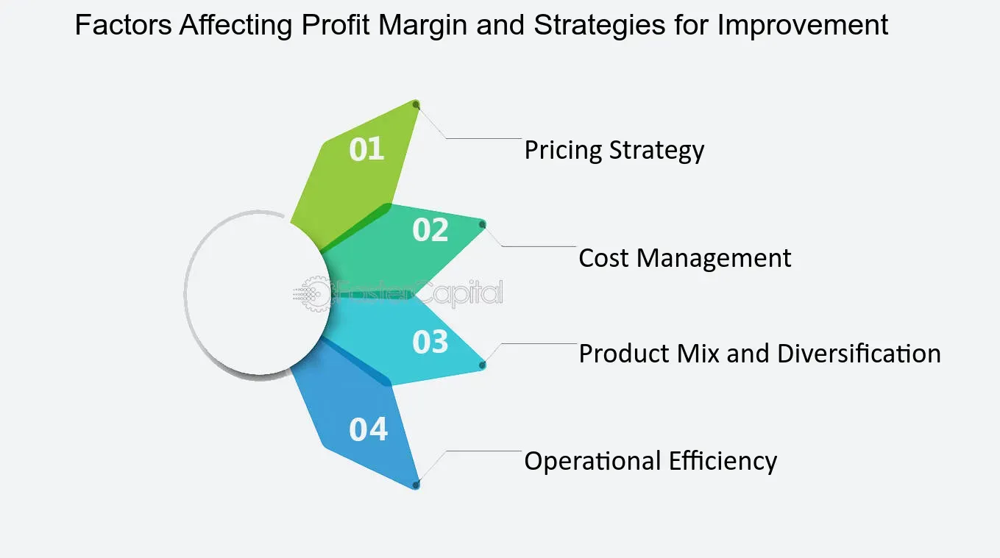

In the fast-paced world of trading, managing risk effectively is paramount to long-term success. Traders often employ stop-loss strategies as a key tool for risk management, which helps to automatically sell a security when it reaches a certain price level. Among these strategies, soft stops and mental stops stand out by offering a degree of flexibility beyond traditional fixed stop-loss orders. Unlike the fixed nature of traditional stop-loss orders, soft stops allow traders to define a range of acceptable price levels, taking into account the volatility and current conditions of the market. This dynamic approach can reduce the likelihood of premature exits during temporary market fluctuations, which could otherwise result in missed profit opportunities.

Similarly, mental stops involve setting a psychological threshold for exiting a trade, without placing an actual order in the market. This non-binding form of stop-loss relies heavily on the trader's discipline and ability to monitor market conditions continuously. While these strategies offer adaptability and discretion, they also require keen awareness of market dynamics and a strong level of discipline, given the absence of automatic triggers inherent in fixed stop-loss orders.



This article explores these flexible stop strategies in detail, examining their applications within algorithmic trading and weighing both their potential benefits and drawbacks. Algorithmic trading, where pre-programmed instructions are executed in quick succession at speeds beyond human capability, can make use of soft and mental stops to enhance decision-making processes. By developing strategies that incorporate these stops, traders aim to create a balanced trading plan that optimizes the potential for both adapting to market changes and reducing risk. Through this approach, traders seek to harness the complexities of market behavior in a way that enhances their adaptability and ensures long-term profitability.

## Table of Contents

## Understanding Soft Stops and Mental Stops

Soft stops and mental stops are innovative tools used by traders to strategically manage risk and optimize trading outcomes without the constraints of fixed stop-loss orders. These methods provide greater control and adaptability to traders, allowing them to adjust their tactics based on real-time market conditions.

A mental stop involves a trader's decision to set a predetermined point in their mind at which they will exit a trade. This decision is not accompanied by placing an actual order in the market. The mental stop requires the trader to be disciplined and aware of their psychological thresholds, as the absence of an automated sell order means they must execute the exit manually at the predetermined point. This approach enables traders to reconsider their position if market conditions change favorably before the mental stop is hit.

Conversely, a soft stop is not a single price point but rather a flexible range of exit points. Traders using soft stops consider various real-time market conditions, including technical indicators, price volatility, and overall market trends. This strategy allows traders to react to temporary market fluctuations without prematurely exiting potentially profitable trades. For example, in a rapidly moving market, a trader might set a soft stop range between two price levels to account for short-term volatility while maintaining their position if they believe the downturn is momentary.

Implementing these types of stops requires traders to possess a deep understanding of market dynamics. They must continually analyze market signals and ensure they possess the discipline to act decisively when the conditions are met. Without this, traders run the risk of either holding onto losing positions for too long or exiting too quickly from promising trades. Successful use of mental and soft stops demands a balance of technical analysis skills, market insight, and psychological fortitude.

## Algorithmic Trading and Stop Strategies

In [algorithmic trading](/wiki/algorithmic-trading), the integration of stop strategies such as soft stops and mental stops can significantly enhance the quality of decision-making processes. These strategies are incorporated into automated systems that rely on advanced programming to react to real-time market data. The capability to execute trades based on predefined conditions or triggers allows algorithms to intelligently manage risk by exiting positions more effectively.

A mental stop in an algorithmic context is defined by a specific market condition or set of conditions coded as a rule within the algorithm. When these conditions are met, the system either alerts the trader or automatically executes a trade adjustment. Soft stops are similarly coded, wherein the [exit](/wiki/exit-strategy) points are not absolute but can adjust dynamically based on continuous market analysis and [volatility](/wiki/volatility-trading-strategies) measurements. This flexibility is achieved by leveraging real-time data streams, thus allowing the algorithm to make informed decisions that are adaptable to sudden market shifts.

Implementation involves programming a systematic approach to stop strategies through software languages such as Python. For example, an algorithm can use libraries such as `pandas` and `numpy` to process and analyze historical market data to develop conditions for soft stops. Below is a simplified example of how one might code a basic soft stop strategy:

```python
import pandas as pd
import numpy as np

# Example function to calculate moving average
def moving_average(data, period=20):
    return data['Close'].rolling(window=period).mean()

# Function to determine soft stop
def calculate_soft_stop(entry_price, data):
    recent_volatility = data['High'].rolling(window=14).std()
    soft_stop = entry_price - recent_volatility[-1] * 2  # e.g., 2 times the recent volatility
    return soft_stop

# Sample usage
market_data = pd.read_csv('market_data.csv')  # Fetching market data
entry_price = 100  # Hypothetical entry price
soft_stop_level = calculate_soft_stop(entry_price, market_data)

print(f"Soft Stop Level: {soft_stop_level}")
```

By tailoring algorithms to incorporate these stop strategies, traders can create more adaptable and potentially profitable trading models. This adaptability is crucial for improving profit margins, especially in fluctuating market conditions. Algorithms optimized with mental and soft stops can efficiently minimize losses during detrimental market moves and capitalize on favorable conditions, ultimately contributing to a more robust and intelligent trading system.

## Who Should Use Soft and Mental Stops?

Short-term traders, particularly day traders, can greatly benefit from the flexibility provided by mental and soft stops. These traders operate in environments where market conditions can change rapidly. Thus, the ability to adapt quickly is crucial. Unlike fixed stop-loss orders, which can trigger exits at predetermined levels regardless of market context, mental and soft stops allow traders to make nuanced decisions based on current market conditions. This can help prevent unnecessary exits during short-term market fluctuations, thereby preserving potentially profitable positions.

Long-term traders who focus on fundamental analyses can also utilize soft and mental stops to their advantage. While these traders typically have a longer investment horizon, they still need to manage risk and adapt to changing market conditions. Mental and soft stops provide the flexibility to adjust exit strategies as new information and market trends emerge. This can be particularly valuable during significant market shifts, where a static stop-loss might not accommodate the evolving nature of market dynamics.

However, successful implementation of these strategies requires traders to have the discipline and ability to engage in continuous position monitoring. This need for constant vigilance is a critical consideration. Traders must be able to quickly interpret market signals and make informed decisions without hesitation. Those who are unable to dedicate the necessary time and attention may find these strategies challenging to employ effectively. As such, assessing one's skills in real-time analysis and decision-making is essential before incorporating mental and soft stops into trading activities.

## Benefits of Soft Stops in Trading

Soft stops offer traders a dynamic approach to managing their positions, characterized by a heightened level of adaptability. Unlike traditional fixed stop-loss orders, which are set at specific price points, soft stops give traders the flexibility to adjust their exit strategies based on real-time market conditions. This flexibility is particularly useful in avoiding premature exits that can occur due to temporary market fluctuations. When market volatility causes price movements that are not indicative of a trend reversal, a fixed stop might be triggered unnecessarily, potentially resulting in missed opportunities for gains.

By employing soft stops, traders have the ability to hold onto positions that still show underlying strength, thereby minimizing unwarranted losses. For instance, if a stock experiences a short-lived dip due to market noise or an external event but retains its fundamental appeal, a soft stop can allow the trader to maintain their position, waiting for the market to stabilize and the asset to regain its upward trajectory.

The capacity to react adaptively to live market conditions is a significant advantage of soft stops. By not being tethered to pre-determined numerical thresholds, traders can incorporate current market analyses and broader economic indicators into their decision-making processes. This real-time adaptability allows traders to optimize their exit strategies, taking into account factors such as trading [volume](/wiki/volume-trading-strategy), volatility, and macroeconomic announcements that might influence asset prices.

In practice, implementing soft stops requires strong analytical skills and the ability to synthesize diverse sets of market data. Traders may use technical indicators such as moving averages, Bollinger Bands, or the Relative Strength Index (RSI) to inform their decisions. Additionally, a trader's subjective judgment, honed through experience and market familiarity, plays a crucial role in the successful application of soft stops. This blend of analytical tools and discretionary judgment provides a comprehensive framework for leveraging soft stops as part of an effective risk management strategy.

## Challenges and Risks of Soft Stops

Soft stops, while offering flexibility in trading, come with inherent challenges and risks that traders must carefully consider. The primary risk associated with soft stops stems from the potential for larger losses, particularly if the decision to exit a position is not made promptly. Unlike fixed stop-loss orders, which automatically trigger a sell or buy action when a particular price threshold is reached, soft stops require traders to make a judgment call based on current market conditions. This reliance on human intervention can lead to delayed decisions, increasing the risk of significant financial losses, especially in volatile market scenarios.

The effectiveness of soft stops significantly hinges on the trader’s level of discipline and their capability for constant market monitoring. Traders must remain attentive to real-time data and be prepared to act swiftly if market conditions move against their positions. This necessity for vigilance means that soft stops may not be suitable for all trading styles or all traders. Day traders or others who can afford to dedicate substantial time to constant oversight may find soft stops appropriate, whereas those who balance trading with other commitments may struggle to maintain the required focus and discipline.

Furthermore, the subjective nature of soft stops means they are prone to emotional biases. Unlike fixed stops that enforce systematic decision-making devoid of emotional influence, soft stops might lead traders to second-guess their initial analyses or succumb to emotions such as fear or greed. As a result, traders may either prematurely exit beneficial positions or hesitantly hold onto losing ones, exacerbating potential losses.

In conclusion, while soft stops can be an effective tool for those with the requisite discipline and monitoring capacity, they [carry](/wiki/carry-trading) risks that must be carefully managed. Traders should assess their ability to vigilantly watch market trends and maintain objectivity, ensuring that emotional responses do not affect their trading decisions. Developing a well-structured trading plan that incorporates both soft stops and more rigid stop-loss strategies could serve as a beneficial compromise, providing the flexibility of soft stops while mitigating the associated risks through a fixed safety net.

## Developing a Balanced Trading Strategy

In trading, developing a balanced strategy that utilizes both soft stops and fixed stops is an effective way to manage risk while maximizing potential returns. Combining these approaches allows traders to protect themselves against significant losses while still taking advantage of favorable market conditions.

**Integration of Stops**

To effectively integrate soft stops and fixed stops, traders can use fixed stops as a safety net, ensuring that positions are closed when a certain loss threshold is reached. This approach prevents catastrophic losses by defining clear exit points that are automatically executed when reached. Soft stops, meanwhile, provide the flexibility to adjust exit points based on market conditions. By monitoring current trends and market dynamics, traders can fine-tune their soft stops to maximize profits and minimize unnecessary exits.

**Strategy Refinement**

Traders should continuously refine their strategies. Market conditions are dynamic, and what works in one scenario may not be effective in another. A successful trader regularly evaluates their strategies and makes necessary adjustments. This ongoing refinement process involves analyzing market data, understanding economic indicators, and considering how various factors might impact trading outcomes. It requires a keen understanding of both technical and [fundamental analysis](/wiki/fundamental-analysis) to anticipate changes and adapt strategies accordingly.

**Backtesting and Outcome Review**

Regular [backtesting](/wiki/backtesting) is a vital part of strategy development. By simulating trades using historical data, traders can assess the performance of soft and mental stops under different market conditions. Backtesting helps traders understand the strengths and weaknesses of their strategies, enabling them to optimize stop placements and refine rules for when to adjust or override stops. Python programming can assist in this process through libraries such as `pandas` for data manipulation and `matplotlib` for visualizing backtest results.

Here’s a basic example of how backtesting can be implemented in Python:

```python
import pandas as pd
import matplotlib.pyplot as plt

# Assume 'data' is a DataFrame containing historical price data
# with columns 'Date', 'Open', 'High', 'Low', 'Close'

def backtest_strategy(data, fixed_stop_loss, soft_stop_range):
    """
    Backtests a simple strategy using fixed and soft stops.

    Parameters:
    - data: Historical price data
    - fixed_stop_loss: The fixed stop loss percentage
    - soft_stop_range: The soft stop range percentage

    Returns:
    - results: DataFrame containing backtest results
    """
    initial_capital = 10000  # Starting capital
    position_size = 100  # Number of shares
    capital = initial_capital
    stop_loss_level = 0

    for i in range(1, len(data)):
        # Imagine that trading logic fills this in
        # For example, buy or sell signals, applying soft stops etc.
        pass

        # Update logic for fixed and soft stops

        # 'capital' modification based on trading logic
        pass

    return capital

# Assume 'data' is provided
results = backtest_strategy(data, fixed_stop_loss=0.02, soft_stop_range=0.05)
print("Final Capital after Backtesting:", results)
```

Regularly reviewing outcomes, whether successful or not, is crucial for learning and improving trading decisions. By documenting trades and reviewing both profitable and loss-making decisions, traders can identify patterns and adjust their strategies to improve future performance.

## Conclusion

Incorporating soft and mental stops into trading could significantly enhance a trader's ability to adapt and profit in dynamic markets. These strategies offer flexibility and adaptability, which are critical in rapidly changing market conditions. However, their successful implementation requires diligent practice and constant market monitoring. Traders must refine their approach continuously, adapting it to evolving market environments and personal trading experiences.

As financial markets evolve with technological advancements and increased volatility, so should the strategies traders use to manage risk and ensure profitability. Adopting soft and mental stops allows for more intelligent decision-making, but it demands high levels of discipline and awareness. By continuously refining stop strategies through rigorous backtesting and outcome review, traders can optimize their use for better performance. Integrating these flexible stop strategies with more traditional risk management tools could provide a balanced approach that maximizes profit potential while controlling risk exposure.

## References & Further Reading

[1]: Bergstra, J., Bardenet, R., Bengio, Y., & Kégl, B. (2011). ["Algorithms for Hyper-Parameter Optimization."](https://dl.acm.org/doi/10.5555/2986459.2986743) Advances in Neural Information Processing Systems 24.

[2]: ["Advances in Financial Machine Learning"](https://www.amazon.com/Advances-Financial-Machine-Learning-Marcos/dp/1119482089) by Marcos Lopez de Prado

[3]: ["Evidence-Based Technical Analysis: Applying the Scientific Method and Statistical Inference to Trading Signals"](https://www.amazon.com/Evidence-Based-Technical-Analysis-Scientific-Statistical/dp/0470008741) by David Aronson

[4]: ["Machine Learning for Algorithmic Trading"](https://github.com/stefan-jansen/machine-learning-for-trading) by Stefan Jansen

[5]: ["Quantitative Trading: How to Build Your Own Algorithmic Trading Business"](https://www.amazon.com/Quantitative-Trading-Build-Algorithmic-Business/dp/1119800064) by Ernest P. Chan