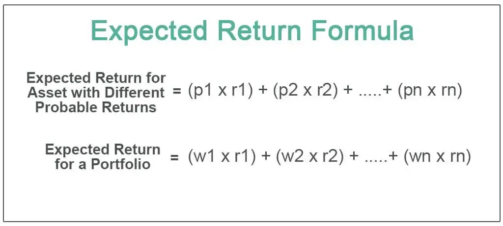

Alpha is a crucial measure in investment strategies, representing the excess returns earned by an asset or a portfolio compared to the market benchmark. This excess return showcases the effectiveness of an investment manager's ability to generate profits beyond the passive market index. For investors and fund managers, achieving a positive alpha is often synonymous with skillful portfolio management and is a key benchmark for performance evaluation.

Algorithmic trading and risk management are integral in optimizing investment returns. Algorithmic trading, which uses computer programs to execute trades at high speed and volume, leverages mathematical models and statistical analyses to identify and capitalize on market inefficiencies. This technology-driven approach allows traders to make data-backed decisions quickly, often leading to enhanced returns. Likewise, robust risk management strategies are essential to safeguard investment portfolios against potential losses. Effective risk management ensures that investors are adequately compensated for the risks they undertake, balancing potential returns with the likelihood and impact of adverse events.



In modern finance, the fusion of investment strategies with cutting-edge technology has become increasingly significant. The digitization of trading platforms and the advent of sophisticated algorithms have transformed how financial markets operate, making them more accessible and efficient. Investment strategies can no longer rely solely on traditional methods; they must integrate technological advancements to maintain competitive edges. The convergence of finance and technology, known as fintech, heralds a new era of innovation that empowers investors and traders to leverage vast amounts of data and computational power. 

This technological transformation not only enhances the precision of investment strategies but also enables the crafting of personalized financial solutions, reflecting an evolving landscape where adaptability and innovation are paramount. As financial markets continue to evolve, the integration of technology with investment strategies remains pivotal for achieving superior performance and ensuring sustainable competitive advantages.

## Table of Contents

## Defining Alpha in Investment Strategy

Alpha is a critical concept in investment strategies, serving as an indicator of an investment's performance relative to a market benchmark. It is defined as the excess return an investment generates above the return predicted by the market or benchmark index. Alpha is often seen as a measure of an investment manager's skills and ability to generate returns beyond what is expected based on market movements. When an investment portfolio has an alpha greater than zero, it signifies that the investment manager has added value beyond passively investing in the benchmark index.

The concept of alpha is rooted in the Capital Asset Pricing Model (CAPM), a foundational model used to determine the expected return on an investment. According to the CAPM, the expected return of an asset is calculated as follows:

$$
\text{Expected Return} = R_f + \beta \times (\text{Market Return} - R_f)
$$

Where:
- $R_f$ is the risk-free rate of return,
- $\beta$ is the measure of an asset's volatility relative to the market,
- $\text{Market Return}$ is the expected return of the market.

Alpha ($\alpha$) is determined by the equation:

$$
\alpha = \text{Actual Return} - \text{Expected Return}
$$

Alpha is not only a product of effective security selection and timing but also reflects the efficacy of the risk management and trading processes employed by an investment manager. A positive alpha indicates that the investment has outperformed the benchmark after adjusting for market risk, while a negative alpha implies underperformance.

To calculate alpha for a portfolio, several methods can be employed. One common approach is to use historical data to regress the portfolio's excess return against the excess return of the market. This method involves performing a linear regression to ascertain the intercept, which represents the portfolio's alpha.

Apart from the CAPM, other models like the Fama-French three-[factor](/wiki/factor-investing) model extend the calculation of alpha by incorporating size risk and value risk factors along with market risk. This model accounts for the effects of a company's market capitalization and book-to-market ratio on expected returns, providing a more comprehensive insight into alpha generation.

The importance of alpha in strategy evaluation cannot be understated. It provides an objective measure of an investment manager's performance relative to predefined benchmarks. Investors use alpha to assess the effectiveness of the active management strategies they employ and to guide decisions regarding the allocation of their capital. In a competitive market environment, achieving and sustaining a positive alpha is crucial for investment managers striving to attract and retain investors.

## Risk Management Strategies

Risk management is a critical component in trading, aimed at minimizing potential losses while maximizing returns. Traditional risk management techniques have laid the foundation for controlling investment risk, while innovative strategies have provided more sophisticated tools for modern finance.

### Traditional Risk Management Techniques

1. **Diversification**: This involves spreading investments across various asset classes to reduce the impact of a single asset's performance on the overall portfolio. By holding a mix of stocks, bonds, and other securities, investors can mitigate unsystematic risk specific to a company or industry.

2. **Asset Allocation**: Adjusting the proportion of different asset types within a portfolio can help in aligning risk levels with an investor’s risk tolerance and investment goals. Typically, a conservative portfolio would have a higher percentage of bonds, while an aggressive portfolio might be more heavily weighted in equities.

3. **Stop-Loss Orders**: A stop-loss order automatically sells a security when it reaches a certain price, limiting potential losses. This tool is particularly useful in volatile markets where quick changes in asset prices can lead to significant losses.

4. **Hedging**: Investors can hedge against potential losses by using derivatives like options and futures. For example, purchasing a put option allows an investor to sell a stock at a predetermined price, offering protection against a drop in its value.

### Innovative Risk Management Strategies

1. **Algorithmic Risk Management**: Leveraging advanced algorithms allows for real-time monitoring and management of risks in a portfolio. These algorithms can automatically adjust positions in response to market changes, optimizing risk exposure.

2. **Machine Learning Models**: Using machine learning models to predict market behavior and identify potential risks can enhance traditional risk management strategies. Models can recognize patterns and assess historical data to forecast future market conditions, allowing investors to make informed decisions.

3. **Value-at-Risk (VaR) and Conditional Value-at-Risk (CVaR)**: These statistical measures help in estimating the potential loss in a portfolio over a defined period for a given confidence interval. VaR provides a value indicating what an investor can expect to lose at most, while CVaR gives an average of the losses that exceed VaR, offering a more comprehensive risk assessment.

4. **Stress Testing and Scenario Analysis**: Simulating extreme market conditions or specific scenarios helps investors understand the potential impact of unprecedented events on a portfolio. This forward-looking approach assists in enhancing preparedness for adverse market conditions.

### Balancing Risk and Return

Achieving the right balance between risk and return is essential for building a successful investment portfolio. This balance is often visualized using the Efficient Frontier model, which represents the set of optimal portfolios providing the highest expected return for a defined level of risk. Utilizing the Capital Asset Pricing Model (CAPM), investors can estimate the expected return on an investment given its risk, using the formula:

$$
\text{Expected Return} = R_f + \beta(R_m - R_f)
$$

where:
- $R_f$ is the risk-free rate,
- $\beta$ is the investment’s beta,
- $R_m$ is the expected market return.

While traditional methods focus on reducing losses and safeguarding investments, innovative strategies employ technology to anticipate and mitigate risks proactively. A well-structured risk management plan, integrating both approaches, can aid investors in optimizing returns while navigating the uncertainties inherent in financial markets.

## The Role of Algorithmic Trading

Algorithmic trading refers to the use of computer algorithms to automate trading strategies, involving the execution of buy and sell orders based on predefined criteria without the need for direct human intervention. This method capitalizes on computational efficiency and the ability to process vast amounts of data swiftly, thereby offering significant advantages over manual trading.

One primary advantage of [algorithmic trading](/wiki/algorithmic-trading) lies in its precision and speed. Algorithms can execute trades at the optimal price and timing, which is crucial in markets where prices fluctuate within milliseconds. This minimizes the risk of human error and ensures consistency in the execution of trading strategies. Additionally, algorithmic trading enables scalability, allowing traders to utilize complex strategies across multiple asset classes and markets simultaneously.

The integration of technology and algorithms in modern trading strategies has revolutionized finance by providing tools that harness data-driven insights. Algorithms can process large datasets rapidly and identify patterns and trends that are not immediately perceivable to human traders. This strong analytical capability allows traders to make data-backed decisions, leverage predictive analytics, and refine strategies in real-time.

Algorithms facilitate the achievement of alpha, defined as the excess returns over a market benchmark, by exploiting market inefficiencies. Through techniques such as [arbitrage](/wiki/arbitrage) and statistical analysis, algorithms detect and capitalize on discrepancies in market prices, even if they exist for a fleeting moment. For instance, high-frequency trading algorithms might use [statistical arbitrage](/wiki/statistical-arbitrage) by capitalizing on small price differences across markets, effectively trading securities nearly instantaneously to capture these price differentials.

Consider the pseudocode below representing a simple moving average crossover strategy, demonstrating how algorithmic trading rules can be implemented:

```python
def moving_average_crossover(prices, short_window, long_window):
    short_ma = prices.rolling(window=short_window).mean()
    long_ma = prices.rolling(window=long_window).mean()

    buy_signals = (short_ma > long_ma) & (short_ma.shift(1) <= long_ma.shift(1))
    sell_signals = (short_ma < long_ma) & (short_ma.shift(1) >= long_ma.shift(1))

    return buy_signals, sell_signals

prices = get_historical_prices("AAPL")  # Hypothetical function to fetch historical prices
buy, sell = moving_average_crossover(prices, 50, 200)
```

This script evaluates a crossover between short-term and long-term moving averages, generating buy and sell signals based on this comparison. Such algorithmic strategies can be backtested using historical data to assess their potential effectiveness in generating alpha.

In conclusion, algorithmic trading enhances the ability to achieve alpha by efficiently managing large volumes of trades, extracting valuable insights from extensive data, and systematically exploiting market inefficiencies. With continued advancements in technology, the role of algorithmic trading in investment strategies is significant and growing, prompting traders to integrate these tools for optimized performance.

## Implementing Alpha-Generating Strategies

Implementing alpha-generating strategies involves identifying and executing trades that yield returns above a given market benchmark without incurring additional risk. One approach is through market-neutral strategies, which aim to eliminate market risk by taking offsetting long and short positions, thus isolating alpha from market movements. These strategies rely on the premise that certain securities are mispriced relative to others, providing opportunities for excess returns.

Market-neutral strategies can be executed using statistical arbitrage, where historical data and statistical methods identify pairs or groups of securities that deviate from historical price relationships. For instance, a mean-reversion strategy involves shorting the overperforming asset while buying the underperforming one, assuming that prices will revert to their historical mean.

Derivatives are another tool to generate alpha. Options, futures, and swaps can hedge systematic risks, allowing investors to focus on extracting alpha. For example, options can be used to construct synthetic market-neutral positions, enabling traders to exploit inefficiencies in option pricing or [volatility](/wiki/volatility-trading-strategies) forecasts. Swaps can transfer specific risks between parties, allowing investors to manage exposure without selling the underlying asset.

Algorithmic trading plays a significant role in supporting these strategies. Algorithms systematically analyze vast datasets to identify mispricing and execute trades with speed and precision that manual trading cannot match. Python, as a preferred language for algorithmic trading, offers libraries such as NumPy, pandas, and scikit-learn to handle data analysis and [machine learning](/wiki/machine-learning). Here's a simple example using Python for a mean-reversion strategy:

```python
import numpy as np
import pandas as pd
from sklearn.linear_model import LinearRegression

# Simulated price series for asset A and B
np.random.seed(0)
price_A = np.random.randn(100).cumsum() + 50
price_B = price_A + np.random.normal(0, 1, 100)

# Calculate linear relationship (cointegration) between two assets
model = LinearRegression()
model.fit(price_A.reshape(-1, 1), price_B)

# Residuals (mispricing signal)
residuals = price_B - model.predict(price_A.reshape(-1, 1))

# Implementing a basic mean-reversion strategy
z_score = (residuals - residuals.mean()) / residuals.std()

# Generate trading signals based on z-score thresholds
trade_signal = np.where(z_score > 1, -1, np.where(z_score < -1, 1, 0))

``` 

In this code, a linear regression captures the historical relationship between two assets, generating residuals as a mispricing indicator. The z-score identifies entry and [exit](/wiki/exit-strategy) points for trades based on statistical deviation from the mean.

Implementing alpha-generating strategies requires not only sophisticated modeling and timely execution but also continuous adaptation to market conditions. Algorithmic trading provides a framework for consistent strategy application, enhancing the potential for outperforming market benchmarks while maintaining risk management discipline.

## Challenges in Alpha Risk Management

Alpha-generating investment strategies aim to achieve returns that exceed market benchmarks, but they are not without their challenges, particularly in risk management. Managing these challenges requires careful analysis and strategic planning to maintain portfolio stability while seeking excess returns.

Market volatility poses one of the primary challenges in alpha strategies. Volatility can affect both the price of assets and the overall direction of the market, leading to unpredictability in investment returns. An unexpected downturn can significantly impact an investment's performance, causing realized returns to deviate from the anticipated alpha. This risk necessitates robust hedging strategies and dynamic portfolio adjustments to cushion against adverse market movements. Techniques such as diversification across asset classes, geographic locations, and sectors can help mitigate these volatility-related risks by spreading exposure and reducing the impact of any single adverse event.

Margin calls present another significant challenge in managing alpha-generating strategies. When using leverage to amplify returns, investors are required to maintain a minimum account balance, known as the maintenance margin. If the account balance falls below this threshold due to market fluctuations, a margin call is triggered, requiring the investor to deposit additional funds or liquidate positions to cover the shortfall. This scenario can force investors to sell assets at unfavorable prices, potentially crystallizing losses and reducing the likelihood of achieving targeted alpha. To mitigate this risk, investors can implement prudent leverage management practices, such as setting conservative leverage limits and regularly monitoring margin levels to ensure sufficient [liquidity](/wiki/liquidity-risk-premium) buffers.

Utilizing stop-loss orders and automated trading systems can offer additional safeguards. Stop-loss orders automatically sell a security when it reaches a specific price, thus limiting potential losses. Meanwhile, automated trading systems can quickly respond to market changes without the delay of human intervention, enabling timely adjustments to minimize risk exposure.

### Python Strategy for Monitoring Market Volatility and Leverage

A simple Python script to calculate the volatility of a portfolio and monitor leverage could look like this:

```python
import numpy as np
import pandas as pd
import yfinance as yf  # For more datasets, visit: https://paperswithbacktest.com/datasets

# Function to compute portfolio volatility
def compute_volatility(prices):
    log_returns = np.log(prices / prices.shift(1))
    volatility = log_returns.std() * np.sqrt(252)  # Annualize the volatility
    return volatility

# Download historical data for a list of tickers
tickers = ["AAPL", "GOOGL", "MSFT"]
data = yf.download(tickers, period="1y")['Close']

# Calculate portfolio volatility
portfolio_volatility = compute_volatility(data)
print(f"Annualized Portfolio Volatility: {portfolio_volatility}")

# Leverage monitoring
def monitor_leverage(account_value, borrowed_funds):
    leverage_ratio = borrowed_funds / account_value
    if leverage_ratio > 0.5:  # Example threshold
        print("Warning: Leverage ratio exceeds recommended threshold!")
    return leverage_ratio

# Example usage
account_value = 100000  # Example account value
borrowed_funds = 35000  # Example borrowed funds
leverage_ratio = monitor_leverage(account_value, borrowed_funds)
print(f"Current Leverage Ratio: {leverage_ratio}")
```

In summary, effective risk management in alpha-generating strategies involves addressing market volatility and potential margin calls through prudent diversification, leverage management, and the use of technology-enabled safeguards. By implementing these approaches, investors can enhance the probability of realizing excess returns while maintaining portfolio stability.

## Case Studies and Real-World Applications

Case studies of successful alpha-generating investment strategies provide crucial insights into how these approaches can effectively outperform market benchmarks. One such example is the Renaissance Technologies' Medallion Fund, which has achieved legendary status in the financial world due to its consistent high returns. The fund's success is largely attributed to its use of sophisticated algorithms and data analysis techniques. This has allowed Renaissance Technologies to identify market inefficiencies and exploit them for profit, showcasing how technology and meticulous data handling play a pivotal role in modern finance.

Another notable case is the AQR Capital Management, which employs quantitative strategies based on a factor investing approach. AQR leverages large data sets to identify patterns and correlations that can lead to alpha generation. Their strategies encompass a broad range of assets, allowing them to maintain a diversified portfolio that mitigates risk while striving for excess returns. This demonstrates how diversification and data-driven decision-making can enhance an investment strategy's ability to generate alpha.

Lessons from these real-world applications emphasize the importance of a robust technological infrastructure. The ability to process large volumes of data quickly and accurately is essential for identifying investment opportunities that can yield alpha. Algorithmic trading systems are designed to execute trades at optimal times and prices, reducing the impact of human error and emotion. For instance, high-frequency trading ([HFT](/wiki/high-frequency-trading-strategies)) is a type of algorithmic trading that involves executing a large number of orders at extremely fast speeds. HFT firms have tapped into the smallest inefficiencies in the market, proving the effectiveness of algorithmic systems in capturing alpha.

Moreover, the integration of machine learning and [artificial intelligence](/wiki/ai-artificial-intelligence) (AI) has further enhanced the capabilities of investment algorithms. Machine learning models can adapt to new information and changing market conditions more efficiently than traditional statistical methods, continuously improving their predictions and decision-making processes. For example, hedge funds like Two Sigma have successfully implemented machine learning techniques to handle dynamic market data, further underscoring AI's significant role in evolving alpha-generating strategies.

In conclusion, these case studies illustrate that combining advanced technology, data science, and algorithmic trading can lead to unparalleled success in alpha generation. By continuously refining algorithms and adapting to market changes, investment managers can maintain a competitive edge, ultimately achieving superior returns for their clients.

## The Future of Investment Strategy with Algorithms

As investment strategies continue to evolve, algorithmic trading is expected to play a pivotal role in shaping the future of financial markets. The integration of new algorithms and artificial intelligence (AI) is anticipated to revolutionize the way investors approach alpha generation and risk management.

One of the key future trends in investment strategies is the advancement of machine learning algorithms. These algorithms are capable of analyzing vast amounts of financial data to identify patterns that are not discernible through traditional methods. For example, [reinforcement learning](/wiki/reinforcement-learning), a subset of machine learning, can be used to optimize trading strategies by continuously learning from the outcomes of trades and adjusting the strategy accordingly. This adaptive learning process enables investors to continually refine their approaches to achieve superior returns over market benchmarks.

Additionally, the rise of quantum computing promises to drastically enhance the computational power available for investment analysis. Quantum algorithms are expected to solve complex optimization problems faster and more efficiently than classical computers, potentially unlocking new strategies for risk management and alpha generation. This leap in computational ability could enable traders to process financial models and simulations at unprecedented speeds, leading to more informed investment decisions.

Another innovation poised to transform investment strategies is natural language processing (NLP). NLP technologies can extract actionable insights from unstructured data sources such as news articles, earnings calls, and social media posts. By understanding market sentiment and the potential impact of geopolitical events, algorithms can make more informed predictions about market movements and adjust strategies accordingly.

Artificial intelligence is also set to enhance risk management practices. AI-driven risk models can provide real-time analysis of market conditions, allowing traders to anticipate and mitigate risks associated with volatility and market disruptions. With the ability to process and analyze [alternative data](/wiki/best-alternative-data) sets, AI can offer a more comprehensive view of risk factors, supporting better decision-making in times of market uncertainty.

Moreover, the concept of automated portfolio rebalancing is expected to become more sophisticated. Algorithms can be programmed to continuously assess a portfolio's performance and make adjustments to maintain the desired risk-return profile. This automated process ensures that portfolios are consistently optimized based on the latest market data, thus enhancing long-term investment performance.

As financial technology continues to innovate, the collaboration between traditional investment strategies and advanced algorithms will likely become more seamless. The convergence of big data, AI, and machine learning is expected to lead to more predictive and responsive investment strategies, offering the potential to generate higher alpha while maintaining effective risk control.

In conclusion, the future of investment strategies with algorithms is bright, with AI and technological advancements at the forefront. These innovations promise not only to enhance the efficacy of alpha-generating strategies but also to strengthen the resilience of risk management practices, ultimately benefiting investors in a rapidly changing financial landscape.

## Conclusion

In the rapidly evolving landscape of modern finance, the synergy between alpha generation, risk management, and algorithmic trading emerges as a cornerstone for successful investment strategies. Alpha, the measure of an investment’s performance against a market benchmark, is often viewed as a definitive indication of an investment manager's skill in outperforming the market. By achieving alpha, investors can potentially secure returns that exceed standard market benchmarks, thus realizing the true value of strategic investment planning.

Risk management stands as a critical discipline, balancing the pursuit of alpha with the necessity of safeguarding capital against potential losses. Traditional risk management strategies provide a foundation for investment security, while innovative approaches offer new mechanisms to manage market volatility and mitigate unforeseen financial threats. The equilibrium between risk and return is essential, as it facilitates the creation of a robust investment portfolio aligned with the investor's goals and risk tolerance.

Algorithmic trading, leveraging sophisticated technologies, offers a competitive edge by enabling rapid execution of trades, capitalizing on market inefficiencies that may be imperceptible to manual traders. This integration of technology into trading strategies not only enhances efficiency but also aids in consistent alpha generation. Algorithms, through their ability to process vast amounts of data and execute complex strategies, embody the future of strategic financial management.

Looking forward, the confluence of alpha generation, risk management, and algorithmic trading is poised to redefine investment paradigms. Investors are encouraged to embrace these technologies to optimize portfolio performance. This integration will enable them to capitalize on new opportunities and manage emerging risks effectively, ensuring sustainable growth and competitiveness in the modern financial market.

## References & Further Reading

[1]: Ang, A. (2014). ["Asset Management: A Systematic Approach to Factor Investing."](https://www.amazon.com/Asset-Management-Systematic-Investing-Association/dp/0199959323) Oxford University Press.

[2]: Thomas, L., & Boyd, F. (2019). ["Algorithmic Trading and DMA: An Introduction to Direct Access Trading Strategies."](https://blog.mathquant.com/2018/12/10/algorithmic-trading-and-dma-an-introduction-to-direct-access-trading-strategies.html) 4Myeloma Press.

[3]: Treynor, J.L., & Black, F. (1973). ["How to Use Security Analysis to Improve Portfolio Selection."](https://www.jstor.org/stable/2351280) The Journal of Business.

[4]: Hull, J.C. (2018). ["Risk Management and Financial Institutions."](https://books.google.com/books/about/Risk_Management_and_Financial_Institutio.html?id=1J1QDwAAQBAJ) Wiley.

[5]: ["The Handbook of High Frequency Trading"](https://www.amazon.com/Handbook-High-Frequency-Trading-Gregoriou-ebook/dp/B00TH0LWHY) by Greg N. Gregoriou