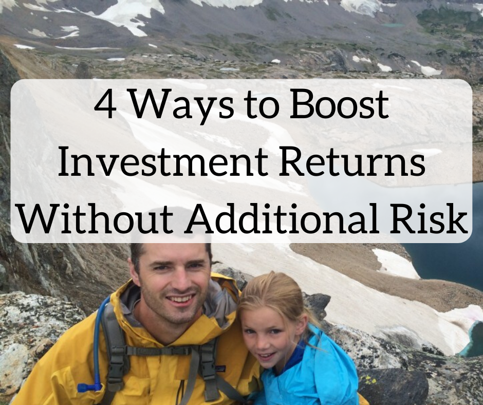

## Table of Contents

## What is the relationship between risk and return in investments?

The relationship between risk and return in investments is pretty straightforward: the higher the risk, the higher the potential return. When you invest in something risky, like a new startup company, you might lose all your money. But if the company does well, you could make a lot more money than if you had invested in something safer, like a savings account. This is because investors need to be rewarded for taking on more risk.

On the other hand, if you choose safer investments, like government bonds, you're less likely to lose your money. But the returns on these investments are usually lower. This is because there's less risk involved, so there's less need for a big reward. So, when you're thinking about where to put your money, you need to think about how much risk you're willing to take and how much return you're hoping to get.

## How can diversification help in enhancing returns without increasing risk?

Diversification means spreading your money across different types of investments. This can help you get better returns without taking on more risk. When you put all your money into one thing, like one company's stock, you're taking a big risk. If that company does badly, you could lose a lot of money. But if you spread your money around, some of your investments might go down, but others might go up. This can balance things out and make your overall returns more stable.

For example, if you invest in both stocks and bonds, you're mixing something that can be risky (stocks) with something that's usually safer (bonds). When the stock market goes down, your bonds might still be doing okay. This way, you're not putting all your eggs in one basket. By diversifying, you can smooth out the ups and downs of your investments, which can lead to better returns over time without making your portfolio riskier.

## What are some common strategies for managing risk in a portfolio?

One common way to manage risk in a portfolio is by diversifying your investments. This means not putting all your money into one type of investment. Instead, you spread it out across different kinds of assets, like stocks, bonds, and real estate. When you diversify, if one investment goes down, others might go up or stay the same, which can help protect your overall money.

Another strategy is to use something called asset allocation. This is about deciding how much of your money to put into different types of investments based on how much risk you're okay with and how long you plan to keep your money invested. For example, if you're young and won't need the money for a long time, you might put more into stocks, which are riskier but can grow a lot over time. If you're closer to needing the money, you might put more into bonds, which are safer but don't grow as much.

You can also use stop-loss orders to manage risk. A stop-loss order is like a safety net for your investments. It tells your broker to sell a stock if it drops to a certain price, which can help limit how much money you could lose on that investment. This way, you can try to keep your losses small while still giving your investments a chance to grow.

## Can asset allocation improve returns without necessarily increasing risk?

Asset allocation can help improve returns without necessarily increasing risk by spreading your money across different types of investments. When you put your money into a mix of stocks, bonds, and other assets, you're not relying on just one thing to do well. This means if one type of investment goes down, others might go up or stay the same, which can balance out your overall returns. This way, you can aim for better growth while keeping the risk level in check.

For example, if you're young and won't need your money for a long time, you might choose to put more money into stocks, which can be riskier but often offer higher returns over time. As you get older and closer to needing the money, you might shift more into bonds, which are safer but grow more slowly. By adjusting your asset allocation over time, you can work towards better returns while managing the risk according to your life stage and financial goals.

## What role does rebalancing play in maintaining an optimal risk-return profile?

Rebalancing is like keeping your investment plan on track. It means adjusting your portfolio to make sure it still matches the mix of investments you wanted at the start. Over time, some of your investments might do better than others, which can change the balance of your portfolio. For example, if your stocks go up a lot, they might start to make up a bigger part of your portfolio than you planned. By rebalancing, you sell some of the stocks that did well and buy more of the ones that didn't, to get back to your original plan.

This helps keep your risk level where you want it. If you don't rebalance, your portfolio might end up riskier than you planned because it's too heavily in stocks. By selling some stocks and buying more bonds or other safer investments, you can keep the risk under control. Rebalancing also gives you a chance to buy low and sell high, which can help improve your returns over time without making your portfolio riskier.

## How can the use of index funds or ETFs contribute to better risk-adjusted returns?

Using index funds or ETFs can help you get better returns for the amount of risk you're taking. Index funds and ETFs are types of investments that track a whole bunch of stocks or bonds, like the ones in the S&P 500. Because they spread your money across many different companies, they're a good way to diversify your investments without having to pick individual stocks. This means you're not putting all your eggs in one basket, which can make your investments less risky.

Plus, index funds and ETFs usually have lower fees than other types of investments. When you pay less in fees, more of your money stays invested and can grow over time. This can lead to better returns without you having to take on more risk. So, by using index funds or ETFs, you can get a good balance of risk and return, making your investments work better for you.

## What are the benefits of using dollar-cost averaging in managing investment risk?

Dollar-cost averaging is a way to invest money over time instead of all at once. When you use dollar-cost averaging, you put the same amount of money into your investments at regular times, like every month. This can help you manage risk because you're not trying to guess when the market is at its highest or lowest. If the market goes down, you'll buy more shares with the same amount of money. If the market goes up, you'll buy fewer shares. Over time, this can average out the cost of your investments and help you avoid big losses if the market drops right after you invest a large sum.

Another benefit of dollar-cost averaging is that it can help you stay disciplined with your investing. It's easy to get scared and stop investing if the market goes down, but with dollar-cost averaging, you keep putting money in no matter what. This can help you stick to your investment plan and keep growing your money over the long term. By investing regularly, you're also taking advantage of the ups and downs of the market, which can lead to better returns without increasing your risk.

## How does the concept of risk parity approach help in enhancing returns?

The risk parity approach is a way to build an investment portfolio that tries to balance risk across different types of investments. Instead of just looking at how much money you put into each thing, like stocks or bonds, risk parity looks at how risky each thing is. The idea is to spread the risk evenly so that no single investment can hurt your portfolio too much. This means you might put more money into safer investments like bonds if they're less risky, and less money into riskier things like stocks.

By using risk parity, you can aim to get better returns without taking on more risk. This is because when you balance the risk, your portfolio can be more stable. If the stock market goes down, the safer parts of your portfolio might not go down as much, which can help protect your money. Over time, this balanced approach can lead to smoother growth and better overall returns because you're not as likely to lose a lot of money all at once.

## What advanced techniques like options and futures can be used to hedge risk while seeking higher returns?

Options and futures are advanced financial tools that can help you manage risk while trying to get higher returns. An option gives you the right, but not the obligation, to buy or sell an asset at a certain price before a specific date. If you think a stock might go down, you can buy a "put" option to sell it at a higher price than it might fall to, which can limit your losses. On the other hand, if you think a stock will go up, you can buy a "call" option to buy it at a lower price than it might rise to, which can boost your returns. By using options, you can protect your investments from big drops while still having the chance to make more money if things go well.

Futures are contracts where you agree to buy or sell an asset at a set price on a future date. They can be used to hedge against price changes in things like commodities or stocks. For example, if you own a lot of a certain stock and you're worried it might go down, you can sell a futures contract for that stock at today's price. If the stock does go down, you'll lose money on the stock itself, but you'll make money on the futures contract, which can help balance out your losses. By using futures, you can lock in prices and protect your portfolio from big swings, which can help you aim for higher returns without taking on too much extra risk.

## How can quantitative analysis and algorithms be applied to optimize the risk-return trade-off?

Quantitative analysis and algorithms can help you make smarter choices about where to put your money. By using math and computer programs, you can look at a lot of data to figure out which investments might do well and which ones might be risky. For example, you can use past information about how stocks have moved to guess how they might move in the future. This can help you pick a mix of investments that might give you good returns without making your portfolio too risky. Algorithms can also help you find patterns that you might not see just by looking at the numbers yourself, which can lead to better decisions.

Another way quantitative analysis helps is by making it easier to keep your portfolio balanced. Algorithms can watch your investments all the time and tell you when it's time to buy or sell something to keep your risk level where you want it. This is called rebalancing, and it's important because it can help you stick to your plan and avoid getting too much risk in one place. By using these tools, you can make sure your investments are always working together to give you the best chance at good returns without taking on too much extra risk.

## What is the impact of behavioral finance on risk management and return enhancement?

Behavioral finance looks at how people's feelings and habits can affect their money choices. Sometimes, people might make quick decisions based on fear or excitement, which can lead to bad investment moves. For example, if the stock market goes down a lot, someone might get scared and sell all their stocks, even if it's not a good time to sell. This can make their portfolio riskier because they might miss out on the market going back up. By understanding these behaviors, investors can try to avoid making these mistakes and manage their risk better.

On the other hand, knowing about behavioral finance can also help people make better choices to get higher returns. If someone knows they tend to follow the crowd and buy stocks just because everyone else is, they can try to do the opposite and buy when others are selling. This can lead to buying stocks at lower prices and selling them at higher prices, which can boost their returns. By being aware of these habits and using them to their advantage, investors can work towards better returns without taking on more risk than they're comfortable with.

## How can an investor assess and utilize the risk-return efficiency of different asset classes in a global portfolio?

To assess and use the risk-return efficiency of different asset classes in a global portfolio, an investor first needs to look at how each asset class has done in the past. This means checking the returns they've given and the risks they've had. For example, stocks might give higher returns but can be riskier, while bonds might give lower returns but are usually safer. By looking at data from different countries and types of investments, like stocks, bonds, real estate, and commodities, an investor can see which ones have a good balance of risk and return. They can also use tools like the Sharpe Ratio, which measures how much return you get for the risk you take, to compare different asset classes.

Once an investor understands the risk-return efficiency of different asset classes, they can build a global portfolio that mixes them in a smart way. This means putting money into different countries and types of investments to spread out the risk. For example, if stocks in the U.S. are doing well but might be risky, the investor might also put some money into safer bonds in Europe or real estate in Asia. By diversifying like this, the investor can aim for better returns without making their portfolio too risky. They can also keep an eye on how the different parts of their portfolio are doing and adjust their investments over time to keep the balance of risk and return that they want.

## What is the definition of Alpha in investment strategy?

Alpha is a critical concept in investment strategies, serving as an indicator of an investment's performance relative to a market benchmark. It is defined as the excess return an investment generates above the return predicted by the market or benchmark index. Alpha is often seen as a measure of an investment manager's skills and ability to generate returns beyond what is expected based on market movements. When an investment portfolio has an alpha greater than zero, it signifies that the investment manager has added value beyond passively investing in the benchmark index.

The concept of alpha is rooted in the Capital Asset Pricing Model (CAPM), a foundational model used to determine the expected return on an investment. According to the CAPM, the expected return of an asset is calculated as follows:

$$
\text{Expected Return} = R_f + \beta \times (\text{Market Return} - R_f)
$$

Where:
- $R_f$ is the risk-free rate of return,
- $\beta$ is the measure of an asset's volatility relative to the market,
- $\text{Market Return}$ is the expected return of the market.

Alpha ($\alpha$) is determined by the equation:

$$
\alpha = \text{Actual Return} - \text{Expected Return}
$$

Alpha is not only a product of effective security selection and timing but also reflects the efficacy of the risk management and trading processes employed by an investment manager. A positive alpha indicates that the investment has outperformed the benchmark after adjusting for market risk, while a negative alpha implies underperformance.

To calculate alpha for a portfolio, several methods can be employed. One common approach is to use historical data to regress the portfolio's excess return against the excess return of the market. This method involves performing a linear regression to ascertain the intercept, which represents the portfolio's alpha.

Apart from the CAPM, other models like the Fama-French three-[factor](/wiki/factor-investing) model extend the calculation of alpha by incorporating size risk and value risk factors along with market risk. This model accounts for the effects of a company's market capitalization and book-to-market ratio on expected returns, providing a more comprehensive insight into alpha generation.

The importance of alpha in strategy evaluation cannot be understated. It provides an objective measure of an investment manager's performance relative to predefined benchmarks. Investors use alpha to assess the effectiveness of the active management strategies they employ and to guide decisions regarding the allocation of their capital. In a competitive market environment, achieving and sustaining a positive alpha is crucial for investment managers striving to attract and retain investors.

## What are Risk Management Strategies?

Risk management is a critical component in trading, aimed at minimizing potential losses while maximizing returns. Traditional risk management techniques have laid the foundation for controlling investment risk, while innovative strategies have provided more sophisticated tools for modern finance.

### Traditional Risk Management Techniques

1. **Diversification**: This involves spreading investments across various asset classes to reduce the impact of a single asset's performance on the overall portfolio. By holding a mix of stocks, bonds, and other securities, investors can mitigate unsystematic risk specific to a company or industry.

2. **Asset Allocation**: Adjusting the proportion of different asset types within a portfolio can help in aligning risk levels with an investor’s risk tolerance and investment goals. Typically, a conservative portfolio would have a higher percentage of bonds, while an aggressive portfolio might be more heavily weighted in equities.

3. **Stop-Loss Orders**: A stop-loss order automatically sells a security when it reaches a certain price, limiting potential losses. This tool is particularly useful in volatile markets where quick changes in asset prices can lead to significant losses.

4. **Hedging**: Investors can hedge against potential losses by using derivatives like options and futures. For example, purchasing a put option allows an investor to sell a stock at a predetermined price, offering protection against a drop in its value.

### Innovative Risk Management Strategies

1. **Algorithmic Risk Management**: Leveraging advanced algorithms allows for real-time monitoring and management of risks in a portfolio. These algorithms can automatically adjust positions in response to market changes, optimizing risk exposure.

2. **Machine Learning Models**: Using machine learning models to predict market behavior and identify potential risks can enhance traditional risk management strategies. Models can recognize patterns and assess historical data to forecast future market conditions, allowing investors to make informed decisions.

3. **Value-at-Risk (VaR) and Conditional Value-at-Risk (CVaR)**: These statistical measures help in estimating the potential loss in a portfolio over a defined period for a given confidence interval. VaR provides a value indicating what an investor can expect to lose at most, while CVaR gives an average of the losses that exceed VaR, offering a more comprehensive risk assessment.

4. **Stress Testing and Scenario Analysis**: Simulating extreme market conditions or specific scenarios helps investors understand the potential impact of unprecedented events on a portfolio. This forward-looking approach assists in enhancing preparedness for adverse market conditions.

### Balancing Risk and Return

Achieving the right balance between risk and return is essential for building a successful investment portfolio. This balance is often visualized using the Efficient Frontier model, which represents the set of optimal portfolios providing the highest expected return for a defined level of risk. Utilizing the Capital Asset Pricing Model (CAPM), investors can estimate the expected return on an investment given its risk, using the formula:

$$
\text{Expected Return} = R_f + \beta(R_m - R_f)
$$

where:
- $R_f$ is the risk-free rate,
- $\beta$ is the investment’s beta,
- $R_m$ is the expected market return.

While traditional methods focus on reducing losses and safeguarding investments, innovative strategies employ technology to anticipate and mitigate risks proactively. A well-structured risk management plan, integrating both approaches, can aid investors in optimizing returns while navigating the uncertainties inherent in financial markets.

## References & Further Reading

[1]: Ang, A. (2014). ["Asset Management: A Systematic Approach to Factor Investing."](https://www.amazon.com/Asset-Management-Systematic-Investing-Association/dp/0199959323) Oxford University Press.

[2]: Thomas, L., & Boyd, F. (2019). ["Algorithmic Trading and DMA: An Introduction to Direct Access Trading Strategies."](https://blog.mathquant.com/2018/12/10/algorithmic-trading-and-dma-an-introduction-to-direct-access-trading-strategies.html) 4Myeloma Press.

[3]: Treynor, J.L., & Black, F. (1973). ["How to Use Security Analysis to Improve Portfolio Selection."](https://www.jstor.org/stable/2351280) The Journal of Business.

[4]: Hull, J.C. (2018). ["Risk Management and Financial Institutions."](https://books.google.com/books/about/Risk_Management_and_Financial_Institutio.html?id=1J1QDwAAQBAJ) Wiley.

[5]: ["The Handbook of High Frequency Trading"](https://www.amazon.com/Handbook-High-Frequency-Trading-Gregoriou-ebook/dp/B00TH0LWHY) by Greg N. Gregoriou