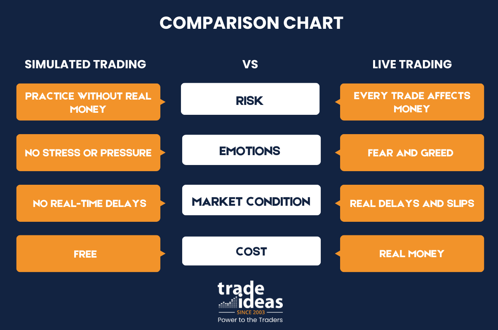

## Table of Contents

## What is simulated trading and how does it work?

Simulated trading, also known as paper trading, is a way for people to practice buying and selling stocks, options, or other financial instruments without using real money. It's like playing a game where you can learn how the stock market works without risking any of your own cash. You use pretend money to make trades and see how your choices would perform in the real market, but since it's all simulated, you don't actually gain or lose any real money.

In simulated trading, you usually use a special platform or software that mimics real market conditions. This software tracks the prices and movements of stocks just like in the real market, but it's all happening in a safe environment. You can experiment with different trading strategies, see how they work out, and learn from your mistakes without any financial risk. It's a great way for beginners to get comfortable with trading before they start using real money, and even experienced traders use it to test new strategies.

## Why is simulated trading beneficial for beginners?

Simulated trading is really helpful for beginners because it lets them practice trading without losing any real money. When you're new to trading, it can be scary to put your own money on the line. With simulated trading, you can try out buying and selling stocks, see how the market moves, and learn the ropes without any risk. It's like a safe playground where you can make mistakes and learn from them, all while using pretend money.

Another big benefit is that simulated trading helps beginners understand how different strategies work. You can try out different ways of trading, see which ones work best for you, and get a feel for what you like and what you don't. This practice can build your confidence so that when you're ready to trade with real money, you'll have a better idea of what to do. It's a great way to learn and grow as a trader without the pressure of real financial risk.

## What are the key features to look for in a simulated trading platform?

When [picking](/wiki/asset-class-picking) a simulated trading platform, it's important to look for one that feels a lot like the real stock market. The platform should have up-to-date and accurate data on stock prices and market conditions. This way, you can practice trading in a way that's close to the real thing. Also, the platform should be easy to use, even if you're new to trading. A good platform will have simple menus and clear instructions so you can focus on learning how to trade, not on figuring out how to use the software.

Another thing to look for is a variety of tools and features that let you practice different kinds of trading. The platform should let you trade stocks, options, and maybe even other things like [forex](/wiki/forex-system) or futures. It's also helpful if the platform has tools like charts, indicators, and analysis features that help you understand the market better. Lastly, make sure the platform gives you enough pretend money to practice with, so you can try out different strategies without running out of cash.

## How can simulated trading help in understanding market dynamics?

Simulated trading is a great way to learn about how the market moves. When you use a simulated trading platform, you get to see how stock prices go up and down every day. This helps you understand things like why prices change, what news can affect the market, and how different events can make stocks go crazy or stay calm. It's like watching a live show of the market, but you don't have to worry about losing money.

By practicing with simulated trading, you can also see how your choices affect your pretend money. You might try buying a stock and then see what happens if you sell it a week later. This helps you learn about timing and how long to hold onto a stock. You can also experiment with different trading strategies and see which ones work best for you. Over time, this practice can help you get a good feel for the ups and downs of the market, making you more ready to trade for real when you're ready.

## What are the common mistakes beginners make in simulated trading?

One common mistake beginners make in simulated trading is getting too excited and making too many trades. When you're using pretend money, it's easy to think that you can just keep buying and selling without worrying about the results. But in the real world, too much trading can lead to big losses. It's important to learn how to be patient and think carefully about each trade, even when you're practicing.

Another mistake is not keeping track of why you're making certain trades. It's easy to just click and buy a stock because it looks good at the moment, but you should always have a reason for your trades. Writing down your thoughts and reasons can help you learn from your decisions and improve your strategy. Without this, you might keep making the same mistakes over and over.

Lastly, beginners often forget that simulated trading isn't exactly like the real thing. The emotions and stress of using real money can change how you make decisions. So, while simulated trading is great for practice, it's important to remember that it's not the same as trading with real money. You need to be ready for the extra pressure and different feelings that come with real trading.

## How can one transition from simulated trading to live trading?

Moving from simulated trading to live trading is a big step, but it can be done smoothly with some preparation. Start by reviewing what you learned from your simulated trades. Look at the strategies that worked well and the mistakes you made. This will help you understand what to do and what to avoid when you start using real money. It's also a good idea to set a budget for how much money you're willing to risk. This way, you won't be tempted to spend more than you can afford to lose.

Once you feel ready, begin with small trades. This will help you get used to the real market without risking too much money. Remember, the emotions and stress of using real money can be different from what you felt in simulated trading. Take your time, and don't rush into big trades right away. As you gain more experience and confidence, you can slowly increase the amount of money you trade with. Always keep learning and adjusting your strategies based on what you see happening in the market.

## What advanced strategies can be practiced using simulated trading?

Simulated trading is a great way to practice advanced trading strategies without risking real money. One strategy you can try is called swing trading, where you buy a stock and hold it for a few days or weeks, hoping to sell it for a profit. This strategy needs you to understand the market's ups and downs and pick the right time to buy and sell. Another advanced strategy is options trading, which can be tricky because it involves contracts that give you the right to buy or sell a stock at a certain price. Simulated trading lets you play around with these options and see how they work without the risk of losing money.

Another strategy to practice is [day trading](/wiki/day-trading-spy), where you buy and sell stocks within the same day. This needs you to be quick and pay close attention to the market all day. Simulated trading helps you get used to the fast pace and learn how to make quick decisions. You can also practice using technical analysis, which is all about looking at charts and patterns to predict where the market might go next. By trying these strategies in a simulated environment, you can see what works for you and get better at trading before you use real money.

## How does simulated trading aid in risk management?

Simulated trading helps you learn about risk management by letting you practice without using real money. You can try different ways of trading and see what happens when you take big risks or play it safe. This helps you figure out how much risk you're comfortable with and what kind of strategies work best for you. By making mistakes in a safe environment, you can learn how to avoid big losses when you start trading for real.

When you practice risk management in simulated trading, you can also learn how to use tools like stop-loss orders. These are orders that automatically sell your stock if the price drops too much, helping you limit your losses. By using these tools in a simulated environment, you can see how they work and how to set them up correctly. This practice helps you get ready for real trading, where managing risk is super important to protect your money.

## What metrics should be tracked to evaluate performance in simulated trading?

When you're doing simulated trading, it's important to keep an eye on a few key numbers to see how well you're doing. One big number to watch is your overall profit and loss. This tells you if you're making money or losing it, even if it's just pretend money. Another number to track is your win rate, which shows how often your trades are successful. If you're winning more than you're losing, that's a good sign. You should also look at the average size of your wins and losses. If your wins are bigger than your losses, that can help you make money even if you don't win every time.

Another useful metric is the risk-reward ratio, which helps you understand if the potential reward of a trade is worth the risk. A good risk-reward ratio means you're taking smart risks. It's also helpful to track your drawdowns, which show the biggest drop in your account value from its highest point. This can tell you how much risk you're taking on. By keeping an eye on these numbers, you can get a clear picture of your trading performance and figure out what you need to work on before you start trading with real money.

## How can simulated trading be used to test and refine trading algorithms?

Simulated trading is a great way to test and refine trading algorithms because it lets you see how your code works in a pretend market without losing any real money. When you write a trading algorithm, you want to make sure it can make good choices and find the right times to buy and sell stocks. By using a simulated trading platform, you can run your algorithm through lots of different market situations and see how it does. This helps you find any problems or mistakes in your code and fix them before you start using real money.

Once you've tested your algorithm in a simulated environment, you can keep refining it by trying out different tweaks and changes. You might change how the algorithm decides to buy or sell, or you might adjust the settings to see if it works better. Each time you make a change, you can run the simulation again to see if your algorithm performs better. This back-and-forth process helps you fine-tune your trading algorithm until it's as good as it can be, all without the risk of losing money in the real market.

## What psychological aspects of trading can be learned through simulated trading?

Simulated trading helps you learn about the emotions you feel when you're trading. When you use pretend money, you can still feel excited, nervous, or even scared when you make trades. This helps you understand how these feelings can affect your decisions. In real trading, these emotions can make you do things like sell too early or hold onto a losing stock for too long. By practicing in a simulated environment, you can see how your emotions play out and learn how to stay calm and make better choices.

Another important thing you can learn is how to deal with losses. Even though it's just pretend money, losing it can still feel bad. Simulated trading lets you practice handling these feelings without the stress of losing real money. You can learn to accept losses as part of trading and figure out how to move on quickly. This practice helps you build the mental strength you need for real trading, where handling your emotions is just as important as understanding the market.

## How can expert traders use simulated trading to explore new markets or instruments?

Expert traders can use simulated trading to try out new markets or instruments without any risk. They can practice trading things like forex, commodities, or even cryptocurrencies in a safe environment. This way, they can learn how these new markets work and see how different strategies might perform. It's a great way to get familiar with the ups and downs of a new market before putting real money on the line.

By using simulated trading, expert traders can also test out new trading ideas and see if they work in different markets. They can try different approaches and see how they hold up against real market data. This practice helps them refine their strategies and figure out what works best for each new market or instrument. It's like a playground where they can experiment and learn without worrying about losing money.

## References & Further Reading

[1]: Bergstra, J., Bardenet, R., Bengio, Y., & Kégl, B. (2011). ["Algorithms for Hyper-Parameter Optimization."](https://papers.nips.cc/paper/4443-algorithms-for-hyper-parameter-optimization) Advances in Neural Information Processing Systems 24.

[2]: ["Advances in Financial Machine Learning"](https://www.amazon.com/Advances-Financial-Machine-Learning-Marcos/dp/1119482089) by Marcos Lopez de Prado

[3]: ["Evidence-Based Technical Analysis: Applying the Scientific Method and Statistical Inference to Trading Signals"](https://www.amazon.com/Evidence-Based-Technical-Analysis-Scientific-Statistical/dp/0470008741) by David Aronson

[4]: ["Machine Learning for Algorithmic Trading"](https://github.com/stefan-jansen/machine-learning-for-trading) by Stefan Jansen

[5]: ["Quantitative Trading: How to Build Your Own Algorithmic Trading Business"](https://www.amazon.com/Quantitative-Trading-Build-Algorithmic-Business/dp/1119800064) by Ernest P. Chan