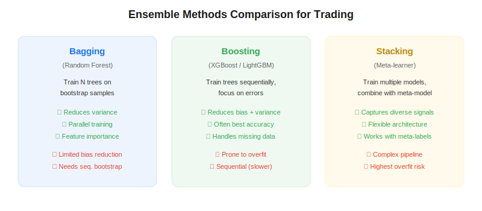
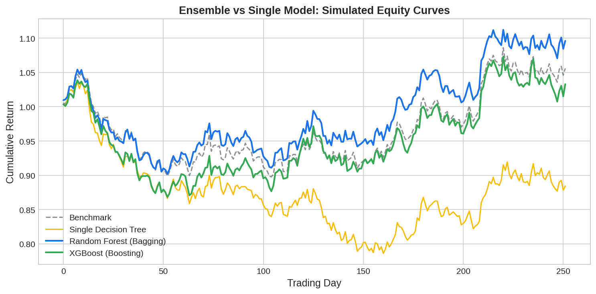

Ensemble methods combine multiple machine learning models to produce predictions that are more accurate and robust than any single model alone. In algorithmic trading, where signal-to-noise ratios are low and overfitting is the primary risk, ensembles — particularly random forests (bagging) and gradient boosting (XGBoost, LightGBM) — have become the workhorses of ML-driven strategies. Marcos Lopez de Prado's *Advances in Financial Machine Learning* (2018) provides specific guidance on adapting these methods for financial data.

## Why Ensembles Work for Trading

A single decision tree is highly prone to overfitting — it memorizes the training data. Ensembles reduce this by aggregating many diverse models. Bagging reduces variance by averaging, boosting reduces bias by sequential error correction, and stacking combines heterogeneous models via a meta-learner.



## Random Forests (Bagging)

Random forests train $B$ decision trees on bootstrap samples with random feature subsets. The prediction is the majority vote (classification) or average (regression).

**Special considerations for finance:**
- Use [sequential bootstrapping](https://paperswithbacktest.com/wiki/sequential-bootstrapping) instead of standard bootstrap to handle overlapping labels
- Pass [sample weights](https://paperswithbacktest.com/wiki/sample-weights-financial-ml) to account for uniqueness and time decay
- Use [purged cross-validation](https://paperswithbacktest.com/wiki/purged-k-fold-cross-validation) instead of standard OOB error

```python
from sklearn.ensemble import RandomForestClassifier

clf = RandomForestClassifier(
    n_estimators=500,
    max_depth=5,
    min_samples_leaf=20,
    max_features="sqrt",
    class_weight="balanced_subsample",
    n_jobs=-1,
    random_state=42,
)
clf.fit(X_train, y_train, sample_weight=weights)
```

## Gradient Boosting (XGBoost / LightGBM)

Boosting builds trees sequentially, with each new tree correcting the errors of the previous ensemble. This is powerful but dangerous — boosting can overfit aggressively to financial noise.

```python
import xgboost as xgb

model = xgb.XGBClassifier(
    n_estimators=300,
    max_depth=3,
    learning_rate=0.05,
    subsample=0.8,
    colsample_bytree=0.8,
    reg_alpha=1.0,
    reg_lambda=1.0,
    early_stopping_rounds=20,
    eval_metric="logloss",
)
model.fit(X_train, y_train, sample_weight=weights,
          eval_set=[(X_val, y_val)], verbose=False)
```

## Stacking

Stacking trains multiple diverse base models (RF, XGBoost, logistic regression, etc.) and combines their predictions using a meta-learner. This is conceptually similar to [meta-labeling](https://paperswithbacktest.com/wiki/meta-labeling), where a secondary model learns to filter signals from a primary model.



## Key Parameters for Financial Data

| Method | Key Parameter | Typical Value | Purpose |
|---|---|---|---|
| RF | max_depth | 3–7 | Prevent overfitting |
| RF | min_samples_leaf | 10–50 | Ensure stable splits |
| XGBoost | learning_rate | 0.01–0.1 | Slower learning = more robust |
| XGBoost | reg_alpha, reg_lambda | 0.5–5.0 | L1/L2 regularization |
| All | n_estimators | 200–1000 | More trees reduce variance |

## Limitations and Risks

Ensembles do not solve the fundamental problem of low signal-to-noise in financial data. They can still overfit, especially boosting with many iterations. The AFML framework mitigates this by combining ensembles with proper labeling (triple-barrier), feature engineering ([fractional differentiation](https://paperswithbacktest.com/wiki/fractional-differentiation)), and validation ([CPCV](https://paperswithbacktest.com/wiki/combinatorial-purged-cross-validation-cpcv)). Never evaluate an ensemble on standard cross-validation — always use purged and embargoed folds.

## Conclusion

Ensemble methods are the backbone of ML-based trading strategies. Random forests with sequential bootstrapping and sample weights offer the best balance of robustness and interpretability, while gradient boosting provides maximum predictive power when carefully regularized. Both benefit enormously from the AFML pipeline of proper data preparation, labeling, and validation.

---

**Explore further on PapersWithBacktest:**
- Browse [backtested ML strategies](https://paperswithbacktest.com/strategies) with Python code and performance metrics
- Access [clean historical market data](https://paperswithbacktest.com/datasets) for equities, crypto, and futures
- Take the [algo trading course](https://paperswithbacktest.com/course) — 60+ video lessons and notebooks
- Related wiki pages: [Sequential Bootstrapping](https://paperswithbacktest.com/wiki/sequential-bootstrapping) · [Sample Weights](https://paperswithbacktest.com/wiki/sample-weights-financial-ml) · [Feature Importance](https://paperswithbacktest.com/wiki/feature-importance-financial-ml)
