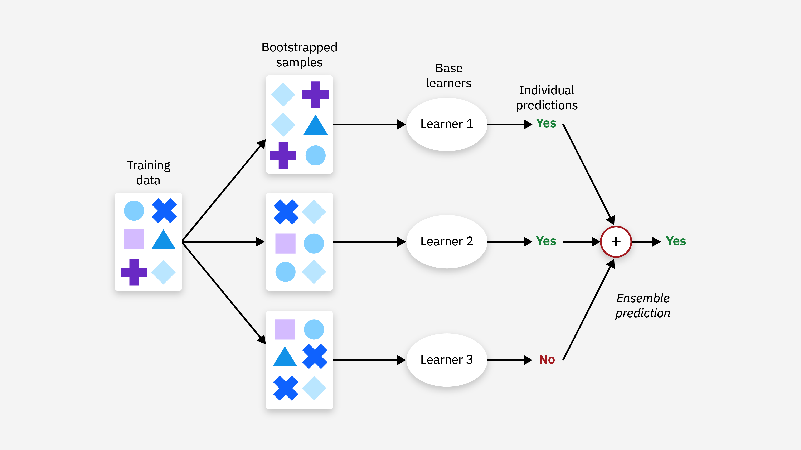

Algorithmic trading refers to the application of computer algorithms to automate financial trading strategies, which allows for more efficient processing and faster execution of trades. With market data streaming in at high speeds, algorithmic trading systems are designed to analyze this data promptly to capitalize on trading opportunities. These systems have become increasingly sophisticated, leveraging advances in artificial intelligence and machine learning.

A significant trend within this domain is the incorporation of ensemble methods. Ensemble methods are a machine learning concept where multiple models, typically referred to as "learners" or "base models," are combined to improve the overall performance of a predictive task. In finance, these methods are particularly beneficial due to the noisy and non-linear nature of financial data. Ensembles can amalgamate predictions from various models to achieve more accurate and stable outcomes than could be realized from any single model.



The attractiveness of ensemble methods in algorithmic trading lies in their ability to enhance the predictive power and robustness of trading strategies. By integrating a variety of models, ensemble methods can mitigate the risk of overfitting, which occurs when a model captures noise instead of the underlying trend in the data. Techniques such as bagging, boosting, and stacking help in capturing complex patterns and relationships, offering an edge in rapidly changing financial markets.

This article aims to elucidate how ensemble methods can be effectively applied to algorithmic trading. The discussion will cover different ensemble techniques, their advantages in optimizing trading strategies, challenges associated with their implementation, and insights into how these methods have been successfully deployed in real-world trading scenarios. As the financial markets continue to evolve, the role of ensemble methods in algorithmic trading is expected to grow, driven by ongoing advancements in machine learning and data analytics.

## Table of Contents

## Understanding Ensemble Methods

Ensemble methods in [machine learning](/wiki/machine-learning) involve the strategic combination of multiple models to enhance prediction accuracy and generalization. By aggregating the strengths of individual models, these techniques aim to produce a more robust and reliable model than any single constituent could achieve independently. 

**Bagging**, short for Bootstrap Aggregating, involves training multiple versions of a model on different subsets of the training dataset, generated using bootstrapping (sampling with replacement). Each model then votes on the final prediction, which for regression is typically averaged and for classification is a majority vote. A prominent example of a bagging technique is the Random Forest, which builds multiple decision trees and combines their outputs to improve prediction stability and accuracy.

**Boosting** is another ensemble technique that builds models sequentially, where each new model attempts to correct the errors of its predecessor. It operates by giving more weight to instances that were previously misclassified, thereby focusing subsequent models on the more difficult cases. Boosting algorithms, like AdaBoost and Gradient Boosting, often result in strong predictive performance due to their emphasis on reducing bias and variance through iterative improvement.

**Stacking** or Stacked Generalization is a process where multiple different models (often of varied types) are trained and their predictions are used as inputs to a higher-level meta-model, which attempts to learn the best way to combine them. The meta-model is usually a simple linear model or another powerful classifier that learns from the predictions of the base models—potentially capturing complex patterns and dependencies among them that individual models might miss.

Ensemble methods are especially effective in trading contexts where data is often noisy, and underlying patterns are complex. Overfitting, a common pitfall in machine learning where models become too tailored to the training data and perform poorly on unseen data, is mitigated by these methods through the combined and weighted approach to prediction. By leveraging the diverse prediction behaviors of various models, ensemble methods enhance the robustness and reliability of forecasts, making them invaluable tools in developing robust [algorithmic trading](/wiki/algorithmic-trading) strategies.

## Advantages of Ensemble Methods in Trading

Ensemble methods offer distinct advantages in algorithmic trading by enhancing predictive accuracy and reducing [volatility](/wiki/volatility-trading-strategies) within trading models. These techniques combine the strengths of multiple models, thereby providing a more reliable framework for making trading decisions.

One of the primary benefits of ensemble methods is their ability to capture complex patterns and relationships inherent in financial data. Financial markets are influenced by a myriad of factors, including economic indicators, geopolitical events, and investor sentiment, which can create non-linear and intricate patterns. Ensemble methods, by integrating various models, can discern these patterns more effectively than individual models. For instance, whereas a single decision tree might focus narrowly on specific attributes in the data, an ensemble of trees, such as a Random Forest, can capture a broader range of features and interactions, producing a more nuanced and comprehensive analysis.

Furthermore, ensemble methods aid in diversifying model risks, consequently leading to more stable trading performance. Traditional single-model approaches can be sensitive to anomalies or noise in the data, which in turn, can increase volatility and risk in predictions. By aggregating the outputs of multiple models, ensemble methods mitigate the risk of reliance on any single potentially flawed model. This diversification reduces the variance of the predictions, thus enhancing the robustness of the trading strategy. Mathematically, this can be demonstrated through the variance reduction property of ensemble models:

$$
Var(\text{Ensemble Model}) = \frac{1}{n} Var(\text{Individual Model}) + \left(1 - \frac{1}{n}\right)Cov(\text{Individual Models})
$$

Here $n$ represents the number of models in the ensemble, and $Cov$ is the covariance between individual models. As $n$ increases, the ensemble's variance approaches the average covariance among models, indicating reduced variance compared to any single constituent model.

Overall, by leveraging ensemble methods, traders can achieve a higher degree of predictive accuracy and stability, ultimately leading to better trading performance. The ability of ensemble methods to synthesize multiple perspectives provides a more reliable foundation for navigating the complexities of financial markets.

## Most Popular Ensemble Techniques in Algo Trading

Algorithmic trading benefits significantly from ensemble methods, which enhance prediction accuracy and trading strategy robustness. Among the most popular techniques employed in this context are Random Forest, Gradient Boosting Machines, and Stacked Generalization. Each method offers unique advantages and strategies for combining multiple models to produce superior trading forecasts.

### Random Forest

Random Forest is a bagging method that constructs an ensemble of decision trees to improve prediction accuracy. In this technique, multiple decision tree models are trained on different subsets of the training data. These subsets are typically generated through bootstrapping, a process that samples with replacement. Each tree is then used to predict the outcome independently, and the final prediction is obtained by aggregating the predictions of all trees, typically through majority voting (for classification) or averaging (for regression). This method helps reduce overfitting by leveraging the wisdom of crowds, where the collective output of the trees is less sensitive to the noise in the training data.

#### Mathematical Framework

The Random Forest algorithm operates under the following formula for generating predictions:

$$

\hat{y} = \frac{1}{N} \sum_{i=1}^{N} h_i(x)
$$

where $\hat{y}$ is the predicted output, $N$ is the number of decision trees, and $h_i(x)$ is the prediction of the i-th tree for input $x$.

### Gradient Boosting Machines

Gradient Boosting Machines (GBMs) focus on improving prediction accuracy by iteratively refining a weak model using a series of models. Each model in the sequence is trained to correct the errors of its predecessor, typically modeled as the residual errors between actual and predicted values. This is accomplished by using gradient descent to minimize the loss function. Over iterations, the ensemble boosts the performance of the weak learners by mastering the underlying patterns in the data.

#### Mathematical Framework

The process can be summarized with the following iterative formula:

$$

F_{m}(x) = F_{m-1}(x) + \eta \cdot h_{m}(x)
$$

where $F_{m}(x)$ is the current model prediction, $\eta$ is the learning rate controlling the step size, and $h_{m}(x)$ is the prediction of the m-th model focusing on improving the previous model $F_{m-1}(x)$.

### Stacked Generalization

Stacked Generalization, or stacking, is an ensemble method in which multiple models (base learners) are combined by a meta-learner to improve forecasting accuracy. The base learners are trained on the original dataset, and their predictions are used as input features for the meta-learner, which blends these predictions to generate the final output. This approach allows for capturing diverse kinds of patterns by exploiting different models trained on the same dataset, thereby improving the generalization of the predictions.

#### Implementation Consideration

In a typical stacking setup:

1. Train several base learners $L_1, L_2, \ldots, L_k$ on the training data.
2. Use the predictions of these learners as input features for the meta-learner $M$.
3. Train $M$ on these features to output the final prediction.

```python
# Pseudocode for Stacked Generalization
from sklearn.model_selection import train_test_split
from sklearn.ensemble import RandomForestClassifier, GradientBoostingClassifier
from sklearn.linear_model import LogisticRegression
from sklearn.datasets import make_classification
from sklearn.metrics import accuracy_score

# Create synthetic data
X, y = make_classification(n_samples=1000, n_features=20)

# Split data into training and test sets
X_train, X_test, y_train, y_test = train_test_split(X, y, test_size=0.2, random_state=42)

# Base learners
base_learner_1 = RandomForestClassifier()
base_learner_2 = GradientBoostingClassifier()

# Train base learners
base_learner_1.fit(X_train, y_train)
base_learner_2.fit(X_train, y_train)

# Obtain base predictions
predictions_1 = base_learner_1.predict(X_train)
predictions_2 = base_learner_2.predict(X_train)

# Meta-learner: Train on predictions
stacked_features = np.column_stack((predictions_1, predictions_2))
meta_learner = LogisticRegression().fit(stacked_features, y_train)

# Evaluate the stacked model
stacked_features_test = np.column_stack((base_learner_1.predict(X_test), base_learner_2.predict(X_test)))
final_predictions = meta_learner.predict(stacked_features_test)
accuracy = accuracy_score(y_test, final_predictions)

print(f"Stacked Generalization Accuracy: {accuracy}")
```

Overall, these techniques provide scalable and flexible frameworks to handle complex datasets inherent in financial markets, making them valuable tools for algorithmic traders seeking robust and accurate predictive models.

## Case Study: Implementing Ensemble Methods in Trading

In a notable case study, ensemble methods were employed to enhance algorithmic trading bots, demonstrating substantial improvements in trading performance. The project leveraged a variety of financial data sources, including historical stock prices, macroeconomic indicators, and real-time trading data from exchanges. The integration of diverse datasets was crucial in capturing the multifaceted nature of financial markets and providing a comprehensive foundation for model training.

The ensemble strategy consisted of several advanced models, each tuned to excel in distinct aspects of price prediction and pattern recognition. Among the models employed, Random Forests, Gradient Boosting Machines, and Stacked Generalization techniques were predominant. These models were chosen for their complementary strengths: Random Forests, with their robust handling of various data inputs, contributed to general forecast accuracy; Gradient Boosting Machines provided iterative refinements that enhanced the precision of predictions; and Stacked Generalization offered an overarching synthesis that harmonized predictions from individual models into a coherent output.

Performance was evaluated using a mix of quantitative metrics designed to reflect both the accuracy and profitability of the trading strategies. Key performance indicators included the Sharpe Ratio, which measures risk-adjusted returns, and the Sortino Ratio, which focuses on downside risk. Additionally, metrics such as precision and recall were employed to assess the models' prediction reliability in catching significant market movements. The results were compelling, showing enhanced predictive accuracy and improved risk management, translating to more stable returns.

Anecdotally, the adoption of ensemble methods resulted in a noticeable decrease in drawdowns and more consistent returns, even during periods of market volatility. Traders reported that the refined trading bots not only predicted market trends with greater accuracy but also adapted swiftly to changing market conditions, a testament to the robustness brought by ensemble techniques. Consequently, the implementation of these methods underscored their value in refining algorithmic trading systems, presenting a promising advancement for future trading applications.

## Challenges and Considerations

Ensemble methods in algorithmic trading come with a set of challenges and considerations that practitioners must address to fully harness their potential.

Firstly, these methods typically demand considerable computational resources. Ensemble techniques, such as Random Forests and Gradient Boosting Machines, involve the construction and evaluation of multiple models, which increases both the time and computational power required. For instance, training a Random Forest can necessitate several runs of decision tree algorithms, each with a different subset of data or features, significantly increasing the computational load. As a result, the cost of acquiring and maintaining the requisite hardware can become substantial, especially when real-time trading strategies are implemented.

Moreover, the complexity inherent in ensemble models can impede model interpretation. Unlike simpler models, such as linear regression, which provide clear insights into the relationships between input variables and outputs, ensemble models often function as black boxes. This lack of transparency can be problematic, particularly for financial institutions that must comply with regulatory demands for model interpretability. Furthermore, when attempting to interpret ensemble models, one might need to rely on techniques like SHAP (SHapley Additive exPlanations) or permutation feature importance, which, while useful, introduce additional layers of complexity and computation.

Another critical consideration is the need for meticulous data preprocessing to prevent complications such as overfitting. Ensemble methods can be sensitive to noisy data, irrelevant features, and imbalanced datasets. Effective preprocessing steps could include feature scaling, normalization, and the application of techniques like Principal Component Analysis (PCA) for dimensionality reduction. Without proper preprocessing, models may capture noise rather than the underlying signal, rendering them less effective in real-world trading scenarios. Implementing these preprocessing steps helps in developing models that generalize well, thus reducing the risk of overfitting.

Addressing these challenges requires a balanced approach that considers computational resources, model interpretability, and thorough data handling to create robust trading models.

## Conclusion

Ensemble methods have become instrumental in refining algorithmic trading strategies by enhancing predictive performance and providing robustness to financial models. These techniques, which integrate predictions from various models, help mitigate the risk of overfitting and improve the generalization of trading strategies, leading to more reliable outcomes. Despite the challenges associated with ensemble methods, such as the need for significant computational resources and increased model complexity, their ability to improve accuracy and stability holds substantial value in financial markets.

The integration of ensemble methods has led to noticeable improvements in capturing complex patterns within financial data, resulting in more informed decision-making processes. This, in turn, contributes to increased profitability, reduced volatility, and better risk management for traders.

The ongoing advancements in technological infrastructure and research are paving the way for even greater adoption of ensemble methods in algorithmic trading. As machine learning and [artificial intelligence](/wiki/ai-artificial-intelligence) continue to evolve, these methods are expected to become more sophisticated and accessible. The future of algorithmic trading is likely to witness higher integration of ensemble methods, ensuring that trading strategies remain robust and effective in dynamic market conditions. With continual enhancements in computational power and data analytics, ensemble methods are poised to play an increasingly vital role in mainstream trading operations.

## Future Outlook

The future of algorithmic trading, driven by advancements in artificial intelligence and machine learning, is poised to experience the emergence of innovative ensemble techniques. The current landscape has already witnessed the successful implementation of methods like Random Forests and Gradient Boosting Machines, which have significantly improved prediction capabilities in trading models. However, as machine learning continues to evolve, it is expected to introduce more sophisticated ensemble strategies that can further enhance accuracy and robustness in predicting financial market behaviors.

There is significant potential for these ensemble techniques to be integrated more deeply with advanced data analytics and big data technologies. As financial markets continue to generate vast amounts of data, the ability to process and analyze this information efficiently is crucial. Ensemble methods, which excel in drawing insights from complex, high-dimensional data, can benefit from the synergistic relationship with big data platforms. This integration enables the handling of massive datasets, allowing for more granular predictive strategies that can adapt to both incremental and disruptive market changes.

Despite the promising outlook, there are challenges to address, particularly concerning computational efficiency and interpretability of ensemble models. The computational demands of ensemble methods are substantial, often necessitating high-performance computing resources. As trading decisions need to be executed in real-time, optimizing these models for speed and efficiency is paramount. Researchers and traders are focusing on developing algorithms that can achieve a balance between computational load and predictive performance. This includes exploring parallel processing and distributed computing solutions to manage the increased computational requirements effectively.

Additionally, enhancing the interpretability of ensemble models remains a priority. Complex ensemble methods can act as black boxes, making it difficult to understand the driving factors behind trading decisions. Developing interpretable models is critical not only for regulatory compliance but also for gaining traders' trust in the system's recommendations. Techniques such as feature importance rankings and model-agnostic explanation systems are being explored to provide more transparency in ensemble methods.

Overall, the future outlook for ensemble methods in algorithmic trading is optimistic. As AI and machine learning technologies advance, they are expected to bring forth new and more efficient algorithms. Through integration with big data and advanced analytics, these methods will likely reshape the way financial markets are analyzed and traded, ushering in a new era of innovation in the trading sector.

## References & Further Reading

[1]: Bergstra, J., Bardenet, R., Bengio, Y., & Kégl, B. (2011). ["Algorithms for Hyper-Parameter Optimization."](https://papers.nips.cc/paper/4443-algorithms-for-hyper-parameter-optimization) Advances in Neural Information Processing Systems 24.

[2]: ["Advances in Financial Machine Learning"](https://www.amazon.com/Advances-Financial-Machine-Learning-Marcos/dp/1119482089) by Marcos Lopez de Prado

[3]: ["Evidence-Based Technical Analysis: Applying the Scientific Method and Statistical Inference to Trading Signals"](https://www.amazon.com/Evidence-Based-Technical-Analysis-Scientific-Statistical/dp/0470008741) by David Aronson

[4]: ["Machine Learning for Algorithmic Trading"](https://github.com/PacktPublishing/Machine-Learning-for-Algorithmic-Trading-Second-Edition) by Stefan Jansen

[5]: ["Quantitative Trading: How to Build Your Own Algorithmic Trading Business"](https://books.google.com/books/about/Quantitative_Trading.html?id=j70yEAAAQBAJ) by Ernest P. Chan