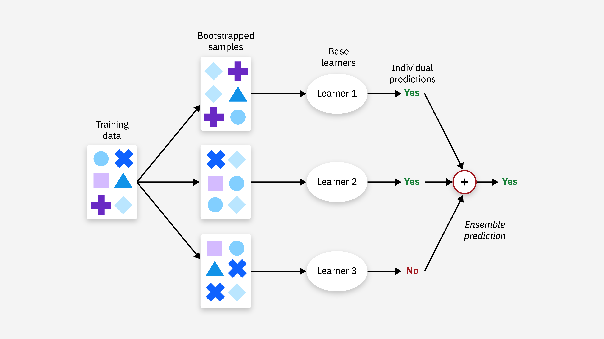

## Table of Contents

## What is ensembling in machine learning?

Ensembling in machine learning is a technique where you combine the predictions from multiple models to make a better prediction than any single model could do on its own. Think of it like asking a group of friends for advice instead of just one friend. If each friend has a different perspective, their combined advice might be more reliable than any single friend's suggestion. In machine learning, these "friends" are different models, and by combining their predictions, we can often improve the accuracy and robustness of our final prediction.

There are several ways to do ensembling, but two common methods are bagging and boosting. Bagging involves training multiple models on different subsets of the data and then averaging their predictions. For example, in Random Forests, many decision trees are trained on random samples of the data, and their predictions are combined to make the final prediction. Boosting, on the other hand, trains models sequentially, where each new model tries to correct the errors made by the previous ones. A popular boosting method is Gradient Boosting, where each new model focuses on the examples that were misclassified by the previous models, gradually improving the overall prediction.

Ensembling can be very powerful, but it also has some challenges. It can make the model more complex and harder to interpret, and it might require more computational resources. However, the trade-off is often worth it because ensembling can lead to better performance and more reliable predictions, especially in complex problems where a single model might not be enough.

## Why is ensembling important in machine learning?

Ensembling is important in machine learning because it helps to improve the accuracy and reliability of predictions. When you use ensembling, you're combining the strengths of different models. Imagine you have a few friends who are good at different things. If you ask all of them for advice, you might get a better answer than if you asked just one. In the same way, ensembling takes the predictions from multiple models and combines them to make a better final prediction. This is especially useful in complex problems where a single model might not be good enough.

Another reason ensembling is important is that it can help reduce errors and overfitting. Overfitting happens when a model learns the training data too well, including the noise and random fluctuations, and then doesn't perform well on new data. By using ensembling, you can create models that are more robust and less likely to overfit. For example, in bagging, you train many models on different parts of the data and then average their predictions. This averaging helps to smooth out the errors, leading to a more stable and reliable model. So, ensembling not only improves accuracy but also makes the model more trustworthy for real-world applications.

## What are the different types of ensembling methods?

Ensembling methods in machine learning are ways to combine different models to make better predictions. One common method is called bagging. In bagging, you train many models on different parts of your data, and then you average their predictions. A popular example of bagging is Random Forests, where you train lots of decision trees on random samples of the data. By averaging their predictions, you can reduce errors and make your model more reliable. This is like asking a lot of friends for advice and then taking the average of what they say.

Another important ensembling method is boosting. In boosting, you train models one after the other, and each new model tries to fix the mistakes made by the previous ones. A well-known boosting method is Gradient Boosting, where each new model focuses on the examples that were not predicted correctly before. This way, the model gets better and better with each step. It's like if you keep asking your friends for advice, and each time, you focus more on the advice that helps you improve the most.

There are also other ensembling methods like stacking, where you use a new model to combine the predictions of several base models. In stacking, you might train different types of models, like decision trees, neural networks, and linear models, and then use another model to make the final prediction based on all their outputs. This can be very powerful because it allows you to use the strengths of different kinds of models. So, ensembling is a great way to make your machine learning models more accurate and reliable.

## How does bagging work as an ensembling technique?

Bagging, which stands for Bootstrap Aggregating, is a way to make machine learning models better by combining them. Imagine you're trying to guess the answer to a question, and you ask many friends for their guesses. If you take the average of all their guesses, you might get a better answer than if you just listened to one friend. In bagging, you train lots of models on different parts of your data. Each model gets a random sample of the data, kind of like each friend has a slightly different view of the problem. Then, you average the predictions from all these models to make your final prediction. This helps to reduce errors and makes your model more reliable.

A common example of bagging is Random Forests. In a Random Forest, you train many decision trees, each on a random sample of the data. Each tree might make a different prediction, but when you average all their predictions, you often get a better result than if you used just one tree. This is because the errors from each tree can cancel each other out, leading to a more accurate final prediction. So, bagging is like asking a group of friends for their opinions and then combining them to make a better decision.

## What is boosting and how does it differ from bagging?

Boosting is another way to make machine learning models better by combining them, but it works a bit differently from bagging. Imagine you're trying to get better at a game. With boosting, you play the game over and over, and each time you focus on the parts you got wrong before. You keep learning from your mistakes, and with each round, you get a little better. In machine learning, boosting trains models one after the other. Each new model tries to fix the errors made by the previous models. A popular way to do this is called Gradient Boosting, where each new model focuses on the examples that were not predicted correctly before. This way, the model gets better and better with each step, like improving at a game by focusing on your weak spots.

The main difference between boosting and bagging is how they combine models. In bagging, like in Random Forests, you train many models at the same time, each on a different part of the data. Then, you average their predictions to make your final guess. It's like asking a lot of friends for advice and then taking the average of what they say. Boosting, on the other hand, trains models in a sequence. Each new model learns from the mistakes of the previous ones, so they work together to improve the overall prediction. It's like playing a game and getting better by focusing on your mistakes each time. Both methods help make your predictions more accurate, but they do it in different ways.

## Can you explain the concept of stacking in ensembling?

Stacking is a way to make machine learning models better by combining them. Imagine you have a few friends who are good at different things. You ask them for their advice on a problem, and then you ask another friend to look at all their advice and make the final decision. In stacking, you train different kinds of models, like decision trees, neural networks, and linear models, on your data. Each of these models gives you a prediction, and then you use another model, called a meta-model, to combine all these predictions into one final prediction. This meta-model learns how to best use the predictions from the other models to make the most accurate guess.

The key difference between stacking and other ensembling methods like bagging and boosting is how it uses the models. In bagging, you train many models at the same time and then average their predictions. In boosting, you train models one after the other, with each new model trying to fix the mistakes of the previous ones. But in stacking, you let the meta-model figure out the best way to combine the predictions from different types of models. This can be very powerful because it allows you to use the strengths of different kinds of models. For example, if one model is good at catching certain patterns in the data and another model is good at catching different patterns, the meta-model can learn how to use both sets of predictions to make the best final prediction.

## What are some common algorithms used in ensembling?

Ensembling in machine learning often uses different algorithms to combine models and make better predictions. One common algorithm is Random Forests, which is a type of bagging. In Random Forests, you train many decision trees on different parts of your data. Each tree gives you a prediction, and then you average all these predictions to get your final guess. This helps reduce errors because the mistakes from one tree can be balanced out by the others. Another popular bagging method is Bootstrap Aggregating, where you also train many models on random samples of your data and then combine their predictions.

Boosting algorithms are another important part of ensembling. A well-known boosting method is Gradient Boosting. Here, you train models one after the other, with each new model focusing on the examples that the previous models got wrong. This helps the overall model get better with each step. Another boosting algorithm is AdaBoost, which works similarly but adjusts the weights of the examples that are hard to predict, so the next model can focus on them more. Both Gradient Boosting and AdaBoost can be very effective at improving the accuracy of your predictions.

Stacking is a different approach to ensembling, where you use a meta-model to combine the predictions of several base models. Common algorithms used in stacking include decision trees, neural networks, and linear models. For example, you might train a decision tree, a neural network, and a linear regression model on your data. Then, you use another model, like a simple linear regression, to take the predictions from these base models and make the final prediction. This meta-model learns how to best use the strengths of each base model to improve the overall accuracy. Stacking can be very powerful because it allows you to combine different types of models and use their unique abilities to make better predictions.

## How does the Mixture of Experts (MoE) model work in ensembling?

The Mixture of Experts (MoE) model is a way to make machine learning better by combining different models, called experts. Imagine you have a group of friends, and each friend is good at something different. When you have a problem, you ask all your friends for their advice. But instead of just averaging their answers, you let another friend, called a gate, decide which friend's advice to listen to based on the problem. In MoE, the experts are different models, and the gate is another model that decides which expert to use for each example. This way, you can use the strengths of different models for different parts of your data.

In the MoE model, the gate looks at the data and decides which expert is best for each example. The gate's decision is based on how well each expert has done on similar examples before. This is different from other ensembling methods like bagging or boosting, where you might average the predictions from all models or train models one after another. In MoE, the gate might choose one expert for some examples and another expert for other examples. This can make the overall prediction more accurate because it uses the best model for each specific case. So, MoE is like having a smart friend who knows which of your other friends to ask for advice depending on the problem.

## What is the role of the EMEA (Error-Modulated Exponential Averaging) in ensembling?

EMEA, or Error-Modulated Exponential Averaging, is a way to make machine learning models better by combining them. Imagine you have a few friends who give you advice, but some friends are better at certain things than others. With EMEA, you listen to all your friends, but you pay more attention to the ones who have been right more often. In machine learning, EMEA looks at how well each model has done in the past and gives more weight to the models that made fewer mistakes. This helps the final prediction be more accurate because it focuses on the models that have been doing well.

The way EMEA works is by using a special formula to decide how much to trust each model. The formula looks at the errors each model has made and adjusts the weight given to each model's prediction. If a model has made fewer mistakes, it gets a bigger say in the final prediction. This is different from just averaging all the models' predictions, like in bagging, or training models one after another, like in boosting. EMEA is smart because it learns which models to trust more over time, making the overall prediction better and more reliable.

## How can ensembling help in reducing overfitting?

Ensembling helps reduce overfitting by combining the predictions from multiple models. Overfitting happens when a model learns the training data too well, including the noise and random fluctuations, and then doesn't perform well on new data. When you use ensembling, you train several models, each on different parts of the data or with different settings. By averaging their predictions, you can smooth out the errors that come from overfitting. It's like asking a lot of friends for advice and then taking the average of what they say. If one friend's advice is too specific to their own experience, the advice from other friends can balance it out, leading to a more reliable answer.

A common way to use ensembling to reduce overfitting is through bagging. In bagging, you train many models on different random samples of the data. For example, in Random Forests, you train many decision trees, each on a different part of the data. When you average the predictions from all these trees, the errors from one tree can be canceled out by the others. This helps to create a model that is more robust and less likely to overfit. Another method is boosting, where you train models one after the other, with each new model focusing on the examples that the previous models got wrong. By focusing on different parts of the data, boosting can also help reduce overfitting by making the model more general and less specific to the training data.

## What are the challenges and limitations of using ensembling techniques?

Ensembling techniques can make machine learning models better, but they also have some challenges. One big challenge is that ensembling can make models more complex and harder to understand. When you combine many models, it can be tough to figure out why the final prediction is what it is. This can be a problem if you need to explain your model's decisions to others. Another challenge is that ensembling often needs more computer power. Training many models takes more time and memory than training just one. This can be a problem if you don't have a lot of computing resources.

Another limitation of ensembling is that it might not always help. Sometimes, if the models you are combining are very similar, ensembling won't make much of a difference. For example, if you train many decision trees that all look at the same data in similar ways, averaging their predictions might not improve things much. Also, ensembling can sometimes make the model slower to use. If you need to make predictions quickly, using many models can slow things down. So, while ensembling can be very powerful, it's important to think about these challenges and limitations when deciding to use it.

## How can one evaluate the performance of an ensemble model?

Evaluating the performance of an ensemble model is a lot like checking how well a team of friends works together to solve a problem. You want to see if the team's combined effort gives better answers than any single friend could. To do this, you can use common metrics like accuracy, which tells you how often the model's predictions are right, or mean squared error, which measures how far off the predictions are on average. For example, if you're predicting house prices, you might use mean squared error to see how close your predictions are to the actual prices. You can also use cross-validation, where you split your data into different parts and test the model on each part to make sure it works well on different kinds of data.

Another way to evaluate an ensemble model is by comparing it to a single model. You train a single model on the same data and then see if the ensemble model does better. If the ensemble model has a lower error rate or higher accuracy, it's a sign that combining the models helped. Sometimes, you might also look at how the model performs on new data it hasn't seen before. This is important because you want to make sure the model can handle real-world situations, not just the data it was trained on. By using these methods, you can get a good idea of how well your ensemble model is working and whether it's worth the extra effort and resources.