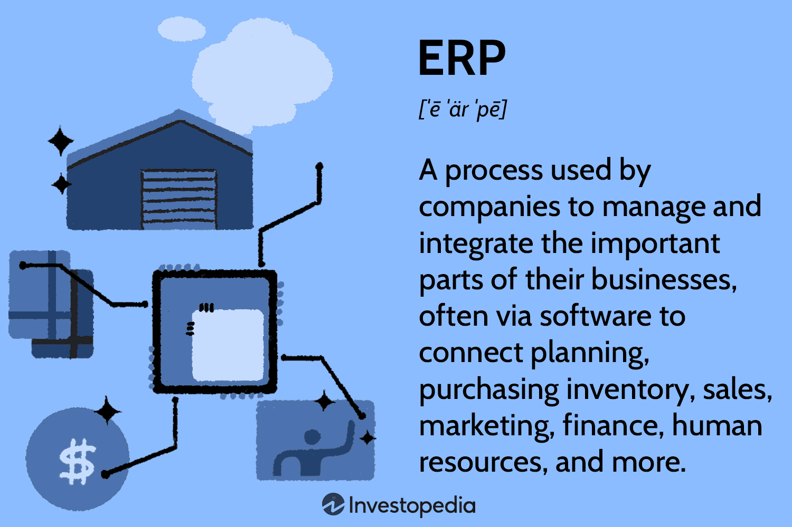

Enterprise Application Integration (EAI) is a critical process for contemporary businesses aiming to enhance operational effectiveness and data uniformity. This integration involves the coordination of various independent enterprise applications, enabling them to function as a cohesive system. The primary objective of EAI is to streamline information flow across different applications, thereby reducing redundancy, ensuring data accuracy, and improving overall process efficiency. This is accomplished by creating a unified application network that allows for seamless communication and data exchange among enterprise systems.

The significance of EAI is particularly evident in complex environments where diverse applications must work together smoothly. System integration facilitated by EAI is vital for businesses that rely on multiple software systems to execute different operational tasks. By integrating these systems, enterprises can establish a more responsive and flexible IT infrastructure, enhance operational workflows, and ultimately support better decision-making processes.

In recent years, one area where EAI has shown remarkable impact is algorithmic trading. Algorithmic trading utilizes computer algorithms to execute trading orders at high speeds and volumes, leveraging pre-defined sets of rules and conditions. The success of algorithmic trading heavily relies on the rapid assimilation and processing of vast streams of data from various sources. EAI plays a pivotal role by providing a robust framework that supports real-time data sharing and integration between trading platforms and other financial systems. This interaction allows trading algorithms to operate with high efficiency and precision, making real-time decisions based on current market conditions.

By facilitating the integration of complex trading systems, EAI contributes significantly to improved trading performance, enhanced market liquidity, and reduced transaction costs. These advancements have made algorithmic trading a dominant force in the financial markets, demonstrating the profound impact of EAI on the sector.

Understanding EAI and its applications in algorithmic trading reveals its potential to transform existing business processes and strategies, encouraging enterprises to leverage EAI for gaining a competitive edge in the market.

## Table of Contents

## Understanding Enterprise Application Integration

Enterprise Application Integration (EAI) refers to the use of software and system architectural principles to enable the integration of various enterprise applications within an organization. EAI is essential for fostering seamless communication and data transfer between disparate systems, thereby enhancing data consistency and process efficiency across business functions.

### Definition and Overview of EAI

Enterprise Application Integration is a structured approach to linking and organizing multiple computing systems and software applications physically or functionally. It eliminates data silos and facilitates coordinated business operations. EAI involves the use of integration technologies that manage, mediate, and govern data exchange processes.

### Key Components and Principles of EAI

EAI is underpinned by several core components and guiding principles, including:

1. **Data Integration**: Central to EAI, data integration ensures that data from different sources is combined to provide a unified view. It uses data mapping, transformation, and data cleansing techniques.

2. **Process Integration**: This aspect focuses on integrating and streamlining business processes across different applications to support end-to-end workflows.

3. **Application Integration**: It ensures that different applications within an enterprise can communicate effectively. This is achieved through the use of application interfaces and APIs.

4. **User Interface Integration**: Simplifies the user experience by combining different application interfaces into a single, unified user interface.

The key principles guiding EAI efforts include interoperability, scalability, and reusability. By adhering to these principles, organizations can ensure that their integration initiatives are robust and adaptable to changing business needs.

### The Role of Middleware in EAI

Middleware plays a critical role in EAI by acting as an intermediary layer that facilitates communication and data exchange between disparate applications. It manages messaging services, transaction processing, and directory services, and provides an abstraction layer for complex system integrations. Middleware solutions like Message Oriented Middleware (MOM) and Enterprise Service Buses (ESB) streamline the integration process by allowing applications to communicate through a message-passing framework rather than direct, synchronous communications.

### Challenges and Solutions in Implementing EAI

Implementing EAI presents numerous challenges including:

- **Complexity and Cost**: Integration can be highly complex and expensive due to the diverse nature of systems involved. Adopting a phased approach and leveraging cloud-based integration platforms can mitigate these issues.

- **Data Silos**: Overcoming existing data silos can be challenging. Employing data standardization and centralized data governance can enhance data interoperability and quality.

- **Security**: Ensuring data security across integrated systems is vital. Implementing robust encryption protocols and identity management systems can secure data exchanges.

- **Scalability**: As organizations grow, the integration framework must scale to accommodate increased demand. Utilizing scalable middleware solutions can address this need.

In response to these challenges, organizations are increasingly relying on agile integration methodologies and emerging integration technologies such as microservices architecture and containerization, which offer more flexible, scalable, and manageable integration solutions.

## System Integration: Bridging the Gap

Integrating disparate systems within an enterprise is crucial for streamlining operations and ensuring seamless data flow across various applications. This integration helps businesses enhance their efficiency, reduce redundancy, and improve the accuracy of data. An effective system integration strategy allows different IT systems and software applications to communicate and exchange data seamlessly, providing a unified view of business processes and information.

There are several common integration patterns and architectures that organizations use to achieve system integration. One of the most widely used is the point-to-point integration pattern, which involves direct connections between different systems. While easy to implement, this pattern is not scalable due to the complexity introduced with the addition of new systems. Another approach is hub-and-spoke architecture, where a central hub manages data exchange between different systems, reducing the complexity and providing a more manageable solution. The Enterprise Service Bus (ESB) architecture is a more advanced option, facilitating communication through a central bus that allows for greater flexibility and scalability in connecting disparate systems.

System integration can be categorized into data integration and application integration. Data integration focuses on combining data residing in different sources to provide users with a unified view. It involves techniques such as Extract, Transform, Load (ETL) processes, data warehousing, and data lakes. In contrast, application integration aims to enable different applications to work together by sharing functionalities and working processes. This involves using middleware technologies that allow disparate applications to communicate and exchange data in real-time.

Middleware plays a critical role in both data and application integration, acting as a bridge that streamlines communication and data workflow between different systems. Middleware technologies include message brokers, API gateways, and integration platforms as a service (iPaaS), which facilitate seamless integration and interoperability of various software applications and IT systems.

In conclusion, bridging the gap between disparate systems is essential for any enterprise looking to optimize its operations and data processes. By implementing efficient integration patterns and architectures, businesses can ensure smooth communication between their systems, thereby enhancing productivity and agility.

## EAI in Algorithmic Trading

Algorithmic trading is a method of executing orders using automated and pre-programmed trading instructions to account for variables such as timing, price, and [volume](/wiki/volume-trading-strategy). It is increasingly popular in financial markets as it allows for the precise and rapid execution of trading strategies, leveraging the computational power and speed of computer systems to make data-driven trading decisions. The effectiveness of [algorithmic trading](/wiki/algorithmic-trading) is deeply reliant on integrated systems that can manage vast quantities of data and execute trades quickly and efficiently. This is where Enterprise Application Integration (EAI) comes into play, providing a framework for the seamless integration of disparate systems involved in trading.

Enterprise Application Integration is crucial in algorithmic trading because it facilitates real-time data exchange between various systems and applications. In algorithmic trading, timely and accurate data is paramount for making informed decisions. EAI systems enable real-time data processing and communication by connecting trading applications, market data feeds, risk management systems, and back-office operations. This connectivity ensures that trading models have immediate access to market changes, which are essential for executing trades at the right moment.

For instance, consider a scenario in which an algo-trading system needs to analyze stock market data, identify profitable trading opportunities, and execute trades within milliseconds. Without robust integration facilitated by EAI, there would be delays in data transmission between systems, leading to missed trading opportunities and potentially higher risks. Middleware platforms used in EAI, such as message brokers and enterprise service buses (ESBs), help in handling these data exchanges efficiently, ensuring that all systems involved in trading operations remain synchronized and responsive.

A practical example of EAI in financial trading systems can be demonstrated through the integration of a trading algorithm with market data providers and execution platforms. A trading system might query multiple data sources—such as Bloomberg or Reuters—for current market information. This data is then processed and analyzed in real-time to inform trading decisions. Once a trading decision is made, EAI ensures that trade orders are routed through execution platforms like FIX (Financial Information Exchange) protocol-enabled systems, and confirmations are sent back to the algorithm and other linked applications, such as risk monitors and compliance systems.

Moreover, EAI assists in maintaining compliance and reducing operational risks by integrating regulatory reporting and risk management systems into the trading process. By doing so, firms can ensure that all their trading activities are transparent and conform to financial regulations and internal risk policies. The integration provided by EAI not only enhances the efficiency and speed of trading operations but also adds an essential layer of auditability and compliance within financial systems.

In summary, EAI plays a pivotal role in algorithmic trading by enabling real-time data exchange and synchronization between diverse systems, thus enhancing the effectiveness and responsiveness of trading strategies. Through the integration of various platforms and data sources, EAI supports the full cycle of algorithmic trading, from market analysis to order execution and compliance, ensuring that trading systems operate smoothly and efficiently in the fast-paced environment of financial markets.

## Benefits of EAI in the Financial Sector

Enterprise Application Integration (EAI) offers significant benefits to the financial sector by enhancing efficiency and reducing operational costs. The seamless integration of various enterprise applications allows financial institutions to automate and streamline processes, which minimizes manual interventions and resource consumption. For example, by integrating trading platforms, order management systems, and risk management tools, EAI facilitates real-time data exchange and processing, leading to faster execution and settlement of trades.

Improved data accuracy and decision-making capabilities are also key advantages of EAI in finance. Through EAI, disparate data sources are consolidated into a unified system, reducing discrepancies and errors commonly associated with manual data handling. This harmonization ensures that decision-makers have access to accurate, up-to-date information, crucial for informed trading decisions. Moreover, the integration enables more sophisticated data analytics, empowering analysts to uncover trends and insights that may otherwise remain hidden.

Scalability and flexibility in trading operations are further benefits provided by EAI. Financial markets are dynamic and volatile, requiring systems that can scale up or down as needed. EAI supports this requirement by allowing seamless incorporation of new applications and technologies without disrupting existing operations. This adaptability is essential for maintaining competitiveness in rapidly changing market conditions, as it enables financial institutions to quickly respond to market demands and technological advancements. 

Overall, Enterprise Application Integration is instrumental in optimizing financial operations, fostering an environment where efficiency, accuracy, and flexibility are aligned to meet the demands of modern financial markets.

## Implementing EAI for Algorithmic Trading

Implementing Enterprise Application Integration (EAI) in algorithmic trading platforms is a meticulous process that requires careful planning and execution. The integration ensures that disparate applications within a trading environment communicate efficiently, thereby enhancing data flow and decision-making capabilities. Here are the essential steps, technologies, and best practices involved in successfully integrating EAI into trading platforms.

### Steps to Integrate EAI in Trading Platforms

1. **Requirement Analysis**: The first step involves gathering and analyzing the business and technical requirements. Understanding the specific needs of algorithmic trading, such as latency requirements and data throughput, is critical.

2. **Designing the Integration Architecture**: Define the integration architecture that aligns with the trading platform's objectives. This involves selecting an appropriate EAI model, such as a point-to-point model or hub-and-spoke model, depending on the complexity and scale of integration required.

3. **Selecting Middleware**: Middleware is a foundational component in EAI, acting as a bridge between different applications. Selecting the correct middleware technology is crucial. Options include message-oriented middleware (MOM), which facilitates asynchronous communication, or an enterprise service bus (ESB), which provides a more flexible integration framework.

4. **Implementing Data Transformation and Mapping**: Data from different systems are often in varied formats. Implementing data transformation logic ensures consistency and accuracy in data exchange among systems. Tools like Apache Camel can be used to define routing and mediation rules.

5. **Developing Connectors and Adapters**: Build connectors and adapters to enable communication between enterprise applications and trading systems. This may involve using standardized protocols such as FIX (Financial Information eXchange) for trading-related data exchange.

6. **Testing and Validation**: Rigorous testing is crucial to ensure that the integrated system operates as expected. This includes unit testing, integration testing, and system testing to validate data flows and trading operations.

7. **Deployment and Monitoring**: Deploy the EAI solution in a production environment and implement a robust monitoring framework to ensure ongoing performance and error detection. Monitoring tools like Prometheus can be used to track system metrics and send alerts for any anomalies.

### Choosing the Right Technologies and Tools for EAI

Selecting suitable technologies and tools is paramount in maximizing the benefits of EAI. Popular technologies include:

- **Apache Kafka**: Ideal for managing real-time data streams and event-driven architecture.
- **RabbitMQ**: Known for its reliability in message brokering.
- **Spring Integration**: Provides a framework for building message-driven applications, helpful for complex integration patterns.

### Best Practices for Successful EAI Implementation

1. **Scalability and Flexibility**: Design integration solutions with scalability and future growth in mind, ensuring they can handle increasing data volumes and additional functionalities.

2. **Security**: Ensure that data encryption, secure socket layers (SSL), and authentication mechanisms are in place to protect sensitive trading information.

3. **Documentation and Training**: Comprehensive documentation and user training are essential to maximize the efficiency and uptake of the integrated system by stakeholders.

4. **Incremental Deployment**: Implement the integration in phases to manage risks effectively, allowing for adjustments and improvements before full deployment.

5. **Continuous Improvement**: Regularly revisit the integration strategy to incorporate technological advancements and address any emerging business needs.

By following these steps and adhering to best practices, enterprises can achieve seamless integration in their algorithmic trading platforms, thus optimizing their operations and maintaining a competitive edge in the financial markets.

## Future Trends in EAI and Algorithmic Trading

Emerging technologies in Enterprise Application Integration (EAI) are continually shaping the landscape of system integration, especially within the domain of algorithmic trading. Among these technologies, Artificial Intelligence (AI) and Machine Learning (ML) are taking center stage, transforming traditional EAI processes to become more efficient and adaptive. AI and ML enhance EAI by providing intelligent data mapping and anomaly detection, which are critical for maintaining the consistency and integrity of integrated systems. These technologies enable dynamic adaptation to changing data structures and user requirements, reducing the time and effort needed for manual configuration.

In terms of system integration, AI-driven tools can automatically analyze and optimize workflows, detect patterns, and make predictive adjustments to the integration schema. This leads to more efficient data processing, reduced latency, and better resource allocation. For instance, algorithms can predict traffic loads and dynamically allocate resources to ensure optimal system performance, which is crucial in the fast-paced environment of algorithmic trading.

Algorithmic trading itself stands on the edge of significant evolution due to advancements in EAI technologies. The increasing sophistication of AI models facilitates the development of more complex trading algorithms capable of executing multi-asset strategies and arbitraging minute price differences across various markets efficiently. These models can analyze vast datasets in real time, identify patterns, and execute trades with minimal human intervention. 

As AI and ML methodologies advance, we can predict that algorithmic trading systems will become even more autonomous and accurate. Innovations like quantum computing and blockchain might further revolutionize how data is integrated and transactions are recorded, offering unprecedented speed and transparency. Quantum computing could exponentially accelerate the execution of complex algorithms, while blockchain provides a decentralized ledger for secure and transparent trade processes.

The future of algorithmic trading will likely be characterized by increased use of decentralized applications (DApps) for executing trades, leveraging peer-to-peer networks without traditional intermediaries. These applications can benefit from advanced EAI to integrate seamlessly with existing trading infrastructures.

In conclusion, as emerging technologies in EAI continue to evolve, their impact on algorithmic trading will be profound. They promise enhanced performance, security, and efficiency, leading to a more competitive and transparent trading environment, ultimately shaping the future of financial markets.

## Conclusion

Enterprise Application Integration (EAI) has proven to be an indispensable asset in the contemporary business landscape, particularly in sectors demanding high levels of data consistency and operational efficiency. EAI facilitates the seamless connection and communication between disparate enterprise applications, mitigating data silos and enhancing the overall effectiveness of system operations. This integration is pivotal for businesses aiming to maintain competitive advantage and operational agility.

In the domain of algorithmic trading, the integration of EAI has revolutionized the approach to automated trading systems. By enabling real-time data exchange and streamlined process management, EAI supports traders and financial institutions in leveraging sophisticated algorithmic strategies to optimize their trading platforms. The synchronization of various applications ensures that trading decisions are informed by accurate, up-to-the-minute data, thereby improving the precision and timeliness of trades executed in dynamic market environments.

As businesses continue to adopt EAI, they are poised to gain strategic advantages through enhanced efficiency, reduced operational costs, and improved decision-making capabilities. Particularly in algorithmic trading, where milliseconds can drastically impact financial outcomes, EAI plays a crucial role in delivering faster, more informed trading actions.

For businesses looking to thrive in increasingly competitive sectors, considering the deployment of EAI could be transformative. Not only would it streamline operations and improve data coherence, but it could also empower businesses with the flexibility to adapt to evolving market demands and technological changes. As AI and [machine learning](/wiki/machine-learning) begin to intersect more broadly with EAI, the potential for even more intelligent and adaptive trading systems becomes evident, heralding a new era of innovation and opportunity in business processes and financial trading.

## References & Further Reading

[1]: Linthicum, D. S. (2000). ["Enterprise Application Integration."](https://www.amazon.com/Enterprise-Application-Integration-David-Linthicum/dp/0201615835) Addison-Wesley Professional.

[2]: Haug, J., & Koppe, H. (2013). ["Algorithmic Trading: Tools and Techniques for Automated Trading Strategies."](https://www.researchgate.net/publication/383201516_Algorithmic_trading_and_machine_learning_Advanced_techniques_for_market_prediction_and_strategy_development) Capital Markets.

[3]: Chien, G., Franklin, M., Hellerstein, J. M., & Hong, W. (2002). ["Integration and Management of Data Streams: A Statemachine Approach."](https://dl.acm.org/doi/10.1145/1061318.1061322) VLDB Endowment.

[4]: Lackey, R. J. (2018). ["Middleware Magic: Efficient Integration of Enterprise Systems."](https://quizlet.com/22610085/chapter-8-flash-cards/) Auerbach Publications.

[5]: Debevoise, T., & Walker, M. (2017). ["The Microservices Handbook"](https://pubmed.ncbi.nlm.nih.gov/28515433/) Morgan Kaufmann.