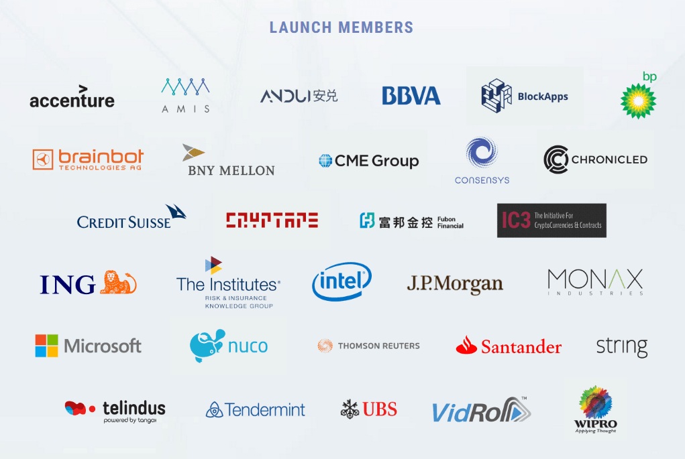

## Table of Contents

## What is the Enterprise Ethereum Alliance (EEA)?

The Enterprise Ethereum Alliance (EEA) is a group made up of businesses and other organizations that work together to use the Ethereum blockchain for their needs. They focus on making Ethereum better for businesses by creating standards and tools that help companies use it more easily and safely.

The EEA helps companies understand how they can use Ethereum to make their work more efficient and secure. They do this by sharing knowledge and developing new ways to use the technology. This way, businesses can trust that the Ethereum they use meets high standards and works well for their specific needs.

## When was the EEA founded and why?

The Enterprise Ethereum Alliance (EEA) was founded in 2017. It started because many businesses saw the potential of the Ethereum blockchain but needed a way to use it safely and effectively for their own purposes.

The main reason for creating the EEA was to bring together companies and experts to work on making Ethereum better for business use. They wanted to set up rules and tools that would help businesses trust and use Ethereum more easily, solving problems like security and efficiency that companies faced when trying to use the technology on their own.

## Who can join the EEA and what are the membership benefits?

Anyone from a business, organization, or even an individual can join the Enterprise Ethereum Alliance (EEA). You just need to be interested in using Ethereum for business purposes. There are different levels of membership, like basic, associate, and full member, and each level has its own requirements and fees.

Being a member of the EEA has many benefits. You get to work with other members to create standards and tools that make Ethereum better for businesses. This means you can learn from experts, share your own ideas, and help shape the future of Ethereum in the business world. Members also get access to special resources, events, and networking opportunities that can help grow your business and keep you up-to-date with the latest in blockchain technology.

## What are the main goals of the EEA?

The main goals of the Enterprise Ethereum Alliance (EEA) are to make Ethereum better for businesses. They want to create rules and tools that help companies use Ethereum safely and easily. This means working together to solve problems like security and efficiency, so businesses can trust and use Ethereum for their needs.

Another goal is to bring businesses together to share knowledge and ideas. By working as a team, members can learn from each other and help make Ethereum better for everyone. This also helps businesses stay up-to-date with the latest in blockchain technology and find new ways to use it in their work.

## How does the EEA support the development of Ethereum technology for enterprises?

The Enterprise Ethereum Alliance (EEA) helps businesses use Ethereum by creating standards and tools that make it safe and easy. They work together with companies to solve problems like security and efficiency. This means businesses can trust that the Ethereum they use meets high standards and works well for their needs.

EEA also brings businesses together to share knowledge and ideas. By working as a team, members can learn from each other and help make Ethereum better for everyone. This helps businesses stay up-to-date with the latest in blockchain technology and find new ways to use it in their work.

## Can you provide examples of companies that are members of the EEA?

The Enterprise Ethereum Alliance has lots of different companies as members. Some big names include Microsoft, which is a huge tech company that makes software and services. Another member is JP Morgan, a big bank that uses Ethereum to make their financial services better. There's also Intel, a company known for making computer chips, and they're working on ways to use Ethereum in their products.

Other members include Accenture, a company that helps other businesses with their technology needs, and ConsenSys, which is all about building tools and services for the Ethereum network. Even companies like Santander, a big bank from Spain, and DTCC, which helps with financial transactions, are part of the EEA. They all work together to make Ethereum better for businesses.

These companies come from different industries, but they all see the value in using Ethereum for their work. By being part of the EEA, they can share ideas and help create new ways to use Ethereum that are safe and efficient. This helps them stay ahead in their fields and make their businesses run smoother.

## What types of industries are represented in the EEA?

The Enterprise Ethereum Alliance includes members from many different industries. There are big tech companies like Microsoft and Intel, who are interested in how Ethereum can be used in their software and hardware. Financial companies like JP Morgan, Santander, and DTCC are also part of the EEA, as they look to use Ethereum to make their banking and financial services better and more secure.

Other industries are represented too. For example, consulting firms like Accenture join the EEA to help their clients use Ethereum in new ways. There are also companies like ConsenSys, which focus on building tools and services for the Ethereum network. This mix of industries shows how Ethereum can be useful in many different areas of business.

By working together, members from these various industries can share ideas and create new standards and tools. This helps make Ethereum safer and easier to use for everyone, no matter what kind of business they are in. The EEA's diverse membership shows that Ethereum has a lot of potential to improve how businesses work across many different fields.

## How does the EEA contribute to Ethereum standards and specifications?

The Enterprise Ethereum Alliance helps make Ethereum better for businesses by creating rules and tools that everyone can use. They work together to set standards that make sure Ethereum is safe and works well for different companies. This means businesses can trust that the Ethereum they use meets high standards and can be used easily in their work.

By bringing together companies from many industries, the EEA can share ideas and knowledge. This helps them create new ways to use Ethereum that solve problems like security and efficiency. When the EEA sets these standards and specifications, it helps businesses use Ethereum more confidently, knowing it's been checked and improved by experts.

## What are some of the key projects or initiatives led by the EEA?

The EEA has worked on several important projects to make Ethereum better for businesses. One key project is the EEA Mainnet Initiative, which focuses on making the Ethereum mainnet more usable for enterprises. This means they are trying to make the main Ethereum network safer and more efficient so that businesses can use it without worrying about problems. They also work on creating standards like the Ethereum Client Specification, which helps different Ethereum software work together smoothly.

Another important initiative is the EEA Token Standardization Group. This group is all about making sure that tokens used on Ethereum follow certain rules, so they are easier to use and trust. By setting these standards, businesses can use tokens in their work knowing they meet high-quality guidelines. This helps with things like security and making sure tokens work well across different systems.

The EEA also runs the Ethereum Enterprise Specification, which is a set of rules that help businesses use Ethereum in a way that is safe and works well. This specification covers things like how to handle private transactions and how to make sure data is kept secure. By working on these projects, the EEA helps businesses trust and use Ethereum more easily in their day-to-day work.

## How does the EEA collaborate with other blockchain organizations?

The Enterprise Ethereum Alliance (EEA) works with other blockchain groups to make Ethereum better for businesses. They team up with organizations like Hyperledger, which is another group that focuses on blockchain technology for businesses. By working together, they share ideas and create standards that help businesses use blockchain technology more easily and safely. This teamwork helps make sure that the technology works well across different systems and meets the needs of many different companies.

The EEA also collaborates with groups like the Ethereum Foundation, which is the main group behind Ethereum. Together, they work on projects that improve the Ethereum network, making it more useful for enterprises. This includes things like making the network faster and more secure, which are important for businesses that want to use Ethereum. By working with other organizations, the EEA helps make sure that Ethereum can be trusted and used by companies all over the world.

## What impact has the EEA had on the adoption of Ethereum in enterprise settings?

The Enterprise Ethereum Alliance (EEA) has helped businesses use Ethereum more by creating rules and tools that make it safe and easy. They bring companies together to share ideas and solve problems like security and efficiency. This teamwork has made businesses more confident in using Ethereum because they know it meets high standards and works well for their needs.

Because of the EEA, more companies are now using Ethereum in their work. Big names like Microsoft and JP Morgan are part of the EEA, and they use Ethereum to make their services better. The EEA's work on standards and specifications has shown businesses that Ethereum can be trusted and used in many different industries, helping it become more popular in the business world.

## What are the future prospects and developments expected from the EEA?

The Enterprise Ethereum Alliance (EEA) is looking to keep making Ethereum better for businesses. They want to keep working on standards and tools that help companies use Ethereum safely and easily. This means they'll keep bringing businesses together to share ideas and solve problems like security and efficiency. As more companies see how useful Ethereum can be, the EEA will help them trust and use it more in their work.

In the future, the EEA might focus on making the Ethereum network faster and more secure. This is important for businesses that need to use Ethereum every day. They might also work on new ways to use Ethereum in different industries, like finance, tech, and consulting. By doing this, the EEA hopes to make Ethereum even more popular and useful for companies all over the world.

## References & Further Reading

[1]: Mougayar, W. (2016). ["The Business Blockchain: Promise, Practice, and Application of the Next Internet Technology"](https://books.google.com/books/about/The_Business_Blockchain.html?id=CEsPDAAAQBAJ). Wiley.

[2]: Consta, I., Tomaino, N., & Lerner, J. (2021). ["Blockchain: A Guide to Building Your Own Crypto & Decentralized Applications (DApps) and Auto Trading Bots with Real World Trading Strategies"](https://www.amazon.com/Blockchain-Decentralized-Applications-Auto-Trading/dp/9814986005).

[3]: Narayanan, A., Bonneau, J., Felten, E., Miller, A., & Goldfeder, S. (2016). ["Bitcoin and Cryptocurrency Technologies: A Comprehensive Introduction"](https://press.princeton.edu/books/hardcover/9780691171692/bitcoin-and-cryptocurrency-technologies). Princeton University Press.

[4]: "Enterprise Ethereum Alliance." (n.d.). [Enterprise Ethereum Alliance official website](https://entethalliance.org/).

[5]: Mallers, J. & Swan, M. (2015). ["Blockchain: Blueprint for a New Economy"](https://books.google.com/books/about/Blockchain.html?id=RHJmBgAAQBAJ). O'Reilly Media.

