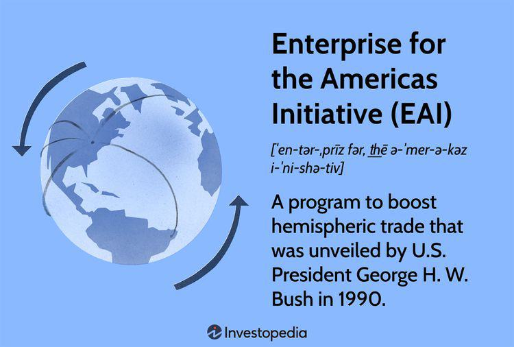

The Enterprise for the Americas Initiative (EAI) was launched by U.S. President George H. W. Bush in 1990. Its primary goal was to bolster trade relations, investment, and economic cooperation across Latin America and the Caribbean. The EAI came at a time of growing globalization and aimed to integrate the economies of the Americas more closely through measures such as free-trade agreements, investment funds, and debt relief. This initiative laid the groundwork for subsequent agreements, most notably the North American Free Trade Agreement (NAFTA), which further facilitated economic collaboration in the region. 

Parallel to these developments in trade policy, the landscape of global financial markets has been rapidly transformed by technological advancements, most prominently through the advent of algorithmic trading. This form of trading utilizes complex algorithms to execute trades at speeds and efficiencies unattainable by human traders. By automating trading decisions, algorithmic trading has not only reduced transaction costs but also contributed to market efficiency by enabling rapid price discovery and enhancing liquidity.



As such, the intersection of economic initiatives like the EAI with technological evolutions in trading presents a unique lens through which to examine international economic cooperation. The potential synergies between these economic policies and algorithmic trading technologies hold promise for enhancing market dynamics and fostering greater economic growth on a hemispheric scale. The exploration of these interconnected elements offers insight into how policy and technology together shape the evolving landscape of global trade.

## Table of Contents

## The Enterprise for the Americas Initiative

The Enterprise for the Americas Initiative (EAI), introduced by U.S. President George H. W. Bush in 1990, was a significant policy effort aimed at fostering economic integration and development across the Americas. Its primary objectives included the establishment of free-trade zones, the expansion of investment, and the provision of debt relief.

One of the core components of the EAI was the negotiation of free-trade agreements, which sought to reduce trade barriers and create a more seamless market environment across the hemisphere. This approach was intended to enhance economic cooperation and mutual growth by facilitating easier access to goods and services across national borders. Central to this was the North American Free Trade Agreement (NAFTA), which served as a case study for EAI’s influence on economic integration. NAFTA, involving the United States, Canada, and Mexico, came into effect in 1994 and significantly reduced trade tariffs among these nations, thus promoting increased trade and investment flows.

Another vital component of the EAI was the creation of an investment fund aimed at encouraging private sector investments in environmental and developmental projects throughout Latin America and the Caribbean. This fund encouraged partnerships and fostered a more conducive environment for sustainable economic growth. By investing in infrastructure and green projects, the initiative intended to attract further foreign direct investment to these regions.

Debt relief initiatives formed a substantial part of the EAI’s strategy, working towards alleviating the debt burden faced by Latin American and Caribbean countries. These efforts provided the financial room necessary for these nations to reinvest in their economies and improve economic stability. Debt-for-nature swaps, a striking element of the debt relief component, enabled debtor countries to allocate debt repayments toward conservation projects, thereby promoting both fiscal health and environmental sustainability.

Collectively, these components reflected the EAI's ambition to create a harmonious economic environment across the Americas, facilitating increased economic cooperation and integration. Through negotiating trade agreements like NAFTA, establishing investment funds, and implementing debt relief strategies, the EAI aimed to reshape the economic landscape of the Western Hemisphere, fostering a more interconnected and prosperous region.

## The Role of Algo Trading in Economic Cooperation

Algorithmic trading, commonly known as algo trading, represents a sophisticated trading mechanism that automates trading decisions by employing complex computer algorithms. This technological innovation has revolutionized financial markets by enhancing market efficiency and transforming the global trading landscape. Algo trading leverages mathematical models and high-speed data analysis, enabling traders to execute orders with minimal human intervention. This automated approach facilitates rapid reactions to market changes, optimizes trading strategies, and minimizes transaction costs.

One of the primary contributions of algo trading to market efficiency is rapid price discovery. By processing vast amounts of market data in real time, algorithms can identify price discrepancies and execute trades at optimal prices. This swift execution not only corrects mispricings quickly but also contributes to the overall efficiency of the market by ensuring that asset prices reflect available information promptly.

Another significant advantage of [algorithmic trading](/wiki/algorithmic-trading) is its ability to enhance [liquidity](/wiki/liquidity-risk-premium). Algorithms can perform high-frequency trading, generating a large number of trades in a short period. This activity provides the market with a continuous flow of buy and sell orders, thus increasing the availability of assets and reducing the spread between bid and ask prices. Enhanced liquidity offers multiple benefits, including reduced [volatility](/wiki/volatility-trading-strategies) and improved market stability, which are crucial for sustaining investor confidence.

The alignment of algo trading methods with the objectives of the Enterprise for the Americas Initiative (EAI) underscores a symbiotic relationship between technological advancements in trading and economic cooperation goals. The EAI, which was conceived to foster trade and investment across the Americas, can find a complementary ally in algorithmic trading. By promoting technological advancements in financial markets, algo trading supports the EAI's aim of increasing economic cooperation through improved market access and integration.

Algo trading's capacity to operate across borders without the constraints of traditional trading practices enables more seamless international trade. For emerging markets in the Americas, this can translate into better access to global capital markets and enhanced opportunities for economic growth. Furthermore, the transparency and efficiency afforded by algo trading encourage foreign investments, aligning with the EAI's visions of expanded investment and economic integration.

In essence, algorithmic trading embodies a modern trading mechanism that not only bolsters market efficiency through rapid price discovery and enhanced liquidity but also aligns with strategic economic cooperation initiatives like the EAI by leveraging technological advancements to drive global economic integration.

## Impact of US Foreign Aid and USAID

U.S. foreign aid has long played a crucial role in fostering global stability and economic growth. As a centerpiece of American foreign policy, these aid efforts help build economic infrastructures, promote democratic governance, and address critical global challenges such as poverty and inequality. The United States Agency for International Development (USAID) is at the forefront of these efforts, leveraging its resources to stimulate international development. USAID's programs target a wide range of developmental aspects, from enhancing agriculture and food security to advancing technological integration within recipient countries.

USAID's strategic approach potentially sets the stage for algorithmic trading to flourish in developing economic environments. By enhancing technological infrastructures and promoting digital literacy, USAID initiatives indirectly facilitate the prerequisites necessary for algo trading to take root. Empirical studies have demonstrated that the proliferation of internet access and computational technologies can significantly amplify financial market development in emerging economies. The computational efficiency and data-driven approach of algorithmic trading contribute to market depth and liquidity, which are essential for robust financial markets.

Moreover, USAID's focus on fostering economic resilience and self-reliance aligns with global economic growth objectives, creating environments conducive to advanced trading technologies. In countries receiving U.S. aid, improvements in transportation, technology infrastructure, and governance systems pave the way for more sophisticated financial systems. As these conditions stabilize and grow, the markets within these nations become more attractive to algorithmic trading firms, which thrive on efficiency and data-rich environments.

The agency's alignment with broader international aid objectives further underscores its commitment to sustainable economic development. USAID's partnerships with other international organizations amplify its impact, creating synergies that support both macroeconomic stability and microeconomic prosperity. Such efforts contribute to creating an ecosystem where innovative financial technologies, including algorithmic trading, can integrate seamlessly, providing opportunities for economic actors across the spectrum. 

In conclusion, the intersection of U.S. foreign aid and algorithmic trading highlights the symbiotic relationship between international development efforts and financial technology advancement. Through USAID, the United States not only aids recipient countries in achieving economic self-sufficiency but also promotes a global financial landscape where advanced trading technologies can thrive, ultimately contributing to a more interconnected and prosperous world economy.

## Synergies Between Initiative Objectives and Trading Technology

The Enterprise for the Americas Initiative (EAI) was directed at creating conducive economic environments to facilitate trade and investment across the Americas. A significant aspect of this initiative was fostering conditions favorable for modern financial practices, including the use of algorithmic trading. These technologies offer substantial advantages in achieving increased economic cooperation through enhanced market efficiency and liquidity.

Algorithmic trading systems deploy computer algorithms to automate trading activities. These systems can analyze large datasets at speeds unattainable by human traders, enabling rapid decision-making and execution of trades to capitalize on emergent opportunities and shifts in market conditions. This efficient processing aligns well with EAI’s objectives of fostering open markets and encouraging investment by providing a platform that reduces barriers to entry and increases participation in trading activities.

To realize the potential benefits of algorithmic trading within the context of EAI, a supportive financial and technological infrastructure is essential. This includes robust telecommunications networks, advanced computing systems, and stringent regulatory frameworks to ensure transparency and fairness in market operations. Governments can play a pivotal role by investing in digital infrastructure and enacting policies that accommodate and nurture innovative trading technologies.

Consider the North American Free Trade Agreement (NAFTA), an EAI-related agreement; it facilitated cross-border trade by lowering tariffs and encouraging the free flow of goods and services. In a modern context, algorithmic trading can further enhance these economic interactions by providing a seamless trading environment where information is rapidly disseminated and incorporated into market prices, thereby optimizing the efficiency of international financial markets.

Python is particularly well-suited for developing algorithmic trading models due to its extensive libraries, such as Pandas for data manipulation, NumPy for numerical computations, and [machine learning](/wiki/machine-learning) libraries like scikit-learn for predictive analytics. Here's a simple Python example of a moving average crossover strategy, often used in algorithmic trading:

```python
import pandas as pd

# Load historical price data
data = pd.read_csv('price_data.csv')
data['Short_MA'] = data['Close'].rolling(window=10).mean()
data['Long_MA'] = data['Close'].rolling(window=50).mean()

# Generate trading signals
data['Signal'] = 0
data['Signal'][10:] = np.where(data['Short_MA'][10:] > data['Long_MA'][10:], 1, 0)
data['Position'] = data['Signal'].diff()

# Calculate returns
data['Returns'] = data['Close'].pct_change()
data['Strategy_Returns'] = data['Returns'] * data['Position'].shift(1)

# Compute cumulative returns
cumulative_strategy_returns = (1 + data['Strategy_Returns']).cumprod()
cumulative_market_returns = (1 + data['Returns']).cumprod()

print("Final Strategy Returns: ", cumulative_strategy_returns[-1])
print("Final Market Returns: ", cumulative_market_returns[-1])
```

This strategy exemplifies how algorithmic trading can be operationalized to make informed trading decisions based on specific triggers, enhancing the potential for profitable outcomes across interconnected markets envisioned by the EAI.

In conclusion, the symbiosis between the EAI's objectives and algorithmic trading technologies underscores a pathway for achieving elevated economic cooperation. By leveraging these sophisticated trading methodologies within supportive policy frameworks, the full spectrum of economic integration and growth envisaged by initiatives like the EAI can be realized.

## Conclusion

The Enterprise for the Americas Initiative (EAI) and algorithmic trading represent two pivotal forces in shaping modern economic landscapes. EAI, initiated with the aim of fostering economic cooperation across the Americas, and algorithmic trading, a transformative force in global markets, both strive toward enhancing economic efficiency and integration. Together, they can potentially redefine international market dynamics by leveraging technology for sustainable development.

Economic cooperation initiatives like EAI aim to establish free-trade zones, encourage investment, and offer debt relief, thereby creating an environment conducive to increased economic collaboration. These efforts help create a more integrated financial landscape, which is essential for facilitating technological advancements like algorithmic trading. Algorithmic trading contributes significantly to market dynamics by fostering rapid price discovery, improving liquidity, and reducing transaction costs, which align well with the objectives of economic initiatives like EAI. As algorithmic trading continues to evolve, it aids in further integrating economies by making markets more responsive and efficient.

The alignment between EAI objectives and modern trading technologies highlights the potential for these elements to jointly influence economic growth. By creating policies and infrastructures that support both economic cooperation and technological innovation, nations can foster environments where markets can thrive. Such alignment does not merely enhance current trading practices but can also lead to innovative financial solutions that drive sustainable development. For instance, investments in technology infrastructure can spur the adoption of algorithmic trading, leading to more transparent and efficient markets, which in turn could support the economic goals set forth by initiatives like EAI.

Continuing to align policy initiatives with advancements in financial technology is crucial for achieving sustainable development. Policymakers must ensure that economic cooperation strategies are adaptable and able to integrate emerging technologies effectively. This synergy not only facilitates immediate economic benefits but also positions economies to be resilient and prosperous in the face of future global economic challenges. Thus, the convergence of economic cooperation initiatives and technological advancement represents a powerful tool for fostering long-term global economic stability.

## References & Further Reading

1. Bush, George H. W. "Enterprise for the Americas Initiative." Statement by President Bush, June 27, 1990. Available at: [https://www.presidency.ucsb.edu/documents/statement-president-bush-the-enterprise-for-the-americas-initiative](https://www.presidency.ucsb.edu/documents/statement-president-bush-the-enterprise-for-the-americas-initiative).

2. NAFTA Secretariat. "North American Free Trade Agreement: An Overview." NAFTA, 2020. Available at: [https://www.nafta-sec-alena.org/Home/Texts-of-the-Agreement/North-American-Free-Trade-Agreement](https://www.nafta-sec-alena.org/Home/Texts-of-the-Agreement/North-American-Free-Trade-Agreement).

3. Aldridge, Irene. "High-Frequency Trading: A Practical Guide to Algorithmic Strategies and Trading Systems." Wiley Trading, 2nd Edition, 2013. ISBN: 978-1118343500.

4. Hendershott, Terrence, and Riordan, Ryan. "Algorithmic Trading and the Market for Liquidity." Journal of Financial and Quantitative Analysis, vol. 48, no. 4, 2013, pp. 1001-1024. DOI: 10.1017/S0022109013000470.

5. USAID. "History: USAID's Fiftieth Anniversary." Available at: [https://www.usaid.gov/who-we-are/usaid-history](https://www.usaid.gov/who-we-are/usaid-history).

6. Ratha, Dilip, et al. "Migration and Development Brief 34: Remittances and Outlook for 2020-21." The World Bank, October 29, 2020. Available at: [https://www.worldbank.org/en/topic/migrationremittancesdiasporaissues/brief/migration-and-development-brief-34](https://www.worldbank.org/en/topic/migrationremittancesdiasporaissues/brief/migration-and-development-brief-34).

7. Baker, Bruce, and Clarke, Ronald. "The Impact of U.S. Economic Aid on Latin America: Success and Failure." Latin American Perspectives, vol. 147, no. 4, 2005, pp. 47-75. DOI: 10.1177/0094582X05274728.

8. Stevens, Paul. "Algo Trading--The Basics." CFA Institute, June 15, 2021. Available at: [https://www.cfainstitute.org/en/research/cfa-digest/2012/07/algo-trading-basics](https://www.cfainstitute.org/en/research/cfa-digest/2012/07/algo-trading-basics).

9. Lin, Tom C. W. "Financial Weapons of Mass Destruction: Algorithmic Trading and Its Discontents." Washington University Law Review, vol. 89, no. 6, 2012, pp. 835-905. Available at: [https://openscholarship.wustl.edu/law_lawreview/vol89/iss6/2](https://openscholarship.wustl.edu/law_lawreview/vol89/iss6/2).

10. Organisation for Economic Co-operation and Development (OECD). "OECD DAC Statistics: Official development assistance (ODA)." Available at: [https://www.oecd.org/dac/stats/](https://www.oecd.org/dac/stats/).

