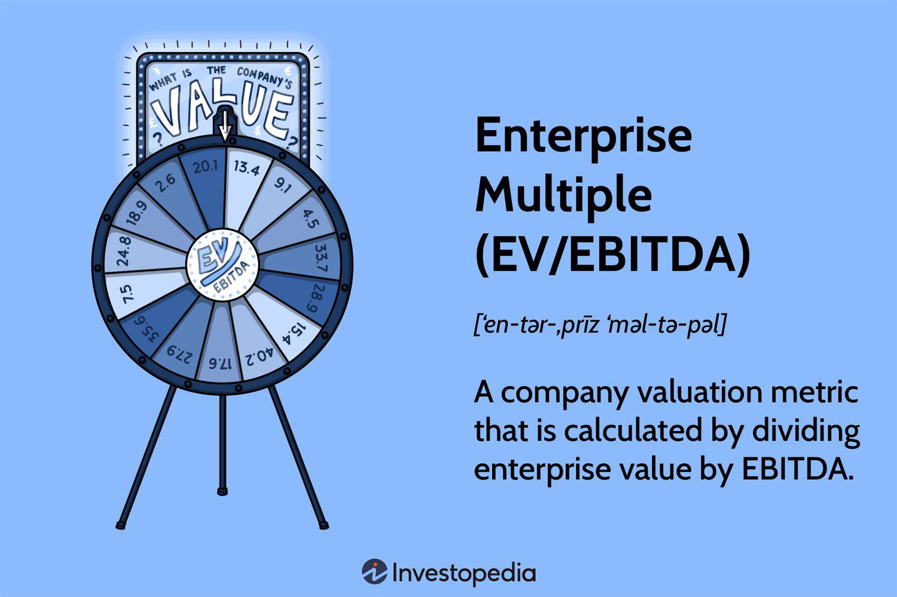

## Table of Contents

## What is the Enterprise Multiple (EV/EBITDA) and why is it important?

The Enterprise Multiple, often known as EV/EBITDA, is a way to figure out how much a company is worth by comparing its total value to its earnings before interest, taxes, depreciation, and amortization (EBITDA). It's like looking at the price of a house compared to how much money it can make if you rent it out. The "Enterprise Value" (EV) is what you'd pay to buy the whole company, including its debts and cash. The EBITDA shows how much profit the company makes from its main business activities before taking out some big expenses.

This ratio is important because it helps investors see if a company is a good buy. If the EV/EBITDA ratio is low, it might mean the company is cheap and could be a good investment. If it's high, the company might be expensive. This ratio is useful because it looks at the company's value in a way that doesn't depend on how it's financed or its tax situation. It gives a clearer picture of the company's operating performance and helps compare different companies more easily.

## How is the Enterprise Value (EV) calculated?

To find the Enterprise Value (EV) of a company, you start by adding up the market value of all its shares, which is the total stock price multiplied by the number of shares. Then, you add the company's total debt, because if you were buying the whole company, you'd have to take on its debts too. But, you also subtract the cash and cash equivalents the company has, because that cash would be yours if you bought the company, and it reduces the amount you'd need to pay.

This calculation gives you a complete picture of what it would cost to buy the entire business, not just the equity part. It's like figuring out the total price tag for a house, including the mortgage, but then subtracting the money you find in the safe. EV is important because it shows the true cost of acquiring a company, considering all its financial aspects, not just the stock price.

## What does EBITDA stand for and how is it computed?

EBITDA stands for Earnings Before Interest, Taxes, Depreciation, and Amortization. It's a way to measure how much money a company makes from its main business activities without considering some big expenses. Think of it like looking at how much profit a lemonade stand makes from selling lemonade, without worrying about the cost of the stand itself or any loans taken to buy it.

To calculate EBITDA, you start with the company's net income, which is the profit after all expenses. Then, you add back the interest paid on any loans, the taxes the company paid, and the depreciation and amortization expenses. Depreciation is the cost of wear and tear on things like machinery, and amortization is similar but for intangible things like patents. By adding these back, you get a clearer picture of the company's operating performance, without the impact of how it's financed or its tax situation.

## Why might investors prefer EV/EBITDA over other valuation metrics?

Investors might like using EV/EBITDA because it gives a clearer picture of a company's value. It looks at the whole cost of buying a company, including its debts and cash, which other metrics like the Price-to-Earnings (P/E) ratio don't do. This makes it easier to compare companies, even if they have different amounts of debt or cash. For example, if you're trying to decide between two companies, one with a lot of debt and one with a lot of cash, EV/EBITDA helps you see which one might be a better deal.

Another reason investors might prefer EV/EBITDA is that it focuses on the company's core business performance. It ignores things like interest, taxes, depreciation, and amortization, which can vary a lot between companies and don't really show how well the business is doing day-to-day. This makes it easier to see if a company is making money from its main activities, like selling products or services. By using EV/EBITDA, investors can get a better idea of a company's true operating profitability and make smarter investment choices.

## How does EV/EBITDA help in comparing companies within the same industry?

EV/EBITDA is really helpful when you want to compare companies in the same industry because it looks at the whole value of a company, including its debts and cash. Imagine you're comparing two car companies. One company might have a lot of debt, while the other has a lot of cash. If you just look at their stock prices or other simple measures, you might think one is a better deal than the other. But with EV/EBITDA, you see the full picture. It shows you what it would really cost to buy each company, making it easier to decide which one is a better buy.

Another reason EV/EBITDA is great for comparing companies in the same industry is that it focuses on how well the companies are doing at their core business. It doesn't get distracted by things like taxes, interest on loans, or the cost of their equipment wearing out over time. These things can be different for each company and don't really tell you how good they are at making and selling cars. By using EV/EBITDA, you can see which car company is making more money from selling cars, not just which one has lower taxes or less debt. This makes it a lot easier to figure out which company is doing better in the industry.

## What are typical EV/EBITDA ratios for different industries?

EV/EBITDA ratios can vary a lot depending on the industry. For example, industries that are growing fast or have high profits, like technology or software companies, often have higher EV/EBITDA ratios. It's not unusual to see these companies with ratios around 15 to 20 or even higher. On the other hand, industries that are more stable but don't grow as quickly, like utilities or consumer goods, usually have lower EV/EBITDA ratios. These might be around 8 to 12.

Industries that need a lot of money to keep running, like manufacturing or energy, might also have lower EV/EBITDA ratios, often around 6 to 10. This is because they have big expenses for things like machines and buildings, which can make their EBITDA look smaller compared to their total value. In contrast, service industries, like healthcare or consulting, might have ratios in the middle, around 10 to 15, because they don't need as much money for equipment but still have steady profits.

## How can EV/EBITDA be used to assess a company's financial health?

EV/EBITDA can be a helpful tool to check a company's financial health because it shows how much you'd pay for the company compared to how much money it makes from its main business. A lower EV/EBITDA ratio might mean the company is a good deal, like finding a house that's cheaper than others in the neighborhood. If the ratio is low, it could be because the company is doing well at making money, or maybe because the market thinks it's not worth as much as it should be. But be careful, because a low ratio could also mean there are problems with the company that make people want to sell its stock.

On the other hand, a high EV/EBITDA ratio might mean the company is expensive, like paying a lot more for a house than its neighbors. This could be because the company is expected to grow a lot in the future, or it could be because investors are too excited about it. A high ratio isn't always bad, but it's important to understand why the company's price is so high. By looking at the EV/EBITDA ratio and comparing it to other companies in the same industry, you can get a better idea of whether a company is a good investment or if it might be overvalued.

## What are the limitations and potential pitfalls of using EV/EBITDA?

Using EV/EBITDA can be tricky because it doesn't tell the whole story about a company. It ignores important costs like depreciation and amortization, which can be big expenses for companies that need a lot of equipment or have valuable patents. If a company has old machines that need replacing soon, the EV/EBITDA might make it look healthier than it really is. Also, EV/EBITDA doesn't consider how a company is financed, so two companies with the same EV/EBITDA might have very different amounts of debt, which can be risky.

Another problem with EV/EBITDA is that it can be easy to manipulate. Companies might play around with their earnings to make their EBITDA look better, which can fool investors. For example, they might delay expenses or change how they account for things to boost their numbers. This means you have to be careful and look at other financial measures too, not just EV/EBITDA. It's a useful tool, but it's not perfect and should be used along with other ways to check a company's health.

## How does debt affect the EV/EBITDA ratio and what should analysts consider?

Debt plays a big role in the EV/EBITDA ratio because it's part of the Enterprise Value (EV). When a company has a lot of debt, its EV goes up, which can make the EV/EBITDA ratio higher. This means the company looks more expensive compared to its earnings. On the other hand, if a company has a lot of cash, that cash is subtracted from the EV, which can make the ratio lower. So, when looking at the EV/EBITDA ratio, it's important to remember that a high ratio might not just mean the company is doing well or growing fast; it could also mean the company has a lot of debt.

Analysts need to think carefully about how debt affects the EV/EBITDA ratio. They should look at the company's debt levels and compare them to other companies in the same industry. If a company's EV/EBITDA ratio is high because of a lot of debt, it might be riskier than it seems. Analysts should also check if the company can pay its debts with its earnings. If the company has trouble paying its debts, the high EV/EBITDA ratio could be a warning sign, not a sign of a good investment. So, it's important to use EV/EBITDA along with other financial measures to get a full picture of a company's health.

## Can you explain how changes in EBITDA impact the EV/EBITDA multiple?

When a company's EBITDA goes up, it means the company is making more money from its main business activities. This makes the bottom part of the EV/EBITDA ratio bigger. If the Enterprise Value (EV) stays the same, a bigger EBITDA will make the EV/EBITDA ratio smaller. It's like if you have a pizza and you cut it into more slices, each slice is smaller. A smaller EV/EBITDA ratio can make the company look cheaper and might attract more investors.

On the other hand, if a company's EBITDA goes down, it means they're making less money. This makes the bottom part of the EV/EBITDA ratio smaller. If the EV stays the same, a smaller EBITDA will make the EV/EBITDA ratio bigger. It's like if you have the same pizza but cut it into fewer slices, each slice is bigger. A bigger EV/EBITDA ratio can make the company look more expensive, which might scare some investors away. So, changes in EBITDA can really change how investors see a company's value.

## What advanced techniques can be used to adjust EV/EBITDA for more accurate valuations?

To get a more accurate valuation using EV/EBITDA, you can adjust it for things like non-recurring expenses or income. Sometimes, a company might have a big one-time cost or gain that doesn't happen every year. If you take these out of the EBITDA, you get a better idea of what the company's normal earnings look like. This helps make the EV/EBITDA ratio more useful because it shows the company's ongoing business performance, not just a snapshot that includes unusual events.

Another way to fine-tune EV/EBITDA is to account for different levels of capital spending. Some industries need to spend a lot of money on new equipment or buildings, which can affect their EBITDA. By adding back the depreciation and amortization and then subtracting the actual capital expenditures, you get a measure called "EBITDA minus Capex." This gives a clearer picture of the cash the company generates after keeping its business running and growing. Using this adjusted number in the EV/EBITDA ratio can help investors see if a company is really a good deal or if it just looks cheap because of its spending habits.

## How do macroeconomic factors influence EV/EBITDA multiples and investment decisions?

Macroeconomic factors like interest rates, inflation, and economic growth can really change how investors see EV/EBITDA multiples. When interest rates go up, borrowing money becomes more expensive for companies. This can make their future earnings look less valuable, which might push down their EV/EBITDA multiples. On the other hand, if the economy is growing fast, people might be more willing to pay higher multiples because they think companies will make more money in the future. Inflation can also mess with EV/EBITDA multiples. If prices are going up a lot, companies might have higher costs, which can lower their EBITDA and make their multiples look higher.

Investors need to think about these big economic changes when they're looking at EV/EBITDA multiples. For example, if they see a company with a high EV/EBITDA multiple during a time when the economy is doing well, they might still think it's a good investment because they expect the company to keep growing. But if the economy is slowing down or interest rates are going up, a high multiple might make them worried that the company is too expensive. By understanding how these big economic factors work, investors can make smarter choices about where to put their money.

## What is the Formula and Calculation of Enterprise Multiple?

The Enterprise Multiple, represented as EV/EBITDA, is a critical measure in evaluating corporate value. The formula is expressed as:

$$
\text{Enterprise Multiple (EV/EBITDA)} = \frac{\text{Enterprise Value (EV)}}{\text{EBITDA}}
$$

To calculate the Enterprise Value (EV), the following components are considered:

1. **Market Capitalization**: This is the total market value of a company's outstanding shares. It is calculated by multiplying the current share price by the total number of outstanding shares.

2. **Total Debt**: Include all short-term and long-term obligations that the company has to third parties.

3. **Cash and Cash Equivalents**: These are the liquid assets held by the company, such as cash on hand and short-term investments that are readily convertible to a known amount of cash.

The EV is computed using the formula:

$$
\text{EV} = \text{Market Capitalization} + \text{Total Debt} - \text{Cash and Cash Equivalents}
$$

EBITDA, which stands for Earnings Before Interest, Taxes, Depreciation, and Amortization, can be derived by reversing these cost deductions from net income:

$$
\text{EBITDA} = \text{Net Income} + \text{Interest} + \text{Taxes} + \text{Depreciation} + \text{Amortization}
$$

Once these calculations are completed, the Enterprise Multiple provides a standardized measure of a company's value by dividing the total Enterprise Value by EBITDA. This calculation is pivotal for traders aiming to incorporate EV/EBITDA into [algorithmic trading](/wiki/algorithmic-trading) models. The process ensures a comprehensive, apples-to-apples comparison across companies, regardless of differences in capital structure or accounting practices.

Incorporating this formula into algorithmic systems not only improves the speed of valuation but also provides consistency and comparability crucial for making informed trading decisions. Here’s a basic example in Python to compute the Enterprise Multiple:

```python
def calculate_ev_ebitda(market_cap, total_debt, cash_and_equivalents, net_income, interest, taxes, depreciation, amortization):
    # Calculate Enterprise Value (EV)
    ev = market_cap + total_debt - cash_and_equivalents

    # Calculate EBITDA
    ebitda = net_income + interest + taxes + depreciation + amortization

    # Calculate EV/EBITDA
    enterprise_multiple = ev / ebitda
    return enterprise_multiple

# Example values
market_cap = 5000
total_debt = 1500
cash_and_equivalents = 200
net_income = 400
interest = 50
taxes = 100
depreciation = 150
amortization = 50

enterprise_multiple = calculate_ev_ebitda(market_cap, total_debt, cash_and_equivalents, net_income, interest, taxes, depreciation, amortization)
print("Enterprise Multiple (EV/EBITDA):", enterprise_multiple)
```

By mastering the calculus of EV/EBITDA, traders can leverage these insights to develop robust algorithmic trading strategies, making better-informed investment decisions.

## References & Further Reading

[1]: ["Advances in Financial Machine Learning"](https://www.amazon.com/Advances-Financial-Machine-Learning-Marcos/dp/1119482089) by Marcos Lopez de Prado

[2]: ["Quantitative Trading: How to Build Your Own Algorithmic Trading Business"](https://www.amazon.com/Quantitative-Trading-Build-Algorithmic-Business/dp/1119800064) by Ernest P. Chan

[3]: ["Machine Learning for Algorithmic Trading"](https://github.com/PacktPublishing/Machine-Learning-for-Algorithmic-Trading-Second-Edition) by Stefan Jansen

[4]: ["Valuation: Measuring and Managing the Value of Companies"](https://www.amazon.com/Valuation-Measuring-Managing-Companies-Finance/dp/1119610885) by McKinsey & Company Inc.

[5]: ["Financial Statement Analysis and Security Valuation"](https://www.amazon.com/Financial-Statement-Analysis-Security-Valuation/dp/0073379662) by Stephen Penman