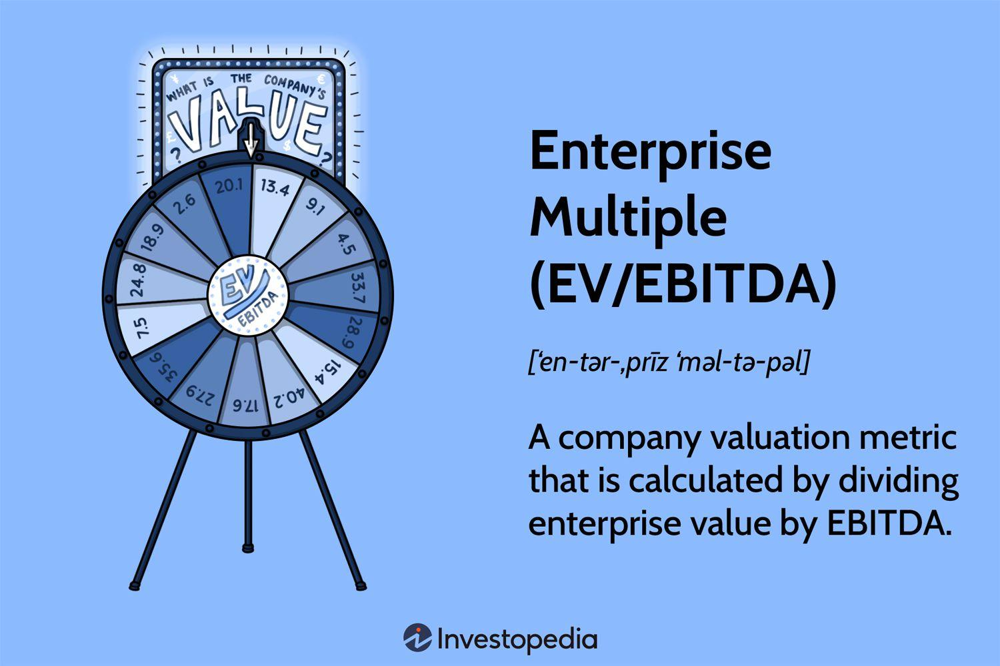

## Table of Contents

## What is the enterprise multiple?

The enterprise multiple is a way to figure out how much a company is worth by looking at its total value compared to its earnings before interest, taxes, depreciation, and amortization (EBITDA). It's like a tool that investors use to see if a company is a good buy. The total value of a company, called enterprise value, includes the market value of its shares, plus its debts, minus any cash it has. By dividing this total value by the company's EBITDA, you get the enterprise multiple.

This multiple helps investors compare companies in the same industry. If one company has a lower enterprise multiple than another, it might be a better deal. But, it's important to remember that this number doesn't tell the whole story. Things like how fast a company is growing, its future plans, and the overall health of the industry can also affect whether it's a good investment. So, while the enterprise multiple is a useful starting point, it's just one piece of the puzzle when deciding where to put your money.

## How is the enterprise multiple calculated?

The enterprise multiple is calculated by dividing a company's enterprise value by its earnings before interest, taxes, depreciation, and amortization (EBITDA). The enterprise value is the total value of a company, which includes the market value of its shares, plus any debts it has, minus any cash it's holding. So, to find the enterprise multiple, you first need to figure out the enterprise value. You do this by taking the company's market capitalization (the total value of its shares), adding its total debt, and then subtracting its cash and cash equivalents.

Once you have the enterprise value, you divide it by the company's EBITDA. EBITDA is a measure of a company's earnings that doesn't take into account interest, taxes, depreciation, or amortization. This gives you a ratio that shows how many times the enterprise value is compared to the company's EBITDA. This ratio, the enterprise multiple, helps investors see if a company might be a good investment by comparing it to other companies in the same industry.

## Why is the enterprise multiple important for value investors?

The enterprise multiple is important for value investors because it helps them figure out if a company is priced right. Value investors look for companies that are undervalued, meaning they are cheaper than they should be. By using the enterprise multiple, investors can compare different companies in the same industry. If one company has a lower enterprise multiple than others, it might be a better deal. This helps value investors find companies that might be good investments because they are priced lower than their true value.

Also, the enterprise multiple gives a fuller picture of a company's value by including its debt and cash. This is different from just looking at the stock price or market capitalization. By considering the whole enterprise value, investors get a more complete view of what they are really paying for. This is especially useful for companies with a lot of debt or cash, as it shows the true cost of buying the business. So, for value investors, the enterprise multiple is a key tool in finding undervalued companies and making smart investment choices.

## How does the enterprise multiple differ from the price-to-earnings ratio?

The enterprise multiple and the price-to-earnings (P/E) ratio are both ways to figure out how much a company is worth, but they do it differently. The enterprise multiple looks at the whole value of a company, including its debts and cash, and compares that to its earnings before interest, taxes, depreciation, and amortization (EBITDA). This gives investors a bigger picture of what they're really paying for when they think about buying a company. On the other hand, the P/E ratio only looks at the market price of a company's shares compared to its net earnings, which is the money left after all expenses, including interest and taxes, are paid.

Because the enterprise multiple includes debt and cash, it can be more useful for comparing companies with different levels of borrowing or cash reserves. If a company has a lot of debt, its enterprise multiple will be higher than its P/E ratio, showing that it's more expensive to buy the whole business. The P/E ratio, being simpler, is easier to calculate and understand, but it doesn't give the full picture of a company's financial health. So, while the P/E ratio is good for a quick look at a company's value, the enterprise multiple gives a deeper understanding, which is why investors often use both to make better investment decisions.

## What does a high enterprise multiple indicate about a company?

A high enterprise multiple means that a company's total value is a lot higher compared to its earnings. This could mean that investors think the company will grow a lot in the future, so they are willing to pay more for it now. It might also mean that the company is in a popular industry, or that it has something special that makes it more valuable, like a unique product or service.

But, a high enterprise multiple can also be a warning sign. It might mean that the company is too expensive compared to what it earns. If the company doesn't grow as fast as people expect, the price might go down, and investors could lose money. So, it's important to look at other things too, like how fast the company is growing, what the industry is like, and if there are any risks that could affect the company's future earnings.

## What does a low enterprise multiple suggest about a company's valuation?

A low enterprise multiple suggests that a company might be undervalued. This means that the total value of the company, including its debts and cash, is low compared to its earnings before interest, taxes, depreciation, and amortization (EBITDA). Investors might see this as a good opportunity to buy the company at a bargain price, hoping that its value will go up in the future.

However, a low enterprise multiple doesn't always mean a company is a great investment. It could also mean that the company is struggling or that it's in an industry that's not doing well. Investors need to look at other factors, like the company's growth potential, its financial health, and the overall market conditions, to decide if a low enterprise multiple really means the company is a good buy.

## How can the enterprise multiple be used to compare companies within the same industry?

The enterprise multiple is a great way to compare companies in the same industry. It helps investors see which companies might be a better deal. By looking at the enterprise multiple, you can tell if one company is cheaper than another, even if they are in the same business. For example, if Company A has an enterprise multiple of 8 and Company B has an enterprise multiple of 12, Company A might be a better buy because it's cheaper compared to its earnings.

But, it's not just about finding the lowest number. You also need to think about why one company has a lower multiple. Maybe it's because the company is growing slower or has more risks. So, when you compare companies, you should look at other things too, like how fast they are growing, how much debt they have, and what the future might hold for their industry. This way, you get a fuller picture of which company might be the better investment.

## What are the limitations of using the enterprise multiple for valuation?

Using the enterprise multiple for valuation has some limits. One big limit is that it doesn't tell you everything about a company. It only looks at the company's earnings before interest, taxes, depreciation, and amortization (EBITDA). This means it doesn't show you if the company has a lot of debt or if it's growing fast. So, you might think a company is a good buy because it has a low enterprise multiple, but if it has a lot of debt, it could be riskier than you think.

Another limit is that the enterprise multiple can be different for companies in different industries. What's a good multiple in one industry might not be good in another. For example, tech companies often have higher multiples than companies in other industries because people expect them to grow a lot. So, if you compare a tech company to a company in a different industry just by looking at their enterprise multiples, you might make a mistake. You need to compare companies within the same industry to get a fair idea of their value.

## Can the enterprise multiple be applied to all types of companies, including those with negative earnings?

The enterprise multiple can be tricky to use for companies with negative earnings. This is because the enterprise multiple is calculated by dividing the company's total value, or enterprise value, by its earnings before interest, taxes, depreciation, and amortization (EBITDA). If a company's EBITDA is negative, it means the company is losing money, and you can't divide by a negative number in a meaningful way. So, for companies with negative earnings, the enterprise multiple might not be a useful way to figure out if they are a good buy.

Even though the enterprise multiple might not work well for companies with negative earnings, investors can still look at other things to value these companies. They can look at the company's growth potential, its market position, and other financial measures like revenue growth or cash flow. These can give a better picture of whether a company with negative earnings might be worth investing in. So, while the enterprise multiple has its limits, it's just one tool among many that investors use to make smart choices.

## How does the enterprise multiple adjust for different capital structures across companies?

The enterprise multiple helps compare companies with different ways of getting money, like loans or selling shares. It does this by looking at the whole value of a company, not just the price of its shares. When you add a company's debts to its market value and then subtract its cash, you get the enterprise value. This way, the enterprise multiple takes into account how much a company owes and how much cash it has. So, even if one company has more debt than another, the enterprise multiple can still show if it's a good deal.

This is important because two companies can look very different if you just look at their share prices. One might have a lot of debt, making it seem cheaper when you only look at the price of its shares. But when you use the enterprise multiple, you see the real cost of buying the whole business. This helps investors make fair comparisons and find the best investments, no matter how the companies are set up financially.

## What role does the enterprise multiple play in merger and acquisition valuations?

The enterprise multiple is a key tool when companies are thinking about buying other companies, which is called mergers and acquisitions. It helps them figure out how much a company is really worth by looking at its total value, including debts and cash, compared to its earnings. This way, the buyer can see if the company they want to buy is a good deal. If the enterprise multiple is low, it might mean the company is cheaper than others in the same industry, making it a good target for a merger or acquisition.

But, the enterprise multiple is just one part of the puzzle. People doing mergers and acquisitions also need to think about other things, like how fast the company is growing, what risks it might have, and how it fits with their own business. Even if a company has a low enterprise multiple, it might not be the best choice if it has a lot of debt or if its industry is not doing well. So, while the enterprise multiple is a useful starting point, it's important to look at the whole picture before making a big decision like buying another company.

## How have historical trends in enterprise multiples influenced investment strategies over time?

Historical trends in enterprise multiples have played a big role in shaping how investors make their choices. Over time, investors have noticed that enterprise multiples can go up or down depending on the economy, the industry, and how well companies are doing. When enterprise multiples are high, it often means that investors are feeling good about the future and are willing to pay more for companies. This can lead investors to focus on growth and future potential rather than just looking at current earnings. On the other hand, when multiples are low, it might mean that investors are worried about the economy or certain industries, so they look for safer bets or undervalued companies.

These trends have led to different investment strategies over the years. For example, during times when enterprise multiples are high, investors might put more money into tech companies or other industries that are expected to grow a lot. They might be willing to pay a high price because they think the company will earn even more in the future. But when multiples are low, investors might switch to a value investing approach, looking for companies with low multiples that they believe are priced too cheaply. This way, they hope to buy the company at a good price and see its value go up over time. So, understanding these historical trends helps investors decide when to buy, sell, or hold onto their investments.

## What is Understanding Enterprise Multiple?

Enterprise Multiple, commonly referred to as EV/EBITDA, is a crucial valuation metric employed to gauge a company's overall value. It effectively allows investors and analysts to assess how a company's market valuation aligns with its operational performance.

The formula for calculating the Enterprise Multiple is:

$$
\text{Enterprise Multiple (EV/EBITDA)} = \frac{\text{Enterprise Value (EV)}}{\text{EBITDA}}
$$

**Enterprise Value (EV)** is a comprehensive measure of a company's total market value. It includes not only the equity market capitalization but also accounts for debt, preferred stock, and cash holdings. This makes EV a more rounded figure than market capitalization alone, as it reflects both the company's capital obligations and resources. The formula for EV is:

$$
\text{Enterprise Value} = \text{Market Capitalization} + \text{Total Debt} - \text{Cash and Cash Equivalents}
$$

This metric captures the full scope of a company's financial liabilities while offsetting any liquid assets, thus providing a holistic view of what the company's market value represents in terms of genuine financial commitments.

**EBITDA (Earnings Before Interest, Taxes, Depreciation, and Amortization)** is another essential component of the Enterprise Multiple. It focuses on the company's profitability from operations by excluding interest, taxes, depreciation, and amortization. This focus on operational profitability allows for a clearer view of a firm's cash flow and intrinsic performance. Essentially, EBITDA simplifies the income statement to highlight pure operational efficiencies and revenue generation abilities before financial structuring and fiscal obligations are considered.

Using EV/EBITDA as a valuation metric offers several advantages:

1. **Comparative Analysis**: It allows for cross-comparisons between companies of different sizes and across industries, as it normalizes for differences in capital structure and tax environments.

2. **Operational Focus**: By concentrating on EBITDA, the metric sidesteps non-operational accounting factors, giving investors a clearer view of operational proficiency.

3. **Cash Flow Indicator**: It offers insight into a firm's ability to generate cash from its core operations, valuable for assessing potential returns on investment.

Overall, the Enterprise Multiple acts as a vital tool for those assessing potential investments, leveraging its focus on comprehensive market value and operational performance to inform strategic decision-making.

## What is the significance in value investing?

Value investing focuses on identifying stocks that are undervalued based on thorough analysis of key financial metrics, with the Enterprise Multiple (EV/EBITDA) being a critical component. This metric serves as a valuable tool for investors, facilitating the assessment of a company's valuation in comparison to its operational performance. 

A lower Enterprise Multiple can signify that a company is undervalued; this suggests the possibility of profitable investment returns. The Enterprise Multiple is calculated by dividing a company's Enterprise Value (EV) by its Earnings Before Interest, Taxes, Depreciation, and Amortization (EBITDA). Mathematically, it is represented as:

$$
\text{Enterprise Multiple} = \frac{\text{Enterprise Value (EV)}}{\text{EBITDA}}
$$

This ratio is instrumental in appraising a company's market value with respect to its earnings capability before accounting for non-operational costs. Consequently, it highlights a more precise reflection of a company's operational efficiency and cash flow potential. 

Investors adopt a comparative approach with this multiple, benchmarking it against industry averages or the multiples of competitor firms. This allows them to pinpoint potential investment opportunities that might be overlooked when relying solely on other traditional accounting indicators like the Price-to-Earnings (P/E) ratio. 

By focusing on operational efficiencies, the Enterprise Multiple provides clarity amidst the potential distortions caused by different accounting methods and financial reporting practices. In essence, it enables a clearer assessment of a company's fundamental performance, helping value investors make informed decisions.

## How does this compare with other financial metrics?

While the Enterprise Multiple (EV/EBITDA) is a valuable metric in financial analysis, it is frequently used alongside other financial metrics like the Price-to-Earnings (P/E) ratio and the Price-to-Book (P/B) ratio. Each of these metrics provides unique insights into different aspects of a company's valuation and financial health.

The P/E ratio is a key indicator that focuses on equity valuation by reflecting how much investors are willing to pay per dollar of net income. Its formula is given by:

$$
\text{P/E Ratio} = \frac{\text{Market Price per Share}}{\text{Earnings per Share (EPS)}}
$$

This metric is particularly useful for evaluating companies with consistent profit generation, as it relates earnings directly to the market price of shares. However, it may not always capture the full financial picture in companies with high capital expenditures or those operating under unique debt structures.

In contrast, the EV/EBITDA metric offers significant advantages in capital-intensive industries, such as utilities or telecommunications, where the debt structure and depreciation might obscure a firm's true operational profitability. By excluding interest, taxes, depreciation, and amortization, the EV/EBITDA offers a clearer view of a firm's operational performance.

For a holistic financial assessment, it is important to combine these metrics. While the Enterprise Multiple provides insight into a company's operational efficiency independent of capital structure, the P/B ratio accounts for the company's asset value and is calculated as:

$$
\text{P/B Ratio} = \frac{\text{Market Price per Share}}{\text{Book Value per Share}}
$$

This metric evaluates the intrinsic value of a company, crucial for industries with significant tangible assets.

By leveraging a combination of these metrics, investors gain a more comprehensive understanding of a company's financial health. Each metric provides a piece of the puzzle, and using them collectively enhances the robustness of investment evaluations, enabling a balanced view that supports better decision-making in the ever-evolving landscape of finance and investment.

## References & Further Reading

[1]: ["Investment Valuation: Tools and Techniques for Determining the Value of Any Asset"](https://archive.org/details/investmentvaluat0000damo_n6k9) by Aswath Damodaran

[2]: ["Valuation: Measuring and Managing the Value of Companies"](https://www.amazon.com/Valuation-Measuring-Managing-Companies-Finance/dp/1119610885) by McKinsey & Company Inc.

[3]: ["The Little Book of Valuation: How to Value a Company, Pick a Stock, and Profit"](https://www.amazon.com/Little-Book-Valuation-Company-Profits/dp/1394244401) by Aswath Damodaran

[4]: ["Financial Statement Analysis and Security Valuation"](https://cie-advances.asme.org/files-library-Documents/financial-statement-analysis-and-security-valuation.pdf) by Stephen Penman

[5]: Fernald, J., & Rogers, B. (2017). ["Algorithmic Trading and Market Dynamics."](https://www.johnfernald.net/papers) SSRN Electronic Journal.

[6]: ["Algorithmic Trading: Winning Strategies and Their Rationale"](https://www.amazon.com/Algorithmic-Trading-Winning-Strategies-Rationale-ebook/dp/B00CY5HC0U) by Ernie Chan

[7]: ["Enterprise Value Versus Equity Value: Understanding The Financial Metrics"](https://corporatefinanceinstitute.com/resources/capital_markets/enterprise-value-vs-equity-value/) by Corporate Finance Institute

[8]: ["Understanding Enterprise Value vs. Equity Value"](https://quickbooks.intuit.com/r/enterprise/enterprise-value-vs-equity-value/) by James Chen, Investopedia