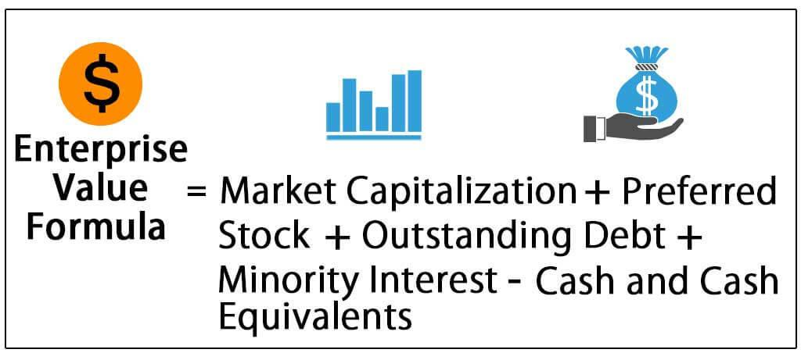

In today's fast-paced financial markets, both enterprise value (EV) and algorithmic trading play crucial roles. With technology driving rapid changes in how trades are executed, achieving a comprehensive understanding of a company's true worth is more critical than ever. Enterprise value serves as a vital metric, providing a multidimensional view of a company's overall valuation. It incorporates factors beyond market capitalization by including debt, as well as subtracting cash and cash equivalents. This broader perspective is essential for investors seeking deeper insights into a company's financial health.

Understanding the formula for calculating enterprise value is essential for both traditional and algorithmic traders. The EV formula, expressed as EV = Market Capitalization + Total Debt - Cash and Cash Equivalents, forms the foundation for various financial analyses. For traditional traders, it aids in making investment decisions by ensuring a more accurate assessment of a company's worth. Meanwhile, algorithmic traders leverage this formula within computational models to deploy sophisticated trading strategies that capitalize on market efficiencies. By programming algorithms to quickly calculate and react to changes in enterprise value, these traders can potentially gain an edge in decision-making processes.



This article explores the concept of EV, its calculation, and how it integrates with financial analysis and algorithmic trading. Bridging the gap between traditional financial evaluation and modern trading strategies, understanding EV is a cornerstone for driving informed investment decisions in contemporary markets. Through mastering EV, traders and analysts alike can enhance their approaches, whether through manual analysis or automated trading algorithms, to achieve optimized portfolio performance.

## Table of Contents

## Understanding Enterprise Value (EV)

Enterprise Value (EV) is a critical metric in finance that provides a holistic measure of a company's total worth. Unlike market capitalization, which reflects only the equity value of a company, EV accounts for a company's full capital structure. This includes its market capitalization, total debt, and cash and cash equivalents, offering a more comprehensive perspective of its valuation.

Enterprise Value (EV) is calculated using the formula:

$$
\text{EV} = \text{Market Capitalization} + \text{Total Debt} - \text{Cash and Cash Equivalents}
$$

Market capitalization is derived from multiplying the company's share price by the number of outstanding shares. This figure represents the equity portion of a firm's value. However, EV extends this valuation by integrating total debt, acknowledging the capital that the company has sourced from creditors. This includes both short-term and long-term debts. Debt is a key aspect because it signifies obligations that need to be settled, impacting the company's financial health and potential for investment returns.

On the other hand, cash and cash equivalents are deducted in the EV calculation as they can be used to pay down debt, effectively reducing the company's net indebtedness. Cash equivalents include highly liquid investments such as Treasury bills, short-term government bonds, and commercial paper. Including cash in EV calculations provides a net perspective, subtracting any excess [liquidity](/wiki/liquidity-risk-premium) that could be applied to vulnerability.

This comprehensive approach allows EV to serve not just as a static measure of value, but as a dynamic tool in financial analysis. It enables investors and analysts to compare companies across sectors and industries with greater accuracy, taking into account the entire financial structure rather than just the equity portion. This attribute makes EV particularly useful in scenarios involving mergers and acquisitions, where understanding the full financial scope of a target company is essential.

Enterprise Value's acknowledgment of total debt and cash ensures a true reflection of the company's market value, free from the misleading simplicity of surface-level metrics like market capitalization alone. Consequently, EV offers a profound insight into a company's total value, serving as a more accurate marker for evaluating potential investment opportunities.

## The Formula and Calculation of EV

Enterprise Value (EV) is a key metric in financial analysis, offering a comprehensive measure of a company's total value. The fundamental formula for calculating EV is:

$$
EV = \text{Market Capitalization} + \text{Total Debt} - \text{Cash and Cash Equivalents}
$$

Each component of this formula should be carefully sourced from reliable financial statements to ensure the accuracy of the calculation.

1. **Market Capitalization**: This is the total market value of a company’s outstanding shares of stock. It is calculated by multiplying the current share price by the total number of outstanding shares. Market capitalization represents the equity value of a company and can be obtained from stock market data.

2. **Total Debt**: This includes both short-term and long-term liabilities that a company holds. It encompasses loans, bonds, and all other forms of debt. The total debt figure is typically found on the balance sheet under the liabilities section.

3. **Cash and Cash Equivalents**: This component consists of the cash in hand, demand deposits, and short-term investments that are easily convertible to cash. These figures appear on a company's balance sheet under current assets.

Accurate sourcing from annual reports or quarterly financial statements is critical for the precision of the EV calculation. Financial professionals must ensure that they use up-to-date and consistent data across all these components to maintain the integrity of their assessments.

Understanding and applying the EV formula is essential for evaluating a company's valuation. By considering both the debt and cash positions, EV provides a more holistic view of a company's value beyond just market capitalization. This comprehensive assessment helps investors and analysts compare companies' worth more effectively, especially when conducting peer analysis in the same sector or industry. 

Incorporating accurate EV calculations into financial analysis enables stakeholders to make well-informed valuation and investment decisions.

## Financial Ratios Using EV

Enterprise Value (EV) is a critical measure in corporate finance and investment analysis, offering a comprehensive look at a company's total valuation beyond mere market capitalization. It is especially valuable when used alongside financial ratios like EV/EBITDA and EV/Sales, which are extensively employed in evaluating a company's financial performance and potential investment value.

#### EV/EBITDA Ratio

The EV/EBITDA ratio measures a company's enterprise value relative to its earnings before interest, taxes, depreciation, and amortization (EBITDA). This ratio is particularly beneficial for comparing companies within the same industry, as it strips away the effects of capital structure and tax regimes. A lower EV/EBITDA might indicate undervaluation, signaling potential investment opportunities, whereas a higher ratio could suggest overvaluation.

The formula for the EV/EBITDA ratio is:

$$
\text{EV/EBITDA} = \frac{\text{Enterprise Value (EV)}}{\text{EBITDA}}
$$

#### EV/Sales Ratio

The EV/Sales ratio provides another perspective by comparing a company's EV to its total sales or revenue. This metric is valuable for industries with volatile profit margins, where EBITDA might not provide a clear valuation perspective. By considering sales, this ratio highlights how much value the market places on each dollar of revenue. Industries with consistent growth prospects might command higher EV/Sales ratios, reflecting strong market confidence.

The formula for the EV/Sales ratio is:

$$
\text{EV/Sales} = \frac{\text{Enterprise Value (EV)}}{\text{Sales}}
$$

#### Application of EV-Based Ratios

Using these ratios, investors can gain insights into how a company's value stacks up against its peers. EV-based ratios facilitate comparative analysis, allowing investors to make informed decisions by identifying trends in valuation relative to cash flow and sales. Ratios such as these are especially powerful in sectors where debt levels and capital expenditures are significant factors, such as utilities or telecommunications. 

These tools are vital for discerning market perceptions and guiding strategic investment decisions. Investors often look at these ratios in conjunction with other metrics to build a comprehensive picture of a company's financial health and future prospects. By doing so, they can better gauge the sustainability of a company's operations and its ability to generate value for shareholders.

## EV vs. Market Cap and P/E Ratio

Market capitalization, or market cap, is a fundamental metric used to determine the equity value of a company. It is calculated by multiplying the current share price by the total number of outstanding shares. This measure provides an immediate snapshot of how the market values a company's equity at a given time. However, market cap solely considers the equity of a company and does not account for other crucial financial components like debt and cash reserves, which can significantly impact a company's overall valuation.

On the other hand, enterprise value (EV) offers a more encompassing view of a company's total worth. It factors in not only the equity value but also the debt and cash the company holds. The formula for calculating EV is:

$$
\text{EV} = \text{Market Capitalization} + \text{Total Debt} - \text{Cash and Cash Equivalents}
$$

By including these components, EV provides a comprehensive approach to understanding a company's valuation, making it a more holistic indicator than market cap alone.

The price-to-earnings (P/E) ratio is another crucial financial metric used to evaluate company valuation. It is defined as the ratio of a company's current share price to its earnings per share (EPS):

$$
\text{P/E Ratio} = \frac{\text{Share Price}}{\text{Earnings per Share}}
$$

The P/E ratio focuses specifically on the relationship between a company's share price and its earnings, providing insights into market expectations about a company's profitability. While this ratio highlights how much investors are willing to pay per dollar of earnings, it does not consider the company's debt load or cash reserves, which are captured in EV.

Utilizing both EV and P/E ratios allows for a more nuanced analysis of a company's financial health. By comparing EV with P/E, investors can assess not only the profitability of a company relative to its share price but also the overall value when debt and cash are included. For example, a company might have a low P/E ratio, suggesting it is undervalued in terms of earnings. However, a high EV, due to substantial debt, might alter this interpretation, indicating potential risks not apparent when looking at the P/E ratio alone.

Thus, incorporating both EV and market cap, along with the P/E ratio, can provide a well-rounded assessment of a company's value, taking into account diverse financial aspects like equity, debt, and earnings. This integrated approach aids investors and analysts in making more informed investment decisions, aligning market expectations with a company's broader financial context.

## Limitations and Considerations in EV

Enterprise value (EV) is a widely utilized metric in financial analysis due to its comprehensive nature in assessing a company's total valuation. However, it is not without its limitations, particularly when comparing companies across different industries.

One significant limitation is that EV does not account for the inherent differences between industries, particularly capital-intensive ones. Such industries typically have substantial debt levels as part of their operational structure, which can result in a high EV. This high EV may not necessarily indicate overvaluation, as the debt levels might be justified by the capital requirements intrinsic to the industry. For example, utility companies customarily [carry](/wiki/carry-trading) high debt due to the large infrastructure investments they must make. Thus, a high EV for such a company might reflect its capital expenditures rather than an overvalued enterprise. 

Another consideration is the necessity of a contextual understanding of EV within specific industry dynamics. Industry-specific factors such as regulatory environments, technological advancements, and competitive landscapes can significantly impact company valuations. For instance, in technology sectors where cash flow and future growth potential are pivotal, a company with a lower EV may still represent a higher value investment due to its potential for innovation and market disruption. Similarly, industries with high entry barriers or regulatory protection may exhibit different valuation characteristics, impacting the interpretation of EV.

Given these factors, it is crucial for analysts and investors to take industry characteristics into account when using EV as a valuation tool. This approach helps prevent misleading conclusions drawn from an EV analysis that lacks appropriate context. Incorporating additional financial metrics and industry-specific insights can enhance the accuracy of EV evaluations, providing a more nuanced understanding of a company's financial health and investment potential.

## Integrating EV with Algorithmic Trading

Algorithmic trading systems are increasingly using enterprise value (EV) calculations to enhance investment strategies through data-driven decision-making. As these systems become more sophisticated, the integration of EV metrics enables traders to optimize their portfolios by identifying undervalued stocks that may offer substantial capital gains.

Quantitative algorithms leverage EV by evaluating a company's market capitalization, debt levels, and cash reserves. This comprehensive assessment allows algorithms to go beyond simple price-based indicators, offering a more robust valuation method. For instance, an algorithm could automate the extraction of these financial metrics from online data sources, allowing for real-time analysis. This process might involve using APIs to retrieve financial data, calculate EV, and assess potential investments.

```python
import requests

def fetch_financial_data(api_endpoint, company_id):
    response = requests.get(f'{api_endpoint}/{company_id}')
    if response.status_code == 200:
        return response.json()
    else:
        raise ConnectionError("Failed to fetch data")

def calculate_ev(market_cap, total_debt, cash_and_equivalents):
    return market_cap + total_debt - cash_and_equivalents

# Example of retrieving and calculating EV
api_endpoint = 'https://financialdataapi.com/company'
company_id = 'sample_company_id'

financial_data = fetch_financial_data(api_endpoint, company_id)
market_cap = financial_data['market_cap']
total_debt = financial_data['total_debt']
cash = financial_data['cash_and_cash_equivalents']

enterprise_value = calculate_ev(market_cap, total_debt, cash)
print(f'Enterprise Value: {enterprise_value}')
```

Moreover, these algorithms can automate EV analysis by incorporating predefined triggers and thresholds. For example, an algorithm could be programmed to buy or sell stocks when the EV-to-EBITDA ratio, an important valuation metric, crosses a specific threshold. This automation ensures that trades are executed based on fundamental insights without manual intervention, increasing efficiency and accuracy.

Automation further enhances execution speed and reduces human error, key advantages in financial markets where timing is critical. With algorithmic systems executing trades based on real-time EV calculations, traders can rapidly adapt to market changes, ensuring they maintain an edge in competitive environments. This strategic integration of EV not only enriches the analytical capabilities of trading systems but also solidifies EV's role as a cornerstone of modern financial analysis and trading strategies.

## Conclusion

Mastering the formula for enterprise value (EV) and understanding its implications is crucial for traders and analysts. As a comprehensive measure, EV supports a nuanced approach to company valuation by integrating different facets of a business's financial standing, such as equity, debt, and liquid assets. Its fundamental role in financial analysis is evident, whether it's used in traditional valuation methods or in more complex [algorithmic trading](/wiki/algorithmic-trading) strategies.

In traditional valuation, EV offers a more robust picture than market capitalization alone, as it incorporates both debt and cash positions, providing a clearer view of a company's overall financial health. This makes it a valuable tool for investors seeking to assess the intrinsic value of a company more accurately.

For algorithmic trading, integrating EV into quantitative models presents an opportunity to automate and refine investment decisions. Python, for example, can be utilized to program algorithms that parse financial data, calculate EV, and identify stocks that are potentially undervalued. This capability can be crucial for generating capital gains in dynamic markets, where timely and informed decision-making is paramount.

An example of such a Python script might involve fetching financial data through an API, calculating EV using these inputs, and triggering buy or sell actions based on preset conditions. Here's a basic outline of what such a script might involve:

```python
import requests

# Function to calculate enterprise value
def calculate_ev(market_cap, total_debt, cash_equiv):
    return market_cap + total_debt - cash_equiv

# Fetching financial data
financial_data = requests.get('https://api.example.com/company/financials').json()

# Extracting required components
market_cap = financial_data['market_cap']
total_debt = financial_data['total_debt']
cash_equiv = financial_data['cash_equiv']

# Calculate EV
enterprise_value = calculate_ev(market_cap, total_debt, cash_equiv)
print("Enterprise Value:", enterprise_value)
```

Continued exploration and refinement of EV-based strategies can significantly enhance investment portfolios and trading algorithms. By leveraging EV calculations, traders and analysts can ensure more informed decision-making, potentially leading to more effective and profitable financial strategies. As the financial landscape evolves, staying adept with EV applications will remain a vital component of success in both investing and trading realms.

## References & Further Reading

[1]: Damodaran, A. (2012). ["Investment Valuation: Tools and Techniques for Determining the Value of Any Asset."](https://books.google.com/books/about/Investment_Valuation.html?id=5SRHAAAAQBAJ) Wiley Finance.

[2]: Marriott, N., & Tipping, A. (2019). ["Enterprise Value: How the Best Owner-Managers Build Their Fortune, Capture Their Company's Gains, and Create Their Legacy."](https://www.amazon.com/Enterprise-Value-Owner-Managers-Fortune-Companys/dp/0071817883) Greenleaf Book Group Press.

[3]: Hull, J. C. (2017). ["Options, Futures, and Other Derivatives."](https://www.semanticscholar.org/paper/Options%2C-Futures%2C-and-Other-Derivatives-Hull/89bdee500c8623864fc9eb7a471546aa713acc44) Pearson.

[4]: ["Quantitative Momentum: A Practitioner's Guide to Building a Momentum-Based Stock Selection System"](https://www.amazon.com/Quantitative-Momentum-Practitioners-Momentum-Based-Selection/dp/111923719X) by Wesley R. Gray and Jack R. Vogel

[5]: ["Financial Modeling"](https://www.investopedia.com/terms/f/financialmodeling.asp) by Simon Benninga