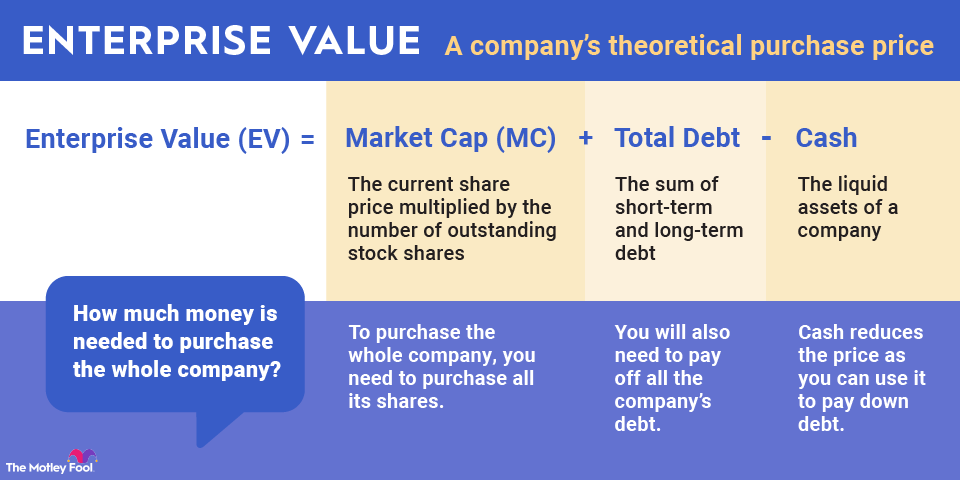

## Table of Contents

## What is enterprise value?

Enterprise value (EV) is a measure of a company's total value, often used in the context of mergers and acquisitions or investment analysis. It represents what it would cost to buy the entire company, including its debts and cash reserves. To calculate EV, you start with the company's market capitalization, which is the total value of its outstanding shares. Then, you add the company's total debt and subtract any cash and cash equivalents it has on hand. The result is a more comprehensive picture of the company's value than market capitalization alone.

Think of EV as the price tag on a company if you were to buy it outright. It's useful because it shows the real cost of acquiring a business, taking into account not just the stock price but also the company's financial obligations and assets. For example, if a company has a lot of debt, its EV will be higher than its market cap, reflecting the additional cost a buyer would have to cover. Conversely, if a company has a lot of cash, its EV will be lower than its market cap, as that cash could be used to offset the purchase price. This makes EV a valuable tool for investors and analysts looking to understand a company's true worth.

## How is enterprise value calculated?

Enterprise value is a way to figure out how much a whole company is worth. You start with the market capitalization, which is the total value of all the company's shares. Then, you add the company's total debt because if you buy the company, you also take on its debts. But, you subtract any cash and cash equivalents the company has because that money could help pay for the purchase.

So, to calculate enterprise value, you take the market capitalization, add the total debt, and then subtract the cash and cash equivalents. This gives you a number that shows what it would really cost to buy the company, debts and all. It's a useful way to see the full picture of a company's value, not just what its stock is worth.

## Why is enterprise value important for investors?

Enterprise value is important for investors because it gives a clearer picture of what a company is really worth. When you look at just the stock price or market capitalization, you only see part of the story. Enterprise value includes the company's debts and subtracts its cash, showing the total cost of buying the whole business. This helps investors understand if a company is a good deal or not. If a company has a lot of debt, its enterprise value will be higher than its market cap, which means it might be more expensive to buy than it looks at first glance.

Investors use enterprise value to compare companies more fairly. For example, two companies might have the same market capitalization, but if one has a lot more debt, its enterprise value will be higher. This tells investors that the company with more debt might be riskier or more expensive to acquire. By looking at enterprise value, investors can make better decisions about which companies to invest in or buy, considering all the financial aspects, not just the stock price.

## What are the components of the enterprise value formula?

The enterprise value formula is made up of three main parts: market capitalization, total debt, and cash and cash equivalents. Market capitalization is the total value of all the company's shares. It's what you get when you multiply the stock price by the number of shares. Total debt includes all the money the company owes, like loans and bonds. Cash and cash equivalents are the money the company has on hand, including actual cash and things like short-term investments that can be turned into cash quickly.

To calculate enterprise value, you start with the market capitalization. Then, you add the total debt because if you buy the company, you also take on its debts. Finally, you subtract the cash and cash equivalents because that money could be used to help pay for the purchase. So, the formula is: Enterprise Value = Market Capitalization + Total Debt - Cash and Cash Equivalents. This gives you a number that shows the real cost of buying the whole company, not just the value of its stock.

## How does enterprise value differ from market capitalization?

Enterprise value and market capitalization are two ways to measure how much a company is worth, but they show different things. Market capitalization, or market cap, is the total value of all the company's shares. You find it by multiplying the stock price by the number of shares. It shows what the stock market thinks the company is worth based on its shares alone.

Enterprise value, on the other hand, gives a fuller picture. It starts with market capitalization but then adds the company's total debt because if you buy the company, you also take on its debts. Then, it subtracts the company's cash and cash equivalents because that money could help pay for the purchase. So, enterprise value shows what it would really cost to buy the whole company, including its debts and cash. This makes it a better measure of a company's true value for investors and buyers.

## Can enterprise value be negative? If so, what does it indicate?

Yes, enterprise value can be negative, but it's not very common. It happens when a company has more cash and cash equivalents than its market capitalization plus its total debt. In simple terms, if you subtract the cash from the market cap and debt, and you end up with a negative number, that's a negative enterprise value.

A negative enterprise value can mean that the company is in a really good financial position. It might have a lot of cash compared to its debts and stock value. This could make the company a good buy for investors because you're essentially getting the company's operations and assets for free, plus the extra cash it has. But, it's important to be careful because sometimes a negative enterprise value can also mean there are other problems with the company that investors need to look into.

## How do changes in debt and cash affect enterprise value?

Changes in a company's debt and cash can have a big impact on its enterprise value. If a company takes on more debt, its enterprise value goes up. This is because enterprise value is calculated by adding the company's total debt to its market capitalization. So, more debt means a higher total cost to buy the company. On the other hand, if a company pays off some of its debt, its enterprise value goes down because there's less debt to take on when buying the company.

Changes in cash work the opposite way. If a company has more cash, its enterprise value goes down. This is because cash is subtracted from the total of market capitalization and debt when calculating enterprise value. So, more cash means less cost to buy the company. If a company uses up its cash, its enterprise value goes up because there's less cash to help pay for the purchase. This is why keeping an eye on a company's debt and cash is important for understanding its true value.

## What role does enterprise value play in mergers and acquisitions?

Enterprise value is really important when companies are thinking about merging or being bought out. It tells them how much it would cost to buy the whole company, including all its debts and cash. When a company wants to buy another, they look at the enterprise value to see if it's a good deal. If the enterprise value is low compared to what the company is worth, it might be a good time to buy. But if it's high, the buyer might think twice because it could be too expensive.

In mergers and acquisitions, understanding enterprise value helps both the buyer and the seller. The buyer uses it to figure out how much they need to pay, considering the company's debts and cash. The seller can use it to show how much their company is really worth, making it easier to negotiate a fair price. By looking at enterprise value, both sides can make smarter choices and agree on a price that works for everyone.

## How can enterprise value be used to assess a company's financial health?

Enterprise value helps investors and analysts see how healthy a company is by showing its total worth, including debts and cash. If a company's enterprise value is much higher than its market capitalization, it means the company has a lot of debt. This could be a warning sign because it might be hard for the company to pay back all that debt. On the other hand, if the enterprise value is lower than the market capitalization, it means the company has a lot of cash. This is usually a good sign because it shows the company has money to cover its costs and maybe even grow.

By looking at enterprise value, you can also compare different companies to see which ones are in better shape. If two companies have the same market capitalization but one has a lower enterprise value, it might be a better investment because it has less debt or more cash. This helps investors make smarter choices about where to put their money. Understanding enterprise value gives a clearer picture of a company's financial health, making it easier to decide if it's a good investment or not.

## What are common misconceptions about enterprise value?

One common misconception about enterprise value is that it's the same as market capitalization. People often think that if they know the market cap, they know how much a company is worth. But that's not true. Enterprise value includes the company's debts and subtracts its cash, so it gives a more complete picture of what it would cost to buy the whole company. Market cap only shows the value of the company's shares, not its debts or cash.

Another misconception is that a high enterprise value always means a company is doing well. Some people think that if a company has a high enterprise value, it must be successful. But that's not always the case. A high enterprise value can mean the company has a lot of debt, which might be risky. It's important to look at the whole picture, including how much debt the company has and how much cash it has, to understand if the high enterprise value is good or bad.

Lastly, some people believe that enterprise value can't be negative. But it can be, and it doesn't always mean the company is in trouble. A negative enterprise value happens when a company has more cash than its market cap plus its debt. This can be a good sign because it means the company is in a strong financial position. But it's still important to look at other factors to make sure there aren't other problems with the company.

## How does enterprise value relate to EBITDA, and why is this significant?

Enterprise value (EV) and EBITDA (Earnings Before Interest, Taxes, Depreciation, and Amortization) are often used together to help investors understand how much a company is worth and how profitable it is. When you divide a company's enterprise value by its EBITDA, you get the EV/EBITDA ratio. This ratio shows how many years it would take for the company to pay back its total value (including debts and cash) with its current earnings before some expenses. A lower EV/EBITDA ratio can mean the company is a good deal because it's cheaper compared to its earnings.

This is significant because it helps investors compare companies in the same industry, even if they have different levels of debt or cash. For example, if two companies have the same EBITDA but one has a lower EV/EBITDA ratio, it might be a better investment because it's less expensive to buy. This way, investors can make better choices about where to put their money by looking at how the company's total value stacks up against its earnings.

## What advanced techniques can be used to refine the calculation of enterprise value for more precise valuations?

To get a more accurate enterprise value, you can use some advanced techniques that go beyond just adding debt and subtracting cash from market capitalization. One way is to adjust the debt figure to account for things like leases or other long-term obligations that might not be counted as traditional debt but still affect the company's value. Another technique is to look at the company's non-controlling interests, which are parts of the company owned by others that might need to be included in the valuation. Also, considering the value of any preferred stock can make the calculation more precise because preferred shareholders have a different claim on the company's assets than common shareholders.

Another advanced method is to adjust the cash figure to reflect only the cash that's truly available for use in a takeover. This means subtracting any cash that's needed for daily operations or that's restricted for other uses. You can also use discounted cash flow (DCF) analysis to estimate the present value of the company's future cash flows, which can give a more dynamic view of enterprise value. By combining these techniques, you get a fuller picture of what the company is really worth, helping investors and buyers make better decisions about its value.

## What is Understanding Enterprise Value (EV)?

Enterprise Value (EV) is a critical metric in finance that provides a holistic measure of a company's total worth. Unlike market capitalization, which reflects only the equity value of a company, EV accounts for a company's full capital structure. This includes its market capitalization, total debt, and cash and cash equivalents, offering a more comprehensive perspective of its valuation.

Enterprise Value (EV) is calculated using the formula:

$$
\text{EV} = \text{Market Capitalization} + \text{Total Debt} - \text{Cash and Cash Equivalents}
$$

Market capitalization is derived from multiplying the company's share price by the number of outstanding shares. This figure represents the equity portion of a firm's value. However, EV extends this valuation by integrating total debt, acknowledging the capital that the company has sourced from creditors. This includes both short-term and long-term debts. Debt is a key aspect because it signifies obligations that need to be settled, impacting the company's financial health and potential for investment returns.

On the other hand, cash and cash equivalents are deducted in the EV calculation as they can be used to pay down debt, effectively reducing the company's net indebtedness. Cash equivalents include highly liquid investments such as Treasury bills, short-term government bonds, and commercial paper. Including cash in EV calculations provides a net perspective, subtracting any excess [liquidity](/wiki/liquidity-risk-premium) that could be applied to vulnerability.

This comprehensive approach allows EV to serve not just as a static measure of value, but as a dynamic tool in financial analysis. It enables investors and analysts to compare companies across sectors and industries with greater accuracy, taking into account the entire financial structure rather than just the equity portion. This attribute makes EV particularly useful in scenarios involving mergers and acquisitions, where understanding the full financial scope of a target company is essential.

Enterprise Value's acknowledgment of total debt and cash ensures a true reflection of the company's market value, free from the misleading simplicity of surface-level metrics like market capitalization alone. Consequently, EV offers a profound insight into a company's total value, serving as a more accurate marker for evaluating potential investment opportunities.

## What is the Formula and Calculation of EV?

Enterprise Value (EV) is a key metric in financial analysis, offering a comprehensive measure of a company's total value. The fundamental formula for calculating EV is:

$$
EV = \text{Market Capitalization} + \text{Total Debt} - \text{Cash and Cash Equivalents}
$$

Each component of this formula should be carefully sourced from reliable financial statements to ensure the accuracy of the calculation.

1. **Market Capitalization**: This is the total market value of a company’s outstanding shares of stock. It is calculated by multiplying the current share price by the total number of outstanding shares. Market capitalization represents the equity value of a company and can be obtained from stock market data.

2. **Total Debt**: This includes both short-term and long-term liabilities that a company holds. It encompasses loans, bonds, and all other forms of debt. The total debt figure is typically found on the balance sheet under the liabilities section.

3. **Cash and Cash Equivalents**: This component consists of the cash in hand, demand deposits, and short-term investments that are easily convertible to cash. These figures appear on a company's balance sheet under current assets.

Accurate sourcing from annual reports or quarterly financial statements is critical for the precision of the EV calculation. Financial professionals must ensure that they use up-to-date and consistent data across all these components to maintain the integrity of their assessments.

Understanding and applying the EV formula is essential for evaluating a company's valuation. By considering both the debt and cash positions, EV provides a more holistic view of a company's value beyond just market capitalization. This comprehensive assessment helps investors and analysts compare companies' worth more effectively, especially when conducting peer analysis in the same sector or industry. 

Incorporating accurate EV calculations into financial analysis enables stakeholders to make well-informed valuation and investment decisions.

## What are Financial Ratios Using EV?

Enterprise Value (EV) is a critical measure in corporate finance and investment analysis, offering a comprehensive look at a company's total valuation beyond mere market capitalization. It is especially valuable when used alongside financial ratios like EV/EBITDA and EV/Sales, which are extensively employed in evaluating a company's financial performance and potential investment value.

#### EV/EBITDA Ratio

The EV/EBITDA ratio measures a company's enterprise value relative to its earnings before interest, taxes, depreciation, and amortization (EBITDA). This ratio is particularly beneficial for comparing companies within the same industry, as it strips away the effects of capital structure and tax regimes. A lower EV/EBITDA might indicate undervaluation, signaling potential investment opportunities, whereas a higher ratio could suggest overvaluation.

The formula for the EV/EBITDA ratio is:

$$
\text{EV/EBITDA} = \frac{\text{Enterprise Value (EV)}}{\text{EBITDA}}
$$

#### EV/Sales Ratio

The EV/Sales ratio provides another perspective by comparing a company's EV to its total sales or revenue. This metric is valuable for industries with volatile profit margins, where EBITDA might not provide a clear valuation perspective. By considering sales, this ratio highlights how much value the market places on each dollar of revenue. Industries with consistent growth prospects might command higher EV/Sales ratios, reflecting strong market confidence.

The formula for the EV/Sales ratio is:

$$
\text{EV/Sales} = \frac{\text{Enterprise Value (EV)}}{\text{Sales}}
$$

#### Application of EV-Based Ratios

Using these ratios, investors can gain insights into how a company's value stacks up against its peers. EV-based ratios facilitate comparative analysis, allowing investors to make informed decisions by identifying trends in valuation relative to cash flow and sales. Ratios such as these are especially powerful in sectors where debt levels and capital expenditures are significant factors, such as utilities or telecommunications. 

These tools are vital for discerning market perceptions and guiding strategic investment decisions. Investors often look at these ratios in conjunction with other metrics to build a comprehensive picture of a company's financial health and future prospects. By doing so, they can better gauge the sustainability of a company's operations and its ability to generate value for shareholders.

## How do Electric Vehicles compare in terms of Market Capitalization and Price-to-Earnings Ratio?

Market capitalization, or market cap, is a fundamental metric used to determine the equity value of a company. It is calculated by multiplying the current share price by the total number of outstanding shares. This measure provides an immediate snapshot of how the market values a company's equity at a given time. However, market cap solely considers the equity of a company and does not account for other crucial financial components like debt and cash reserves, which can significantly impact a company's overall valuation.

On the other hand, enterprise value (EV) offers a more encompassing view of a company's total worth. It factors in not only the equity value but also the debt and cash the company holds. The formula for calculating EV is:

$$
\text{EV} = \text{Market Capitalization} + \text{Total Debt} - \text{Cash and Cash Equivalents}
$$

By including these components, EV provides a comprehensive approach to understanding a company's valuation, making it a more holistic indicator than market cap alone.

The price-to-earnings (P/E) ratio is another crucial financial metric used to evaluate company valuation. It is defined as the ratio of a company's current share price to its earnings per share (EPS):

$$
\text{P/E Ratio} = \frac{\text{Share Price}}{\text{Earnings per Share}}
$$

The P/E ratio focuses specifically on the relationship between a company's share price and its earnings, providing insights into market expectations about a company's profitability. While this ratio highlights how much investors are willing to pay per dollar of earnings, it does not consider the company's debt load or cash reserves, which are captured in EV.

Utilizing both EV and P/E ratios allows for a more nuanced analysis of a company's financial health. By comparing EV with P/E, investors can assess not only the profitability of a company relative to its share price but also the overall value when debt and cash are included. For example, a company might have a low P/E ratio, suggesting it is undervalued in terms of earnings. However, a high EV, due to substantial debt, might alter this interpretation, indicating potential risks not apparent when looking at the P/E ratio alone.

Thus, incorporating both EV and market cap, along with the P/E ratio, can provide a well-rounded assessment of a company's value, taking into account diverse financial aspects like equity, debt, and earnings. This integrated approach aids investors and analysts in making more informed investment decisions, aligning market expectations with a company's broader financial context.

## References & Further Reading

[1]: Damodaran, A. (2012). ["Investment Valuation: Tools and Techniques for Determining the Value of Any Asset."](https://books.google.com/books/about/Investment_Valuation.html?id=5SRHAAAAQBAJ) Wiley Finance.

[2]: Marriott, N., & Tipping, A. (2019). ["Enterprise Value: How the Best Owner-Managers Build Their Fortune, Capture Their Company's Gains, and Create Their Legacy."](https://www.amazon.com/Enterprise-Value-Owner-Managers-Fortune-Companys/dp/0071817883) Greenleaf Book Group Press.

[3]: Hull, J. C. (2017). ["Options, Futures, and Other Derivatives."](https://www.semanticscholar.org/paper/Options%2C-Futures%2C-and-Other-Derivatives-Hull/89bdee500c8623864fc9eb7a471546aa713acc44) Pearson.

[4]: ["Quantitative Momentum: A Practitioner's Guide to Building a Momentum-Based Stock Selection System"](https://www.amazon.com/Quantitative-Momentum-Practitioners-Momentum-Based-Selection/dp/111923719X) by Wesley R. Gray and Jack R. Vogel

[5]: ["Financial Modeling"](https://www.investopedia.com/terms/f/financialmodeling.asp) by Simon Benninga