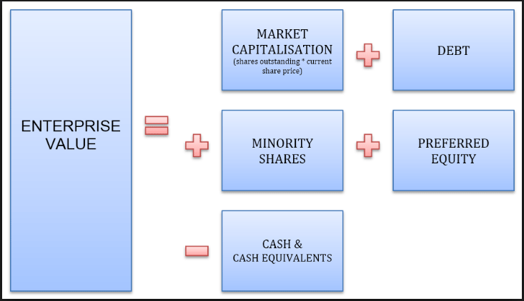

## Table of Contents

## What is enterprise value (EV)?

Enterprise value (EV) is a measure used to figure out how much a company is worth. It's like the total price tag if someone wanted to buy the whole business. EV takes into account not just the value of the company's stock, but also its debts and cash. To calculate it, you start with the market value of all the company's shares, then add any money the company owes (like loans and bonds), and finally subtract the cash the company has on hand.

Think of EV as a way to see the full picture of a company's value. It's useful because it shows what it would really cost to take over the company, including paying off its debts. Investors and analysts use EV to compare companies, especially when looking at potential buyouts or mergers. It helps them understand if a company is a good deal or not, by considering all the financial pieces that come with it.

## What is market capitalization (market cap)?

Market capitalization, or market cap, is the total value of all a company's shares of stock. It's calculated by taking the current stock price and multiplying it by the total number of shares that are out there. So, if a company has 1 million shares and each share is worth $50, the market cap would be $50 million. This number gives investors a quick way to see how big a company is in terms of its value on the stock market.

Market cap is important because it helps people compare companies. A bigger market cap usually means a company is larger and might be more stable, but it doesn't tell the whole story. It doesn't include debts or cash the company has, which is why it's different from enterprise value. Still, market cap is a handy tool for investors to get a sense of a company's size and how it's doing compared to others in the market.

## How is enterprise value calculated?

Enterprise value, or EV, is a way to figure out the total value of a company if someone wanted to buy it. It's like the price tag for taking over the whole business. To calculate EV, you start with the market capitalization, which is the total value of all the company's shares. Then, you add any money the company owes, like loans and bonds. This part is important because if you buy the company, you also have to take on its debts. Finally, you subtract the cash the company has on hand. This makes sense because if you buy the company, you get to keep its cash, which reduces the total cost.

So, the formula for enterprise value is: Market Capitalization + Debt - Cash. This gives you a complete picture of what it would cost to buy the company, including all its financial responsibilities and assets. EV is useful for investors and analysts because it helps them compare companies more accurately, especially when thinking about buying one company with another. It shows the real cost of taking over a business, not just the value of its stock.

## How is market capitalization calculated?

Market capitalization, or market cap, is the total value of all the shares of a company's stock. You calculate it by taking the current price of one share and multiplying it by the total number of shares that exist. So, if a company has 1 million shares and each share is worth $50, the market cap would be $50 million.

This number is useful because it gives investors a quick way to see how big a company is in terms of its value on the stock market. A bigger market cap usually means a company is larger and might be more stable. But remember, market cap doesn't include things like the company's debts or the cash it has, so it's different from the enterprise value. Still, it's a handy tool for comparing companies and understanding their size in the market.

## Why might enterprise value be a better indicator of a company's value than market capitalization?

Enterprise value (EV) might be a better indicator of a company's value than market capitalization (market cap) because it gives a fuller picture of what it would cost to buy the whole company. Market cap only shows the value of the company's shares, but EV also includes the company's debts and subtracts its cash. This means EV shows the real cost of taking over a business, including all its financial responsibilities and assets. If someone wants to buy a company, they need to know about the debts they'll have to pay and the cash they'll get, not just the price of the shares.

For example, two companies might have the same market cap, but one might have a lot of debt and little cash, while the other has less debt and more cash. The EV would show that these companies are not the same value to a buyer, even though their market caps are the same. This makes EV a more useful tool for investors and analysts who are looking at potential buyouts or mergers. It helps them see the full financial picture and make better decisions about the true value of a company.

## What components are included in enterprise value that are not in market capitalization?

Enterprise value includes some things that market capitalization does not. Market capitalization is just the total value of all the company's shares, calculated by multiplying the current stock price by the number of shares. But enterprise value goes further. It adds the company's debts to the market capitalization. This means it includes money the company owes, like loans and bonds. If someone wants to buy the company, they have to take on these debts too, so it's important to include them in the total value.

Enterprise value also subtracts the cash the company has on hand. This makes sense because if you buy the company, you get to keep its cash, which reduces the total cost of the purchase. So, enterprise value gives a more complete picture of what it would really cost to take over the whole business. It shows the full financial situation, including debts and cash, which market capitalization does not. This makes enterprise value a better tool for understanding the true value of a company, especially when thinking about buying it.

## How do debt and cash affect the difference between enterprise value and market capitalization?

Debt and cash are the main reasons why enterprise value (EV) and market capitalization (market cap) are different. Market cap is just the total value of all the company's shares, which you get by multiplying the stock price by the number of shares. But EV adds the company's debt to this number. Debt is money the company owes, like loans or bonds. If someone wants to buy the company, they have to take on this debt too, so it's important to include it in the total value.

On the other hand, EV subtracts the cash the company has on hand. Cash is money the company can use right away. If you buy the company, you get to keep this cash, which makes the total cost of buying the company less. So, EV gives a fuller picture of what it would really cost to take over the whole business. It shows the full financial situation, including debts and cash, which market cap does not. This makes EV a better tool for understanding the true value of a company, especially when thinking about buying it.

## Can you provide an example of a company where enterprise value and market capitalization significantly differ?

Let's talk about a company called XYZ Corp. Imagine XYZ Corp has a market capitalization of $100 million. This means if you just look at the value of all its shares, the company is worth $100 million. But, XYZ Corp also has a lot of debt. Let's say it owes $50 million in loans and bonds. On top of that, XYZ Corp has $10 million in cash sitting in its bank account.

When you calculate the enterprise value of XYZ Corp, you start with the market cap of $100 million, add the $50 million in debt, and then subtract the $10 million in cash. This gives you an enterprise value of $140 million ($100 million + $50 million - $10 million). So, even though the market cap is $100 million, the enterprise value is much higher at $140 million. This big difference shows that if someone wanted to buy XYZ Corp, they would have to pay a lot more than just the value of the shares because they would also have to take on the company's debt, but they would get to keep the cash.

## How do investors use enterprise value and market capitalization in valuation models?

Investors use enterprise value (EV) and market capitalization (market cap) to help them figure out how much a company is worth. Market cap is the total value of all the company's shares, which is easy to calculate and gives a quick idea of a company's size. But it doesn't tell the whole story because it doesn't include the company's debts or cash. That's why investors also use EV. EV adds the company's debt to the market cap and subtracts its cash, giving a more complete picture of what it would really cost to buy the whole business. This makes EV a better tool for understanding a company's true value, especially when thinking about buying it or comparing it to other companies.

For example, when investors are looking at a company to buy, they might start with the market cap to get a basic idea of its value. But to make a smart decision, they need to look at the EV too. If a company has a lot of debt, its EV will be much higher than its market cap, showing that it would be more expensive to buy than the share price alone suggests. On the other hand, if a company has a lot of cash, its EV will be lower than its market cap, making it a potentially better deal. By using both EV and market cap, investors can get a fuller understanding of a company's financial situation and make more informed decisions about its value.

## What are the limitations of using enterprise value compared to market capitalization?

Using enterprise value (EV) has some limitations compared to market capitalization (market cap). One big limitation is that EV can be harder to calculate. You need to know not just the value of the company's shares, but also how much debt the company has and how much cash it has. This information can be tricky to find, especially for smaller companies that don't share as much financial information. So, while EV gives a more complete picture of a company's value, it's not always easy to figure out.

Another limitation is that EV might not be as useful for all types of investors. For example, if an investor is just buying shares and not planning to buy the whole company, market cap might be more relevant. Market cap is simpler and gives a quick idea of a company's size. EV, on the other hand, is more about what it would cost to take over the whole business, which isn't what every investor is interested in. So, while EV is great for understanding a company's true value for buyouts or mergers, it might not be as helpful for everyone.

## How does the industry sector influence the relevance of enterprise value versus market capitalization?

The industry sector can make enterprise value (EV) more or less important compared to market capitalization (market cap). In industries like telecom or utilities, companies often have a lot of debt because they need to spend a lot of money on things like networks or power plants. For these companies, EV is really important because it shows the full cost of buying the business, including all that debt. Investors who are thinking about buying a telecom or utility company need to look at EV to understand the true value of the company.

In other industries, like tech or consumer goods, companies might have less debt and more cash. For these companies, market cap might be a good enough way to see their value. If a company has a lot of cash, EV might be lower than market cap, which can make the company look like a better deal. But, if an investor is just buying shares and not the whole company, market cap might be all they need to know. So, the industry a company is in can change how useful EV and market cap are for understanding its value.

## What advanced metrics can be derived from enterprise value and market capitalization for deeper financial analysis?

From enterprise value and market capitalization, investors can derive advanced metrics like the EV/EBITDA ratio and the price-to-earnings (P/E) ratio. The EV/EBITDA ratio compares a company's enterprise value to its earnings before interest, taxes, depreciation, and amortization. This ratio helps investors see if a company is a good deal by comparing its value to its earnings, without the effects of how it's financed or its accounting decisions. A lower EV/EBITDA ratio might mean the company is undervalued, making it a potentially good investment. On the other hand, the P/E ratio compares the market capitalization to the company's net income. It shows how much investors are willing to pay for each dollar of earnings, which can help compare companies in the same industry.

Another useful metric is the EV/Sales ratio, which compares enterprise value to the company's total sales. This ratio is helpful because it looks at the company's value in terms of its revenue, which can be easier to predict than earnings. A lower EV/Sales ratio might suggest that the company is undervalued based on its sales performance. Additionally, the EV/FCF (Free Cash Flow) ratio compares enterprise value to the cash a company generates after accounting for capital expenditures. This ratio is important because it shows how much a company's value is based on its ability to generate cash, which is crucial for long-term growth and stability. By using these metrics, investors can get a deeper understanding of a company's financial health and potential investment value.

## What is Understanding Enterprise Value?

Enterprise Value (EV) is a comprehensive metric used to evaluate a company's total value, encompassing more than just its market capitalization. It accounts for a firm's complete financial structure, including equity, debt, and cash reserves. This metric is particularly valuable because it offers a holistic view of a company's financial obligations and accessible resources, unlike market capitalization, which focuses solely on equity.

To calculate enterprise value, the formula typically used is:

$$
\text{EV} = \text{Market Capitalization} + \text{Total Debt} + \text{Minority Interest} + \text{Preferred Equity} - \text{Cash and Cash Equivalents}
$$

Each component of this formula plays a critical role in the assessment:

1. **Market Capitalization**: This is the total market value of a company's outstanding shares and serves as the foundational component of enterprise value.

2. **Total Debt**: This includes current and non-current portions of a company's obligations and is crucial for understanding the firm's leverage.

3. **Minority Interest**: The portion of subsidiaries not owned by the parent company is taken into account to reflect the comprehensive ownership stakes.

4. **Preferred Equity**: Preferred shares often have different terms compared to common equity, such as fixed dividends, and must be considered in assessing the company's total value.

5. **Cash and Cash Equivalents**: These assets are subtracted because they represent resources readily available to satisfy obligations, thus reducing the net value of external claims on the company.

Analyzing enterprise value provides investors with insights that can determine whether a company is undervalued or overvalued, transcending the limitations of stock price evaluations. Such analysis is indispensable for understanding a company's true profitability and growth potential.

The utility of enterprise value extends beyond surface-level evaluations by facilitating comparisons between companies with different financial structures. It enables investors to assess how well a firm can service its debt and meet financial obligations while considering potential investment returns after accounting for liabilities.

Understanding EV is critical in scenarios such as mergers and acquisitions, where buyers aim to acquire a company's entire interest, including its debt obligations. Mastering this metric can significantly enhance strategic investment decisions and financial forecasting.

## What is Dissecting Market Capitalization?

Market capitalization represents the total market value of a company’s outstanding shares of stock. It is a straightforward calculation, determined by multiplying the current share price by the total number of outstanding shares:

$$
\text{Market Capitalization} = \text{Share Price} \times \text{Number of Outstanding Shares}
$$

This measure provides investors and analysts with a quick snapshot of a company's size, effectively serving as a starting point for evaluating its market position and competitive landscape.

Market capitalization is often used to classify companies into different tiers. These commonly include small-cap, mid-cap, and large-cap categories:

- **Small-cap companies** are generally defined as companies with a market capitalization of between $300 million and $2 billion. These firms may offer substantial growth potential, but they also pose higher risks compared to larger corporations.

- **Mid-cap companies** have market capitalizations ranging from $2 billion to $10 billion. These companies are perceived as having a balanced risk-reward profile, often exhibiting potential for growth with relatively less risk than small-cap companies.

- **Large-cap companies** boast market capitalizations of $10 billion or more. They are typically well-established entities, providing stability and predictable returns, albeit with potentially lower growth rates than smaller companies.

While market capitalization offers an accessible metric for evaluating a company’s scale and market prominence, its simplicity also serves as a limitation. Specifically, it focuses solely on stock equity, failing to account for other financial factors like debt obligations and cash reserves. Consequently, market capitalization may overlook broader financial nuances that could be captured through other metrics, such as enterprise value.

In summary, market capitalization remains a fundamental tool in financial analysis, assisting investors in categorizing companies and assessing their market position. However, it does not encompass the full spectrum of a company’s financial circumstances, prompting the need for a more nuanced approach when making comprehensive investment decisions.

## References & Further Reading

[1]: ["Valuation: Measuring and Managing the Value of Companies"](https://www.mckinsey.com/capabilities/strategy-and-corporate-finance/our-insights/valuation-measuring-and-managing-the-value-of-companies) by McKinsey & Company Inc., Tim Koller, Marc Goedhart, David Wessels

[2]: ["Algorithmic Trading and DMA: An Introduction to Direct Access Trading Strategies"](https://archive.org/details/algorithmictradi0000john) by Barry Johnson

[3]: Rachev, S. T., Mittnik, S., Fabozzi, F. J., Focardi, S. M., & Jasic, T. (2007). ["Financial Econometrics: From Basics to Advanced Modeling Techniques."](https://www.wiley.com/en-us/Financial+Econometrics%3A+From+Basics+to+Advanced+Modeling+Techniques+-p-9780471784500) Wiley.

[4]: Hasbrouck, J. (2007). ["Empirical Market Microstructure: The Institutions, Economics, and Econometrics of Securities Trading."](https://academic.oup.com/book/52241) Oxford University Press.

[5]: Narang, R. K. (2013). ["Inside the Black Box: A Simple Guide to Quantitative and High Frequency Trading"](https://onlinelibrary.wiley.com/doi/book/10.1002/9781118662717) Wiley.