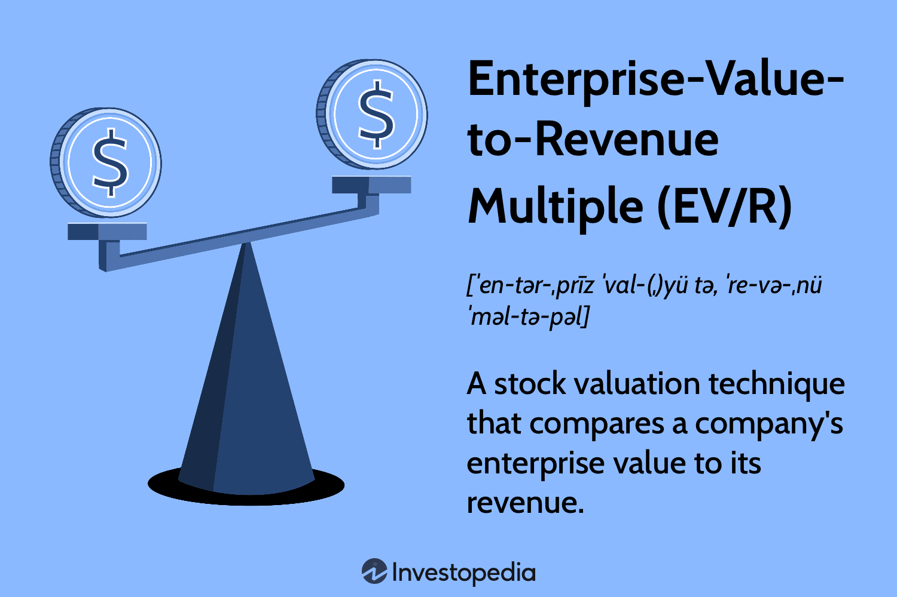

The enterprise value-to-revenue (EV/R) multiple is a pivotal financial metric utilized in assessing company valuations, offering substantial benefits in algorithmic trading. This metric gauges a company's valuation by comparing its enterprise value (EV) to its revenue, thus providing a clear perspective on stock value irrespective of profitability. Such insights are invaluable in valuing companies that have yet to achieve profitability, particularly startups or enterprises in high-growth sectors where traditional profit metrics may not apply.

This article investigates the importance of the EV/R multiple in market analysis and algorithmic trading strategies. Calculating EV/R involves dividing a company's enterprise value by its revenue, a straightforward formula that supplies traders with essential data for stock evaluations:



$$
\text{EV/R} = \frac{\text{Enterprise Value}}{\text{Revenue}}
$$

The article emphasizes the multilayered significance of EV/R across different industries, highlighting both its advantages and limitations. As a neutral metric, EV/R focuses on the 'top line' revenue aspect, thereby avoiding the complexities associated with earnings or book value, making it particularly useful for algorithmic traders seeking straightforward valuation comparisons.

By the conclusion of this article, traders and investors will grasp how to incorporate the EV/R multiple effectively to develop profitable trading algorithms. This understanding will drive competitive advantages in various market situations, particularly as algorithmic trading continues to evolve with technological advancements in fintech.

Understanding the foundation and application of EV/R is crucial for integrating it into sophisticated algorithmic trading models. Its role extends beyond simple valuations, providing a robust metric for assessing potential trading opportunities and refining stock evaluations.

## Table of Contents

## What is the Enterprise Value-to-Revenue Multiple?

The enterprise value-to-revenue (EV/R) multiple is an essential financial metric utilized primarily in evaluating a company's stock value, regardless of its profitability. Unlike other valuation metrics that emphasize earnings or book value, EV/R focuses on the top line, or revenue, making it particularly relevant for analysts assessing startups and entities within high-growth sectors. This attribute serves as a decisive advantage in scenarios where companies might not yet be profitable but demonstrate potential through strong revenue streams.

The calculation of the EV/R multiple involves two primary components: enterprise value (EV) and revenue. Enterprise value is a comprehensive measure of a company's total value, often considered more accurate than market capitalization alone. The formula for EV is as follows:

$$
\text{EV} = \text{Market Capitalization} + \text{Total Debt} - \text{Cash and Cash Equivalents}
$$

1. **Market Capitalization**: This is the total market value of a company's outstanding shares and is calculated by multiplying the current stock price by the total number of outstanding shares.

2. **Total Debt**: This includes all of a company's short-term and long-term debt obligations.

3. **Cash and Cash Equivalents**: These are the company's liquid assets, which can reduce the enterprise value when subtracted, as they represent funds readily available to the company.

Revenue, on the other hand, is the total income generated by the company from its business activities over a specified period. This financial figure does not account for expenses and provides a pure measure of a company's ability to generate sales.

The EV/R multiple is calculated using the formula:

$$
\text{EV/R} = \frac{\text{Enterprise Value}}{\text{Revenue}}
$$

For algorithmic traders, understanding this metric is crucial as it allows the evaluation of a company's potential by comparing its market position and valuation relative to its sales performance. The EV/R multiple can serve as a reliable tool across industries, offering insights that are not affected by varying profit margins or accounting policies. This makes it a versatile metric, particularly in valuations and strategic financial assessments. However, while EV/R provides strong indications about a company's revenue-driven market standing, traders and financial analysts might consider it alongside other metrics for a thorough evaluation, especially when examining cross-industry differences.

## Calculating the Enterprise Value-to-Revenue Multiple

The Enterprise Value-to-Revenue (EV/R) multiple is calculated using the formula:

$$
\text{EV/R} = \frac{\text{Enterprise Value (EV)}}{\text{Revenue}}
$$

To determine the Enterprise Value (EV), one must first gather several data components including market capitalization, total debt, preferred equity, and cash equivalents. Here is a step-by-step guide on how this data is collected and used:

1. **Market Capitalization**: This is calculated by multiplying the current share price by the total number of outstanding shares. This data is readily available on most financial platforms and represents the equity value of a company.

2. **Total Debt**: This figure encompasses both short-term and long-term liabilities. These values are typically found on a company's balance sheet under liabilities.

3. **Preferred Equity**: In some cases, companies issue preferred shares which need to be accounted for separately from regular shares. This figure is also available in the equity section of the balance sheet.

4. **Cash and Cash Equivalents**: This is the total liquid assets that a company can quickly access. These resources are listed on the balance sheet under current assets.

The formula for calculating Enterprise Value (EV) is thus:

$$
\text{EV} = \text{Market Capitalization} + \text{Total Debt} + \text{Preferred Equity} - \text{Cash and Cash Equivalents}
$$

Once the EV is calculated, it is divided by the company's revenue to obtain the EV/R multiple. Revenue can be sourced from a company's income statement, often referred to as the "top line", and represents the total sales income without accounting for expenses.

**Example Calculation**:

Consider a company with the following financial data:
- Market Capitalization: \$100 billion
- Total Debt: \$20 billion
- Preferred Equity: \$5 billion
- Cash and Cash Equivalents: \$10 billion
- Revenue: \$150 billion

Calculating the EV:

$$
\text{EV} = \$100 \text{ billion} + \$20 \text{ billion} + \$5 \text{ billion} - \$10 \text{ billion} = \$115 \text{ billion}
$$

Then, the EV/R ratio is:

$$
\text{EV/R} = \frac{\$115 \text{ billion}}{\$150 \text{ billion}} = 0.767
$$

**Comparative Analysis**:

When applied to real-world companies, such as Amazon or Walmart, the EV/R multiple offers insight into how the market values their revenue streams. For instance, Amazon, known for thin profit margins but high revenue, might exhibit a relatively high EV/R multiple, reflecting investor optimism about future growth. In contrast, Walmart, with more stable earnings and growth, may have a lower EV/R, reflecting its established market position and lesser emphasis on rapid expansion. Investors can use these multiples to guide decisions on whether to buy, sell, or hold shares, integrating the data into broader [algorithmic trading](/wiki/algorithmic-trading) strategies for optimal asset selection.

## Applications of EV/R in Algorithmic Trading

The enterprise value-to-revenue (EV/R) multiple is increasingly utilized in algorithmic trading to establish comparative valuations across various industries. This metric enables identification of stocks that may be undervalued or overvalued based on their revenue generation, offering a distinct perspective apart from traditional profitability measures.

### Role in Algorithmic Trading
Algorithmic traders harness EV/R within their trading algorithms to make informed buy or sell decisions. The process usually involves collecting data on enterprise value and revenue for multiple companies and calculating the EV/R ratio for each. This data can then be used to rank companies, identify outliers, or set thresholds for executing trades. For instance, an algorithm could be programmed to purchase stocks when the EV/R falls below a certain threshold, indicating potential undervaluation.

### Integration with Predictive Models
EV/R is also valuable when integrated into predictive models and [machine learning](/wiki/machine-learning) frameworks. Algorithms can be trained using historical EV/R data alongside other financial indicators to predict future stock price movements. Machine learning models can identify patterns in how certain EV/R levels correlate with price increases or decreases, thus enabling more accurate trading strategies.

```python
import pandas as pd
from sklearn.model_selection import train_test_split
from sklearn.ensemble import RandomForestRegressor

# Sample data preparation
data = pd.read_csv('historical_stock_data.csv')  # Sample CSV file with company financials
X = data[['EV', 'Revenue', 'Other_Metrics']]  # Feature set including EV and Revenue
y = data['Stock_Price']  # Target variable

# Splitting the data
X_train, X_test, y_train, y_test = train_test_split(X, y, test_size=0.2, random_state=42)

# Model training
model = RandomForestRegressor()
model.fit(X_train, y_train)

# Predicting future stock prices
predictions = model.predict(X_test)
```

### Stability in Volatile Markets
In volatile market conditions, focusing on revenue rather than earnings makes EV/R a sturdy metric for guiding trading decisions. This is particularly important for high-growth or tech sectors, where revenue growth is often prioritized over immediate profitability. Companies in these sectors might have irregular earnings yet demonstrate strong revenue increases, making EV/R a key tool for evaluating their true market potential.

In conclusion, the strategic use of EV/R in algorithmic trading lies in its ability to assess revenue-oriented valuations systematically. By embedding EV/R into trading algorithms, integrating it with machine learning models, and leveraging its stability in volatile markets, traders can make more nuanced and data-driven financial decisions.

## Advantages and Limitations of EV/R

The enterprise value-to-revenue (EV/R) multiple offers several advantages when used in algorithmic trading. Its simplicity allows traders to quickly assess a company's valuation without the complexities of more nuanced metrics. This straightforward approach is beneficial in automated trading strategies where rapid decision-making is essential. EV/R focuses primarily on revenue, disregarding profitability metrics, which can be advantageous when evaluating companies in high-growth sectors that may not yet be profitable. This emphasis on revenue helps maintain stability, especially in volatile markets prevalent in industries like technology.

EV/R’s ability to facilitate cross-company comparisons enhances its utility. By standardizing the enterprise value against revenue, traders can compare companies of different sizes and across various markets, identifying potential investment opportunities that might go unnoticed with other financial ratios.

However, the EV/R multiple is not without limitations. Its primary drawback is the lack of consideration given to a company's profitability. Focusing solely on revenue might overlook underlying issues in profit margins or cost management, leading to potential misrepresentations of financial health. This limitation is particularly problematic when comparing companies across different industries, where profit structures can significantly vary. For example, a company in a sector with typically high operating costs might appear more attractive when evaluated only on revenue, missing critical nuances related to its overall financial performance.

To counterbalance EV/R's limitations, it is prudent to integrate this metric with other financial ratios, such as EV/EBITDA or the Price-to-Earnings (P/E) ratio. Combining EV/R with these metrics can provide a more comprehensive view of a company's financial standing. For instance, while EV/R might highlight a revenue trend, the P/E ratio could offer insights into profitability, and EV/EBITDA can indicate operational efficiency.

When developing a comprehensive trading strategy, traders should consider not only the EV/R but also its integration with other financial metrics to ensure a holistic analysis. This combined approach enables traders to make well-rounded investment decisions, leveraging the strengths of multiple financial metrics to mitigate the inherent weaknesses of relying solely on one.

## Comparative Financial Metrics in Algorithmic Trading

In algorithmic trading, financial metrics like the Enterprise Value-to-Revenue (EV/R) multiple, Enterprise Value-to-EBITDA (EV/EBITDA), and Price-to-Earnings (P/E) ratio play critical roles in developing effective trading models. Each metric provides unique insights, and understanding their comparative advantages enhances decision-making in trading algorithms.

EV/R is particularly useful for evaluating companies that are in high-growth industries or are not yet profitable, as it prioritizes revenue generation over profitability. Unlike the EV/EBITDA and P/E ratios, which require positive earnings or EBITDA for meaningful analysis, EV/R can be applied to companies regardless of their profit margins, since it only relies on revenue figures. This distinction is crucial in scenarios involving startups or tech firms that invest heavily in growth over immediate profitability.

The EV/EBITDA ratio, on the other hand, provides insights into a company's operational efficiency by comparing value relative to earnings before interest, taxes, depreciation, and amortization. This measure is beneficial for assessing mature companies with stable cash flows, where operating performance is more indicative of long-term potential.

The P/E ratio is a widely used metric, giving insights into how much investors are willing to pay per dollar of earnings. It is best suited for mature companies with consistent earnings, providing a snapshot of market sentiment related to growth expectations.

In specific trading scenarios, EV/R can outperform other ratios. For instance, in volatile markets where earnings might be erratically influenced by macroeconomic factors, EV/R offers a more stable valuation approach by concentrating on revenue. This revenue-centric focus is valuable for high-growth sectors where companies typically prioritize scaling over profitability.

Additionally, incorporating EV/R in algorithmic trading models alongside other financial ratios contributes to a robust analytical framework. By combining various metrics, traders can form a holistic view of stock valuation. For example, a multi-[factor](/wiki/factor-investing) model may use EV/R to identify revenue growth potential, while deploying EV/EBITDA to assess operational efficiency, and P/E to gauge market sentiment. This integrated approach allows algorithms to adjust strategies dynamically based on different market conditions, supporting optimized buy or sell signals.

In conclusion, while EV/R offers unique advantages in certain contexts, combining it with other financial ratios enhances the robustness of algorithmic trading models. By leveraging the strengths of each metric, traders can build sophisticated algorithms capable of navigating diverse market landscapes effectively.

## Real-World Examples and Case Studies

Case studies on how major corporations utilize the enterprise value-to-revenue (EV/R) multiple in strategic valuations and acquisitions provide valuable insights into the practical application of this financial metric. Companies such as Amazon and Netflix, known for their focus on revenue growth over immediate profitability, have been assessed using EV/R to better understand their valuation in various acquisition bids and strategic investments. For instance, during the evaluation of potential acquisition targets, large corporations often leverage the EV/R metric to determine whether a company is an attractive buy relative to its revenue. This is crucial in industries characterized by rapid growth and innovation, like technology and e-commerce, where traditional profit-based metrics may not fully capture a company's future potential.

In the context of algorithmic trading, EV/R serves as a notable tool for crafting strategies aimed at predicting price movements or identifying market inefficiencies. For instance, algorithmic systems developed by quantitative hedge funds may apply EV/R within their models to screen for stocks that appear undervalued compared to their revenue generation capability. By analyzing a vast array of financial data, these algorithms can identify discrepancies between a company's market price and its revenue-derived valuation, flagging opportunities for potential trades.

Python remains a favored language for implementing such algorithms due to its extensive libraries for data analysis and machine learning. Here's a simplified Python example illustrating how an algorithm might utilize the EV/R metric:

```python
import pandas as pd

# Sample DataFrame where 'EnterpriseValue' and 'Revenue' columns exist
data = pd.DataFrame({
    'Company': ['A', 'B', 'C'],
    'EnterpriseValue': [1000, 1500, 2000],
    'Revenue': [200, 250, 400]
})

# Calculate EV/R
data['EV/R'] = data['EnterpriseValue'] / data['Revenue']

# Simple trading signal: Buy if EV/R < threshold (indicating undervaluation)
threshold = 6
data['Signal'] = data['EV/R'].apply(lambda x: 'Buy' if x < threshold else 'Hold')

print(data[['Company', 'EV/R', 'Signal']])
```

Such simplified logic can be foundational in more sophisticated trading strategies, where EV/R is part of a multifaceted algorithmic model that includes other financial ratios and market indicators.

Insights from successful trading algorithms that integrate EV/R reflect its utility as a core component, particularly in sectors where revenue growth is a key indicator of potential stock performance. By focusing on revenue rather than profit, these algorithms can maintain relevance and accuracy in volatile markets, providing a competitive edge through nuanced market analysis. As financial technology continues to evolve, the role of EV/R in automated trading is likely to expand, enhancing the ability of traders to make informed and timely decisions.

## Conclusion

The enterprise value-to-revenue (EV/R) multiple emerges as a powerful tool in algorithmic trading, providing traders with a robust framework to evaluate companies irrespective of their profitability status. Its utility in algorithmic trading stems from its simplicity and its focus on the stability of revenue, allowing traders to navigate volatile markets with a revenue-centered lens. By focusing on the revenue aspect, traders can efficiently develop strategies that highlight discrepancies between a company's revenue performance and market valuation, thus identifying potential overvaluations or undervaluations.

The integration of EV/R into trading algorithms enables more informed decision-making. Traders can leverage this metric to construct comparative analyses across industries, thus identifying mispriced stocks that may not be apparent through traditional profit-based metrics. The inherent stability offered by the EV/R multiple is particularly beneficial in high-growth sectors, like technology, where profitability might be less predictable but revenue can offer insights into future growth potential.

Looking towards the future, the landscape of automated trading is continuously shaped by technological advancements in fintech. The increasing sophistication of machine learning and [artificial intelligence](/wiki/ai-artificial-intelligence) can be expected to enhance the application of EV/R. These technologies can harness vast datasets to refine trading algorithms that utilize EV/R, improving their predictive capabilities and ultimately offering traders an edge in market dynamics. Python, with its powerful data analysis libraries such as pandas and scikit-learn, presents a useful toolkit for implementing such strategies, allowing traders to efficiently compute and analyze EV/R metrics.

As fintech evolves, the role of EV/R will likely expand, integrating deeper into automated systems that seamlessly combine various financial metrics to predict market movements. This trend signifies a future where the EV/R multiple not only complements other valuation measures but stands as a decisive component in the toolkit of quantitative traders, enabling them to exploit market inefficiencies with greater precision and agility.

## References & Further Reading

[1]: Damodaran, A. (2007). ["Valuation Approaches and Metrics: A Survey of the Theory and Evidence."](https://people.stern.nyu.edu/adamodar/pdfiles/papers/valuesurvey.pdf) *SSRN Electronic Journal*.

[2]: ["Investment Valuation: Tools and Techniques for Determining the Value of Any Asset"](https://archive.org/details/investmentvaluat0000damo_n6k9) by Aswath Damodaran

[3]: ["Financial Modeling"](https://en.wikipedia.org/wiki/Financial_modeling) by Simon Benninga

[4]: ["Algorithmic and High-Frequency Trading"](https://www.amazon.com/Algorithmic-High-Frequency-Trading-Mathematics-Finance/dp/1107091144) by Álvaro Cartea, Sebastian Jaimungal, and José Penalva

[5]: ["Python for Finance: Analyze Big Financial Data"](https://books.google.com/books/about/Python_for_Finance.html?id=E93SBQAAQBAJ) by Yves Hilpisch