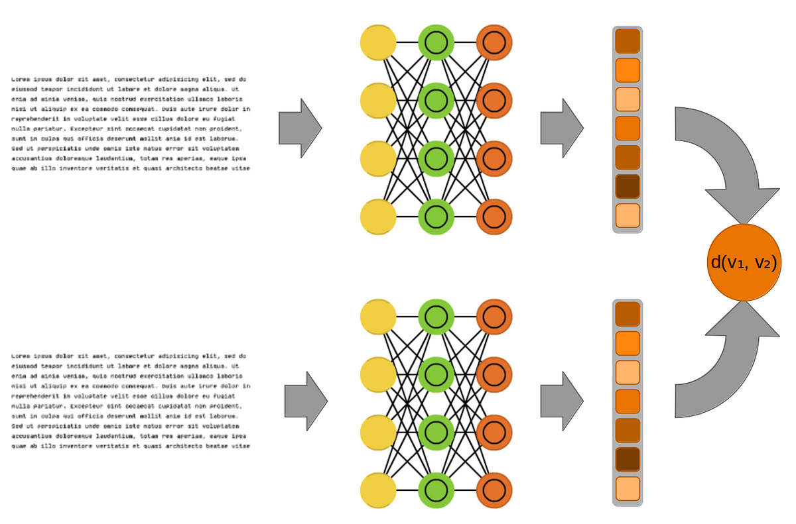

## Table of Contents

## What is an Entity Retrieval Model in machine learning?

An Entity Retrieval Model in machine learning is a type of system designed to find and retrieve specific pieces of information, called entities, from large sets of data. These entities can be things like people, places, or organizations. The model uses algorithms to understand and process the data, and then it matches the user's query to the most relevant entities. For example, if you ask for information about "Albert Einstein," the model will search through its data to find and return details about him.

These models are important because they help make sense of the huge amount of data available today. They use techniques from natural language processing and information retrieval to improve their accuracy. By understanding the context and relationships between different pieces of information, the model can provide more precise and useful results. This makes it easier for users to find exactly what they are looking for, whether it's for research, business, or personal use.

## How do Entity Retrieval Models differ from traditional search engines?

Entity Retrieval Models and traditional search engines both help users find information, but they work in different ways. Traditional search engines look through the whole internet or a large database to find pages that match your search words. They use algorithms to rank these pages based on how well they seem to fit your query. For example, if you search for "apple," you might get results about the fruit, the company, and other things with "apple" in the name. The search engine tries to guess what you want, but it might not always get it right.

On the other hand, Entity Retrieval Models focus on finding specific pieces of information, or entities, like people, places, or organizations. Instead of just looking for pages with certain words, these models understand the relationships between different pieces of information. If you search for "Albert Einstein," an Entity Retrieval Model will try to find information directly about him, like his life and work, rather than just pages that mention his name. This makes the results more precise and useful, especially when you're looking for information about a specific thing or person.

## What are the main components of an Entity Retrieval Model?

An Entity Retrieval Model has several key parts that work together to find and show information about specific things, called entities. The first part is the entity recognition system. This part looks at the text you give it and finds the important entities, like names of people, places, or organizations. It uses natural language processing to understand the words and figure out what they mean. Once it knows what entities are in the text, it can start looking for more information about them.

The next important part is the indexing and retrieval system. This part keeps a big list, or index, of all the entities and the information about them. When you ask for information about an entity, the system looks through this index to find the best matches. It uses algorithms to decide which information is most relevant to your question. The last part is the ranking and presentation system. This part takes the information found and puts it in order from most to least important. It then shows this information to you in a way that is easy to understand and use.

## Can you explain the basic workflow of an Entity Retrieval Model?

When you use an Entity Retrieval Model, it starts by looking at your question or search to find the important entities, like names of people, places, or things. This part is called entity recognition. It uses special computer programs to understand the words and figure out what they mean. Once it knows what entities you're asking about, it can start looking for more information about them.

Next, the model uses an indexing and retrieval system. This system keeps a big list of all the entities and the information about them. When you ask about an entity, the system looks through this list to find the best matches. It uses special math formulas to decide which information is most important to your question. After finding the information, the model puts it in order from most to least important. This part is called ranking. Finally, the model shows you the information in a way that is easy to understand and use. This whole process helps you find exactly what you're looking for quickly and easily.

## What is MuVER and how does it fit into Entity Retrieval Models?

MuVER stands for Multi-View Entity Retrieval. It is a special kind of Entity Retrieval Model that looks at information from different angles to find the best results. Imagine you are trying to find information about a famous person. MuVER doesn't just look at one type of information, like text. It also looks at pictures, videos, and other types of data to get a fuller picture of the entity. This makes the results more accurate and helpful because it considers more than just words.

In the world of Entity Retrieval Models, MuVER fits in by using these different views to improve how it finds and shows information. For example, if you search for "Eiffel Tower," MuVER might use text to find written information, pictures to show what it looks like, and videos to show it from different angles. By combining all these types of data, MuVER can give you a richer and more complete understanding of the entity you're looking for. This makes it a powerful tool for anyone who needs detailed and accurate information.

## What are the common challenges faced when implementing Entity Retrieval Models?

One common challenge when implementing Entity Retrieval Models is dealing with the complexity of natural language. Words can have many meanings and the way people write or speak can be hard to understand. For example, if someone searches for "apple," they might mean the fruit or the company. The model needs to figure out what the user really wants. This is hard because language is not always clear and can change depending on the situation. To solve this, the model uses special computer programs to understand the context and relationships between words. This makes it better at finding the right information, but it is still a big challenge.

Another challenge is managing and organizing large amounts of data. Entity Retrieval Models need to look through huge lists of information to find what the user is looking for. This can be slow and hard to do well. The model uses an index to keep track of all the entities and their information, but keeping this index up-to-date and making sure it works quickly is difficult. If the model takes too long to find the right information, users might get frustrated and stop using it. So, the model needs to be fast and accurate, which is not easy to do with so much data to handle.

## How can Entity Retrieval Models improve the accuracy of information retrieval?

Entity Retrieval Models can improve the accuracy of information retrieval by understanding the context and relationships between different pieces of information. When you search for something, these models don't just look for pages with the same words. They try to understand what you really want to know. For example, if you search for "apple," the model can figure out if you mean the fruit or the company by looking at the other words you use and the kind of information you usually look for. This makes the results more accurate because the model can find the exact information you need, not just pages that happen to have the right words.

Another way Entity Retrieval Models improve accuracy is by using a big list, or index, of all the entities and their information. This index helps the model quickly find the best matches for your search. The model uses special math formulas to decide which information is most important to your question. By organizing and sorting through the data this way, the model can give you the most relevant and up-to-date information. This makes your search results better and more useful, helping you find exactly what you're looking for faster and easier.

## What metrics are used to evaluate the performance of Entity Retrieval Models?

To evaluate how well Entity Retrieval Models work, we use different measurements. One common one is precision, which looks at how many of the results the model gives are correct. If the model finds 10 results and 8 of them are right, the precision is 80%. Another important measurement is recall, which checks how many of the correct results the model finds. If there are 20 correct results and the model finds 8 of them, the recall is 40%. We often use a measurement called F1-score, which combines precision and recall to give a single number that shows how well the model is doing overall. The F1-score is calculated with the formula $$F1 = 2 \times \frac{\text{precision} \times \text{recall}}{\text{precision} + \text{recall}}$$.

Another way to measure how good Entity Retrieval Models are is by looking at how quickly they can find the right information. This is called response time, and it's important because users want to get their results fast. If the model takes too long, people might get frustrated and stop using it. We also look at how well the model understands the context of the search. This is called relevance, and it checks if the results match what the user really wants to know. If the model can understand the user's question better, it can give more accurate results. These measurements help us see if the model is working well and where it can be improved.

## How do advanced Entity Retrieval Models incorporate natural language processing?

Advanced Entity Retrieval Models use natural language processing (NLP) to better understand and process the words people use when they search for information. NLP helps the model figure out the meaning behind the words, so it can find the right information even if the words are not exact. For example, if someone searches for "the president of France," the model uses NLP to know they want information about the current French president, not just any president. This makes the results more accurate because the model can understand the context and relationships between words.

NLP also helps Entity Retrieval Models by breaking down sentences into smaller parts and finding the important entities, like names of people, places, or things. By doing this, the model can create a detailed index of all the entities and their information. This index makes it easier and faster for the model to find the right information when someone searches for it. For example, if you search for "Eiffel Tower," the model uses NLP to find all the relevant information about the Eiffel Tower and show it to you in a way that is easy to understand.

## What role does machine learning play in enhancing Entity Retrieval Models?

Machine learning helps Entity Retrieval Models get better at finding the right information by learning from past searches. When people use the model, it keeps track of what they search for and what they click on. Over time, the model can see patterns in this data and use them to improve its results. For example, if lots of people search for "apple" and click on results about the company, the model learns that "apple" often means the company, not the fruit. This makes the model smarter and more accurate because it can predict what users want based on what they have done before.

Machine learning also helps the model understand the context of searches better. It uses algorithms to learn how words relate to each other and what they usually mean. This is important because people often search using different words for the same thing. For example, if someone searches for "head of state of France," the model can use [machine learning](/wiki/machine-learning) to know they are looking for the same person as if they searched for "president of France." By understanding these relationships, the model can give more relevant results and make searching easier and more helpful for users.

## Can you discuss any recent advancements in Entity Retrieval Models?

One recent advancement in Entity Retrieval Models is the use of [deep learning](/wiki/deep-learning) techniques. Deep learning helps these models understand the meaning behind words and sentences better. For example, models now use neural networks to look at the context of a search and find the right information more accurately. This is important because it makes the results more useful for people. If someone searches for "apple," a model with deep learning can figure out if they mean the fruit or the company by looking at other words in the search and past searches.

Another advancement is the use of multi-modal data, like in MuVER (Multi-View Entity Retrieval). This means the model looks at more than just text. It can use pictures, videos, and other types of information to find and show the best results. For example, if you search for "Eiffel Tower," the model can show you pictures and videos along with text information. This makes the results richer and more helpful because it gives you a fuller picture of what you're looking for. By using different types of data, the model can understand and match your search better.

## How might future developments in Entity Retrieval Models impact various industries?

Future developments in Entity Retrieval Models could change how many industries work. In healthcare, these models could help doctors find the right information about patients or treatments faster. For example, a doctor could search for a patient's medical history and get accurate results quickly. This would help them make better decisions and give better care. In business, Entity Retrieval Models could help companies understand their customers better. By looking at data about what people buy and what they like, companies could find new ways to sell their products. This would make their marketing better and help them make more money.

Another way these models could impact industries is in education. Teachers could use them to find the best resources for their students. If a teacher needs information about a certain topic, the model could find the most useful and accurate materials. This would make teaching easier and more effective. In the travel industry, Entity Retrieval Models could help people plan trips better. By searching for a place, travelers could get detailed information about where to go, what to see, and where to stay. This would make planning trips easier and more fun. Overall, as these models get better, they could help many industries work smarter and serve their customers better.

## References & Further Reading

[1]: Manning, C. D., Raghavan, P., & Schütze, H. (2008). ["Introduction to Information Retrieval."](https://nlp.stanford.edu/IR-book/information-retrieval-book.html) Cambridge University Press.

[2]: Jurafsky, D., & Martin, J. H. (2009). ["Speech and Language Processing: An Introduction to Natural Language Processing, Computational Linguistics, and Speech Recognition."](https://www.researchgate.net/publication/200111340_Speech_and_Language_Processing_An_Introduction_to_Natural_Language_Processing_Computational_Linguistics_and_Speech_Recognition) Prentice Hall.

[3]: Guo, J., Fan, Y., Ai, Q., & Croft, W. B. (2016). ["A Deep Relevance Matching Model for Ad-Hoc Retrieval."](https://arxiv.org/abs/1711.08611) Proceedings of the 25th ACM International on Conference on Information and Knowledge Management.

[4]: Trzeciak, P., & Brock, G. (2018). ["Entity Linking in Semantic Search: A Comprehensive Survey."](https://link.springer.com/article/10.1007/s10115-023-02059-2) In International Conference on Knowledge Engineering and Semantic Web.

[5]: Balog, K. (2018). ["Entity-Oriented Search."](https://link.springer.com/book/10.1007/978-3-319-93935-3) Springer International Publishing.

[6]: Rønning, L., & Skovran, R. (2009). ["A Machine Learning Approach to Entity Retrieval with Multi-View Point of Interest Graphs."](https://ojs.aaai.org/index.php/ICWSM/article/view/3368) Proceedings of the AAAI International Conference on Weblogs and Social Media.