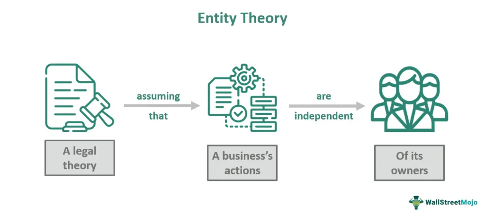

This article explores the intersection between entity theory and algorithmic trading, presenting a framework for understanding financial market dynamics. Entity theory, fundamentally, posits that businesses and financial firms are separate legal entities distinct from their owners. This concept is crucial in financial markets where defining and recognizing various entities, such as individual traders, institutional investors, and regulatory bodies, plays a vital role. In algorithmic trading, these distinctions allow for a structured understanding of market interactions and the corresponding impact on market liquidity, volatility, and efficiency.

The importance of entity theory lies in its ability to categorize and systematically analyze market participants, which is essential given the complexity and rapid pace of modern financial markets. By characterizing entities based on their objectives, resources, and constraints, traders and analysts can better predict behavior patterns, facilitating more informed decision-making. Recognizing these entities also highlights the interconnectedness and interdependencies within financial systems, making it possible to anticipate potential market shifts and responses.



This article sets the stage for a more detailed examination of the mechanisms by which entity theory influences the strategies employed in trading environments. It also addresses criticisms of entity theory, focusing on its implications for algorithmic trading where businesses, treated as autonomous units, interact in complex and strategic ways. Understanding these interactions and characteristics is invaluable for developing more effective algorithms, adhering to regulatory standards, and navigating the complexities inherent in modern financial markets. The following sections will delve deeper into these topics, providing a comprehensive overview of how entity theory facilitates more effective market participation and regulation.

## Table of Contents

## Understanding Entity Theory in Algorithmic Trading

Entity theory asserts that businesses and financial firms function as separate legal and accounting entities from their owners. This framework is fundamental in understanding how entities operate within markets, particularly in the context of algorithmic trading. By categorizing market participants into distinct entities, entity theory helps clarify their roles and the effects they have on market dynamics. 

In algorithmic trading, entities such as financial firms, traders, and other market participants are recognized as separate from the individuals who own or manage them. This distinction is critical for several reasons. Firstly, it facilitates precise identification and categorization of market participants, enhancing the understanding of trading activities and market behaviors. Algorithmic traders, ranging from individual traders to large financial institutions, operate under unique legal and operational structures that are defined by this theory. Each entity's operations, objectives, and constraints can be assessed independently, allowing for more nuanced analyses of market trends and behaviors.

Furthermore, entity theory underscores the importance of separating business and personal assets and liabilities. This separation is vital for the efficient functioning of limited liability businesses, including firms engaged in algorithmic trading. By legally distinguishing the firm as an independent entity, the theory ensures that personal assets of the owners or stakeholders remain protected from business liabilities and vice versa. This legal separation enhances the firm’s ability to take risks and engage in sophisticated trading strategies without exposing personal wealth to market volatility.

Algorithmic traders leverage this legal framework to structure their operations, ensuring compliance with regulatory demands while pursuing market opportunities. By utilizing algorithms that react to market signals, these entities execute trades with speed and precision, operating within the confines of established regulations. The application of entity theory in this context allows for optimization in trade execution and strategic planning, as traders can simulate and predict market behaviors in a structured manner.

In summary, entity theory provides a foundational framework for understanding how various market participants behave and interact in [algorithmic trading](/wiki/algorithmic-trading) environments. It enables a clear demarcation between entity operations and owner involvement, fostering an ecosystem where market dynamics can be analyzed with an understanding of each participant's independent objectives and constraints. This theoretical approach is indispensable for analyzing and predicting market behavior, crucial for both regulatory compliance and strategic decision-making in algorithmic trading.

## Mechanisms of Entity Theory in Financial Markets

Entity theory plays a pivotal role in financial markets by enabling firms to function independently from their owners. This abstraction allows these entities to own assets, incur liabilities, and engage in contractual agreements as standalone entities. Such delineation is crucial for entities like institutional investors and high-frequency traders, who leverage these principles to develop and execute intricate trading strategies.

Institutional investors, such as pension funds, mutual funds, and insurance companies, act as separate entities capable of managing substantial pools of capital. By treating these institutions as distinct entities, they are able to mobilize resources efficiently and perform large-scale transactions that influence market dynamics. The independence afforded by entity theory ensures that the financial activities undertaken by these institutions are aligned with their strategic objectives, while also adhering to legal and regulatory frameworks. This allows for rational economic decision-making, focusing on maximizing returns for their stakeholders.

High-frequency trading ([HFT](/wiki/high-frequency-trading-strategies)) firms utilize entity theory to a greater extent due to their reliance on speed and technology. By operating as independent entities, HFT firms can deploy proprietary algorithms to conduct thousands of trades per second, exploiting minute price discrepancies in the market. These trades are executed based on pre-set strategies designed to capitalize on short-term market inefficiencies. Entity theory supports these operations by allowing firms to isolate trading risks from their owners, thus maintaining the firm's long-term strategic integrity while engaging in high-risk, high-reward activities.

An example of how entity theory aids HFT strategies is evident in the use of statistical [arbitrage](/wiki/arbitrage). This strategy involves the use of mathematical models to identify and exploit relationships between securities. As independent entities, these firms can deploy complex algorithms and leverage vast computing power to analyze large datasets, identifying profit opportunities that human traders might overlook. Python, often used in algorithmic trading due to its extensive libraries like NumPy and pandas, can be employed to implement such strategies. A simple implementation of a mean-reversion strategy might involve calculating a moving average and executing trades based on deviations from this average:

```python
import pandas as pd

# Example data
data = pd.DataFrame({'price': [100, 101, 102, 98, 97, 99, 100, 103]})

# Calculate moving average
data['moving_average'] = data['price'].rolling(window=3).mean()

# Identify trading signals
data['signal'] = 0
data.loc[data['price'] > data['moving_average'], 'signal'] = -1  # Sell signal
data.loc[data['price'] < data['moving_average'], 'signal'] = 1   # Buy signal

print(data)
```

The legal and accounting separation provided by entity theory not only safeguards the interests of firm owners but also fosters a competitive and innovative trading environment. By facilitating independent operation, entity theory encourages diverse trading strategies that contribute to market [liquidity](/wiki/liquidity-risk-premium) and efficiency. This theoretical framework is instrumental in shaping the behaviors and strategies of modern market participants, driving advancements in algorithmic and high-frequency trading methodologies.

## Types of Entities in Financial Markets

In financial markets, the entities engaged in trading activities can be broadly categorized into individual traders, institutional investors, and high-frequency traders. Each of these entities plays a distinct role in shaping market liquidity, [volatility](/wiki/volatility-trading-strategies), and trading dynamics.

### Individual Traders

Individual traders, also known as retail traders, are non-professional investors who buy and sell securities for personal accounts, rather than for another company or organization. These traders typically operate on a smaller scale compared to institutional investors and may utilize various trading strategies, including [day trading](/wiki/day-trading-spy), swing trading, or long-term investing. 

The impact of individual traders on market liquidity and volatility can be significant, particularly during periods of heightened speculation or when a large number of retail traders act in concert, as seen with the rise of social media-driven trading phenomena. Although individual traders often lack the sophisticated tools and resources available to institutional investors, their collective actions can contribute to rapid price movements and increased market volatility.

### Institutional Investors

Institutional investors are entities such as mutual funds, pension funds, insurance companies, and hedge funds, which invest large sums of money on behalf of their clients or beneficiaries. These entities typically have substantial capital at their disposal and access to advanced trading technologies and analytical tools.

Institutional investors significantly influence market liquidity due to the large volumes of assets they manage. Their trading strategies often focus on long-term investment horizons, asset allocation, and risk management, but they can also engage in short-term trading strategies to capitalize on market inefficiencies. The sheer size of their trades can lead to considerable market impact, affecting asset prices and volatility.

### High-Frequency Traders

High-frequency traders (HFTs) are firms that use sophisticated algorithms and cutting-edge technology to execute trades at extremely high speeds, often placing millions of orders per day. HFTs aim to profit from small price discrepancies that exist for very short periods.

These traders contribute to market liquidity by providing continuous buy and sell orders, which can narrow bid-ask spreads and facilitate trade execution for other market participants. However, the presence of HFTs can also exacerbate market volatility, particularly during times of stress, as rapid trading activities can lead to sudden and large price swings.

In summary, each type of market entity—individual traders, institutional investors, and high-frequency traders—plays a unique role in financial markets. Their distinct strategies and behaviors contribute to shaping the overall trading dynamics, affecting liquidity and volatility. Understanding these roles is crucial for comprehending the complexities and interactions within modern financial markets.

## Behavioral Characteristics and Interactions of Entities

Understanding the behavioral characteristics and interactions of various market entities is a vital aspect of assessing the dynamics in algorithmic trading. Different market entities, such as individual traders, institutional investors, and high-frequency traders, operate with distinct objectives, resources, and constraints, shaping their behaviors in trading activities.

Individual traders often participate in the market driven by personal financial goals, risk tolerance, and emotional factors. They typically have fewer resources and constraints compared to larger entities. Consequently, their trading strategies may be less sophisticated and more prone to behavioral biases. These traders can be influenced by market trends, media reports, and psychological factors like fear and greed, often leading to [momentum](/wiki/momentum)-based trading patterns that can introduce volatility into the market.

Institutional investors, such as mutual funds, pension funds, and hedge funds, have access to significant resources and operate under different constraints. They possess a range of objectives, including achieving long-term growth, income generation, and risk management. Institutional investors often employ algorithmic trading strategies designed to optimize their objectives, utilizing vast datasets and employing advanced data analytics. Their behavior tends to focus on efficiency and minimizing transaction costs, with a focus on market liquidity and stability. These entities can influence market movements significantly due to the size of their trades, often leading to smoother transitions in price movements.

High-frequency traders (HFTs) constitute another important category of market entities. Their primary objective is to capitalize on short-term price inefficiencies by executing trades at lightning-fast speeds. HFTs are resource-intensive, relying on cutting-edge technology and sophisticated algorithms to gain microsecond advantages. They contribute to market liquidity but can also increase volatility due to their rapid fire trading activities. These traders often engage in competitive interactions, seeking to outpace each other, which has sparked debates about market fairness and stability.

The interactions between these entities can be competitive, cooperative, or adversarial, each forming an integral part of market dynamics. Competitive interactions are common, with entities striving to outperform one another in the pursuit of profit. This competition can enhance market efficiency but may also lead to increased volatility. Cooperative interactions occur when entities work together, often indirectly, to achieve mutual benefits such as shared liquidity pools or market-making activities.

Adversarial interactions often arise when different entities' interests conflict, such as when high-frequency traders attempt to exploit slow-moving institutional trades. These adversarial dynamics can prompt regulatory scrutiny and lead to changes in market policies, influencing how entities interact in the future. Understanding these interactions is crucial for predicting the overall behavior of the market and developing robust algorithmic trading strategies that account for the diverse objectives and resources across entities. By comprehending these interplay dynamics, algorithmic traders can better anticipate market trends, manage risks, and optimize their trade execution strategies.

## Criticisms of Entity Theory

Critics of entity theory often argue that its fundamental principle—treating businesses and financial entities as separate from their owners—introduces significant agency problems and a sense of detachment from reality. This separation can lead to conflicting interests between owners and managers, known as agency problems. In these scenarios, managers, acting as [agents](/wiki/agents) for the owners, might pursue personal interests rather than those aligning with the owners' goals. Such conflicts can skew decision-making processes and result in inefficiencies that undermine business performance and market stability.

Within algorithmic trading, these agency problems manifest distinctly. Algorithmic trading systems are engineered by developers and operated under the directives of institutional managers, who might prioritize short-term gains over long-term strategies that align with the entity's operational ethos. Consequently, the prioritization of rapid profits could lead to increased market volatility and systemic risks, which contradict the stability objectives of regulatory bodies and long-term investors.

Moreover, the notion of treating businesses as separate legal fictions can detach economic activities from real-world impacts. Critics contend that this abstraction may lead to decisions that neglect broader social and environmental considerations. For instance, an algorithm prioritizing shareholder value might disregard externalities, such as community welfare or environmental sustainability, given its programmed focus on maximizing returns in isolation from broader context.

The legal framework bolstered by entity theory also has its fair share of detractors. These critics argue that limited liability protects individual shareholders and managers from the legal consequences of business actions, potentially fostering a culture of irresponsible risk-taking. This phenomenon can be particularly detrimental within high-frequency trading paradigms, where the fast-paced nature of trades necessitates rigorous risk control measures. The absence of accountability due to the legal distinction between the business and its operators might encourage riskier trading behaviors that could be catastrophic in moments of market distress.

Addressing these concerns, some suggest that the solution lies in better aligning the interests of agents and principals through mechanisms like performance-based compensation or stronger regulatory oversight. By ensuring that managers and traders have vested interests in the long-term success and ethical behavior of the entity, the adverse effects of agency problems might be mitigated.

Additionally, embedding responsibility and accountability into algorithmic trading frameworks could help bridge the gap between the conceptual separation of entity theory and the tangible impacts of financial operations. This alignment may involve integrating ethical considerations and long-term sustainability goals into the design and execution of trading algorithms, ensuring that they reflect a balance between profit maximization and societal obligations.

## Implications for Algorithmic Trading

Entity theory is pivotal in the development of predictive models and trade execution algorithms within algorithmic trading. By perceiving market participants as distinct legal and economic entities, this theory allows traders and developers to craft more targeted and precise trading strategies. One of the primary ways entity theory contributes to algorithmic trading is through the categorization of market actors—such as individual traders and institutional investors—and understanding their unique behaviors and objectives.

In algorithmic trading, predictive models benefit significantly from the insights provided by entity theory. Predictive models rely on recognizing patterns and trends that can be attributed to the distinctive characteristics of different market entities. For instance, institutional investors often have larger transactions and may follow different investment strategies than individual traders, which can impact market liquidity and price movements. By accurately modeling these behaviors, algorithms can anticipate market movements and react accordingly, thereby enhancing trade efficiency and potential profitability.

Furthermore, entity theory underscores the importance of legal and financial separations, which translates into the safeguarding of algorithmic systems through proper risk management and regulatory compliance. Regulatory compliance is crucial in algorithmic trading, where adherence to legal frameworks can dictate the parameters within which algorithms operate. Failure to comply with applicable regulations can result in significant penalties and reputational damage. As such, designing algorithmic systems with compliance in mind is essential, necessitating an understanding of the legal obligations of different market entities.

Python, a popular programming language for developing trading algorithms, provides numerous libraries to assist with such tasks. For example, using Python's `pandas` and `numpy`, developers can create models that incorporate entity-specific data to forecast market behaviors. An example of a simple predictive model using Python could be as follows:

```python
import numpy as np
import pandas as pd
from sklearn.linear_model import LinearRegression

# Sample data
data = pd.DataFrame({
    'trading_volume': [1000, 1500, 2000, 2500],
    'price_change': [5, 7, 12, 15]
})

# Predictive model
X = data[['trading_volume']]
y = data['price_change']
model = LinearRegression().fit(X, y)

# Predict future price change for a given volume
future_volume = np.array([[3000]])
predicted_price_change = model.predict(future_volume)
print(predicted_price_change)
```

In this example, the model attempts to predict future price changes based on trading volumes—a [factor](/wiki/factor-investing) often influenced by the activities of large market entities like institutional investors.

In conclusion, entity theory informs the design and execution of algorithmic trading systems by offering a framework to analyze and predict the actions of varied market participants. The critical intersection of legal compliance and technical excellence defines successful algorithmic trading strategies, ensuring that systems not only respond aptly to market conditions but also operate within the bounds of regulatory mandates.

## Conclusion

The application of entity theory in algorithmic trading serves as a valuable tool for enhancing both market efficiency and performance. By leveraging this theoretical framework, traders are equipped to identify and comprehend the distinct characteristics and interactions of various market participants, such as individual traders, institutional investors, and high-frequency trading entities. This understanding allows for the development of more effective trading algorithms, tailored to predict and respond to the dynamic behaviors of these entities within the financial markets.

Entity theory simplifies the complexities of financial markets by categorizing participants as separate entities, each with its own objectives, risk appetites, and operational constraints. This separation not only aids in predicting the actions of individual market participants but also enhances the ability of algorithms to execute trades intelligently and efficiently. The distinct nature of entities as legal and accounting units facilitates a clearer analysis of market behaviors and helps mitigate risks associated with trading strategies.

Algorithmic traders, when armed with insights derived from entity theory, can construct models that predict the movement of assets and optimize trade execution strategies. This foresight is particularly crucial in a landscape where speed and precision can significantly impact trading outcomes. Moreover, understanding these interactions aids in navigating the intricate and often volatile nature of modern financial markets. 

In addition, the alignment of trading strategies with entity theory supports compliance with regulatory frameworks governing financial markets. By ensuring that algorithmic systems adhere to legal standards, traders not only safeguard their operations against potential violations but also foster trust and credibility within the industry.

Ultimately, entity theory's contribution to algorithmic trading extends beyond mere theoretical elucidation; it offers a pragmatic approach to market interaction analysis, enabling traders to devise algorithms that maximize returns while minimizing risk. By maintaining a firm grasp on the nuances of market participant interactions, traders can adeptly navigate the evolving landscape of today's financial markets, ensuring sustained efficiency and performance.

## References & Further Reading

[1]: ["The Theory of the Firm: An Overview of the Economic Mainstream"](https://papers.ssrn.com/sol3/papers.cfm?abstract_id=4171371) by Stephen Martin, published in 2002.

[2]: Coase, R. H. (1937). ["The Nature of the Firm"](https://onlinelibrary.wiley.com/doi/full/10.1111/j.1468-0335.1937.tb00002.x). *Economica, 4*(16), 386–405.

[3]: ["Advances in Financial Machine Learning"](https://www.amazon.com/Advances-Financial-Machine-Learning-Marcos/dp/1119482089) by Marcos Lopez de Prado.

[4]: "Algorithmic and High-Frequency Trading" by Álvaro Cartea, Sebastian Jaimungal, and Jose Penalva.

[5]: ["Quantitative Trading: How to Build Your Own Algorithmic Trading Business"](https://www.amazon.com/Quantitative-Trading-Build-Algorithmic-Business/dp/1119800064) by Ernest P. Chan.

[6]: Harris, L. (2003). ["Trading and Exchanges: Market Microstructure for Practitioners"](https://www.amazon.com/Trading-Exchanges-Market-Microstructure-Practitioners/dp/0195144708). Oxford University Press.

[7]: Black, F., & Scholes, M. (1973). ["The Pricing of Options and Corporate Liabilities"](https://www.cs.princeton.edu/courses/archive/fall09/cos323/papers/black_scholes73.pdf). *Journal of Political Economy, 81*(3), 637–654.