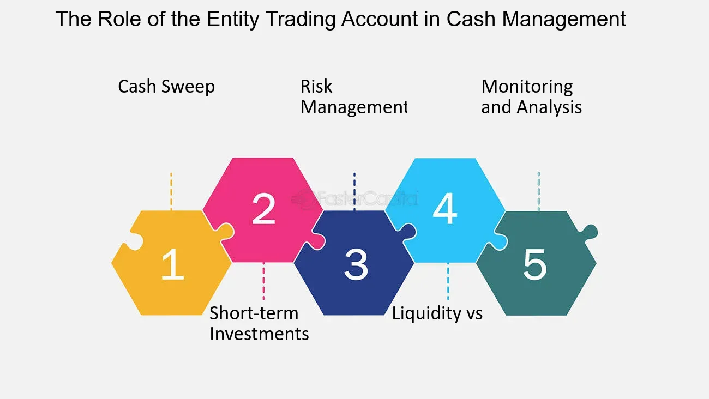

## Table of Contents

## What is an Entity Trading Account?

An Entity Trading Account is a type of account that businesses or organizations use to buy and sell financial assets like stocks, bonds, and commodities. It's different from a personal trading account because it's set up under the name of the business or organization, not an individual person. This type of account helps companies manage their investments and can be used for various purposes, such as growing their funds or managing risks.

These accounts are typically managed by professionals, like financial advisors or traders, who make decisions on behalf of the business. They follow the company's investment goals and strategies. Entity Trading Accounts can also have different rules and requirements compared to personal accounts, like higher minimum balances or specific documentation needed to open them. This makes them suitable for larger organizations that need to handle more complex financial operations.

## Who can open an Entity Trading Account?

An Entity Trading Account can be opened by businesses, organizations, or other legal entities. This includes companies, partnerships, non-profits, and even government agencies. The main requirement is that the entity must have a legal status that allows it to enter into financial transactions.

To open an Entity Trading Account, the entity usually needs to provide certain documents. These can include business registration papers, tax identification numbers, and resolutions from the board of directors or other governing body authorizing the account. The process can be a bit more complicated than opening a personal account, but it's designed to make sure the entity is legitimate and has the right to manage investments.

## What are the basic requirements to open an Entity Trading Account?

To open an Entity Trading Account, the business or organization needs to show that it is a real legal entity. This means they must provide documents like the business registration certificate, which proves the company exists legally. They also need to show a tax identification number, which is like a special ID for the business used for tax purposes. Sometimes, they need a resolution from the board of directors or another group that makes decisions for the business, saying it's okay to open the account.

The process can be a bit more complicated than opening a personal account because the bank or brokerage firm wants to make sure the business is real and has the right to manage investments. They might ask for more papers or have different rules than for personal accounts. But once everything is set up correctly, the Entity Trading Account can help the business manage its money and investments in a way that fits its goals.

## How does an Entity Trading Account differ from a personal trading account?

An Entity Trading Account is used by businesses or organizations to buy and sell things like stocks and bonds. It's different from a personal trading account because it's set up in the name of the business, not a single person. This means the account follows the rules and goals of the business. For example, a company might use the account to grow its money or to manage risks. Personal accounts are usually for one person and follow their own investment plans.

Opening an Entity Trading Account needs more paperwork than a personal account. The business has to show it's a real legal entity with documents like a business registration certificate and a tax ID number. They might also need a special permission from the people who make decisions for the business, like a board of directors. Personal accounts are simpler to open, usually just needing things like a driver's license or social security number. Entity accounts can handle bigger and more complex financial moves that match what the business needs.

## What are the main benefits of using an Entity Trading Account?

An Entity Trading Account helps businesses manage their money better. It lets them buy and sell things like stocks and bonds in a way that fits their goals. For example, a company might want to grow its money or protect itself from risks. With an Entity Trading Account, they can do this in a way that's just for the business, not mixed with personal stuff. It's like having a special tool that works just for the company's needs.

Another big benefit is that these accounts can handle bigger and more complex financial moves. They are set up to deal with the kind of money and investments that businesses need. Plus, they are usually managed by professionals who know how to make smart choices for the business. This can help the company make more money or save on taxes, which is a big deal for any business trying to do well.

## How can an Entity Trading Account help with tax planning?

An Entity Trading Account can help a business save money on taxes. When a business uses this type of account, it can make smart choices about when to buy and sell things like stocks. By doing this at the right times, the business can lower how much it has to pay in taxes. For example, if a company knows it will owe less tax in a certain year, it might sell investments then to pay less tax on the money it makes.

Also, an Entity Trading Account lets a business use special tax rules that are just for companies. These rules can help the business manage its taxes better. For example, some businesses can use losses from their investments to lower their taxes. By keeping the business's investments separate from personal ones, it's easier to use these special tax rules and save money.

## What types of entities are eligible for an Entity Trading Account?

Businesses, organizations, and other groups that have a legal status can open an Entity Trading Account. This includes companies, partnerships, non-profits, and even government agencies. As long as the group is recognized as a legal entity, it can use this type of account to manage its investments.

The main thing is that the entity must be able to do financial transactions legally. This means they need to show they are real with documents like a business registration certificate and a tax ID number. Once they do this, they can open an account to help grow their money or manage risks in a way that fits their goals.

## What are the potential risks associated with Entity Trading Accounts?

Using an Entity Trading Account can come with some risks. One big risk is that the people in charge might not make good choices about what to buy and sell. If they pick the wrong investments, the business could lose a lot of money. Another risk is that the market can change in ways nobody expects. If the value of stocks or other things the business owns goes down a lot, it could hurt the company's money a lot.

There's also the risk that the account might not be managed well. If the people looking after the account don't follow the rules or keep good records, it could cause problems with taxes or the law. Plus, having all the business's investments in one place means that if something goes wrong with the account, it could affect the whole company. So it's important for businesses to be careful and make sure they have good people managing their Entity Trading Account.

## How can an Entity Trading Account improve investment strategies for a business?

An Entity Trading Account can help a business make smarter choices about its investments. Because this account is just for the business, it can focus on what the company needs, like growing money or protecting it from risks. Professionals who know a lot about money can manage the account and pick the best investments for the business. They can look at the big picture and decide when to buy or sell things like stocks or bonds to make the most money for the company.

Also, using an Entity Trading Account keeps the business's investments separate from personal ones. This makes it easier to follow the company's investment plan without mixing things up. It can also help with taxes because the business can use special tax rules that only apply to companies. By doing this, the business can save money and make its investment strategies work better for its goals.

## What are the regulatory considerations for managing an Entity Trading Account?

Managing an Entity Trading Account comes with some rules that businesses need to follow. These rules are set by places like the government or financial groups to make sure everything is done the right way. For example, businesses need to keep good records of all their trades and make sure they follow the laws about buying and selling investments. They also have to report certain things to the government, like how much money they made or lost, so they can pay the right amount of taxes.

Another important part is making sure the people who manage the account know and follow these rules. They need to be careful about things like insider trading, which means using secret information to make money. There are also rules about how much risk the business can take with its investments. By following all these rules, businesses can keep their Entity Trading Account in good shape and avoid getting in trouble with the law.

## How do Entity Trading Accounts impact financial reporting and compliance?

Entity Trading Accounts can change how a business does its financial reporting. When a business uses one of these accounts, it needs to keep good records of all the buying and selling it does. This means they have to write down every trade and show how much money they made or lost. This information goes into the company's financial reports, which tell people like investors and the government how the business is doing. If the records are not clear or correct, it can cause problems with the financial reports and make it hard for the business to show its real financial situation.

These accounts also affect how a business follows the rules. There are laws and rules that say how businesses should manage their money and report it. With an Entity Trading Account, the business has to make sure it follows all these rules. This includes things like paying the right amount of taxes and not doing anything wrong, like insider trading. If the business does not follow the rules, it could get in trouble with the government or other groups that watch over financial activities. So, it's important for the business to manage its Entity Trading Account carefully to stay compliant and avoid any legal issues.

## What advanced strategies can be employed using an Entity Trading Account to optimize returns?

An Entity Trading Account can help a business use smart ways to make more money from its investments. One way is to use something called diversification, which means spreading the money across different types of investments like stocks, bonds, and commodities. This can help the business not lose all its money if one type of investment does badly. Another strategy is called hedging, where the business buys investments that protect it from losing money if the market goes down. For example, they might buy options or futures to make sure they don't lose too much if stock prices fall.

Another advanced way to use an Entity Trading Account is to do something called tax-loss harvesting. This means selling investments that have gone down in value to lower the business's taxes. By doing this at the right time, the business can save money on taxes and then buy back similar investments later. Also, the business can use leverage, which means borrowing money to buy more investments. This can make more money if the investments do well, but it's risky because it can also lead to bigger losses if things go wrong. By using these strategies carefully, a business can make the most of its Entity Trading Account and improve its overall returns.

## References & Further Reading

[1]: Bergstra, J., Bardenet, R., Bengio, Y., & Kégl, B. (2011). ["Algorithms for Hyper-Parameter Optimization."](https://papers.nips.cc/paper/4443-algorithms-for-hyper-parameter-optimization) Advances in Neural Information Processing Systems 24.

[2]: ["Advances in Financial Machine Learning"](https://www.amazon.com/Advances-Financial-Machine-Learning-Marcos/dp/1119482089) by Marcos Lopez de Prado

[3]: ["Evidence-Based Technical Analysis: Applying the Scientific Method and Statistical Inference to Trading Signals"](https://www.amazon.com/Evidence-Based-Technical-Analysis-Scientific-Statistical/dp/0470008741) by David Aronson

[4]: ["Machine Learning for Algorithmic Trading"](https://github.com/stefan-jansen/machine-learning-for-trading) by Stefan Jansen

[5]: ["Quantitative Trading: How to Build Your Own Algorithmic Trading Business"](https://github.com/LucindaYa/quant-resources/blob/master/Quantitative%20Trading%20How%20to%20Build%20Your%20Own%20Algorithmic%20Trading%20Business.pdf) by Ernest P. Chan