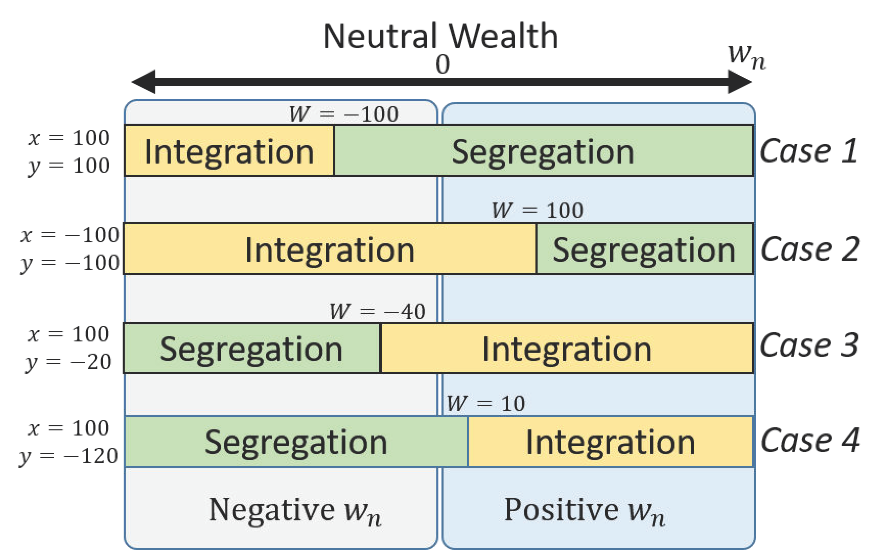

## Table of Contents

## What is entropy in simple terms?

Entropy is a measure of how messy or disorganized something is. Imagine your room: when it's tidy, everything is in its place and easy to find. But as time goes on, things get moved around, and it becomes harder to keep track of where everything is. That messiness is like entropy – it's a way to describe how much disorder there is in a system.

In science, entropy is used to talk about how energy spreads out in a system. For example, if you have a hot cup of coffee, the heat will slowly spread to the cooler air around it until they are the same temperature. This spreading out of energy increases the entropy because the system becomes more uniform and less organized. So, entropy is all about how things naturally move from order to disorder over time.

## How does entropy relate to disorder and randomness?

Entropy is closely linked to disorder and randomness. Think of a deck of cards. When the cards are neatly sorted by suit and number, they are in a very ordered state with low entropy. But if you shuffle the deck, the cards get mixed up, and it's hard to predict where each card will be. This randomness means the deck now has higher entropy because it's more disordered.

In nature, systems tend to move towards higher entropy over time. This is because there are many more ways for things to be messy than for them to be neat. For example, if you drop a glass, it shatters into many pieces. It's much easier for the glass to break into a random pattern than to stay in one piece. This increase in randomness and disorder is an increase in entropy. So, entropy is a way to measure how much randomness or disorder there is in a system, and it tends to increase as time goes on.

## What are some everyday examples of entropy?

Imagine you just cleaned your room. Everything is neat and in its place. But as the days go by, your room starts to get messy again. Clothes end up on the floor, books are scattered, and toys are everywhere. This is entropy at work. Your room naturally goes from being organized to being disorganized because it's easier for things to get messy than to stay neat.

Another example is making a cup of hot tea. When you pour the hot water into the cup, it's all hot. But over time, the heat from the tea spreads out to the cooler air around it. Eventually, the tea and the air around it become the same temperature. This spreading out of heat is an increase in entropy. The system goes from having a neat, concentrated area of heat to a more spread-out, random state where everything is the same temperature.

## How is entropy measured in thermodynamics?

In thermodynamics, entropy is measured using a unit called joules per kelvin (J/K). Scientists use a formula to calculate entropy, which involves looking at how heat energy spreads out in a system. The formula is ΔS = Q/T, where ΔS is the change in entropy, Q is the heat added to or removed from the system, and T is the temperature in kelvins. This formula helps us understand how much more disorganized a system becomes when heat moves around.

Imagine you have a hot object and a cold object. When you put them together, heat flows from the hot object to the cold one until they reach the same temperature. As this happens, the entropy of the whole system increases because the heat energy spreads out and becomes more random. The more heat that moves and the lower the temperature, the bigger the increase in entropy. So, by measuring how much heat moves and at what temperature, we can figure out how much the entropy has changed.

## What is the second law of thermodynamics and its connection to entropy?

The second law of thermodynamics is like a rule that says things will naturally get messier over time. It's all about how energy moves around. Imagine you have a hot cup of tea and a cold room. The heat from the tea will spread out into the room until everything is the same temperature. This spreading out of heat is what the second law is talking about. It says that heat will always move from hot places to cold places, making everything more even and less organized.

This rule is closely connected to entropy because entropy is a way to measure how messy or disorganized something is. When the heat from the tea spreads out into the room, the entropy of the whole system goes up. The second law tells us that the total entropy of a closed system, like our tea and room, will always increase over time. It's like saying that it's much easier for things to get messy than to stay neat. So, the second law of thermodynamics is really about how entropy always increases, making things go from order to disorder naturally.

## How does entropy apply to information theory?

In information theory, entropy is used to measure how much uncertainty or randomness there is in a message or a set of data. Imagine you're trying to guess a letter from the alphabet. If every letter is equally likely, it's hard to guess the right one, and the entropy is high. But if you know that the letter is most likely to be 'E', then it's easier to guess, and the entropy is lower. So, entropy in information theory tells us how much information we need to perfectly describe something, and it's higher when things are more random and unpredictable.

This idea of entropy helps us in things like compressing data. If a message has a lot of repeated parts, like the word "the" in a text, we can use less space to store it because we know it's likely to appear often. This reduces the entropy because the message becomes more predictable. On the other hand, if a message has a lot of randomness, like a string of completely random numbers, it's hard to compress because there's no pattern to predict. So, entropy in information theory is all about how much surprise or unpredictability there is in our data, and it helps us understand how to handle and store information more efficiently.

## What are the key formulas used to calculate entropy in different fields?

In thermodynamics, entropy is calculated using the formula ΔS = Q/T. This formula means that the change in entropy (ΔS) is equal to the heat added to or taken away from a system (Q) divided by the temperature (T) in kelvins. This helps us understand how much more disorganized a system becomes when heat moves around. Imagine you have a hot cup of tea and a cold room. When the heat from the tea spreads out into the room, the entropy goes up because the heat energy becomes more spread out and random. The more heat that moves and the lower the temperature, the bigger the increase in entropy.

In information theory, entropy is calculated using the formula S = -Σ p(x) log₂ p(x). This formula means that the entropy (S) is the sum of the probabilities of each possible event (p(x)) multiplied by the logarithm base 2 of those probabilities, but with a negative sign in front. This helps us measure how much uncertainty or randomness there is in a message or data. For example, if you're trying to guess a letter from the alphabet, and every letter is equally likely, the entropy is high because it's hard to guess the right one. But if you know that the letter is most likely to be 'E', then the entropy is lower because it's easier to guess.

These formulas show how entropy works in different fields. In thermodynamics, it's about how heat spreads out and increases disorder. In information theory, it's about how much surprise or unpredictability there is in data. Both use entropy to measure how things move from order to disorder, but they look at different kinds of systems and use different units and methods to calculate it.

## How can entropy be used in risk assessment?

Entropy can be used in risk assessment to measure how unpredictable or uncertain something is. Imagine you're trying to figure out how risky it is to drive in bad weather. If the weather is always the same, like clear skies every day, it's easy to predict and the risk is low. But if the weather changes a lot, like sudden storms or heavy fog, it's hard to predict what will happen, and the risk goes up. By using entropy, you can measure how much uncertainty there is in the weather patterns and use that to understand how risky driving might be.

In another example, think about a factory where machines can break down. If the machines break down in a way that's hard to predict, the entropy of the system is high, and the risk of unexpected problems is also high. By studying the patterns of when and how machines break down, you can calculate the entropy and use it to plan better maintenance schedules or safety measures. This helps reduce the risk because you can be more prepared for when things might go wrong. So, entropy helps in risk assessment by showing how much randomness or unpredictability there is in a situation, which can guide us in making safer decisions.

## What are the challenges in computing entropy for complex systems?

Computing entropy for complex systems can be tricky because there are so many different parts to keep track of. Imagine a big city with lots of people, cars, and buildings. All these things are moving and changing all the time, and it's hard to predict exactly what will happen next. To figure out the entropy, you need to know the probabilities of all the different ways things can be arranged. But in a big, messy system like a city, there are so many possibilities that it's tough to calculate them all accurately. This makes it hard to get a clear picture of how much disorder or randomness there is.

Another challenge is that real-world systems often have parts that are connected in complicated ways. For example, in a factory, one machine breaking down can affect other machines. This means that the entropy of one part of the system can change the entropy of other parts. Keeping track of all these connections and how they change over time requires a lot of data and powerful computers. Even with all this, it can still be hard to get a precise measurement of entropy because small changes can have big effects in a complex system. So, computing entropy in these situations is like trying to solve a huge puzzle with pieces that keep moving around.

## How do different disciplines interpret and use the concept of entropy?

In physics, entropy is all about how messy or disorganized things are. Imagine a hot cup of tea in a cold room. The heat from the tea spreads out into the room until everything is the same temperature. This spreading out of heat is what physicists call an increase in entropy. They use a formula, ΔS = Q/T, to measure how much more disorganized a system becomes when heat moves around. This helps them understand how energy behaves in different systems, like engines or refrigerators, and why things naturally go from order to disorder over time.

In information theory, entropy measures how much surprise or randomness there is in a message or data. Think of trying to guess a letter from the alphabet. If every letter is equally likely, it's hard to guess, and the entropy is high. But if you know the letter is most likely to be 'E', it's easier to guess, and the entropy is lower. Scientists use a formula, S = -Σ p(x) log₂ p(x), to calculate this. This helps them figure out how to compress data or send messages more efficiently because it shows how much information is needed to describe something perfectly. So, while physicists look at heat and energy, information theorists focus on data and communication, but both use entropy to understand randomness and disorder in their own ways.

## What are the advanced methods for entropy estimation in statistical mechanics?

In statistical mechanics, figuring out entropy for big, complicated systems can be really hard. Scientists use something called the Boltzmann entropy formula, S = k ln W, where S is entropy, k is the Boltzmann constant, and W is the number of ways the system can be arranged. But for really big systems, like all the particles in a gas, counting all the possible arrangements is tough. So, scientists use computer simulations and special math tricks to estimate entropy. These simulations, like Monte Carlo methods, let them look at a small part of the system and guess what the whole thing might be like. It's like trying to understand a huge puzzle by looking at just a few pieces.

Another way to estimate entropy in statistical mechanics is by using something called the partition function. This is a math tool that helps scientists figure out how energy is spread out in a system. By calculating the partition function, they can then find the entropy using another formula, S = k ln Z + kT (∂ ln Z/∂T), where Z is the partition function and T is the temperature. This method is helpful because it lets scientists look at how entropy changes when they change things like temperature or pressure. It's like having a map that shows how the messiness of a system changes as you tweak it. Both these methods help scientists understand and predict how systems behave, even when they're really complicated.

## How does entropy contribute to understanding and predicting system behavior in chaos theory?

In chaos theory, entropy helps us understand how small changes can lead to big, unpredictable results. Imagine you're trying to predict the weather. Even tiny differences, like a butterfly flapping its wings, can change the weather a lot over time. This is because weather systems are very sensitive and have high entropy, meaning they're really messy and hard to predict. By looking at the entropy, scientists can see how much randomness there is in a system and how likely it is to behave in unexpected ways. This helps them understand why some systems, like the weather, are so hard to predict.

Entropy also helps in chaos theory by showing how systems move from order to disorder. Think of a sand pile. If you keep adding sand, it stays in a neat pile until it suddenly collapses into a mess. This sudden change from order to disorder is linked to entropy. As the sand pile gets messier, its entropy goes up. By studying this, scientists can learn about the tipping points where systems change suddenly. So, entropy in chaos theory is like a tool that helps us see how and why systems can be so unpredictable and how they move from being organized to being chaotic.

## What is the understanding of entropy in financial markets?

Entropy, originally a concept from thermodynamics and later adopted into information theory, has become a valuable tool in financial market analysis. It quantifies the level of randomness or unpredictability in a given system, making it ideal for evaluating market conditions characterized by uncertainty and volatility.

In the context of financial markets, entropy measures the unpredictability of price movements and asset behavior. Given that markets are influenced by a multitude of factors—ranging from economic indicators to geopolitical events—entropy offers a quantitative approach to capturing the inherent noise and volatility. Analysts leverage this measurement to gain insights into market trends, distinguishing between random fluctuations and meaningful signals.

Mathematically, entropy can be articulated using Shannon's entropy formula, which is foundational in quantifying information content:

$$
H(X) = -\sum_{i=1}^{n} p(x_i) \log_2 p(x_i)
$$

Here, $H(X)$ represents the entropy of a random variable $X$, with $p(x_i)$ denoting the probability of $X$ taking a particular value $x_i$. In trading, this formula helps assess how spread out or concentrated price distributions are, giving a measure of uncertainty.

Financial markets characterized by high entropy typically exhibit considerable unpredictability and risk. These periods are usually marked by high [volatility](/wiki/volatility-trading-strategies), where price changes can be abrupt and substantial. Such conditions could emanate from factors like policy announcements, economic shocks, or speculative behaviors.

Through entropy, analysts can better understand market dynamics and attempt to predict potential movements. When entropy is high, it suggests that the market is less predictable, which might warrant caution among investors. Conversely, stable market phases, reflected by low entropy, might offer a more predictable environment for investment.

In summary, entropy serves as a potent analytical tool in the financial sector. By providing a measure of randomness, it enhances the understanding of market behavior, helping analysts and traders anticipate potential risks and capitalize on opportunities.

## Can Entropy be Used as a Tool for Risk Assessment?

Entropy facilitates the assessment of financial risk by measuring the randomness inherent in security movements. Traditionally, risk assessment in finance relies on metrics such as beta, which measures an asset's volatility relative to the overall market. However, entropy offers a different and often complementary perspective by quantifying uncertainty and disorder within financial datasets.

The fundamental principle of entropy in risk assessment is rooted in its ability to capture the unpredictability of asset prices. Traditional measures may indicate volatility but may not accurately represent the underlying uncertainty of returns. Entropy analysis provides a more comprehensive understanding by acknowledging the probabilistic distribution of market changes. Mathematically, the information entropy $H$ of a random variable $X$ with possible outcomes $x_i$, each with a probability $p(x_i)$, is calculated as:

$$

H(X) = - \sum_{i} p(x_i) \log p(x_i) 
$$

In this context, higher entropy suggests greater unpredictability, indicating a higher risk environment. Conversely, lower entropy is indicative of a more predictable market, suggesting less risk.

Investors can leverage entropy for risk-return optimization in their portfolios by assessing the unique risk landscape that entropy outlines. Understanding entropy allows investors to construct portfolios that maximize returns for a given level of uncertainty, complementing insights from traditional risk metrics. Techniques such as entropy pooling, where different assets' entropy measures are aggregated to evaluate the portfolio's overall risk, can significantly enhance portfolio optimization. 

For practical implementation, [algorithmic trading](/wiki/algorithmic-trading) systems can be designed to monitor and react to changes in entropy. Python, for instance, provides robust libraries like NumPy and SciPy to calculate and analyze entropy. An example implementation for calculating the entropy of a return distribution can be illustrated as follows:

```python
import numpy as np

# Define the probability distribution of returns
returns_prob = np.array([0.1, 0.3, 0.4, 0.2])

# Calculate the entropy
entropy = -np.sum(returns_prob * np.log2(returns_prob))
print(f"Entropy of the asset return distribution: {entropy}")
```

By incorporating entropy into algorithmic strategies, traders can gain insights into the potential instability of market conditions, beyond what traditional metrics provide. This facilitates the development of dynamic and adaptive strategies capable of adjusting to varying market uncertainty levels, thus establishing more robust financial strategies capable of efficiently balancing growth and risk.

## What are the Mechanics of Entropy Computation in Algo Trading?

Computing entropy in algorithmic trading necessitates the use of advanced mathematical concepts and diverse methodologies. Entropy serves as a measure of unpredictability or information content, and its application in trading systems is designed to enhance the accuracy of predictions and increase the adaptability of trading strategies.

Entropy can be quantified through multiple approaches, with Shannon entropy being one of the most commonly used measures. Shannon entropy is defined mathematically as:

$$
H(X) = -\sum_{i=1}^{n} p(x_i) \log p(x_i)
$$

where $X$ is a discrete random variable with possible outcomes $x_1, x_2, \ldots, x_n$, and $p(x_i)$ represents the probability of each outcome.

In the context of algorithmic trading, this formula helps assess the unpredictability associated with financial data series. By measuring the entropy of a data set containing asset prices or returns, traders can gauge the level of randomness or disorder, which in turn informs the robustness of their trading models.

Entropy-based models are particularly effective in deconstructing market noise. Financial markets are fraught with both meaningful information and extraneous noise that can obfuscate underlying trends. Entropy provides a metric to filter out this noise, allowing algorithms to focus on significant price movements and anomalies that might indicate profitable trading opportunities. Consequently, traders can leverage entropy to pinpoint optimal entry and [exit](/wiki/exit-strategy) points in the market, enhancing their decision-making processes.

The integration of entropy into trading algorithms involves several stages. Initially, financial data must be pre-processed to account for missing values and outliers, ensuring the integrity of the data set. Once pre-processing is complete, the entropy of the data can be computed, providing insights into the variability and structure of market movements.

Incorporating entropy measures into trading systems requires constructing algorithms capable of dynamically adjusting to varying levels of market uncertainty. Python is often utilized for this purpose due to its robust libraries and ease of use. For example, the NumPy library can efficiently handle large datasets, and SciPy offers functions for calculating entropy directly. A simple implementation might look as follows:

```python
import numpy as np
from scipy.stats import entropy

# Example of calculating Shannon entropy for a data distribution
data = np.array([0.2, 0.1, 0.3, 0.4])  # Sample probabilities
shannon_entropy = entropy(data, base=2)
print(f'Shannon Entropy: {shannon_entropy}')
```

This Python script demonstrates a basic calculation of Shannon entropy for a given probability distribution. In practical applications, traders would replace the sample data with actual financial data, calculate entropy at different time intervals, and integrate these values into larger, automated trading frameworks to fine-tune their predictions and risk assessments.

Overall, the incorporation of entropy in algorithmic trading represents an advanced step toward more intelligent and responsive trading systems, capable of deciphering market complexity and optimizing performance.

## References & Further Reading

[1]: Shannon, C. E. (1948). ["A Mathematical Theory of Communication."](https://onlinelibrary.wiley.com/doi/abs/10.1002/j.1538-7305.1948.tb01338.x) The Bell System Technical Journal.

[2]: Cover, T. M., & Thomas, J. A. (2006). ["Elements of Information Theory."](https://onlinelibrary.wiley.com/doi/book/10.1002/047174882X) Wiley-Interscience.

[3]: ["Entropy Measures, Maximum Entropy Principle and Emerging Applications"](https://link.springer.com/book/10.1007/978-3-540-36212-8) by Klaus Lucas, Udo von Toussaint

[4]: Jizba, P., Kleinert, H., & Shefaat, M. (2012). ["Rényi's Information Measure: Discussion, Generalizations and Applications."](https://hagenkleinert.de/documents/articles/397.pdf) Physica A: Statistical Mechanics and its Applications.

[5]: Tsallis, C. (1988). ["Possible Generalization of Boltzmann-Gibbs Statistics."](https://link.springer.com/article/10.1007/BF01016429) Journal of Statistical Physics.