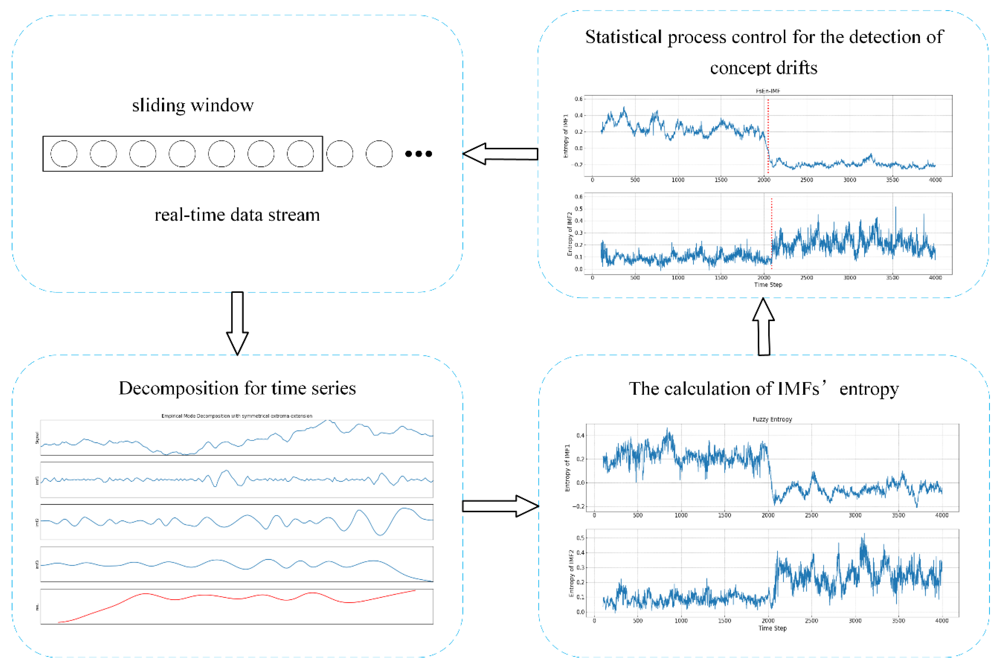

In today's rapidly evolving financial markets, algorithmic trading has become a common practice among traders seeking to optimize their strategies using advanced statistical and computational techniques. Algorithmic trading involves using computers programmed to follow a defined set of instructions for placing trades with the aim of generating profits at a speed and frequency that is impossible for a human trader to match. One of the intriguing concepts applied in algorithmic trading is entropy—a concept borrowed from thermodynamics.

Entropy, in its classical sense, measures the degree of disorder or randomness in a physical system. In finance, this concept translates into measuring uncertainty or unpredictability in asset prices, providing a quantitative measure of market behavior's complexity. This article explores how entropy features are utilized in algorithmic trading to identify and highlight market trends. By examining changes in entropy over time, traders can infer periods of high disorder, which may precede market reversals or trend continuations. Such insights are invaluable in a field where timely decisions can leverage significant returns or avoid substantial losses.



We will discuss the fundamentals of entropy, its historical roots, and how it has been adapted to serve as a valuable tool in the financial markets. The notion was originally introduced in economics through information theory, notably through Shannon entropy, which quantifies the amount of information or surprise inherent in a dataset. In the context of finance, Shannon's entropy can be used to assess the level of uncertainty in price movements, thereby providing a systematic framework to predict price trajectories.

By bridging the gap between traditional financial metrics and modern data-driven approaches, entropy-based indicators offer unique insights into market dynamics. These indicators have been shown to outperform traditional metrics like moving averages and volume analysis by offering a more nuanced understanding of market states through the lens of uncertainty and complexity. As traders continue to seek competitive edges, the adoption of entropy-based approaches represents a shift towards more sophisticated, scientifically grounded trading strategies. This integration of thermodynamic concepts into financial practices underscores the interdisciplinary nature of modern financial analysis and its potential to revolutionize trading paradigms.

## Table of Contents

## Theoretical Background of Entropy in Finance

Entropy, a concept originally rooted in thermodynamics, signifies the degree of disorder or randomness present in a system. In the context of finance, entropy serves as a measure of uncertainty or unpredictability in asset prices. Drawing parallels from thermodynamic systems, financial markets exhibit chaotic behaviors where price movements can appear seemingly random and disordered. The introduction of entropy into financial analysis allows traders and analysts to measure and quantify this randomness in a structured manner.

The foundation of entropy in finance is deeply intertwined with information theory, pioneered by Claude Shannon. Shannon entropy provides a mathematical framework to quantify the amount of uncertainty or surprise embedded within data. In mathematical terms, Shannon entropy $H$ can be defined for a discrete random variable $X$ with possible values $\{x_1, x_2, ..., x_n\}$ and probability mass function $P(X)$ as:

$$

H(X) = -\sum_{i=1}^{n} P(x_i) \log P(x_i) 
$$

This formulation allows the capturing of uncertainty by summing the expected value of the information content of each outcome, weighted by its probability.

In [algorithmic trading](/wiki/algorithmic-trading), entropy is applied to assess the order or turbulence within historical trading data, leading to a sophisticated understanding of price dynamics. For instance, examining varying periods of high or low entropy in price movements can offer insights into potential trend shifts or continuations. By utilizing entropy, traders can systematically track and predict price behaviors, translating seemingly erratic market movements into actionable data.

The adaptation of entropy to financial markets involves the utilization of historical price data, where traders may calculate the entropy of price changes over specified intervals. Python code can be used to compute the Shannon entropy of a dataset of price returns. Here is a basic implementation using Python:

```python
import numpy as np

def calculate_shannon_entropy(data):
    """
    Calculate the Shannon entropy of a dataset.

    Params:
    - data (list or np.array): Dataset of price returns or price changes

    Returns:
    - float: Calculated Shannon entropy
    """
    # Normalize the data
    value_counts = np.unique(data, return_counts=True)[1]
    probabilities = value_counts / len(data)

    # Calculate entropy
    entropy = -np.sum(probabilities * np.log2(probabilities))
    return entropy

# Example usage
price_changes = np.array([0.01, -0.02, 0.01, 0.03, -0.01, 0.00, -0.02])
entropy_value = calculate_shannon_entropy(price_changes)
print(f"Shannon Entropy: {entropy_value}")
```

This entropy calculation can assist traders in distinguishing between periods of noise and potential trend signals. By embracing entropy in their analytic models, financial experts can harness a deeper comprehension of market entropy, channeling it towards more effective trading decisions. As the financial domain continues to embrace data-driven approaches, entropy stands out as a pivotal tool in bridging traditional market analysis with innovative computational techniques.

## Defining Market Entropy Features

Market entropy in financial trading quantifies the uncertainty or disorder present in market behavior, as evident through fluctuations in asset prices over time. Entropy as a metric aims to capture these dynamics, offering traders indicators that highlight unstable conditions which can inform strategic decisions.

### Key Components of Market Entropy

1. **Candlestick Patterns**: These visual representations of price movements are central to identifying market entropy. They encapsulate open, high, low, and close prices for specific time frames, each pattern potentially indicating a shift in market sentiment. For instance, elongated shadows and small real bodies in candlesticks can suggest market indecision, which may increase entropy.

2. **Moving Averages**: Moving averages, such as the Exponential Moving Average (EMA), help smooth out price data, providing a clearer visualization of market trends. In the context of entropy, moving averages establish a benchmark for computing positive and negative entropy levels. The EMA assigns more weight to recent prices, making it responsive to new data and useful for detecting changes in market conditions.

### Calculating Positive and Negative Entropy Levels

To measure market entropy effectively, traders often calculate both positive (upward trend) and negative (downward trend) entropy. This involves examining price deviations from a moving average like the EMA. Here is a basic approach using Python:

```python
import numpy as np

def calculate_entropy(prices, window_length):
    ema = np.convolve(prices, np.ones(window_length)/window_length, mode='valid')
    deviations = prices[-len(ema):] - ema

    # Calculate probabilities
    positive_probs = np.where(deviations > 0, deviations, 0) / np.sum(np.abs(deviations))
    negative_probs = np.where(deviations < 0, np.abs(deviations), 0) / np.sum(np.abs(deviations))

    # Calculate entropy
    positive_entropy = -np.sum(positive_probs * np.log(positive_probs + 1e-9))
    negative_entropy = -np.sum(negative_probs * np.log(negative_probs + 1e-9))

    return positive_entropy, negative_entropy

prices = np.array([105, 107, 104, 103, 108, 110, 112, 111, 113])
window_length = 3
positive_entropy, negative_entropy = calculate_entropy(prices, window_length)
```

### Interpretation and Application

Understanding these entropy measures allows traders to interpret periods of high disorder. High entropy indicates diverse market opinions and potential unpredictability, while low entropy suggests greater consensus, likely pointing to trend continuations. By examining the balance between positive and negative entropy, traders can gain insights into market [momentum](/wiki/momentum) and corrective phases.

For example, periods with increasing negative entropy might precede bearish trends, where prices could fall, while rising positive entropy suggests bullish trends. Traders leverage this information to optimize entry and [exit](/wiki/exit-strategy) points in their trading strategies, thus enhancing decision-making processes by accounting for the inherent uncertainty in financial markets.

In practical scenarios, traders integrate these entropy calculations into their trading platforms to automate alerts and actions based on set thresholds for positive and negative entropy. These insights contribute to adapting strategies swiftly, reflecting the ever-changing market dynamics.

## Implementing Entropy-Based Indicators in Trading Platforms

Platforms like Superalgos have adopted entropy-based indicators to enhance the precision with which traders can identify market trends. These indicators, such as the 'FastTrend', work by analyzing differences in positive and negative entropy, thereby offering clear visual cues about the direction of market trends.

To effectively implement entropy-based indicators in trading platforms, several integration steps are crucial. First, traders typically begin by calculating Exponential Moving Averages (EMAs). EMAs are favored over simple moving averages for their ability to give more weight to recent data, thereby being more responsive to recent price changes. These averages serve as a baseline for distinguishing between periods of order and chaos within the market data.

In tandem with EMAs, historical price data is stored and continuously updated. This data serves as the foundation for calculating entropy values. By computing the degree of randomness or disorder from this historical data, traders can derive actionable trading signals. The calculation of entropy ($H$) in this context is similar to the Shannon entropy, defined as:

$$
H(X) = -\sum_{i} p(x_i) \log p(x_i)
$$

where $p(x_i)$ represents the probability distribution of the possible states of the market data. Differences in entropy values over time can indicate significant changes in market behavior, thereby suggesting potential trading opportunities.

One of the considerable advantages of these systems is their customization options. Traders can tailor parameters such as EMA factors and window lengths to align with specific trading strategies. For instance, shorter EMAs may be used for short-term [scalping](/wiki/gamma-scalping) strategies, while longer EMAs could be more suitable for trend-following approaches. 

In practical terms, traders can enhance their trading algorithms by leveraging these entropy-derived insights. By adjusting parameters and integrating these indicators into existing trading systems, they can improve their decision-making processes significantly. An open-source platform like Superalgos allows for such modifications, making it accessible for traders looking to optimize their strategies. The adaptability of entropy-based indicators makes them a potent tool in modern trading, providing nuanced understanding and forecasting abilities that traditional methods may lack.

## Case Studies and Performance Analysis

Real-world applications of entropy-based trading indicators have increasingly been documented, shedding light on their capacity to navigate complex market environments. These indicators apply principles from entropy to quantify the degree of uncertainty or irregularity in price movements, thereby offering a novel tool to anticipate potential reversals or trend continuations.

One prominent example is the deployment of entropy indicators in equity markets, where they have been utilized to forecast significant trend reversals. In these studies, entropy metrics often identify periods when traditional indicators such as the Relative Strength Index (RSI) or the Moving Average Convergence Divergence (MACD) may lag. The sensitivity of entropy measures to shifts in market dynamics allows traders to spot emerging trends earlier and with greater accuracy. This is primarily because traditional indicators are generally based on historical price data without accounting for the underlying uncertainty or randomness captured by entropy.

Back-testing these entropy-based indicators forms a crucial component of performance evaluation, providing insights into their effectiveness over historical datasets. By experimenting across diverse asset classes, from stocks to cryptocurrencies, researchers and practitioners can assess the robustness of these indicators. For instance, back-testing might involve computing Shannon entropy over various time windows to determine price [volatility](/wiki/volatility-trading-strategies) shifts. In Python, this can be implemented as follows:

```python
import numpy as np

def shannon_entropy(time_series):
    probabilities, _ = np.histogram(time_series, bins=10, density=True)
    probabilities = probabilities[probabilities > 0]  # Filter zero probabilities
    entropy = -np.sum(probabilities * np.log2(probabilities))
    return entropy

# Example time series data
prices = np.array([100, 102, 101, 105, 107, 110, 108, 107, 111, 115])
entropy_value = shannon_entropy(prices)
print(f"Shannon Entropy of time series: {entropy_value:.4f}")
```

Comparative analyses have underscored the advantages of entropy indicators, particularly in reducing the incidence of false signals. While RSI and MACD provide insights into momentum and trend strength, they might falter in volatile or rapidly changing markets, often producing misleading signals. Entropy-based methods, in contrast, emphasize the distribution and variability of price movements, providing a statistically grounded approach to validating trends.

Several case studies have demonstrated quantifiable improvements in trading outcomes with these methods. For example, in foreign exchange markets, entropy metrics have been shown to outperform traditional technical indicators during periods of high volatility, such as central bank announcements or geopolitical events, by accurately predicting the start or continuation of trends.

In summary, the incorporation of entropy features into trading strategies offers a refined lens through which to interpret market behavior. The empirical evidence supporting their use, particularly in enhancing the prediction of trends and minimizing erroneous signals, makes them a promising addition to the toolkit of modern algorithmic trading systems. Continued research and adaptation of entropy-based approaches are likely to yield further advancements, enhancing the strategic capabilities of traders across asset classes.

## Conclusion

The application of entropy in algorithmic trading provides a novel approach to understanding market dynamics. By leveraging entropy features, traders can gain a deeper insight into market trends and develop more informed trading strategies. Entropy helps to quantify the level of unpredictability or disorder in price movements, offering a systematic measurement of market uncertainty. This capability facilitates the identification of potential trend reversals or continuing trends, allowing traders to avoid uncertified risks.

Although still a burgeoning field, the intersection of entropy and finance holds significant potential for future trading innovations. The continuous evolution of computational power and data analysis techniques is driving the integration of entropy-based measures into trading algorithms. Such advancements promise enriched analytical capabilities, paving the way for novel predictive models that can capitalize on subtle market anomalies that traditional tools might overlook.

Further research and development of these techniques will undoubtedly shape the landscape of modern trading systems. By introducing robust solutions that address the complexities of financial markets, entropy-based indicators are set to enhance the precision and efficiency of trading strategies. This progression underscores the critical role of interdisciplinary approaches, combining financial theory with principles originally derived from thermodynamics and information theory.

As the field progresses, entropy-based indicators are likely to become an integral part of the algorithmic trader's toolkit. This integration will not only offer competitive advantages but also encourage the adoption of more data-driven, adaptive trading methodologies in handling dynamic market environments.

## References & Further Reading

[1]: Shannon, C. E. (1948). ["A Mathematical Theory of Communication."](https://people.math.harvard.edu/~ctm/home/text/others/shannon/entropy/entropy.pdf) Bell System Technical Journal.

[2]: López de Prado, M. (2018). ["Advances in Financial Machine Learning."](https://www.amazon.com/Advances-Financial-Machine-Learning-Marcos/dp/1119482089) Wiley.

[3]: Aronson, D. R. (2006). ["Evidence-Based Technical Analysis: Applying the Scientific Method and Statistical Inference to Trading Signals."](https://www.amazon.com/Evidence-Based-Technical-Analysis-Scientific-Statistical/dp/0470008741) Wiley.

[4]: Jansen, S. (2020). ["Machine Learning for Algorithmic Trading."](https://github.com/stefan-jansen/machine-learning-for-trading) Packt Publishing.

[5]: Cover, T. M., & Thomas, J. A. (2006). ["Elements of Information Theory."](https://onlinelibrary.wiley.com/doi/book/10.1002/047174882X) Wiley.

[6]: Nair, S., & Antulov-Fantulin, N. (2019). ["Learning Entropy for High-Frequency Trading."](https://scholar.google.com/citations?user=00-i_zsAAAAJ) arXiv preprint arXiv:1902.06751.