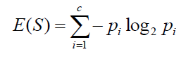

## Table of Contents

## What is entropy in the context of information theory?

In information theory, entropy is a measure of how unpredictable or random something is. Imagine you have a bunch of different colored balls in a bag. If you know exactly what colors are in there and how many of each, the entropy is low because you can predict what you'll pull out. But if you have no idea what colors are in the bag, the entropy is high because it's hard to guess what you'll get.

Entropy is important because it helps us understand how much information is in a message or a system. If a message is very predictable, like always saying "yes" or "no," it doesn't carry much new information, so its entropy is low. But if a message can be any word in the dictionary, it's harder to predict and has higher entropy, meaning it carries more information. This concept is used in many fields, like data compression and cryptography, to make sure messages are as efficient and secure as possible.

## How is entropy calculated in a simple system?

Entropy in a simple system can be calculated using a formula that looks at how likely different outcomes are. Imagine you have a coin. If it's a fair coin, there's a 50% chance it will land on heads and a 50% chance it will land on tails. To find the entropy, you use the probability of each outcome and a special math function called a logarithm. The formula is: Entropy = - (Probability of heads * log2(Probability of heads) + Probability of tails * log2(Probability of tails)). For our fair coin, that's - (0.5 * log2(0.5) + 0.5 * log2(0.5)), which equals 1 bit of entropy. This means the coin flip is completely unpredictable and gives us 1 bit of new information each time.

Now, if the coin is not fair, say it lands on heads 75% of the time and tails 25% of the time, the entropy changes. Using the same formula, you get: Entropy = - (0.75 * log2(0.75) + 0.25 * log2(0.25)), which equals about 0.81 bits of entropy. This means the coin flip is less unpredictable because heads is more likely, so it gives us less new information each time. The more uneven the probabilities, the lower the entropy, and the more predictable the outcome.

## What are the practical applications of entropy in data compression?

Entropy plays a big role in data compression because it helps us understand how much we can shrink our data. Imagine you have a text file where the word "the" appears a lot. Because "the" is so common, it has low entropy, meaning it's predictable. Data compression algorithms use this information to replace common words or patterns with shorter codes. This way, the file takes up less space without losing any information. The more predictable the data, the more we can compress it, making entropy a key tool in making files smaller and easier to store or send.

In practical terms, entropy helps us decide how to best compress different types of data. For example, in a picture, if there are large areas of the same color, that part of the image has low entropy because it's easy to predict. Compression algorithms can then use fewer bits to describe those areas, making the file smaller. On the other hand, if the picture has a lot of different colors and patterns, it has high entropy, and it's harder to compress as much. By understanding the entropy of the data, we can choose the right compression method to make our files as small as possible while still keeping all the important information.

## How does entropy relate to randomness and unpredictability?

Entropy is a measure of how random or unpredictable something is. If you have a system where you can easily guess what will happen next, like a coin that always lands on heads, the entropy is low. It's like knowing what color ball you'll pull out of a bag because you can see inside. On the other hand, if you have no idea what will happen next, like with a fair coin flip, the entropy is high. It's like pulling a ball from a bag where you can't see the colors inside. The higher the entropy, the harder it is to predict outcomes, which means the system is more random.

This idea of entropy being tied to randomness and unpredictability is used in many areas. For example, in cryptography, high entropy is important for keeping messages secret. If a code is very predictable (low entropy), it's easier for someone to crack it. But if the code is very random (high entropy), it's much harder to guess. In data compression, understanding entropy helps us shrink files by finding and using patterns. If data is very predictable, we can compress it more. So, entropy helps us understand and use randomness in practical ways.

## Can you explain the difference between Shannon entropy and other types of entropy?

Shannon entropy, named after Claude Shannon, is a specific type of entropy used in information theory. It measures how unpredictable or random something is by looking at the probabilities of different outcomes. Imagine you have a bag with different colored balls. If you know exactly what colors are inside, the Shannon entropy is low because you can predict what you'll pull out. But if you have no idea, the entropy is high because it's hard to guess. This type of entropy is used to figure out how much information is in a message or a system, which is really helpful for things like data compression and sending messages securely.

There are other types of entropy too, like thermodynamic entropy and Boltzmann entropy, which are used in physics. Thermodynamic entropy is about how energy spreads out in a system, like how heat spreads from a hot coffee to the cooler air around it. Boltzmann entropy looks at the number of ways particles can be arranged in a system, like how molecules move in a gas. These types of entropy are different from Shannon entropy because they deal with physical systems rather than information. But they all share the idea of measuring how things spread out or become more random over time.

## How is entropy used in machine learning and data analysis?

Entropy is really important in [machine learning](/wiki/machine-learning) and data analysis because it helps us understand how mixed up or spread out our data is. Imagine you're trying to sort a bunch of different colored balls into groups. If the balls are all mixed up, it's hard to predict which group a new ball will go into. This is high entropy. But if the balls are already sorted into neat groups, it's easy to predict where a new ball will go, which means low entropy. In machine learning, we use entropy to figure out how to split data into different groups, like deciding which questions to ask to separate apples from oranges. This helps make our models better at sorting and predicting.

In data analysis, entropy helps us see how random or predictable our data is. For example, if you're looking at a bunch of survey answers, you can use entropy to see how spread out the answers are. If everyone gives the same answer, the entropy is low because the answers are predictable. But if the answers are all over the place, the entropy is high, showing that the data is more random. By understanding the entropy of our data, we can make better decisions about how to analyze it and what kind of models to use. This makes our data analysis more accurate and helpful.

## What role does entropy play in thermodynamics and statistical mechanics?

In thermodynamics, entropy is like a measure of how messy or spread out energy is in a system. Imagine you have a hot cup of coffee and a cold room. If you leave the coffee sitting, the heat will spread from the coffee to the room until everything is the same temperature. This spreading out of heat is what we call an increase in entropy. The second law of thermodynamics says that entropy in a closed system always increases over time, meaning things naturally get more mixed up and less organized. So, if you leave your room messy, it's following the laws of thermodynamics!

In statistical mechanics, entropy is about how many different ways particles can be arranged in a system. Think of a bunch of gas molecules bouncing around in a box. There are tons of different ways those molecules can be moving and positioned. Entropy here is a measure of how many of those arrangements are possible. The more ways there are for the particles to be arranged, the higher the entropy. This idea helps us understand why things like gas spreading out in a room happen naturally. It's all about the system moving towards the most likely, or highest entropy, state.

## How can entropy be applied to measure complexity in biological systems?

Entropy can be used to measure how complex things are in living systems, like in our bodies or in nature. Imagine you're looking at a forest. If all the trees are the same type and grow in neat rows, the forest is not very complex, and its entropy is low. But if the forest has many different kinds of trees, plants, and animals all mixed together, it's much more complex and has high entropy. Scientists use entropy to understand how diverse and unpredictable biological systems are, which helps them study things like how ecosystems work or how our bodies fight off diseases.

In biology, entropy also helps us see how cells and organisms change over time. For example, as a cell grows and divides, it gets more complex, and its entropy increases. This is important for understanding how life evolves and adapts. By measuring entropy, scientists can track how much a system is changing and becoming more mixed up, which gives them clues about how life works and how it might change in the future.

## What are the limitations of using entropy as a measure of information?

Entropy is a great way to measure how unpredictable or random something is, but it has its limits. One big problem is that entropy looks at the whole system and doesn't care about the order of things. For example, if you have a message that says "hello" and another that says "olleh," they might have the same entropy, but they mean very different things. So, entropy can't tell us about the meaning or structure of information, just how spread out it is.

Another limit is that entropy assumes that all possible outcomes are equally important. But in real life, some things matter more than others. For instance, if you're trying to compress a file, you might care more about keeping certain parts of the data clear than others. Entropy doesn't take this into account, so it might not be the best way to decide how to handle all types of information. It's like trying to use the same tool for every job—it works okay for some things but not for others.

## How do advanced entropy-based methods improve cryptographic systems?

Advanced entropy-based methods make cryptographic systems stronger by making them more random and harder to predict. In cryptography, it's really important that the codes used to protect messages are as unpredictable as possible. By using high entropy, these methods ensure that the codes are very mixed up, making it super hard for anyone trying to crack them to guess what's going on. This randomness is like using a really big, messy bag of balls where you can't see inside. The more mixed up the balls are, the harder it is to guess what color you'll pull out, which is exactly what you want in a code.

These methods also help in creating keys that are much harder to break. Keys are like the secret codes that unlock the message, and if they're not random enough, someone might be able to figure them out. By using entropy to make keys with a lot of randomness, advanced methods make sure that the keys are very secure. This is like having a lock with so many different possible combinations that it would take forever to try them all. So, by using entropy to make things more random, these methods keep messages safe and secure.

## Can entropy be used to detect anomalies in network traffic or other data streams?

Entropy can be used to spot strange things in network traffic or other data streams. Think of it like this: if you're watching cars go by and they're all different colors and speeds, that's high entropy because it's hard to predict what you'll see next. But if suddenly all the cars are the same color and speed, that's low entropy and might mean something unusual is happening. In the same way, if network traffic or data streams suddenly have a lot less randomness than usual, it could be a sign of a problem or an attack.

To use entropy for this, you measure how random the data usually is and then keep an eye out for changes. If the entropy drops or spikes a lot, it might mean something weird is going on. This method is really helpful for keeping networks safe because it can catch things that other ways might miss. By watching how entropy changes, you can find and stop problems before they get worse.

## What are the current research trends and future directions in the field of entropy features?

Researchers are always looking for new ways to use entropy to understand and improve things. One big trend is using entropy to help with machine learning and [artificial intelligence](/wiki/ai-artificial-intelligence). Scientists are finding that by looking at the entropy of data, they can make better models that learn faster and work more accurately. Another area where entropy is getting a lot of attention is in cybersecurity. People are working on new ways to use entropy to spot and stop cyber attacks by watching how random network traffic is. These trends show that entropy is becoming more and more important in figuring out how to make technology safer and smarter.

Looking into the future, entropy could play an even bigger role in many fields. In biology, for example, scientists might use entropy to learn more about how complex life is and how it changes over time. This could help us understand diseases better and find new ways to treat them. In physics, researchers might use entropy to explore new ideas about how the universe works, like how black holes behave or how time moves forward. As we learn more about entropy and how to use it, we'll find more ways to solve big problems and make life better.

## What is the Theoretical Background of Entropy in Finance?

Entropy, a concept originally rooted in thermodynamics, signifies the degree of disorder or randomness present in a system. In the context of finance, entropy serves as a measure of uncertainty or unpredictability in asset prices. Drawing parallels from thermodynamic systems, financial markets exhibit chaotic behaviors where price movements can appear seemingly random and disordered. The introduction of entropy into financial analysis allows traders and analysts to measure and quantify this randomness in a structured manner.

The foundation of entropy in finance is deeply intertwined with information theory, pioneered by Claude Shannon. Shannon entropy provides a mathematical framework to quantify the amount of uncertainty or surprise embedded within data. In mathematical terms, Shannon entropy $H$ can be defined for a discrete random variable $X$ with possible values $\{x_1, x_2, ..., x_n\}$ and probability mass function $P(X)$ as:

$$

H(X) = -\sum_{i=1}^{n} P(x_i) \log P(x_i) 
$$

This formulation allows the capturing of uncertainty by summing the expected value of the information content of each outcome, weighted by its probability.

In [algorithmic trading](/wiki/algorithmic-trading), entropy is applied to assess the order or turbulence within historical trading data, leading to a sophisticated understanding of price dynamics. For instance, examining varying periods of high or low entropy in price movements can offer insights into potential trend shifts or continuations. By utilizing entropy, traders can systematically track and predict price behaviors, translating seemingly erratic market movements into actionable data.

The adaptation of entropy to financial markets involves the utilization of historical price data, where traders may calculate the entropy of price changes over specified intervals. Python code can be used to compute the Shannon entropy of a dataset of price returns. Here is a basic implementation using Python:

```python
import numpy as np

def calculate_shannon_entropy(data):
    """
    Calculate the Shannon entropy of a dataset.

    Params:
    - data (list or np.array): Dataset of price returns or price changes

    Returns:
    - float: Calculated Shannon entropy
    """
    # Normalize the data
    value_counts = np.unique(data, return_counts=True)[1]
    probabilities = value_counts / len(data)

    # Calculate entropy
    entropy = -np.sum(probabilities * np.log2(probabilities))
    return entropy

# Example usage
price_changes = np.array([0.01, -0.02, 0.01, 0.03, -0.01, 0.00, -0.02])
entropy_value = calculate_shannon_entropy(price_changes)
print(f"Shannon Entropy: {entropy_value}")
```

This entropy calculation can assist traders in distinguishing between periods of noise and potential trend signals. By embracing entropy in their analytic models, financial experts can harness a deeper comprehension of market entropy, channeling it towards more effective trading decisions. As the financial domain continues to embrace data-driven approaches, entropy stands out as a pivotal tool in bridging traditional market analysis with innovative computational techniques.

## How can entropy-based indicators be implemented in trading platforms?

Platforms like Superalgos have adopted entropy-based indicators to enhance the precision with which traders can identify market trends. These indicators, such as the 'FastTrend', work by analyzing differences in positive and negative entropy, thereby offering clear visual cues about the direction of market trends.

To effectively implement entropy-based indicators in trading platforms, several integration steps are crucial. First, traders typically begin by calculating Exponential Moving Averages (EMAs). EMAs are favored over simple moving averages for their ability to give more weight to recent data, thereby being more responsive to recent price changes. These averages serve as a baseline for distinguishing between periods of order and chaos within the market data.

In tandem with EMAs, historical price data is stored and continuously updated. This data serves as the foundation for calculating entropy values. By computing the degree of randomness or disorder from this historical data, traders can derive actionable trading signals. The calculation of entropy ($H$) in this context is similar to the Shannon entropy, defined as:

$$
H(X) = -\sum_{i} p(x_i) \log p(x_i)
$$

where $p(x_i)$ represents the probability distribution of the possible states of the market data. Differences in entropy values over time can indicate significant changes in market behavior, thereby suggesting potential trading opportunities.

One of the considerable advantages of these systems is their customization options. Traders can tailor parameters such as EMA factors and window lengths to align with specific trading strategies. For instance, shorter EMAs may be used for short-term [scalping](/wiki/gamma-scalping) strategies, while longer EMAs could be more suitable for trend-following approaches. 

In practical terms, traders can enhance their trading algorithms by leveraging these entropy-derived insights. By adjusting parameters and integrating these indicators into existing trading systems, they can improve their decision-making processes significantly. An open-source platform like Superalgos allows for such modifications, making it accessible for traders looking to optimize their strategies. The adaptability of entropy-based indicators makes them a potent tool in modern trading, providing nuanced understanding and forecasting abilities that traditional methods may lack.

## References & Further Reading

[1]: Shannon, C. E. (1948). ["A Mathematical Theory of Communication."](https://people.math.harvard.edu/~ctm/home/text/others/shannon/entropy/entropy.pdf) Bell System Technical Journal.

[2]: López de Prado, M. (2018). ["Advances in Financial Machine Learning."](https://www.amazon.com/Advances-Financial-Machine-Learning-Marcos/dp/1119482089) Wiley.

[3]: Aronson, D. R. (2006). ["Evidence-Based Technical Analysis: Applying the Scientific Method and Statistical Inference to Trading Signals."](https://www.amazon.com/Evidence-Based-Technical-Analysis-Scientific-Statistical/dp/0470008741) Wiley.

[4]: Jansen, S. (2020). ["Machine Learning for Algorithmic Trading."](https://github.com/stefan-jansen/machine-learning-for-trading) Packt Publishing.

[5]: Cover, T. M., & Thomas, J. A. (2006). ["Elements of Information Theory."](https://onlinelibrary.wiley.com/doi/book/10.1002/047174882X) Wiley.

[6]: Nair, S., & Antulov-Fantulin, N. (2019). ["Learning Entropy for High-Frequency Trading."](https://scholar.google.com/citations?user=00-i_zsAAAAJ) arXiv preprint arXiv:1902.06751.