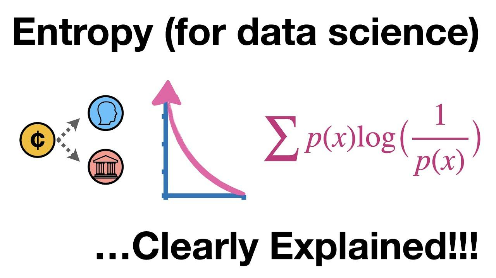

## Table of Contents

## What is entropy in the context of machine learning?

Entropy in machine learning is a measure of randomness or uncertainty in a dataset. Imagine you're trying to guess the outcome of flipping a coin. If the coin is fair, it's hard to predict whether it will land on heads or tails because both outcomes are equally likely. This high level of uncertainty is what we call high entropy. In machine learning, entropy helps us understand how mixed up our data is, which is important when we're trying to build models that can make good predictions.

When we use entropy in decision trees, for example, it helps us decide which feature to split on to make our predictions more accurate. We choose the feature that reduces entropy the most, meaning it makes our data less random and more organized. This process is called information gain. By reducing entropy, we're essentially making our model better at predicting outcomes because it's working with more certain, less random data. So, entropy is a key concept that helps us build more effective machine learning models.

## How is entropy used in decision trees?

In decision trees, entropy is used to measure how mixed up or uncertain the data is at each node. Imagine you're sorting a bunch of different colored balls into groups. If the balls are all mixed up, it's hard to predict what color you'll pick next. That's high entropy. But if you start sorting them into groups by color, it gets easier to predict, and the entropy goes down. In a decision tree, we use entropy to decide which question to ask next to make our predictions better. We choose the question that splits the data in a way that reduces entropy the most, making our groups more pure and easier to predict.

To calculate entropy, we use a formula that looks at the proportion of each class in the dataset. The formula for entropy $$H$$ is $$H = -\sum_{i=1}^{n} p_i \log_2(p_i)$$, where $$p_i$$ is the probability of class $$i$$, and $$n$$ is the number of classes. If all the data at a node belongs to one class, the entropy is zero because there's no uncertainty. But if the data is evenly split between classes, the entropy is at its highest, meaning the data is very mixed up. By choosing splits that reduce entropy, we're making our decision tree better at predicting the right class for new data.

## What is the mathematical formula for calculating entropy?

Entropy is a measure of how mixed up or uncertain your data is. Imagine you're trying to guess the outcome of flipping a coin. If the coin is fair, it's hard to predict whether it will land on heads or tails because both outcomes are equally likely. This high level of uncertainty is what we call high entropy. In math, we calculate entropy using a formula that looks at the probability of each possible outcome.

The formula for entropy $$H$$ is $$H = -\sum_{i=1}^{n} p_i \log_2(p_i)$$. Here, $$p_i$$ is the probability of the $$i$$-th outcome, and $$n$$ is the total number of possible outcomes. If all the data belongs to one category, the entropy is zero because there's no uncertainty. But if the data is evenly split between categories, the entropy is at its highest, showing that the data is very mixed up.

## Can you explain the concept of information gain in relation to entropy?

Information gain is a way to measure how much better a decision tree can predict outcomes after splitting the data. Imagine you're sorting a bunch of colored balls into groups. If you can ask a question that helps you sort the balls into more pure groups (like separating all the red balls from the rest), that's a good question. Information gain tells you how good that question is by looking at how much it reduces the uncertainty, or entropy, in your data.

In a decision tree, we use information gain to decide which feature to split on next. We calculate the entropy before the split and then the entropy after the split for each possible feature. The feature that gives us the biggest drop in entropy is the one we choose because it makes our predictions more accurate. The formula for information gain is $$IG(T, a) = H(T) - \sum_{v \in Values(a)} \frac{|T_v|}{|T|} H(T_v)$$, where $$H(T)$$ is the entropy of the dataset before the split, $$a$$ is the feature we're considering, $$Values(a)$$ are the possible values of that feature, $$T_v$$ is the subset of the dataset where feature $$a$$ has value $$v$$, and $$|T_v|$$ and $$|T|$$ are the sizes of those subsets and the whole dataset, respectively. By choosing the split that maximizes information gain, we're making our decision tree better at predicting the right class for new data.

## How does entropy relate to the purity of a dataset?

Entropy is a measure of how mixed up or uncertain your data is. Think of it like sorting a bunch of colored balls into groups. If all the balls are mixed up, it's hard to predict what color you'll pick next. That's high entropy. But if you sort them into groups by color, it gets easier to predict, and the entropy goes down. In a dataset, if all the data points belong to one category, the entropy is zero because there's no uncertainty. But if the data is evenly split between categories, the entropy is at its highest, meaning the data is very mixed up.

The purity of a dataset refers to how well it's sorted into groups. A pure dataset is one where all the data points in a group belong to the same category. Entropy helps us measure this purity. When we split a dataset in a decision tree, we want to make the groups as pure as possible. We do this by choosing the split that reduces entropy the most. The formula for entropy is $$H = -\sum_{i=1}^{n} p_i \log_2(p_i)$$, where $$p_i$$ is the probability of the $$i$$-th category, and $$n$$ is the number of categories. By reducing entropy, we're making our dataset more pure and our predictions more accurate.

## What role does entropy play in feature selection?

Entropy helps us choose the best features when building a decision tree. Imagine you're sorting a bunch of colored balls into groups. If you can ask a question that helps you sort the balls into more pure groups (like separating all the red balls from the rest), that's a good question. Entropy measures how mixed up the balls are. The best feature to split on is the one that reduces the entropy the most, making the groups more pure and easier to predict.

To find the best feature, we calculate the entropy before the split and then the entropy after the split for each possible feature. The feature that gives us the biggest drop in entropy is the one we choose because it makes our predictions more accurate. The formula for entropy is $$H = -\sum_{i=1}^{n} p_i \log_2(p_i)$$, where $$p_i$$ is the probability of the $$i$$-th category, and $$n$$ is the number of categories. By choosing the split that reduces entropy the most, we're making our decision tree better at predicting the right class for new data.

## How is entropy applied in different machine learning algorithms besides decision trees?

Entropy is used in many [machine learning](/wiki/machine-learning) algorithms beyond decision trees, like in random forests and boosting methods. In random forests, which are collections of decision trees, entropy helps each tree decide which features to split on. Just like in a single decision tree, the goal is to find splits that reduce entropy, making the data more organized and easier to predict. By using entropy, random forests can build many trees that work together to make better predictions.

Another place where entropy is used is in boosting algorithms, like AdaBoost. In these algorithms, entropy helps adjust the weights of the data points. If a data point is hard to predict correctly, its weight goes up, making it more important in the next round. Entropy helps measure how hard it is to predict the data, so the algorithm can focus on the tricky parts. By using entropy, boosting algorithms can improve their performance over time, making better and better predictions.

In clustering algorithms like K-means, entropy can be used to measure the quality of the clusters. A good clustering should have low entropy within each cluster, meaning the data points in a cluster are similar to each other. By minimizing the entropy within clusters, the algorithm can find groups that are more pure and meaningful. The formula for entropy $$H$$ is $$H = -\sum_{i=1}^{n} p_i \log_2(p_i)$$, where $$p_i$$ is the probability of the $$i$$-th category, and $$n$$ is the number of categories. By using entropy, clustering algorithms can create more accurate and useful groupings of the data.

## What are the limitations of using entropy as a measure in machine learning?

Entropy is a great tool for measuring how mixed up or uncertain our data is, but it has some limitations. One big problem is that entropy can be sensitive to small changes in the data. Imagine you're sorting colored balls into groups. If you add or remove just one ball, the entropy can change a lot, even if the overall mix of colors stays pretty much the same. This can make it hard to choose the best way to split the data in a decision tree or other algorithms that use entropy. Also, entropy assumes that all outcomes are equally important, which might not always be true in real life. If some outcomes are more important than others, entropy might not be the best way to measure uncertainty.

Another limitation is that entropy can be hard to understand and explain to people who aren't experts in math or machine learning. The formula for entropy $$H = -\sum_{i=1}^{n} p_i \log_2(p_i)$$ looks complicated and can be confusing. This can make it difficult to explain why a certain feature was chosen in a decision tree or why a clustering algorithm grouped the data in a certain way. Lastly, entropy might not work well with continuous data. It's designed for categorical data, where each data point fits into a clear category. With continuous data, like temperatures or heights, you might need to use other measures, like variance or information gain ratio, to understand how mixed up the data is.

## How can entropy be used to assess model performance?

Entropy can help us see how well a machine learning model is doing by measuring how mixed up or uncertain its predictions are. Imagine you're playing a guessing game where you try to predict the color of a ball. If your guesses are all over the place and hard to predict, that means high entropy. But if your guesses are more accurate and consistent, the entropy goes down. In machine learning, we can use entropy to check how well our model's predictions match the real outcomes. If the entropy of the model's predictions is low, it means the model is doing a good job at making clear and accurate predictions.

To use entropy for assessing model performance, we calculate the entropy of the model's predictions and compare it to the entropy of the actual data. The formula for entropy is $$H = -\sum_{i=1}^{n} p_i \log_2(p_i)$$, where $$p_i$$ is the probability of the $$i$$-th outcome, and $$n$$ is the number of possible outcomes. If the entropy of the predictions is much lower than the entropy of the actual data, it means the model is reducing uncertainty well and making good predictions. But if the entropy of the predictions is still high, it means the model is not doing a great job at sorting the data into clear groups, and we might need to improve the model or try a different approach.

## What advanced techniques exist for optimizing entropy in machine learning models?

One advanced technique for optimizing entropy in machine learning models is using ensemble methods like random forests and boosting algorithms. In a random forest, we build many decision trees, each using entropy to choose the best splits. By combining the predictions from all these trees, we can reduce the overall entropy and make more accurate predictions. In boosting algorithms like AdaBoost, we use entropy to adjust the weights of the data points. If a data point is hard to predict, its weight goes up, making it more important in the next round. This helps the model focus on the tricky parts and improve its performance over time.

Another technique is using information gain ratio instead of just information gain. Information gain can be biased towards features with many categories, so information gain ratio adjusts for this by dividing the information gain by the intrinsic value of the split. The formula for information gain ratio is $$IGR(T, a) = \frac{IG(T, a)}{IV(a)}$$, where $$IG(T, a)$$ is the information gain and $$IV(a)$$ is the intrinsic value of the split. This helps us choose splits that not only reduce entropy but also consider the complexity of the feature, leading to more balanced and effective decision trees.

Lastly, we can use entropy in feature selection to improve model performance. By calculating the entropy of each feature and how it changes after splitting, we can identify the most important features that help reduce uncertainty the most. This can be done using techniques like recursive feature elimination, where we keep removing the least important features until we find the best set. By focusing on the features that lower entropy the most, we can build models that are simpler and more accurate, making better predictions with less data.

## How does entropy contribute to understanding model complexity and overfitting?

Entropy helps us understand how complex a model is by showing how mixed up or uncertain the data is. Imagine you're sorting colored balls into groups. If the balls are all mixed up, it's hard to predict what color you'll pick next. That's high entropy. In a decision tree, if we keep splitting the data into smaller and smaller groups, the entropy might go down, but the tree gets more complex. A very complex tree might fit the training data perfectly but could be overfitting, meaning it's too focused on the training data and might not work well on new data. By looking at how entropy changes as we build the tree, we can see if the model is getting too complex and might be overfitting.

To prevent overfitting, we can use techniques like pruning, where we cut back parts of the tree that don't help reduce entropy much. This makes the tree simpler and less likely to overfit. Another way is to use ensemble methods like random forests, where we build many trees and combine their predictions. Each tree uses entropy to choose the best splits, but by combining them, we can reduce the overall entropy and make more accurate predictions without overfitting. The formula for entropy is $$H = -\sum_{i=1}^{n} p_i \log_2(p_i)$$, where $$p_i$$ is the probability of the $$i$$-th outcome, and $$n$$ is the number of possible outcomes. By keeping an eye on entropy, we can build models that are just complex enough to make good predictions without overfitting.

## Can you discuss any recent research or developments involving entropy in machine learning?

Recent research in machine learning has explored new ways to use entropy to improve model performance and interpretability. One interesting development is the use of entropy in [deep learning](/wiki/deep-learning) models, particularly in neural networks. Researchers have found that by measuring the entropy of the activations in different layers of a [neural network](/wiki/neural-network), they can better understand how the network processes information and makes decisions. This can help in designing more efficient architectures and in detecting when a model might be overfitting. For example, if the entropy of the activations in the later layers is very low, it might mean the model is too focused on the training data and not generalizing well to new data.

Another area of research involves using entropy to improve the fairness and robustness of machine learning models. By analyzing the entropy of the predictions across different groups of data, researchers can identify biases and work to reduce them. This is important for applications like healthcare and finance, where fairness is crucial. Additionally, entropy has been used to enhance the robustness of models against adversarial attacks. By measuring the entropy of the model's outputs when faced with slightly altered inputs, researchers can develop techniques to make the model more resistant to such attacks. The formula for entropy $$H = -\sum_{i=1}^{n} p_i \log_2(p_i)$$ remains a key tool in these efforts, helping to quantify uncertainty and guide improvements in model design and performance.

## References & Further Reading

[1]: Mitchell, T. M. (1997). ["Machine Learning."](https://www.cs.cmu.edu/~tom/mlbook.html) McGraw Hill.

[2]: Quinlan, J.R. (1986). ["Induction of Decision Trees."](https://link.springer.com/article/10.1007/BF00116251) Machine Learning, 1, 81–106.

[3]: Breiman, L. (2001). ["Random Forests."](https://link.springer.com/article/10.1023/A:1010933404324) Machine Learning, 45(1), 5-32.

[4]: Schapire, R. E. (1990). ["The strength of weak learnability."](http://rob.schapire.net/papers/strengthofweak.pdf) Machine Learning, 5(2), 197-227.

[5]: Bishop, C. M. (2006). ["Pattern Recognition and Machine Learning."](https://www.cs.uoi.gr/~arly/courses/ml/tmp/Bishop_book.pdf) Springer.

[6]: MacKay, D. J. C. (2003). ["Information Theory, Inference, and Learning Algorithms."](https://assets.cambridge.org/97805216/42989/frontmatter/9780521642989_frontmatter.pdf) Cambridge University Press.

[7]: Hastie, T., Tibshirani, R., & Friedman, J. (2009). ["The Elements of Statistical Learning: Data Mining, Inference, and Prediction."](https://link.springer.com/book/10.1007/978-0-387-84858-7) Springer.