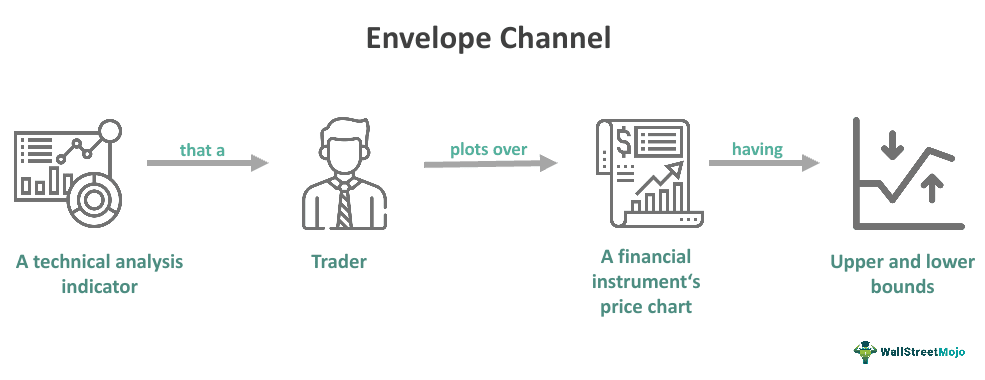

Envelope channels are vital components within the domain of technical analysis, primarily serving as tools for price modeling and trading decision-making processes. Their significance is further amplified in algorithmic trading, where precision and speed are paramount. These channels essentially provide a structured method to assess market dynamics by creating a trading band formed by two moving averages positioned symmetrically around a central moving average. This configuration facilitates an objective framework for detecting potential market reversals and identifying optimal entry and exit points.

This article offers an extensive exploration of envelope channels, dissecting their essential role in trading and examining their application through algorithmic strategies. By understanding the functional elements of envelope channels, traders can better construct algorithmic models that automate decision-making and minimize emotional biases. Practical examples will shed light on the mechanics of these tools, elucidating their integration into automated trading systems to enhance trading accuracy and efficiency.



In essence, envelope channels assist in navigating the complexities of financial markets by enabling traders to visualize potential price thresholds. This insight is crucial for evaluating when markets might become overbought or oversold, providing a basis for strategic trading actions. Through this article, insights will be shared on how envelope channels can enhance trading systems and improve outcomes, underlining their indispensable role in the evolving landscape of algorithmic trading.

## Table of Contents

## What Is an Envelope Channel?

Envelope channels are a fundamental concept in technical analysis, playing a significant role in identifying potential trading opportunities by establishing visual boundaries around price movements. These channels are constructed using two primary components: a central moving average and two accompanying lines known as the bands. These bands are positioned at a set distance above and below the moving average, forming what is commonly referred to as a trading band.

The construction of an envelope channel starts with selecting a moving average, which could be a simple moving average (SMA), an exponential moving average (EMA), or any other variant. The moving average represents the central tendency of the price over a specified period. Once the moving average is determined, the next step involves setting the upper and lower bands at a fixed percentage distance from this average. These percentages can vary depending on the asset's volatility, trader preferences, or specific market conditions. For instance, if a 5% deviation is chosen, the upper band is calculated as 105% of the moving average, while the lower band is 95%.

In some formulations, instead of a fixed percentage, traders might opt to use a standard deviation to determine the position of the bands. This approach allows the envelope to adjust dynamically to changing market volatility, as periods of higher volatility will naturally lead to wider envelopes, while lower volatility will result in tighter envelopes. The mathematical representation for the bands when using standard deviation can be expressed as:

$$
\text{Upper Band} = \text{MA}(n) + k \times \sigma
$$
$$
\text{Lower Band} = \text{MA}(n) - k \times \sigma
$$

where $\text{MA}(n)$ is the moving average over n periods, $\sigma$ is the standard deviation of the price over the same period, and $k$ is a constant multiplier determining the width of the band.

Envelope channels offer a visual framework that helps traders to identify potential overbought or oversold conditions in the market. When the price touches or crosses the upper band, it might indicate an overbought condition, suggesting a potential price reversal or a sell signal. Conversely, interaction with the lower band may indicate an oversold condition, possibly signaling a buy opportunity. However, these interpretations should be carefully corroborated with other indicators and market analysis to enhance decision-making efficacy.

## How Envelope Channels Work

Envelope channels are a dynamic tool used in technical analysis, primarily due to their ability to adapt to market conditions by expanding and contracting based on [volatility](/wiki/volatility-trading-strategies). The core functionality of these channels lies in identifying potential entry and [exit](/wiki/exit-strategy) points in trading, aiding traders to recognize buy and sell signaling opportunities with greater accuracy.

These channels consist of two bands that surround a central moving average. As market volatility increases, the bands will widen, and they will narrow as volatility decreases. This behavior provides a visual gauge of potential overbought or oversold market conditions. The expansion and contraction are typically adjusted through either a fixed percentage or by leveraging standard deviation calculations tied to the moving average. 

The envelopes can be customized with different types of moving averages, such as simple moving averages (SMA), exponential moving averages (EMA), or weighted moving averages (WMA), and can also vary in length to better fit the characteristics of a particular trading instrument or market condition. This flexibility is crucial for enhancing their predictive power and ensuring they align with the trader’s objectives.

For instance, assume the application of a simple moving average (SMA) over a defined period, such as 20 days. The upper and lower bands could be set at a fixed percentage, such as 5% above and below the SMA. The mathematical representation of these bands could be expressed as follows:

- Upper Band: $Upper\ Band = SMA_{20} \times (1 + \frac{Percentage}{100})$
- Lower Band: $Lower\ Band = SMA_{20} \times (1 - \frac{Percentage}{100})$

Here’s how you might calculate such an envelope channel in Python:

```python
import pandas as pd

def calculate_envelope(sma, percentage):
    upper_band = sma * (1 + percentage/100)
    lower_band = sma * (1 - percentage/100)
    return upper_band, lower_band

# Sample data: a list of closing prices
closing_prices = [100, 102, 104, 101, 98, 97, 105, 107, 106, 104, 102, 100]
data = pd.DataFrame(closing_prices, columns=['Close'])

# Calculate the 20-day simple moving average
data['SMA20'] = data['Close'].rolling(window=20).mean()

# Calculate the envelope channels
data['UpperBand'], data['LowerBand'] = calculate_envelope(data['SMA20'], 5)

print(data)
```

In this example, the calculation creates an envelope channel around a 20-day SMA with a 5% deviation. By customizing the envelope settings, traders can optimize these channels to cater to various financial instruments and adjust for changing market climates. Combining these technical tools with other indicators enhances their accuracy and reliability in signaling, thereby providing a robust framework for executing trades efficiently.

## Technical Example and Calculations

Envelope channels are primarily constructed using a simple moving average (SMA) over a specific period, such as 20 days. This central SMA is augmented with two bands—an upper and a lower—set at a fixed percentage above and below the SMA. These bands create the envelope around the price data, visually assisting traders in identifying potential overbought and oversold levels. Let's break down the technical setup with calculations and coding examples to illustrate how this can be implemented using common trading software and Python.

### Calculation Example

Assume we are analyzing a financial instrument with daily closing prices. The envelope channel will be based on a 20-day SMA with the bands set at 5% above and below the SMA. Here are the steps to calculate and interpret the envelope channel:

1. **Calculate the 20-day SMA:**
$$
   \text{SMA}_{20} = \frac{\sum_{i=1}^{20} \text{Price}_i}{20}

$$

2. **Determine the upper and lower bands:**
$$
   \text{Upper Band} = \text{SMA}_{20} \times (1 + 0.05)

$$
$$
   \text{Lower Band} = \text{SMA}_{20} \times (1 - 0.05)

$$

These bands are plotted alongside the closing prices to form the envelope channel.

### Python Example

Here is how you can implement the envelope channel calculations in Python using the Pandas library, which is often used in financial data analysis:

```python
import pandas as pd

# Sample data: Daily closing prices
data = {'Close': [100, 102, 101, 105, 107, 110, 108, 107, 111, 115, 116, 114, 112, 113, 118, 120, 121, 123, 125, 128]}
df = pd.DataFrame(data)

# Calculate the 20-day simple moving average
df['SMA_20'] = df['Close'].rolling(window=20).mean()

# Calculate the envelope upper and lower bands (5% deviation)
df['Upper_Band'] = df['SMA_20'] * 1.05
df['Lower_Band'] = df['SMA_20'] * 0.95

# Print the DataFrame to see the calculated values
print(df)
```

In this code:
- We calculate the 20-day SMA using the rolling function.
- The Upper and Lower Bands are 5% above and below the calculated SMA values.

### Interpretation

When the price crosses above the upper band, it may be considered a signal that the asset is overbought, which could precede a price pullback. Conversely, when the price falls below the lower band, it can indicate an oversold condition, potentially signaling a buying opportunity.

### Practical Use in Trading Software

In many trading platforms, envelope channels can be set up using built-in technical analysis tools:
- Select the moving average period, such as 20 days.
- Define the percentage deviation to set the upper and lower bands.
- Use the visualization on price charts to support decision-making in trade entries and exits.

This technical framework simplifies the detection of potential market entry and exit points, enhancing trading strategies through well-defined thresholds.

Envelope channels offer a foundational technique in [quantitative trading](/wiki/quantitative-trading) strategies, maximizing precision and reducing emotional bias by adhering to systematic calculations and rules.

## Implementing Envelope Channels in Algorithmic Trading

Envelope channels represent a potent tool in [algorithmic trading](/wiki/algorithmic-trading) by offering automated mechanisms to execute trading strategies based on market conditions. When implementing envelope channels in algorithmic systems, several components must be considered to ensure their effectiveness and precision.

Firstly, setting up an envelope channel requires determining the moving average type and the percentage deviation for the upper and lower bounds. A popular choice is the simple moving average (SMA), though other types like exponential moving averages (EMA) can be employed depending on the responsiveness desired. The envelope bands are typically set at a fixed percentage from the moving average to encompass varying price ranges.

In Python, the setup for an envelope channel might look like this:

```python
import pandas as pd

def calculate_envelope_channel(data, moving_average_period=20, percentage=0.05):
    data['SMA'] = data['Close'].rolling(window=moving_average_period).mean()
    data['Upper Band'] = data['SMA'] * (1 + percentage)
    data['Lower Band'] = data['SMA'] * (1 - percentage)
    return data

# Example usage
# Assuming 'df' is a DataFrame with historical stock data with a 'Close' column
envelope_df = calculate_envelope_channel(df)
```

Once the envelope is defined, the next step is integrating these indicators into trading algorithms. This involves specifying clear entry and exit conditions based on the price movements relative to the envelope bands. For instance, a common strategy might be to execute a buy when the price falls below the lower band and to initiate a sell when the price rises above the upper band.

Automation through algorithms not only streamlines the execution but also reduces the emotional bias typically associated with manual trading. Python libraries such as `pandas` for data manipulation and `[backtrader](/wiki/backtrader)` for [backtesting](/wiki/backtesting) provide robust environments to develop and test these strategies.

```python
import backtrader as bt

class EnvelopeStrategy(bt.Strategy):
    params = (('ma_period', 20), ('percentage', 0.05),)

    def __init__(self):
        self.sma = bt.indicators.SimpleMovingAverage(self.data.close, period=self.params.ma_period)
        self.upper_band = self.sma * (1 + self.params.percentage)
        self.lower_band = self.sma * (1 - self.params.percentage)

    def next(self):
        if self.data.close < self.lower_band:
            self.buy()
        elif self.data.close > self.upper_band:
            self.sell()

# Set up the backtest and run it
cerebro = bt.Cerebro()
cerebro.addstrategy(EnvelopeStrategy)
cerebro.adddata(bt.feeds.PandasData(dataname=df))
cerebro.run()
```

Incorporating envelope channels into algorithmic trading provides traders with a structured approach to handling trades. Nonetheless, it's essential to backtest the strategies to verify their performance under different market conditions. This process ensures that the strategy is not only sound theoretically but also practical and profitable in real-world scenarios.

## Benefits and Limitations

Envelope channels are highly valued in technical analysis for their ability to delineate potential reversals and provide traders with a visual representation of market trends. By setting bands above and below a central moving average, envelope channels outline price levels that may signify overbought or oversold conditions. This visualization aids traders in making informed decisions when entering or exiting positions based on anticipated price movements.

However, envelope channels are not without limitations. One significant drawback is their susceptibility to false signals during periods of heightened market volatility. In such conditions, price movements may breach the envelope bands frequently, thereby generating misleading buy or sell signals. This occurs because envelope channels, by nature, adjust dynamically with price fluctuations. The effectiveness of these signals may diminish as volatility increases, potentially leading to misguided trading decisions. 

To mitigate the risks associated with false signals, traders often combine envelope channels with other technical indicators. Indicators such as Relative Strength Index (RSI), Moving Average Convergence Divergence (MACD), or Bollinger Bands can be used in conjunction with envelope channels to provide additional layers of confirmation before executing trades. This multi-indicator strategy helps in filtering out noise and improving the accuracy of signal recognition.

For example, here is a basic Python script using a combination of an envelope channel and RSI to generate buy/sell signals:

```python
import pandas as pd

def envelope_channel(data, window=20, perc=0.05):
    sma = data['Close'].rolling(window=window).mean()
    upper_band = sma * (1 + perc)
    lower_band = sma * (1 - perc)
    return sma, upper_band, lower_band

def rsi(data, window=14):
    delta = data['Close'].diff()
    gain = (delta.where(delta > 0, 0)).rolling(window=window).mean()
    loss = (-delta.where(delta < 0, 0)).rolling(window=window).mean()
    rs = gain / loss
    return 100 - (100 / (1 + rs))

data = pd.DataFrame({'Close': [...]})  # Replace with actual data
sma, upper, lower = envelope_channel(data)
data['RSI'] = rsi(data)

# Signal Generation
data['Signal'] = 0
data.loc[(data['Close'] < lower) & (data['RSI'] < 30), 'Signal'] = 1  # Buy
data.loc[(data['Close'] > upper) & (data['RSI'] > 70), 'Signal'] = -1  # Sell
```

In conclusion, while envelope channels provide a valuable method for visualizing market dynamics and identifying potential reversals, their reliability can be compromised in volatile markets. Integrating additional indicators into the analysis framework is crucial to enhancing trading decisions and minimizing associated risks.

## Conclusion and Practical Insights

Envelope channels represent a potent resource for traders aiming to optimize their algorithmic strategies. By effectively utilizing these channels, traders can enhance their trading efficiency and results. At their core, envelope channels offer a visual aid for identifying the potential overbought or oversold conditions in the market, serving as a guide for potential reversals or continuations of market trends. This section aims to consolidate the benefits of envelope channels and provide actionable insights on fine-tuning settings to adapt to diverse market scenarios.

To harness the full potential of envelope channels, a solid understanding of their construction and application is essential. Traders can significantly improve their decision-making by adjusting parameters such as the type of moving average, the percentage bands around the average, and the time frame used. A common setup might employ a 20-day simple moving average with a 5% deviation to form the envelope bands. This configuration can be adapted based on empirical observations of asset behavior.

```python
import pandas as pd

# Example Python code to calculate envelope channels
def calculate_envelope(data, window=20, percentage=0.05):
    data['SMA'] = data['Close'].rolling(window=window).mean()
    data['Upper Band'] = data['SMA'] * (1 + percentage)
    data['Lower Band'] = data['SMA'] * (1 - percentage)
    return data

# Assuming 'data' is a DataFrame with 'Close' prices
data = pd.DataFrame({'Close': [/* ...data... */]})
envelope_data = calculate_envelope(data)
```

The above code snippet demonstrates how traders can automate the calculation of envelope channels using Python, easily integrating this approach into broader algorithmic strategies. By fine-tuning parameters like the window size or percentage, traders can align the envelope channels with their specific risk tolerance and trading objectives.

While the utility of envelope channels as predictive tools is substantial, relying solely on this indicator can lead to inaccuracies, especially during volatile market periods. Traders should therefore integrate envelope channels with other technical analysis tools such as Relative Strength Index (RSI) or Moving Average Convergence Divergence (MACD) to filter out false signals and improve trading outcomes.

Envelope channels, when deployed appropriately, can greatly assist traders in navigating complex market landscapes. Such integration not only automate trading processes but also enhances precision by removing emotional biases that impede trading decisions. As market conditions vary, continuously optimizing and adjusting the parameters of envelope channels remains a critical practice for maximizing their effectiveness.

## References & Further Reading

[1]: Bollinger, J. (2002). ["Bollinger on Bollinger Bands."](https://archive.org/download/BollingerOnBollingerBands/Bollinger%20On%20Bollinger%20Bands.pdf) McGraw-Hill.

[2]: Kaufman, P. J. (2013). ["Trading Systems and Methods + Website."](https://www.amazon.com/Trading-Systems-Methods-Website-Wiley/dp/1118043561) Wiley.

[3]: Murphy, J. J. (1999). ["Technical Analysis of the Financial Markets: A Comprehensive Guide to Trading Methods and Applications."](https://archive.org/details/technicalanalysi0000murp) New York Institute of Finance.

[4]: Chan, E. (2009). ["Quantitative Trading: How to Build Your Own Algorithmic Trading Business."](https://github.com/ftvision/quant_trading_echan_book) Wiley.

[5]: Hull, J. C. (2015). ["Options, Futures, and Other Derivatives."](https://archive.org/download/economia-usp/Hull%20J.C.-Options%2C%20Futures%20and%20Other%20Derivatives_9th%20edition.pdf) Pearson.