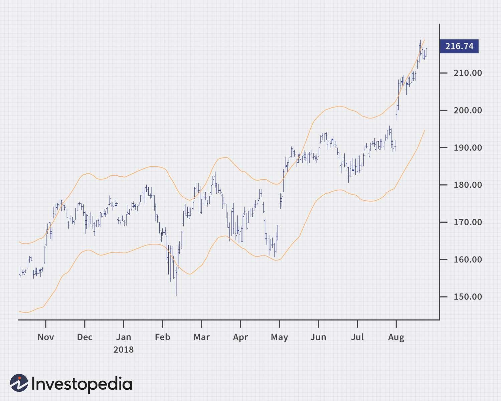

## Table of Contents

## What is an Envelope Channel?

An Envelope Channel is a tool used in technical analysis to help traders understand how a stock or other asset is moving. It consists of two lines drawn around the price of the asset. The top line is called the upper envelope, and the bottom line is called the lower envelope. These lines are usually set a certain percentage above and below a moving average of the asset's price. The moving average is a line that shows the average price of the asset over a certain period of time.

Traders use the Envelope Channel to see if an asset's price is moving too far away from its average price. If the price touches or goes beyond the upper envelope, it might mean the asset is overbought, which means it could be overpriced and might go down soon. If the price touches or goes below the lower envelope, it might mean the asset is oversold, which means it could be underpriced and might go up soon. By watching how the price interacts with these envelopes, traders can make better decisions about when to buy or sell the asset.

## How does an Envelope Channel work?

An Envelope Channel works by drawing two lines around the price of an asset, like a stock or a currency. The middle of these lines is a moving average, which is just the average price of the asset over a certain time. The top line, called the upper envelope, is set a little bit above the moving average, usually by a certain percentage. The bottom line, called the lower envelope, is set the same amount below the moving average. These lines create a channel that the price moves within.

Traders use this channel to see if the price is getting too high or too low compared to its average. If the price goes up and touches or goes beyond the upper envelope, it might mean the asset is overbought. This means it could be too expensive and might start to go down soon. On the other hand, if the price goes down and touches or goes below the lower envelope, it might mean the asset is oversold. This means it could be too cheap and might start to go up soon. By watching where the price is in relation to these envelopes, traders can decide when it might be a good time to buy or sell.

## What are the main components of an Envelope Channel?

The main components of an Envelope Channel are the moving average, the upper envelope, and the lower envelope. The moving average is a line that shows the average price of an asset over a certain period of time. This line helps traders see the general direction the price is moving. The upper envelope is a line drawn a little bit above the moving average, usually by a set percentage. It acts like a ceiling for the price. The lower envelope is a line drawn the same amount below the moving average. It acts like a floor for the price.

These three components work together to form a channel around the price of the asset. When the price of the asset gets close to or touches the upper envelope, it might mean the asset is overbought, which means it could be too expensive and might start to go down. When the price gets close to or touches the lower envelope, it might mean the asset is oversold, which means it could be too cheap and might start to go up. By watching how the price moves within this channel, traders can make better decisions about when to buy or sell the asset.

## What are the benefits of using an Envelope Channel in trading?

Using an Envelope Channel in trading can help traders see if a stock or other asset is getting too expensive or too cheap. It does this by showing two lines around the price of the asset. One line is above the average price, and the other is below it. If the price goes up and touches the top line, it might mean the asset is overbought, which means it could be overpriced and might go down soon. If the price goes down and touches the bottom line, it might mean the asset is oversold, which means it could be underpriced and might go up soon. This helps traders decide when to buy or sell the asset.

Another benefit of using an Envelope Channel is that it can help traders see the general direction of the price. The middle line of the channel is the average price over time, which shows if the price is generally going up or down. By watching how the price moves around this average, traders can get a better idea of the market's trend. This can help them make smarter trading decisions based on whether the market is trending up, down, or staying the same.

## How do you set up an Envelope Channel on a trading platform?

Setting up an Envelope Channel on a trading platform is pretty easy. First, you need to choose the moving average you want to use. This could be a simple moving average or an exponential moving average, depending on what you like. Once you've picked that, you'll set the time period for the moving average. This could be 20 days, 50 days, or any other number of days that you think works best. Then, you decide how far above and below the moving average you want the envelopes to be. This is usually a percentage, like 5% above and 5% below.

After you've made these choices, you just add the Envelope Channel to your chart on the trading platform. Most platforms have a tool or indicator section where you can find the Envelope Channel. You click on it, and then you'll see a box where you can enter the settings you decided on earlier. Once you enter those settings and click apply, you'll see the Envelope Channel on your chart. It will show you the moving average line in the middle, with the upper and lower envelopes around it. Now you can use it to help you make trading decisions by watching how the price moves within the channel.

## What are the common strategies for trading with Envelope Channels?

One common strategy for trading with Envelope Channels is to buy when the price touches the lower envelope and sell when it touches the upper envelope. This strategy is based on the idea that when the price hits the lower envelope, the asset might be oversold and could go up soon. When it hits the upper envelope, the asset might be overbought and could go down soon. Traders using this strategy will look for the price to bounce off these envelopes as a signal to enter or [exit](/wiki/exit-strategy) trades.

Another strategy is to use Envelope Channels to confirm trends. If the price is consistently touching the upper envelope, it might mean there's a strong uptrend. In this case, traders might keep buying the asset as long as the price stays within the channel and doesn't break below the lower envelope. On the other hand, if the price is often touching the lower envelope, it might indicate a strong downtrend. Traders might then keep selling or shorting the asset as long as the price stays within the channel and doesn't break above the upper envelope. This helps traders stay in line with the market's direction.

A third strategy involves using Envelope Channels to spot potential breakouts. If the price breaks above the upper envelope, it could signal the start of a new uptrend. Traders might buy the asset in anticipation of further price increases. Conversely, if the price breaks below the lower envelope, it could signal the start of a new downtrend. Traders might sell or short the asset expecting the price to keep falling. Watching for these breakouts can help traders catch big moves early on.

## How can Envelope Channels be used to identify overbought and oversold conditions?

Envelope Channels help traders see if a stock or other asset is overbought or oversold by drawing two lines around the price. The top line, called the upper envelope, is a bit above the average price. If the price touches or goes beyond this line, it might mean the asset is overbought. This means it could be too expensive and might start to go down soon. Traders watch for this because it can be a good time to sell the asset before the price drops.

The bottom line, called the lower envelope, is a bit below the average price. If the price touches or goes below this line, it might mean the asset is oversold. This means it could be too cheap and might start to go up soon. Traders look for this because it can be a good time to buy the asset before the price rises. By watching how the price moves within these envelopes, traders can make better decisions about when to buy or sell.

## What are the key differences between Envelope Channels and other technical indicators like Bollinger Bands?

Envelope Channels and Bollinger Bands are both used to help traders see if a stock or other asset is overbought or oversold, but they work a bit differently. Envelope Channels use a moving average and draw two lines around it, one a set percentage above and one a set percentage below. This means the distance between the upper and lower lines stays the same no matter what the price does. Bollinger Bands, on the other hand, also use a moving average, but the lines around it change based on how much the price is moving around. The top and bottom lines of Bollinger Bands are set at a certain number of standard deviations away from the moving average, so they get wider when the price is moving a lot and narrower when it's not.

Another key difference is how traders use these indicators. With Envelope Channels, traders often look for the price to touch the upper or lower line as a signal to buy or sell. If the price touches the upper line, it might be overbought, and if it touches the lower line, it might be oversold. Bollinger Bands are used in a similar way, but traders also pay attention to how wide the bands are. When the bands get very wide, it might mean the price is about to calm down, and when they get very narrow, it might mean the price is about to start moving a lot. So, while both tools help traders see if an asset is overbought or oversold, they give different kinds of information and can be used in different ways.

## How can the settings of an Envelope Channel be optimized for different markets?

To optimize the settings of an Envelope Channel for different markets, you need to think about how fast the market moves and how much it changes. For markets that move quickly, like stocks or [forex](/wiki/forex-system), you might want to use a shorter time period for the moving average, like 10 or 20 days. This helps the Envelope Channel react faster to price changes. You might also want to set the envelopes closer to the moving average, maybe at 2% or 3%, so you can catch more trading signals. For slower markets, like commodities or some ETFs, a longer time period for the moving average, like 50 or 100 days, might work better. You could set the envelopes further away, maybe at 5% or 10%, to avoid getting too many false signals.

Testing different settings is a good idea to see what works best for the market you're trading. You can use past data to see how well different settings would have worked. This is called [backtesting](/wiki/backtesting). By trying out different time periods for the moving average and different percentages for the envelopes, you can find the settings that give you the best results for your specific market. Remember, what works well in one market might not work as well in another, so it's important to keep testing and adjusting your settings as you go.

## What are the potential pitfalls and limitations of using Envelope Channels?

Using Envelope Channels can have some problems. One big issue is that they might give you false signals. This happens when the price touches the top or bottom line, but then it doesn't do what you expect. For example, if the price touches the bottom line and you think it's a good time to buy because it's oversold, but then the price keeps going down instead of going up. This can make you lose money if you trade based on these signals without looking at other things too.

Another limitation is that Envelope Channels work best in markets that move in a steady way. If the market is moving a lot and changing direction often, the Envelope Channel might not be very helpful. It's also important to remember that Envelope Channels are just one tool. They don't tell you everything about the market. You need to use them with other tools and information to make the best trading decisions.

## How can Envelope Channels be integrated with other technical analysis tools for better results?

Envelope Channels can be used with other tools to help traders make better decisions. One way to do this is by using them with trend lines. Trend lines show the overall direction of the market. If the price is going up and touching the upper envelope, and it's also following an upward trend line, it can give you more confidence that it's a good time to buy. On the other hand, if the price is going down and touching the lower envelope while following a downward trend line, it can be a good sign to sell. By using Envelope Channels with trend lines, you get a clearer picture of what the market might do next.

Another tool that works well with Envelope Channels is the Relative Strength Index (RSI). The RSI helps you see if a stock is overbought or oversold. If the price touches the upper envelope and the RSI is above 70, it's a strong sign that the stock might be overbought and could go down soon. If the price touches the lower envelope and the RSI is below 30, it's a strong sign that the stock might be oversold and could go up soon. Using Envelope Channels and RSI together gives you two different ways to check if a stock is overbought or oversold, making your trading decisions more reliable.

## What advanced techniques can be applied to Envelope Channels for expert traders?

Expert traders can use something called "multiple time frame analysis" with Envelope Channels. This means looking at the same stock or asset on different time frames, like daily, weekly, and monthly charts. By doing this, traders can see if the signals from the Envelope Channels on the shorter time frames match up with the bigger trends on the longer time frames. For example, if the price touches the lower envelope on a daily chart and it's also following a downward trend on a weekly chart, it might be a stronger signal to sell. This helps traders make more confident decisions by seeing how different time frames line up.

Another advanced technique is to use Envelope Channels with other indicators like the Moving Average Convergence Divergence (MACD). The MACD helps traders see if the price is gaining or losing [momentum](/wiki/momentum). If the price touches the upper envelope and the MACD is showing a bearish crossover (when the MACD line crosses below the signal line), it could mean the price is about to go down. On the other hand, if the price touches the lower envelope and the MACD shows a bullish crossover (when the MACD line crosses above the signal line), it could mean the price is about to go up. By combining Envelope Channels with the MACD, expert traders can get a better sense of when to enter or exit trades based on both price position and momentum.

## What is an envelope channel?

Envelope channels are a fundamental concept in technical analysis, playing a significant role in identifying potential trading opportunities by establishing visual boundaries around price movements. These channels are constructed using two primary components: a central moving average and two accompanying lines known as the bands. These bands are positioned at a set distance above and below the moving average, forming what is commonly referred to as a trading band.

The construction of an envelope channel starts with selecting a moving average, which could be a simple moving average (SMA), an exponential moving average (EMA), or any other variant. The moving average represents the central tendency of the price over a specified period. Once the moving average is determined, the next step involves setting the upper and lower bands at a fixed percentage distance from this average. These percentages can vary depending on the asset's [volatility](/wiki/volatility-trading-strategies), trader preferences, or specific market conditions. For instance, if a 5% deviation is chosen, the upper band is calculated as 105% of the moving average, while the lower band is 95%.

In some formulations, instead of a fixed percentage, traders might opt to use a standard deviation to determine the position of the bands. This approach allows the envelope to adjust dynamically to changing market volatility, as periods of higher volatility will naturally lead to wider envelopes, while lower volatility will result in tighter envelopes. The mathematical representation for the bands when using standard deviation can be expressed as:

$$
\text{Upper Band} = \text{MA}(n) + k \times \sigma
$$
$$
\text{Lower Band} = \text{MA}(n) - k \times \sigma
$$

where $\text{MA}(n)$ is the moving average over n periods, $\sigma$ is the standard deviation of the price over the same period, and $k$ is a constant multiplier determining the width of the band.

Envelope channels offer a visual framework that helps traders to identify potential overbought or oversold conditions in the market. When the price touches or crosses the upper band, it might indicate an overbought condition, suggesting a potential price reversal or a sell signal. Conversely, interaction with the lower band may indicate an oversold condition, possibly signaling a buy opportunity. However, these interpretations should be carefully corroborated with other indicators and market analysis to enhance decision-making efficacy.

## What are some technical examples and how are the calculations performed?

Envelope channels are primarily constructed using a simple moving average (SMA) over a specific period, such as 20 days. This central SMA is augmented with two bands—an upper and a lower—set at a fixed percentage above and below the SMA. These bands create the envelope around the price data, visually assisting traders in identifying potential overbought and oversold levels. Let's break down the technical setup with calculations and coding examples to illustrate how this can be implemented using common trading software and Python.

### Calculation Example

Assume we are analyzing a financial instrument with daily closing prices. The envelope channel will be based on a 20-day SMA with the bands set at 5% above and below the SMA. Here are the steps to calculate and interpret the envelope channel:

1. **Calculate the 20-day SMA:**
$$
   \text{SMA}_{20} = \frac{\sum_{i=1}^{20} \text{Price}_i}{20}

$$

2. **Determine the upper and lower bands:**
$$
   \text{Upper Band} = \text{SMA}_{20} \times (1 + 0.05)

$$
$$
   \text{Lower Band} = \text{SMA}_{20} \times (1 - 0.05)

$$

These bands are plotted alongside the closing prices to form the envelope channel.

### Python Example

Here is how you can implement the envelope channel calculations in Python using the Pandas library, which is often used in financial data analysis:

```python
import pandas as pd

# Sample data: Daily closing prices
data = {'Close': [100, 102, 101, 105, 107, 110, 108, 107, 111, 115, 116, 114, 112, 113, 118, 120, 121, 123, 125, 128]}
df = pd.DataFrame(data)

# Calculate the 20-day simple moving average
df['SMA_20'] = df['Close'].rolling(window=20).mean()

# Calculate the envelope upper and lower bands (5% deviation)
df['Upper_Band'] = df['SMA_20'] * 1.05
df['Lower_Band'] = df['SMA_20'] * 0.95

# Print the DataFrame to see the calculated values
print(df)
```

In this code:
- We calculate the 20-day SMA using the rolling function.
- The Upper and Lower Bands are 5% above and below the calculated SMA values.

### Interpretation

When the price crosses above the upper band, it may be considered a signal that the asset is overbought, which could precede a price pullback. Conversely, when the price falls below the lower band, it can indicate an oversold condition, potentially signaling a buying opportunity.

### Practical Use in Trading Software

In many trading platforms, envelope channels can be set up using built-in technical analysis tools:
- Select the moving average period, such as 20 days.
- Define the percentage deviation to set the upper and lower bands.
- Use the visualization on price charts to support decision-making in trade entries and exits.

This technical framework simplifies the detection of potential market entry and exit points, enhancing trading strategies through well-defined thresholds.

Envelope channels offer a foundational technique in [quantitative trading](/wiki/quantitative-trading) strategies, maximizing precision and reducing emotional bias by adhering to systematic calculations and rules.

## References & Further Reading

[1]: Bollinger, J. (2002). ["Bollinger on Bollinger Bands."](https://archive.org/download/BollingerOnBollingerBands/Bollinger%20On%20Bollinger%20Bands.pdf) McGraw-Hill.

[2]: Kaufman, P. J. (2013). ["Trading Systems and Methods + Website."](https://www.amazon.com/Trading-Systems-Methods-Website-Wiley/dp/1118043561) Wiley.

[3]: Murphy, J. J. (1999). ["Technical Analysis of the Financial Markets: A Comprehensive Guide to Trading Methods and Applications."](https://archive.org/details/technicalanalysi0000murp) New York Institute of Finance.

[4]: Chan, E. (2009). ["Quantitative Trading: How to Build Your Own Algorithmic Trading Business."](https://github.com/ftvision/quant_trading_echan_book) Wiley.

[5]: Hull, J. C. (2015). ["Options, Futures, and Other Derivatives."](https://archive.org/download/economia-usp/Hull%20J.C.-Options%2C%20Futures%20and%20Other%20Derivatives_9th%20edition.pdf) Pearson.