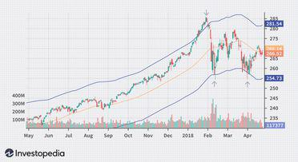

The intersection of diverse industries often leads to innovative solutions, and the collaboration between the postal service, envelope market, and algorithmic trading (algo trading) is a compelling example. In the digital age, the postal service is undergoing significant transformations, as technological advancements introduce new players and methods that redefine how mail is delivered and processed. This evolution extends beyond logistical enhancements, reaching into financial strategies where mailing services integrate with high-speed trading operations.

Algorithmic trading, which utilizes computer algorithms to execute trade orders at impressive velocities, relies heavily on data precision and expediency. It represents a sophisticated financial strategy that merges traditional economic principles with cutting-edge technology. Envelopes, both as physical items in the postal service and as technical indicators in trading charts, serve as bridges between these worlds. In trading, envelope indicators determine upper and lower boundaries surrounding a moving average, providing crucial insights into market conditions. These technical indicators enable traders to identify overbought or oversold conditions and craft strategies to capitalize on market movements efficiently.



Understanding the intricate relationship between the postal services, envelope market, and algo trading is becoming increasingly important as financial technologies progress. This interaction not only underscores the role of traditional services in the digital age but also highlights the necessity for technological adoption across sectors. For traders and businesses, recognizing these intersections is crucial to adapting to a rapidly evolving financial landscape where innovative solutions are key to maintaining a competitive edge.

## Table of Contents

## Understanding Envelopes in Technical Analysis

The concept of 'envelopes' in trading involves using technical indicators that are plotted over a price chart to outline upper and lower bounds for asset prices. These bounds are instrumental in identifying overbought or oversold conditions within the market. Typically, envelopes are derived from moving averages, which help smooth out price data and highlight trends over time. Traders utilize these boundaries to determine optimal entry and exit points for trades, leveraging price movements within the specified envelope.

The construction of envelopes begins with calculating a moving average for the asset's price. A simple moving average (SMA) can suffice, though more sophisticated methods like the exponential moving average (EMA) or weighted moving average (WMA) may also be employed. Once the moving average is established, the envelope is formed by creating lines above and below it, often set at a specified percentage distance.

For example, if an SMA of a stock is calculated at $50, and the envelope percentage is set to 2%, the upper and lower bounds of the envelope would be positioned at $51 and $49, respectively. This can be expressed mathematically as:
$$
\text{Upper Bound} = \text{SMA} + (\text{SMA} \times \text{Envelope Percentage})
$$
$$
\text{Lower Bound} = \text{SMA} - (\text{SMA} \times \text{Envelope Percentage})
$$

Traders monitor these bounds for signals. When the asset's price touches or breaches the upper envelope, it may indicate an overbought condition, suggesting potential for price reversal or selling opportunities. Conversely, a touch or breach of the lower envelope can signal an oversold condition, offering potential buying opportunities.

In [algorithmic trading](/wiki/algorithmic-trading), these envelope indicators are crucial as they provide the algorithm with precise parameters to trigger buy or sell actions. This precision allows algorithms to automate trades at high speeds, capitalizing on market inefficiencies or price movements as they occur.

Python can be used to calculate and plot trading envelopes using libraries like Pandas for data manipulation and Matplotlib for visualization. Here is a basic example of how to construct and plot an envelope:

```python
import pandas as pd
import matplotlib.pyplot as plt

# Sample data: Adjust "data" to your DataFrame with DateTime index and 'Close' price
data = pd.DataFrame({
    'Date': pd.date_range(start='2023-01-01', periods=100, freq='D'),
    'Close': [50 + x for x in range(100)]  # Sample closing prices
})
data.set_index('Date', inplace=True)

# Calculate Simple Moving Average (SMA)
sma = data['Close'].rolling(window=20).mean()

# Set the envelope percentage
envelope_percentage = 0.02

# Calculate the upper and lower envelopes
upper_envelope = sma * (1 + envelope_percentage)
lower_envelope = sma * (1 - envelope_percentage)

# Plot the closing prices and envelopes
plt.figure(figsize=(12, 6))
plt.plot(data['Close'], label='Close Price', color='blue')
plt.plot(sma, label='SMA', color='orange')
plt.plot(upper_envelope, label='Upper Envelope', color='green', linestyle='--')
plt.plot(lower_envelope, label='Lower Envelope', color='red', linestyle='--')
plt.title('Stock Price with Envelope')
plt.xlabel('Date')
plt.ylabel('Price')
plt.legend()
plt.show()
```

In summary, trading envelopes provide a structured mechanism for traders to identify potential investment opportunities by setting clear boundaries within which asset prices can be judged. Understanding how these indicators work and their application in algorithms is requisite knowledge for traders seeking to optimize their strategies in dynamic financial markets.

## The Role of Postal Services in Algo Trading

Postal services, although traditionally associated with the delivery of letters and parcels, play a vital role in supporting the operational framework of algorithmic trading (algo trading). In an industry where speed and precision are of utmost importance, the logistics capabilities of postal services ensure the timely delivery of essential physical documents.

The algorithmic trading industry is heavily regulated, requiring the physical mailing of critical legal documents, contracts, and notices. These documents are integral to establishing and maintaining the legal and compliant operation of trading activities. For example, contracts outlining the terms of partnerships, service agreements, and regulatory compliance documents are often transmitted by postal services. The reliability of these services ensures that such documentation reaches its destination efficiently, thereby reducing the risk of regulatory non-compliance or contractual disputes.

Furthermore, postal services contribute to the continuity of trading operations by facilitating communication between different entities involved in trading. In high-frequency trading environments, where operations are carried out across global financial markets, the need for swiftly exchanging documents cannot be overstated. Postal logistics ensure the seamless transmission of paperwork that may be required for audit purposes, strategic partnerships, or operational adjustments, thereby supporting uninterrupted trading activities.

The behind-the-scenes role of postal services in the algo trading industry underscores its importance in today's fast-paced trading environments. As financial operations increasingly integrate with emerging technologies, the physical infrastructure provided by postal services remains indispensable for ensuring the flow of crucial information and compliance-related materials. Their capacity to uphold these logistical functions underscores the significant, albeit often overlooked, contribution to the algo trading ecosystem.

## Algorithmic Trading Trends Shaping the Industry

High-frequency trading ([HFT](/wiki/high-frequency-trading-strategies)), a sophisticated form of algorithmic trading, capitalizes on the ability to analyze vast amounts of data and execute trades at remarkable speeds. This approach relies heavily on cutting-edge technology and algorithms capable of making split-second decisions. Within this high-paced environment, the use of technical indicators such as envelopes becomes pivotal. Envelopes help in interpreting market data by creating upper and lower bands around a moving average, thus providing a visual framework for identifying potential buy and sell points.

Envelopes in HFT strategies are particularly effective due to their simplicity and adaptability. Traders employ these bands to monitor market [volatility](/wiki/volatility-trading-strategies) and assess when an asset is overbought or oversold. By setting algorithms to respond automatically to these signals, traders can execute trades efficiently, minimizing the lag time inherent in manual decision-making.

Moreover, the integration of [artificial intelligence](/wiki/ai-artificial-intelligence) (AI) and [machine learning](/wiki/machine-learning) (ML) into algo trading systems is a transformative trend. These technologies enhance the ability of trading algorithms to predict market movements by learning from historical data and adjusting strategies in real-time. This predictive capability is achieved through training machine learning models on large datasets to identify patterns and forecast price movements, thereby improving trade accuracy and profitability. A basic example of such a model could be implemented using Python and libraries like TensorFlow or Scikit-learn:

```python
import numpy as np
from sklearn.ensemble import RandomForestRegressor

# Example data: features and target prices
features = np.array([[...], [...]])  # Trading data inputs
prices = np.array([...])  # Historical price points

# Initialize the model
model = RandomForestRegressor(n_estimators=100)

# Train the model
model.fit(features, prices)

# Predict prices
predicted_prices = model.predict(features_new)
```

In this context, ML algorithms are often used to fine-tune the parameters of the envelopes, allowing them to adapt dynamically to changing market conditions. This adaptability is crucial as it enhances the decision-making process, allowing traders to maintain a competitive edge in volatile markets.

In conclusion, recognizing and adapting to these trends in algorithmic trading is essential for both experienced traders and novices. The seamless integration of technical indicators, coupled with AI and ML technologies, is not just revolutionizing how trades are executed but also how markets are understood. As the financial landscape continues to evolve, leveraging these advancements will be vital in maintaining competitive advantage and achieving sustained success in trading endeavors.

## Case Study: Envelopes and Automated Trading Systems

A real-world application of envelope indicators within an algo trading system can provide actionable insights into their practical integration and strategic benefits. This case study examines a trading firm that adeptly incorporated envelopes into their automated trading framework, enhancing both strategy precision and operational efficiency.

The firm in question utilized moving average envelopes, which are constructed by plotting lines above and below a moving average to define upper and lower price bounds. Specifically, they applied a 20-period simple moving average (SMA) as the central line, with envelopes set at a 2% deviation above and below this SMA. This configuration allowed them to capitalize on market movements by identifying potential entry and [exit](/wiki/exit-strategy) points when prices touched or breached these envelope boundaries.

Algorithm adjustments played a crucial role in optimizing the performance of their automated system. Initially, the model was tuned to execute trades driven purely by envelope breach signals. However, after analyzing trade outcomes, the firm integrated additional filters, such as the Average True Range (ATR), to avoid false breakouts during periods of market volatility. This adjustment minimized whipsaw trades and improved the system's risk management profile.

Risk management was further enhanced through the application of a stop-loss mechanism. For instance, the trading algorithm was programmed to exit positions if the price moved against the trade direction by 1.5 times the ATR. This strategy protected the firm from substantial losses and preserved capital for more promising opportunities.

Performance optimization also involved periodic reviews of the envelope parameters. The firm conducted [backtesting](/wiki/backtesting) across various market conditions, adjusting the percentage deviation of envelopes to align with current volatility levels. This iterative approach ensured the trading system remained robust and responsive to market dynamics.

Readers can glean several key takeaways from this case study. First, the integration of envelope indicators into an automated system necessitates a comprehensive understanding of the underlying market conditions and the characteristics of the trading instruments. Second, adaptive algorithm adjustments, such as the incorporation of additional indicators and risk management mechanisms, are pivotal for mitigating potential downsides and enhancing robustness. Lastly, regular optimization through parameter calibration and performance reviews is essential to maintain system efficacy and profitability over time.

By examining the strategic frameworks employed by this trading firm, practitioners can enhance their own systems by leveraging technical indicators like envelopes, ultimately crafting more informed and effective trading strategies.

## Conclusion

The convergence of postal services, envelopes, and algorithmic trading is a testament to the intricate connections present within modern industries. This synergy underscores how traditional systems can be interlaced with cutting-edge technologies to maintain relevance and improve efficiencies in a digital age. Notably, the evolution of these sectors underscores the critical need for innovative thinking and the strategic adoption of technology. 

For traders, mastering technical indicators like envelopes is crucial for devising effective trading strategies. Envelopes, as part of technical analysis, help traders navigate market fluctuations by determining the upper and lower thresholds for asset prices. This knowledge enhances their ability to make informed decisions in a highly competitive environment, where milliseconds can make a significant difference.

Furthermore, the often-overlooked role of postal services in supporting the financial sector's operational needs highlights their importance. As algo trading involves not only complex algorithms but also stringent compliance and documentation requirements, reliable postal services ensure that essential legal documents and notifications reach their destination efficiently, facilitating seamless trading operations.

As the landscape continues to evolve with the integration of AI and machine learning into algorithmic trading, staying informed and adaptable to these intersections will be essential. This capability allows traders and industry players to capitalize on emerging opportunities, ensuring sustained success amidst ongoing technological advancements. Embracing the convergence of diverse industries and understanding their interconnectedness will thus remain a key driver of progress in the future.

## References & Further Reading

[1]: Bergstra, J., Bardenet, R., Bengio, Y., & Kégl, B. (2011). ["Algorithms for Hyper-Parameter Optimization."](https://dl.acm.org/doi/10.5555/2986459.2986743) Advances in Neural Information Processing Systems 24.

[2]: ["Advances in Financial Machine Learning"](https://www.amazon.com/Advances-Financial-Machine-Learning-Marcos/dp/1119482089) by Marcos Lopez de Prado

[3]: ["Evidence-Based Technical Analysis: Applying the Scientific Method and Statistical Inference to Trading Signals"](https://www.amazon.com/Evidence-Based-Technical-Analysis-Scientific-Statistical/dp/0470008741) by David Aronson

[4]: ["Machine Learning for Algorithmic Trading"](https://github.com/stefan-jansen/machine-learning-for-trading) by Stefan Jansen

[5]: ["Quantitative Trading: How to Build Your Own Algorithmic Trading Business"](https://www.amazon.com/Quantitative-Trading-Build-Algorithmic-Business/dp/1119800064) by Ernest P. Chan

[6]: Pring, M. J. (2002). ["Technical Analysis Explained: The Successful Investor's Guide to Spotting Investment Trends and Turning Points."](https://www.amazon.com/Technical-Analysis-Explained-Fifth-Successful/dp/0071825177)

[7]: Vanstone, B. J., & Finnie, G. R. (2009). ["An Empirical Methodology for Developing Stockmarket Trading Systems using Artificial Neural Networks."](https://www.sciencedirect.com/science/article/pii/S0957417408005836) Expert Systems with Applications.