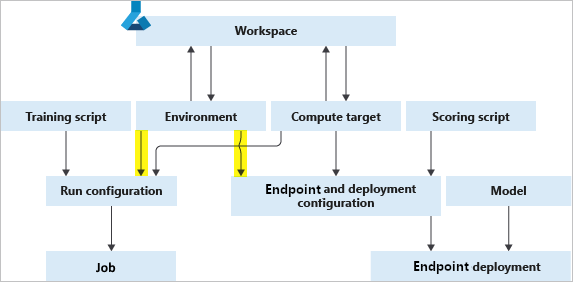

## Table of Contents

## What is an environment in the context of machine learning?

In the context of machine learning, an environment refers to the setting or the world in which an algorithm or a model operates. This can be thought of as the space where the model interacts with data, learns from it, and makes decisions or predictions. For example, in a game-playing AI, the environment would be the game itself, including all its rules, the current state of play, and the possible actions the AI can take.

Environments are crucial because they define what the model can observe and how it can act. In reinforcement learning, for instance, the environment provides the rewards and feedback that guide the learning process. The model learns to maximize these rewards by exploring and understanding the environment. This interaction helps the model improve its performance over time, adapting to new situations and making better decisions.

## How does the environment influence the training of machine learning models?

The environment plays a big role in how a machine learning model learns. Think of the environment as the world where the model gets its data and tries to make sense of it. When a model is training, it looks at examples from the environment to figure out patterns and rules. For example, if you're training a model to recognize cats, the environment would be all the pictures of cats and non-cats that the model sees. The better and more varied the pictures (the environment), the better the model can learn to tell a cat from a dog.

The environment also affects how the model improves over time. In reinforcement learning, the model gets feedback from the environment in the form of rewards or penalties. If the model does something good, it gets a reward, and if it does something bad, it might get a penalty. This feedback helps the model adjust its actions to do better next time. So, the environment not only provides the data but also shapes the learning process by telling the model what is right or wrong. This interaction is key to making the model smarter and more accurate.

## What are the key components of a machine learning environment?

The key components of a machine learning environment include the data, the model, and the feedback system. The data is like the building blocks that the model uses to learn. It could be pictures, numbers, or any information that the model can use to find patterns. The model is the brain of the operation, trying to make sense of the data and learn from it. It could be a simple algorithm or a complex neural network, depending on what you're trying to do. The feedback system is how the model knows if it's doing a good job or not. In supervised learning, it might be labeled data that tells the model the right answer. In reinforcement learning, it's more like a game where the model gets points for doing well and loses points for messing up.

Another important part of the environment is the infrastructure that supports the learning process. This includes the hardware like computers and GPUs that do the heavy lifting, and the software like libraries and frameworks that help you build and train the model. For example, you might use Python and libraries like TensorFlow or PyTorch to create your model and train it on a powerful computer. The environment also includes the rules and constraints that the model has to follow. These could be things like how much time the model has to make a decision, or what actions it's allowed to take. All these components work together to help the model learn and improve over time.

## How can you set up a basic machine learning environment?

To set up a basic machine learning environment, you'll need a computer that can handle the work, some software to help you build and train your model, and data for your model to learn from. Start by choosing a programming language like Python, which is popular and easy to use for machine learning. Install Python on your computer, and then use a package manager like pip to install libraries such as NumPy for handling numbers, Pandas for organizing data, and scikit-learn for building simple models. You'll also want to set up a development environment like Jupyter Notebook, which lets you write and run code in a web browser.

Next, you need data for your model to learn from. This could be anything from pictures to numbers, depending on what you're trying to do. You can find datasets online or create your own. Once you have your data, you can use your chosen libraries to load it into your model. For example, you might use Pandas to read a CSV file and then split your data into training and testing sets. After that, you can start building your model. With scikit-learn, you can create a simple model with just a few lines of code, like a linear regression model to predict house prices. Once your model is built, you can train it on your data and then test it to see how well it performs. This basic setup is a good starting point for learning about machine learning and experimenting with different models and techniques.

## What are the differences between local and cloud-based machine learning environments?

A local machine learning environment is set up on your own computer. You install software like Python and libraries like TensorFlow or scikit-learn directly on your machine. This means you have full control over the environment and can work offline if you want. But, your computer's power limits how big and complex your models can be. If you're just starting out or working on small projects, a local environment is great because it's easy to set up and you can experiment without worrying about costs.

A cloud-based machine learning environment, on the other hand, uses powerful computers on the internet. You can use services like Google Colab, Amazon SageMaker, or Microsoft Azure to run your models. These services give you access to a lot more computing power than most personal computers, so you can work on bigger and more complex projects. But, you need an internet connection to use them, and you might have to pay for the computing time you use. Cloud environments are good for big projects or when you need to collaborate with others because you can share your work easily and scale up your computing resources as needed.

Both local and cloud-based environments have their own advantages. A local environment is simple and private, while a cloud environment offers more power and flexibility. Depending on your project's needs, you might choose one over the other or even use both together. For example, you could do initial experiments on your local machine and then move to the cloud for more intensive training.

## How do you manage dependencies in a machine learning environment?

Managing dependencies in a machine learning environment means keeping track of all the software and libraries your project needs to run. Think of it like a recipe for a cake - you need to list all the ingredients so someone else can make it too. In machine learning, these ingredients are things like Python, NumPy, Pandas, and other libraries. To manage them, you can use a file called `requirements.txt` or a tool like `pip` to list all the versions of the libraries you need. This way, when someone else wants to run your project, they can easily install the right versions of everything.

One popular way to handle dependencies is to use virtual environments. A virtual environment is like a separate space on your computer where you can install libraries without messing up other projects. You can create one with a tool like `venv` in Python. Once you have your virtual environment set up, you can install all the libraries you need for your project inside it. This keeps everything organized and makes it easier to share your work with others. If you're using a cloud-based environment, you might use tools like Docker to create containers that include all your dependencies, making it even easier to move your project from one computer to another.

## What are the best practices for version control in machine learning environments?

Version control is super important in machine learning environments because it helps you keep track of changes to your code and data. One of the best ways to do this is by using Git, a tool that lets you save different versions of your project. When you're working on a machine learning model, you might want to try different ideas or fix bugs. Git makes it easy to go back to an old version if something goes wrong. You can also share your work with others and work together on the same project without messing things up.

Another good practice is to keep your data and your code in different places but still linked together. You can use Git to manage your code, but for big datasets, you might want to use something like DVC (Data Version Control). DVC works with Git to help you track changes to your data files. This way, if you change your data, you can see how it affects your model's performance. It's also a good idea to write clear notes about what you're doing, so you remember why you made certain changes. This makes it easier for others to understand your work and helps you keep everything organized.

One more thing to think about is how you handle different versions of your model. As you train your model, you might want to save different versions to see which one works best. You can use tools like MLflow or Weights & Biases to track your experiments and keep all your model versions in one place. These tools let you compare different models and see how changes to your code or data affect the results. By using version control and these best practices, you can make your machine learning work more organized and easier to share with others.

## How can you optimize a machine learning environment for performance?

To optimize a machine learning environment for performance, start by choosing the right hardware. A powerful computer with a good GPU can make your models train much faster. If you're using a local machine, make sure it has enough memory and processing power. If you're using the cloud, pick a service that lets you scale up your resources easily. Also, use the right software. Libraries like TensorFlow or PyTorch are designed to work well with GPUs, so they can help speed up your training. You can also use tools like Docker to set up your environment in a way that's easy to move from one computer to another without losing performance.

Another way to optimize your environment is by managing your data and code efficiently. Keep your data organized and use tools like DVC to track changes to your datasets. This can help you avoid wasting time on retraining models with the wrong data. For your code, use version control with Git to keep track of changes and make sure you're always working with the latest version. You can also use tools like MLflow to track your experiments and see which changes to your model make it perform better. By keeping your environment well-organized and using the right tools, you can make your machine learning work faster and more efficient.

## What security measures should be implemented in a machine learning environment?

Securing a machine learning environment is important to protect your data and models from being stolen or messed with. One way to do this is by using strong passwords and two-factor authentication. This means you need more than just a password to get into your system, like a code sent to your phone. You should also keep your software up to date. When new versions of libraries like TensorFlow or PyTorch come out, they often fix security problems, so updating them can keep your environment safe. Another good idea is to use encryption to protect your data. Encryption is like putting your data in a secret code that only you can read. This way, even if someone gets your data, they can't use it without the key to unlock it.

Another important security measure is to control who can access your machine learning environment. You can set up different levels of access so only certain people can see or change your code and data. This helps prevent mistakes and keeps your work safe. It's also a good idea to use secure networks and avoid working on public Wi-Fi, which can be less safe. Finally, keep an eye on your environment for any strange activity. Tools like intrusion detection systems can help you spot if someone is trying to break in. By using these security measures, you can keep your machine learning environment safe and focus on building great models.

## How do you scale a machine learning environment for large datasets?

To scale a machine learning environment for large datasets, you need to think about both your hardware and software. On the hardware side, using powerful computers with lots of memory and fast GPUs can help you process big datasets faster. If your local machine isn't up to the task, you might want to move to the cloud. Services like Amazon Web Services (AWS), Google Cloud Platform (GCP), or Microsoft Azure let you use big computers without buying them. They also let you add more computers as you need them, which is called scaling up. This way, you can handle bigger datasets without waiting forever for your models to train.

On the software side, you can use tools that are made for big data. Libraries like Apache Spark can help you process large datasets quickly. You can also use data versioning tools like DVC to keep track of your big datasets and make sure you're always using the right version. Another good idea is to break your data into smaller pieces and process them one at a time. This is called data parallelism, and it can make your training much faster. By using the right hardware and software, you can handle large datasets and build better machine learning models.

## What are the advanced techniques for monitoring and logging in machine learning environments?

Monitoring and logging in machine learning environments help you keep track of how your models are doing and what's happening in your system. One advanced technique is using tools like MLflow or Weights & Biases. These tools let you log all the details of your experiments, like what data you used, what model you built, and how well it performed. You can see graphs and charts that show how your model's accuracy changes over time, and you can compare different versions of your model to see which one works best. This makes it easier to understand what's working and what's not, so you can make your models better.

Another technique is to use distributed logging systems like ELK Stack (Elasticsearch, Logstash, Kibana). These systems can handle a lot of log data from different parts of your machine learning environment. They let you search through your logs easily and set up alerts if something goes wrong. For example, if your model starts to perform badly or if there's a problem with your data, you can get a notification right away. This helps you fix issues quickly and keep your machine learning environment running smoothly. By using these advanced monitoring and logging techniques, you can make sure your models are always working their best.

## How can you integrate continuous integration and deployment (CI/CD) into a machine learning environment?

To integrate continuous integration and deployment (CI/CD) into a machine learning environment, you can use tools like Jenkins, GitLab CI, or GitHub Actions. These tools help you automate the process of testing and deploying your machine learning models. When you make changes to your code or data, the CI/CD system runs your tests automatically to make sure everything still works. If the tests pass, the system can then deploy your new model to production, so it's ready for people to use. This way, you can keep improving your models and get them out to users quickly and safely.

One important part of setting up CI/CD for machine learning is to make sure your tests cover all the important parts of your model. You might want to test things like how well your model predicts outcomes, how fast it runs, and whether it works with different kinds of data. You can write these tests in your code and then use the CI/CD system to run them every time you make a change. This helps you catch problems early and makes sure your models are always working as expected. By using CI/CD, you can make your machine learning work more efficient and reliable.