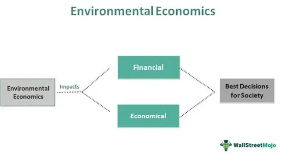

In recent years, the convergence of sustainability, economics, and technology has become increasingly significant, reflecting a paradigm shift in how societies and businesses operate. Sustainability, traditionally viewed as an environmental initiative, now plays a crucial economic role, influencing market structures, investment strategies, and policy-making. This article examines the economic impact of sustainability, the role of environmental economics, and the influence of algorithmic trading to understand their interconnectedness.

The economic facets of sustainability are manifold, encompassing corporate strategies that incorporate eco-friendly practices and investments in renewable energy sources. These sustainable efforts are not only environmentally beneficial but also contribute to economic growth by creating new markets and enhancing organizational competitiveness. Companies are beginning to recognize the financial advantages of sustainable operations, such as cost reduction and improved brand reputation, which can positively impact their financial performance.



Environmental economics emerges as a pivotal field, analyzing the economic consequences of environmental policies and activities. It aims to achieve a balance between economic growth and environmental preservation by employing economic incentives to encourage sustainable practices. This discipline encompasses concepts like externalities, public goods, and the tragedy of the commons, which are critical in understanding and addressing the economic dimensions of environmental issues.

Simultaneously, advancements in technology, particularly in algorithmic trading, have significant ramifications for sustainable finance. This sophisticated form of trading uses computer algorithms to execute trades based on predefined criteria and is increasingly being leveraged to develop investment strategies that align with environmental, social, and governance (ESG) criteria. Emerging trends such as AI-driven pairs trading highlight how machine learning can be harnessed to create investment opportunities that are both financially and environmentally sustainable.

By illuminating the interplay between these domains, the article provides insights into how technology is reconfiguring economic landscapes towards more sustainable trajectories. The implications for sustainable development are profound, as integrating these areas offers a multifaceted approach to achieving a harmonious balance between economic progression and environmental stewardship.

## Table of Contents

## The Economic Impact of Sustainability

The notion of sustainability has evolved from being a predominantly environmental issue to a significant economic catalyst. Businesses across various sectors are increasingly recognizing the financial advantages of integrating sustainable practices into their operations. One prominent manifestation of this trend is the investment in green technology and renewable energy, which serves as a conduit for economic expansion. By embracing sustainability, companies can not only reduce operational costs but also improve their brand reputation, leading to positive impacts on their financial performance.

The transformation to sustainable models often involves adopting energy-efficient technologies, reducing waste, and implementing circular economy principles. For instance, corporations adopting energy-efficient practices can see a reduction in operational costs. The deployment of renewable energy resources, such as wind, solar, and hydropower, diminishes dependence on fossil fuels, thereby lowering energy expenses in the long term. The International Renewable Energy Agency (IRENA) reports that renewable energy costs are decreasing, making them an increasingly viable option for businesses seeking both sustainability and cost efficiency.[^1^]

Moreover, sustainable investments, including those in green infrastructure and eco-friendly products, provide opportunities for economic development. The global market for such investments is expanding, partly fueled by increasing demand for environmentally conscious goods and services. A report by the Global Sustainable Investment Alliance noted that sustainable investments reached $35.3 trillion globally in 2020, a 15% increase over two years, underscoring the growing financial appetite for sustainability-focused initiatives.[^2^]

Sustainability also significantly influences brand reputation. Consumers are increasingly opting for products and companies that align with their values, notably those demonstrating a commitment to environmental stewardship. This consumer shift can lead to increased market share and higher revenue for businesses that prioritize sustainability. A 2020 study by IBM and the National Retail Federation found that nearly 70% of consumers in the U.S. and Canada consider sustainability when making a purchase, and they are willing to pay a premium for environmentally friendly products.[^3^] Consequently, companies investing in sustainable practices may not only witness cost savings but also enhanced brand loyalty and customer engagement.

In summary, sustainability emerges as a pivotal economic driver by offering cost reduction, revenue growth through sustainable investments, and strengthened brand reputation. These advantages affirm the economic rationale for sustainability, encouraging more businesses to integrate these practices into their strategic planning.

[^1^]: International Renewable Energy Agency (IRENA). "Renewable Power Generation Costs in 2020." June 2021.
[^2^]: Global Sustainable Investment Alliance. "2020 Global Sustainable Investment Review." 2020.
[^3^]: IBM Institute for Business Value and the National Retail Federation. "Meet the 2020 Consumers Driving Change." January 2020.

## Understanding Environmental Economics

Environmental economics is a pivotal area of study focusing on the intersection of economic activities and environmental impacts. It seeks to assess how these activities contribute to or detract from environmental health and uses this understanding to promote sustainable practices.

One fundamental concept in environmental economics is that of externalities, which occur when the true costs or benefits of a production or consumption process are not reflected in market prices. Negative externalities, such as pollution, lead to market failures where private costs do not align with social costs. For instance, a factory emitting pollutants may not bear the full costs of the damage these emissions cause, resulting in a higher than socially optimal level of pollution. To address this, economists advocate for policies that internalize these externalities, ensuring that the market prices reflect the true social costs. Examples of such policies include taxes on pollution or tradable emissions permits.

Another crucial concept is that of public goods, which are characterized by their non-excludability and non-rivalrous consumption. Clean air is a classic example of a public good; it is available for everyone to consume without diminishing the quality for others. However, because individuals cannot be excluded from using public goods, there is often little incentive for private investment in their maintenance, leading to potential underprovision. Environmental economists address this through governmental intervention or incentivization structures to ensure adequate supply and maintenance of public goods.

The tragedy of the commons, a term popularized by ecologist Garrett Hardin, describes a scenario where individual users acting independently and rationally according to their self-interest deplete a shared resource, despite understanding that depleting the common resource is contrary to the group's long-term best interests. This concept is central to environmental economics, highlighting the necessity for cooperative strategies or regulatory frameworks to manage common resources such as fisheries, forests, and clean water effectively.

Environmental economics strives to harmonize economic progress with environmental stewardship. Policy instruments often employed include regulatory measures, market-based incentives, and informational campaigns designed to shift behavior toward greater sustainability. The ultimate aim is to align economic development with long-term environmental sustainability, ensuring that progress today does not compromise the needs of future generations. This necessitates innovative approaches and continuous evaluation of policies to adapt to new environmental and economic challenges.

## Algorithmic Trading in Sustainable Finance

Algorithmic trading uses computer algorithms to automate trade execution based on predefined criteria, offering efficiency and precision in financial markets. Within the sphere of sustainable finance, these algorithms are developed to create investment strategies that align with Environmental, Social, and Governance ([ESG](/wiki/esg-investing)) criteria, ensuring that investment portfolios contribute positively to sustainable development.

In recent years, the integration of ESG considerations into investment strategies has gained significant traction. Algorithmic trading systems are being adapted to evaluate not only market data but also ESG data, which encompasses metrics like carbon emissions, labor practices, and board diversity, among others. By incorporating ESG factors, these systems can identify and prioritize investments in companies demonstrating sustainable practices.

A noteworthy trend in this domain is the use of AI-driven pairs trading. Traditional pairs trading identifies two correlated securities, executing trades based on the premise that their historical price relationship will revert to the mean. When enhanced with [machine learning](/wiki/machine-learning) techniques, such pairs trading becomes significantly more sophisticated. Algorithms can analyze vast datasets to identify pairs whose relationships adhere to both profitability criteria and sustainable standards. For instance, if two companies operate within the same industry and exhibit high ESG scores, a machine learning algorithm might identify them as a viable pair for sustainable pairs trading.

Machine learning models in [algorithmic trading](/wiki/algorithmic-trading) typically involve various methods such as supervised learning, where historical ESG and financial data train the model, enabling the prediction of future market behaviors. For example, a basic implementation in Python using the popular machine learning library scikit-learn could involve regression analysis to predict future ESG scores and align them with financial performance for robust trading strategies.

```python
from sklearn.linear_model import LinearRegression
import numpy as np

# Simulated data for ESG scores and financial performance
esg_scores = np.array([[70, 65, 80], [85, 80, 75], [78, 75, 70]])
financial_performance = np.array([1.2, 1.5, 1.1])

# Create and train the regression model
model = LinearRegression().fit(esg_scores, financial_performance)

# Predict future financial performance
predicted_performance = model.predict(esg_scores)
print(predicted_performance)
```

In this example, the linear regression model predicts financial performance based on historical ESG scores, allowing the algorithm to identify sustainable investment opportunities.

Adapting algorithmic trading systems to incorporate sustainable criteria presents both technical and ethical challenges. On the technical side, ensuring data quality and dealing with the complexity of ESG data integration require significant resources. Ethically, there's the challenge of defining sustainability in a way that aligns with diverse investor values.

Despite these challenges, the potential impact is substantial. By utilizing algorithmic trading to prioritize ESG compliance, the financial sector can significantly contribute to global sustainability efforts, providing investors with opportunities for socially responsible investing without compromising profitability. This approach exemplifies how technology and finance can intersect to impact sustainable development positively.

## Challenges in Integrating Sustainability and Economics

Aligning economic growth with sustainable practices presents multifaceted challenges due to the complex interplay between market dynamics, policy frameworks, and environmental considerations. Market-based solutions such as carbon credits are designed to mitigate climate change by creating economic incentives for reducing greenhouse gas emissions. The implementation of these systems requires extensive global cooperation, as they function effectively only when embraced across borders. This need for international collaboration introduces intricacies, including issues of fairness, enforcement, and economic competitiveness among nations.

One of the core challenges is the tension between short-term economic gains and long-term environmental sustainability. Businesses and policymakers often prioritize immediate economic benefits, which can conflict with the need for sustainable resource management. This conflict arises because the costs associated with sustainable practices, such as investments in renewable energy or pollution control, can be perceived as a burden in the short term, despite their long-term economic and environmental benefits.

Environmental economists face significant difficulties in quantifying the economic value of environmental goods, such as clean air, water, and biodiversity. These goods are often non-market entities, making it challenging to assign them a monetary value. Standard economic models struggle to account for externalities, which are the unintended side effects of economic activities that impact the environment, either positively or negatively. The difficulty lies in measuring these impacts accurately and devising economic incentives to promote sustainable behavior.

The concept of externalities is central to environmental economics. These are costs or benefits that affect third parties not involved in an economic transaction. For instance, pollution from a factory affects the surrounding community's air quality, representing a negative externality. Conversely, a company that invests in a nature preserve creates positive externalities by enhancing biodiversity and offering recreation spaces for the public.

The traditional economic framework often fails to incorporate these externalities, leading to a market failure where resources are not allocated optimally. To address this, environmental economists propose interventions such as taxation, subsidies, or the implementation of tradable permits, like carbon credits. These tools aim to internalize the external costs or benefits, aligning private incentives with social welfare.

Achieving this integration requires not only robust economic models but also comprehensive policy instruments and global consensus. The complexity of environmental goods valuation, alongside the need for cooperative international frameworks, underscores the challenges to fully integrating sustainability into the economic system. As societies strive to reconcile these challenges, understanding and implementing innovative economic tools and strategies become increasingly imperative for sustainable development.

## Future Trends and Opportunities

The intersection of technology, economics, and sustainability continues to evolve, signaling promising trends and opportunities within sustainable finance. As industries strive to embrace more environmentally and socially responsible practices, the integration of advanced technologies, such as [artificial intelligence](/wiki/ai-artificial-intelligence) (AI) and machine learning, is anticipated to play a crucial role in enhancing algorithmic trading strategies. These strategies aim to not only optimize financial returns but also align investments with environmental, social, and governance (ESG) criteria. 

AI and machine learning algorithms can analyze vast datasets to identify patterns and predict market trends, allowing traders to make informed decisions that support sustainable development. For instance, these technologies can automate the selection of stocks in a portfolio based on ESG performance metrics, thus promoting investments in companies that prioritize sustainability. This not only aids in achieving financial objectives but also in driving positive societal impacts.

The demand for sustainable investment vehicles such as green bonds is anticipated to rise as investors increasingly seek to align their portfolios with sustainable initiatives. Green bonds, which are specifically earmarked to fund projects that have positive environmental or climate benefits, offer an attractive investment opportunity that combines financial returns with sustainability objectives. The growth potential of green bonds is substantial, driven by both investor demand and regulatory incentives aimed at promoting sustainable finance.

Investors and financial institutions are likely to explore and develop innovative financial products that integrate sustainability and generate environmental and social impacts alongside financial returns. The emphasis on transparency and accountability will likely lead to the establishment of more robust frameworks and standards for measuring and reporting ESG performance, further facilitating the integration of sustainable practices into mainstream finance.

Technological advancements will continue to reshape the landscape of sustainable finance, with AI and machine learning being pivotal in refining strategies that incorporate ESG principles. As the demand for green bonds and sustainable investments grows, the financial sector has a unique opportunity to contribute towards global sustainability goals while achieving economic success.

## Conclusion

Sustainability has emerged as an essential consideration within the economic landscape, bridging the gap between environmental integrity and financial prosperity. As industries and governments increasingly recognize the importance of sustainable development, the dynamics between environmental economics and algorithmic trading become critical insights for shaping future pathways. Both fields offer tools and methodologies that aid in understanding the complex interactions between market forces and environmental sustainability.

Environmental economics provides a framework for evaluating the economic implications of environmental policies and the use of economic incentives to promote sustainable behavior. This discipline emphasizes finding equilibrium between economic growth and ecological preservation. For instance, concepts such as externalities, public goods, and the tragedy of the commons illustrate how market failures can lead to environmental degradation. By internalizing external costs and implementing policies like carbon pricing, societies can encourage more sustainable practices that align economic and environmental objectives.

Concurrently, algorithmic trading in sustainable finance exemplifies how technology can significantly enhance investment strategies, particularly those considering environmental, social, and governance (ESG) factors. Through the use of sophisticated algorithms, investors can develop ESG-centered portfolios that not only aim for financial return but also contribute positively to societal and environmental outcomes. This integration of technology in finance highlights the potential for machine learning and artificial intelligence to play transformative roles in advancing sustainable investment strategies.

The intersection of these fields underscores the potential for a more sustainable economic model, one where technology and economic principles are harnessed to promote environmental stewardship alongside economic advancement. By adopting frameworks that prioritize sustainability, industries and economies can endeavor to achieve a harmonious balance between financial growth and the preservation of our planet's resources.

## References & Further Reading

[1]: International Renewable Energy Agency (IRENA). ["Renewable Power Generation Costs in 2020."](https://www.irena.org/publications/2021/Jun/Renewable-Power-Costs-in-2020) June 2021.

[2]: Global Sustainable Investment Alliance. ["2020 Global Sustainable Investment Review."](http://www.gsi-alliance.org/wp-content/uploads/2021/08/GSIR-20201.pdf) 2020.

[3]: IBM Institute for Business Value and the National Retail Federation. ["Meet the 2020 Consumers Driving Change."](https://nrf.com/research/meet-2020-consumers-driving-change) January 2020.

[4]: Perman, R., Ma, Y., McGilvray, J., & Common, M. (2011). ["Natural Resource and Environmental Economics."](https://elibrary.pearson.de/book/99.150005/9780273760375) Pearson Education.

[5]: Shapiro, J. F. (2016). ["Modeling the Supply Chain."](https://www.amazon.com/Modeling-Supply-Chain-Duxbury-Applied/dp/0495126098) Springer US. 

[6]: Lopez de Prado, M. (2018). ["Advances in Financial Machine Learning."](https://www.amazon.com/Advances-Financial-Machine-Learning-Marcos/dp/1119482089) Wiley.

[7]: Jansen, S. (2020). ["Machine Learning for Algorithmic Trading."](https://github.com/stefan-jansen/machine-learning-for-trading) Packt Publishing.