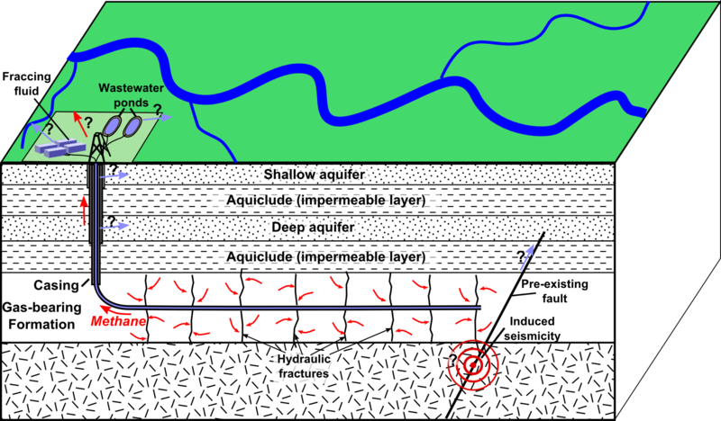

## Table of Contents

## What is hydraulic fracturing?

Hydraulic fracturing, often called fracking, is a way to get oil and gas out of the ground. It involves drilling deep into the earth and then pumping in a mix of water, sand, and chemicals at high pressure. This pressure cracks the rock underground, and the sand keeps the cracks open. The oil and gas can then flow out of the cracks and up to the surface.

Fracking has made it possible to get more oil and gas from places where it was hard to reach before. This has helped increase the supply of energy and lowered prices. However, fracking can also cause problems. It uses a lot of water and can pollute the air and water if not done carefully. There are also worries about small earthquakes happening because of the process.

## How does hydraulic fracturing work?

Hydraulic fracturing, or fracking, is a way to get oil and gas out of the ground. First, a well is drilled deep into the earth, often over a mile down. Once the well is drilled, a steel pipe is put into the hole to keep it open. Then, a mix of water, sand, and chemicals is pumped down the pipe at very high pressure. This high pressure causes the rock deep underground to crack.

When the rock cracks, the sand in the mix gets into the cracks and keeps them open. This lets the oil and gas that's trapped in the rock flow out through the cracks and up the well to the surface. The water and chemicals used in fracking help to make the cracks and also help the sand get into the cracks. Once the oil and gas reach the surface, they are collected and sent to be processed and used for energy.

## What are the primary environmental concerns associated with hydraulic fracturing?

Hydraulic fracturing, or fracking, can harm the environment in several ways. One big worry is that it uses a lot of water. Each fracking job can use millions of gallons of water, which can be a problem in places where water is already scarce. Also, the water mixed with chemicals used in fracking can leak into the ground and pollute nearby water sources, like rivers and wells. This can make the water unsafe to drink and harm fish and other wildlife.

Another concern is air pollution. Fracking releases methane, a powerful greenhouse gas, and other harmful chemicals into the air. This can lead to health problems for people living near fracking sites, like breathing issues and higher chances of getting sick. There are also worries about small earthquakes caused by fracking. When the wastewater from fracking is pumped back into the ground, it can cause the earth to move and lead to small quakes, which can damage buildings and roads.

## How does hydraulic fracturing impact water resources?

Hydraulic fracturing uses a lot of water. Each time they frack, they can use millions of gallons of water. This can be a big problem in places where water is hard to come by. When there's not enough water for everyone, using so much for fracking can make things worse. People and farms might not have enough water for their needs.

Fracking can also make water dirty. The mix of water, sand, and chemicals used in fracking can leak into the ground and get into rivers, lakes, and wells. This can make the water unsafe to drink. It can also harm fish and other animals that live in the water. Cleaning up this polluted water can be hard and costly.

## What are the potential air quality issues related to hydraulic fracturing?

Hydraulic fracturing can make the air dirty. When they frack, they release methane into the air. Methane is a gas that can make the earth warmer, like a greenhouse gas. It's very powerful and can cause big problems for the climate. Fracking also lets out other bad chemicals into the air. These chemicals can make it hard for people to breathe and can make them sick. People who live near fracking sites might have more trouble with their health because of the dirty air.

The air pollution from fracking can also affect a larger area. The gases and chemicals can travel far from where the fracking happens. This means that even people who don't live right next to a fracking site can still breathe in the bad air. Over time, this can lead to more people getting sick and having trouble with their lungs and hearts. It's important for companies to try to stop as much pollution as they can to keep the air clean for everyone.

## Can hydraulic fracturing cause seismic activity?

Yes, hydraulic fracturing can cause small earthquakes. When they frack, they pump a lot of water and chemicals into the ground. This can make the ground move and cause small quakes. These quakes are usually not very big, but they can still be felt by people living nearby.

The main problem comes from the wastewater from fracking. After they frack, they have to get rid of the used water. They often pump this wastewater back into the ground. When they do this, it can cause the ground to move even more and lead to more small earthquakes. This can be a worry for people living in areas where fracking happens a lot.

## What is the impact of hydraulic fracturing on wildlife and ecosystems?

Hydraulic fracturing can harm wildlife and ecosystems. When they frack, they use a lot of water and chemicals. If these chemicals leak into rivers and lakes, they can make the water dirty. This dirty water can kill fish and other animals that live in the water. Animals that drink the water can get sick or die. Plants can also be harmed if the chemicals get into the soil. This can mess up the whole ecosystem because many animals depend on these plants for food.

Fracking can also disturb wildlife habitats. The noise and activity from drilling and fracking can scare animals away from their homes. This can make it hard for them to find food and safe places to live. Some animals might not come back to their homes even after the fracking is done. Over time, this can lead to fewer animals in the area and can harm the balance of nature. It's important for companies to try to protect wildlife and their habitats when they frack.

## How does the disposal of wastewater from hydraulic fracturing affect the environment?

The disposal of wastewater from hydraulic fracturing can harm the environment. When they frack, they use a lot of water mixed with chemicals. After they are done, they have to get rid of this used water. One way they do this is by pumping it back into the ground. If this wastewater leaks, it can make the ground and nearby water dirty. This dirty water can harm plants and animals that live in or near the water. It can also make the water unsafe for people to drink.

Another problem with wastewater disposal is that it can cause small earthquakes. When they pump the wastewater back into the ground, it can make the earth move. These earthquakes are usually small, but they can still be felt by people living nearby. Over time, these small quakes can damage buildings and roads. It's important for companies to be careful about how they get rid of the wastewater to try to avoid these problems.

## What regulations are in place to mitigate the environmental impact of hydraulic fracturing?

Governments have made rules to help lower the harm that hydraulic fracturing, or fracking, can do to the environment. These rules are different in different places, but they often include things like making companies tell people what chemicals they use in fracking. This helps keep the water and air clean. The rules also say that companies need to be careful about how they get rid of the wastewater from fracking. They have to follow strict ways to pump it back into the ground to try to stop it from making the earth shake and to keep it from leaking into rivers and lakes.

Another part of these rules is about watching and checking fracking sites. Companies have to keep an eye on the air and water around their sites to make sure they are not making them dirty. If they find any problems, they have to fix them quickly. Some places also have rules about where fracking can happen. They might not let companies frack near homes, schools, or important wildlife areas. These rules help to keep people and the environment safe from the bad effects of fracking.

## How effective are current technologies in reducing the environmental footprint of hydraulic fracturing?

Current technologies have made some good steps in reducing the environmental footprint of hydraulic fracturing. They have made better ways to recycle the water used in fracking. This means they use less new water and make less wastewater. They also use new ways to catch methane and other gases that come out during fracking. This helps keep the air cleaner and stops some of the greenhouse gases from getting into the air. These technologies help to make fracking a bit safer for the environment.

However, these technologies are not perfect. They can help, but they don't fix all the problems. Fracking still uses a lot of water and can still make the air and water dirty if something goes wrong. The wastewater from fracking can still cause small earthquakes when it's pumped back into the ground. So, while the new technologies are helpful, people and companies need to keep working to find even better ways to make fracking safer for the environment.

## What are the long-term environmental consequences of hydraulic fracturing?

Hydraulic fracturing can have big effects on the environment over a long time. When they frack, they use a lot of water mixed with chemicals. If these chemicals leak into the ground, they can make the water dirty for a long time. This can harm fish and other animals that live in the water, and it can make the water unsafe for people to drink. The dirty water can also mess up the whole ecosystem because many animals and plants depend on clean water. Over many years, this can lead to fewer animals and plants in the area and can change the balance of nature.

Fracking can also cause small earthquakes when they pump the wastewater back into the ground. These earthquakes might not be very big, but they can still happen over and over again. This can slowly damage buildings and roads over time. Also, the air pollution from fracking, like methane and other bad chemicals, can keep making the air dirty for a long time. This can lead to more people getting sick and having health problems. So, even though fracking helps us get more oil and gas, it can also cause problems for the environment that last for many years.

## What research is being conducted to better understand and minimize the environmental impact of hydraulic fracturing?

Scientists and researchers are working hard to learn more about how hydraulic fracturing affects the environment. They are studying things like how the chemicals used in fracking can leak into the ground and make water dirty. They are also looking at how fracking can cause small earthquakes and what can be done to stop this from happening. Another big part of their research is figuring out better ways to recycle the water used in fracking so that less new water is needed and less wastewater is made. They are also trying to find new ways to catch the methane and other gases that come out during fracking to keep the air cleaner.

This research is important because it can help make fracking safer for the environment. By understanding the problems better, scientists can come up with new technologies and rules to help lower the harm that fracking can cause. For example, they might find new ways to clean up the wastewater so it can be reused, or they might come up with better ways to pump the wastewater back into the ground without causing earthquakes. All of this research helps to make sure that if we keep using fracking to get oil and gas, we can do it in a way that is kinder to the environment.

## References & Further Reading

- Osborn, S. G., Vengosh, A., Warner, N. R., & Jackson, R. B. (2011). Methane contamination of drinking water accompanying gas-well drilling and hydraulic fracturing. Proceedings of the National Academy of Sciences, 108(20), 8172-8176. doi:10.1073/pnas.1100682108. This study explores the link between hydraulic fracturing and methane contamination in domestic water wells, highlighting the environmental challenges associated with fracking.

- IPCC. (2007). Climate Change 2007: The Physical Science Basis. Contribution of Working Group I to the Fourth Assessment Report of the Intergovernmental Panel on Climate Change. Cambridge University Press. Available at https://www.ipcc.ch/report/ar4/wg1/. This comprehensive report evaluates the scientific evidence for climate change, providing a crucial backdrop for understanding methane emissions from hydraulic fracturing and their contribution to global warming.

- Scanlon, B. R., Reedy, R. C., & Nicot, J.-P. (2014). Will Water Scarcity in Semiarid Regions Limit Hydraulic Fracturing of Shale Plays? Environmental Research Letters, 9(12), 124011. doi:10.1088/1748-9326/9/12/124011. This paper discusses the potential for water scarcity to impede hydraulic fracturing operations in semiarid climates, examining the balance between energy extraction and water resource management.

- Aldridge, I. (2013). High-Frequency Trading: A Practical Guide to Algorithmic Strategies and Trading Systems. Wiley Trading Series. ISBN: 978-1118343500. This book provides an in-depth analysis of algorithmic trading strategies and their effects on financial markets, offering insights into the implications of high-speed trading systems, including potential market disruptions like flash crashes.

