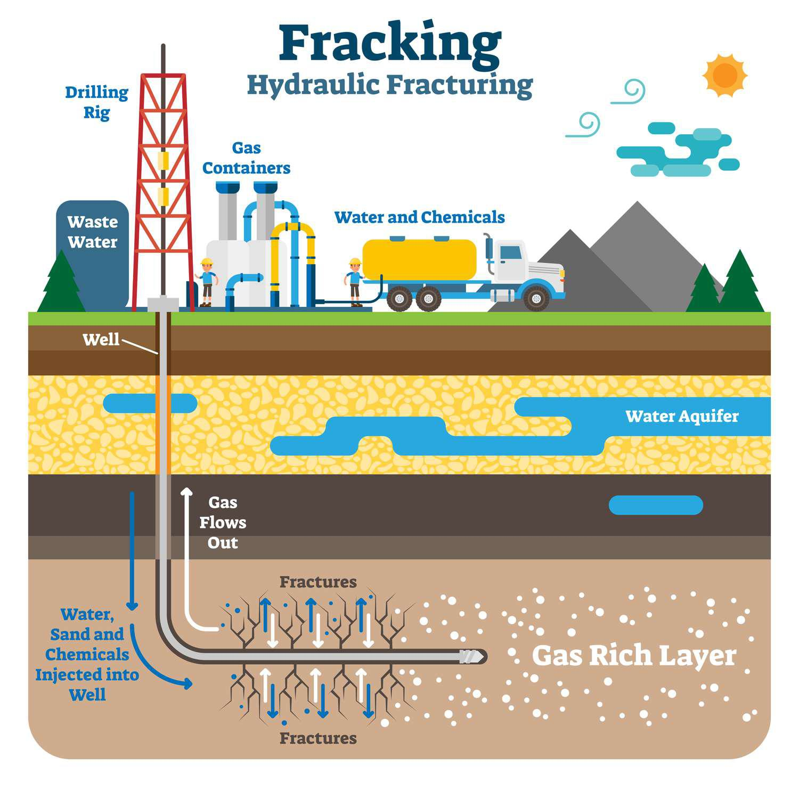

In recent years, both hydraulic fracturing (commonly known as fracking) and algorithmic trading (or algo trading) have emerged as significant technological developments influencing the energy and financial sectors, respectively. These advancements have played a critical role in shaping modern economies by introducing new opportunities and challenges.

Fracking has fundamentally transformed the global energy landscape by enabling the extraction of oil and natural gas from previously inaccessible shale formations. This process has significantly increased the supply of fossil fuels, contributing to an energy boom, particularly in countries with substantial shale resources. The technique involves high-pressure injection of fluid into subterranean rock formations, which fractures the rock and releases valuable hydrocarbons. This method has not only expanded the availability of energy resources but has also driven changes in energy prices and global energy politics.



Simultaneously, algo trading has revolutionized financial markets by leveraging computer algorithms to execute trades with remarkable speed and precision. This technological advancement has enhanced market efficiency, allowing vast volumes of financial transactions to be processed within fractions of a second. By optimizing trading strategies and minimizing human error, algo trading has boosted liquidity and reshaped market dynamics. Nevertheless, its implementation has also introduced new risks, such as increased market volatility and flash crashes due to the rapid pace and complexity of automated trading systems.

This article investigates the environmental impacts associated with fracking and the operational dynamics of algo trading, while identifying the points at which these two fields intersect. Understanding these impacts and interactions is crucial for developing strategies that balance economic growth with environmental sustainability. As such, this discussion not only highlights the transformative nature of these technologies but also underscores the importance of managing their consequences to ensure responsible advancement.

## Table of Contents

## Understanding Hydraulic Fracturing

Hydraulic fracturing, commonly referred to as fracking, is a technique used to extract natural gas and oil from shale rock formations deep beneath the earth's surface. The process involves injecting a high-pressure mixture of water, sand, and chemicals into the rock layer. This creates fractures, allowing trapped hydrocarbons to escape and be collected at the surface. 

The technique has significantly reshaped global energy production by enabling access to vast reserves of hydrocarbons previously considered uneconomical to exploit. Fracking has been instrumental in increasing energy independence in several countries, notably the United States, and has contributed to a global shift in energy dynamics. According to the U.S. Energy Information Administration (EIA), fracking has been a primary [factor](/wiki/factor-investing) in the U.S.'s transition to become one of the world's leading oil producers.

One of the advancements that have propelled the effectiveness of fracking is horizontal drilling. This approach involves drilling vertically to the depth of the shale layer and then extending the well horizontally. This method increases the exposed surface area of the shale, thereby enhancing the [volume](/wiki/volume-trading-strategy) of gas or oil that can be extracted from a single well. This increased efficiency has made fracking more economically viable and has contributed to the rapid expansion of shale gas and oil production.

However, despite the economic advantages and energy benefits, there are significant concerns surrounding the environmental implications of hydraulic fracturing. One major issue is groundwater contamination. Chemicals used in the fracking fluid, along with methane released during the process, can migrate and potentially contaminate underground water sources. Research, such as the study by Osborn et al. (2011) published in the Proceedings of the National Academy of Sciences, has reported instances of methane contamination of drinking water in areas close to fracking sites.

Furthermore, fracking has been linked to induced seismicity or human-induced earthquakes. The injection of wastewater, a byproduct of the fracking process, into deep underground wells is believed to alter stress conditions in fault lines, increasing seismic activity. While these earthquakes are generally minor, they raise legitimate safety and regulatory concerns.

In conclusion, while hydraulic fracturing has revolutionized energy production by unlocking new reserves of oil and gas, it presents environmental challenges that need addressing. Balancing the economic gains with environmental protection requires ongoing research, technological innovation, and regulatory oversight.

## Environmental Impacts of Fracking

Hydraulic fracturing, commonly known as fracking, is fraught with environmental challenges that have triggered widespread debate about its sustainability. One of the primary concerns is air pollution, specifically the release of methane, a potent greenhouse gas. Methane emissions during the fracking process are significant contributors to climate change, intensifying the global warming effect. It is estimated that methane has a global warming potential 25 times greater than carbon dioxide over a 100-year period, making its release particularly concerning.

Water usage is another critical environmental issue associated with fracking. The process requires substantial amounts of water, which are injected along with chemicals into the ground to facilitate the release of oil and natural gas. This extensive water usage can strain local water resources, especially in arid regions where water scarcity is a pressing concern. Studies like those by Scanlon et al. (2014) have highlighted the potential limitations of water supplies in semi-arid areas due to the water demands of hydraulic fracturing.

Moreover, the management of wastewater generated from the fracking process poses significant contamination risks. This wastewater, often laden with harmful chemicals and naturally occurring radioactive materials, can infiltrate clean water supplies if not properly managed. The potential for such contamination necessitates robust wastewater treatment and disposal strategies to mitigate environmental harm.

Induced seismic activity is another notable concern related to fracking. The process of injecting wastewater deep underground has been linked to an increase in seismic events, or human-induced earthquakes. These induced seismic events, while generally low in magnitude, nonetheless raise safety concerns and complicate the operational landscape for fracking activities. The rise in seismic activity has prompted calls for further research and revised regulatory frameworks to minimize such risks.

Overall, while fracking has undeniably contributed to energy production, its environmental impacts warrant careful consideration and action. Balancing the benefits of fracking with its environmental footprint necessitates ongoing innovation and regulation to ensure both economic and ecological sustainability.

## Algorithmic Trading and Market Dynamics

Algorithmic trading, commonly referred to as algo trading, employs sophisticated computer algorithms to perform the intricate task of executing trades with remarkable speed and precision. The cornerstone of this technology is the ability to analyze vast quantities of market data, identify trading opportunities, and execute orders, all within fractions of a second. This has markedly transformed financial markets, enhancing market efficiency by enabling quicker price discovery and tighter bid-ask spreads.

The proliferation of algo trading has contributed significantly to increased market [liquidity](/wiki/liquidity-risk-premium). By executing a large number of trades swiftly, algorithmic strategies can ensure that markets remain active and fluid. This liquidity enhancement is crucial for both large institutional investors seeking to execute sizable trades and smaller participants aiming to buy or sell assets with minimal price impact.

Despite its benefits, algo trading carries inherent risks. A notable concern is market [volatility](/wiki/volatility-trading-strategies), exacerbated by the speed at which algorithms can react to new information. This instant response can precipitate rapid price fluctuations, unsettling markets. Flash crashes are an extreme manifestation of this volatility, where markets can plummet dramatically within minutes due to the cascading effect of algorithm-triggered trades.

To counter these risks, regulation of [algorithmic trading](/wiki/algorithmic-trading) has become increasingly stringent. Regulatory frameworks focus on achieving a balance between fostering innovation and mitigating potential systemic dangers. Measures may include mandating risk controls such as maximum order limits, implementing circuit breakers to pause trading in volatile conditions, and requiring firms to adhere to rigorous testing and monitoring of their algorithms.

The challenge lies in creating adaptive regulations that do not stifle technological progress yet adequately safeguard market stability. As algo trading continues to evolve, so too must the strategies for managing the nuanced intersection of innovation and risk within financial markets.

## Intersections: Fracking's Impact on Commodities Trading

Fracking, or hydraulic fracturing, significantly influences commodity markets, primarily through its impact on energy supplies, leading to price volatility. The advent of fracking technology has unlocked vast reserves of oil and natural gas, markedly increasing their supply. This increase fundamentally shifts the supply curve in commodity markets, often resulting in decreased prices due to higher availability. For example, the Energy Information Administration (EIA) has reported fluctuations in oil prices corresponding directly to changes in production levels influenced by fracking activities.

Algorithmic trading, or algo trading, further amplifies these price fluctuations due to its ability to execute high-speed transactions based on market data. Algorithms are coded to respond to price changes and market indicators with high precision, often within milliseconds. This rapid response capability means that any shifts in supply, such as those driven by fracking, can lead to swift adjustments in trading activity. For instance, if a new fracking site becomes operational, increasing oil supply, algo trading systems might quickly sell off oil futures in anticipation of price drops, thereby accelerating market movements.

The integration of fracking and algo trading in commodity markets demands that stakeholders—such as traders, policymakers, and energy companies—understand the intertwined dynamics to manage economic stability effectively. By analyzing patterns in trading data and energy outputs, it becomes possible to model potential impacts of fracking on commodity prices. Python, with libraries like Pandas for data analysis and Matplotlib for visualization, can be instrumental in developing these models:

```python
import pandas as pd
import matplotlib.pyplot as plt

# Sample data frame simulating price changes due to fracking outputs
data = {'Fracking Output': [10, 20, 15, 40, 25], 
        'Commodity Price': [100, 95, 97, 90, 92]} 

df = pd.DataFrame(data)

# Plotting the data
plt.plot(df['Fracking Output'], df['Commodity Price'], marker='o')
plt.title('Impact of Fracking Output on Commodity Prices')
plt.xlabel('Fracking Output (Units)')
plt.ylabel('Commodity Price ($)')
plt.show()
```

By using such modeling, stakeholders can predict possible futures and strategize accordingly, planning for both the risks and opportunities these technological advancements present. Furthermore, effective policies and practices can be developed to balance potential economic benefits with market stability, highlighting the complex interactions between fracking-induced supply changes and algorithmic-driven market responses.

## Future Perspectives and Challenges

Hydraulic fracturing, often termed fracking, stands at a crossroads of opportunity and responsibility. To ensure sustainable development, the industry must prioritize technological advancements that address environmental concerns. One significant area of focus is innovation in water management. Fracking operations require substantial water resources, leading to potential depletion of local water supplies and ecological impact. Developing technologies for water recycling and treatment can reduce the fresh water needed for fracking operations. Methods such as membrane filtration, reverse osmosis, and advanced oxidation processes are promising avenues to minimize water usage and contamination risks.

Methane reduction is another critical challenge. Methane is a potent greenhouse gas, and its emissions during fracking significantly contribute to global warming. Improved sealing techniques in wells, rigorous monitoring systems, and the implementation of capture technologies can drastically reduce methane leakage. For instance, infrared cameras and gas capture equipment can identify and mitigate emissions, ensuring more environmentally friendly operations.

As for algorithmic trading, the integration of [artificial intelligence](/wiki/ai-artificial-intelligence) (AI) presents an opportunity to enhance market stability. AI can analyze vast amounts of data in real-time, identifying patterns that humans might miss and allowing for more informed trading decisions. Machine learning algorithms, such as [reinforcement learning](/wiki/reinforcement-learning), could adjust trading strategies dynamically in response to market conditions, thus reducing volatility and preventing events like flash crashes.

Collaboration between industry stakeholders, policymakers, and environmental organizations is essential to create an effective regulatory framework. Such collaboration can drive innovation while establishing guidelines that protect the environment. Regulations should incentivize sustainable practices and investment in research and development, ensuring that economic benefits do not come at the expense of ecological integrity.

Through concerted efforts in these areas, the challenges posed by fracking and algo trading can be surmounted, paving the way for a balanced approach to resource extraction and market operations.

## Conclusion

Fracking and algorithmic trading are at the forefront of contemporary technological developments, bringing both opportunities and challenges. Hydraulic fracturing, or fracking, has significantly enhanced energy production capabilities by unlocking new oil and gas reserves, contributing to economic growth and greater energy independence. However, this comes with considerable environmental concerns. Issues such as groundwater contamination, methane emissions, and induced seismicity present formidable challenges that need addressing through innovative approaches and stringent regulation.

On the other hand, algorithmic trading has transformed financial markets by executing trades with remarkable speed and efficiency. This technological advancement increases market liquidity and reduces transaction costs, offering tangible benefits to market participants. Nevertheless, the same high-speed capabilities that offer efficiencies can also heighten market volatility, leading to phenomena such as flash crashes that may disrupt market stability.

Stakeholders, including governments, industry leaders, and environmentalists, must work together to create balanced regulatory frameworks that foster sustainable development. For fracking, this could involve investing in technologies that minimize environmental harm, such as improved water management systems and techniques that reduce methane leakage. For algorithmic trading, integrating artificial intelligence to better predict market trends and manage risk could be vital in enhancing market stability while maintaining the benefits of speed and efficiency.

The path toward a sustainable future relies on advancements in both cleaner fracking practices and smarter trading algorithms. By embracing innovation and implementing thoughtful regulations, it is possible to maximize the positive impacts of these technologies while minimizing their negatives, ensuring progress that is both economically beneficial and environmentally responsible.

## References & Further Reading

- Osborn, S. G., Vengosh, A., Warner, N. R., & Jackson, R. B. (2011). Methane contamination of drinking water accompanying gas-well drilling and hydraulic fracturing. Proceedings of the National Academy of Sciences, 108(20), 8172-8176. doi:10.1073/pnas.1100682108. This study explores the link between hydraulic fracturing and methane contamination in domestic water wells, highlighting the environmental challenges associated with fracking.

- IPCC. (2007). Climate Change 2007: The Physical Science Basis. Contribution of Working Group I to the Fourth Assessment Report of the Intergovernmental Panel on Climate Change. Cambridge University Press. Available at https://www.ipcc.ch/report/ar4/wg1/. This comprehensive report evaluates the scientific evidence for climate change, providing a crucial backdrop for understanding methane emissions from hydraulic fracturing and their contribution to global warming.

- Scanlon, B. R., Reedy, R. C., & Nicot, J.-P. (2014). Will Water Scarcity in Semiarid Regions Limit Hydraulic Fracturing of Shale Plays? Environmental Research Letters, 9(12), 124011. doi:10.1088/1748-9326/9/12/124011. This paper discusses the potential for water scarcity to impede hydraulic fracturing operations in semiarid climates, examining the balance between energy extraction and water resource management.

- Aldridge, I. (2013). High-Frequency Trading: A Practical Guide to Algorithmic Strategies and Trading Systems. Wiley Trading Series. ISBN: 978-1118343500. This book provides an in-depth analysis of algorithmic trading strategies and their effects on financial markets, offering insights into the implications of high-speed trading systems, including potential market disruptions like flash crashes.

