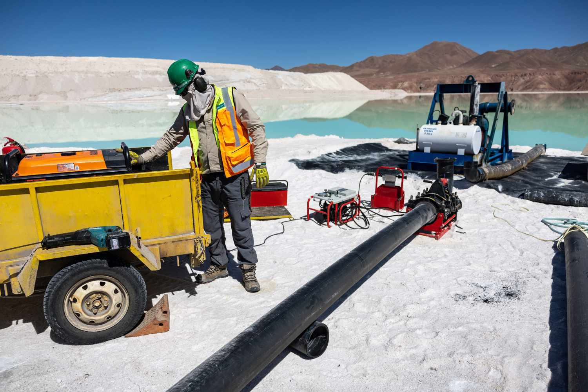

## Table of Contents

## What is lithium and why is it important?

Lithium is a soft, silvery metal that is the lightest of all metals. It is found in small amounts in the Earth's crust and in some minerals. Lithium is also found in water and in the air we breathe, but in very tiny amounts. It is a very reactive element, which means it can easily combine with other elements to form new compounds.

Lithium is important for many reasons. One big reason is that it is used in batteries, especially in the batteries that power our phones, laptops, and electric cars. These batteries can store a lot of energy and last a long time, which is why they are so popular. Lithium is also used in some medicines to help people with certain mental health conditions, like bipolar disorder. It helps to balance the chemicals in the brain and can make a big difference in people's lives.

## How is lithium mined and what are the common methods used?

Lithium is mined from two main sources: hard rock and brine. Hard rock mining involves digging into the earth to find lithium-rich minerals like spodumene. Miners use big machines to break up the rock and then crush it into smaller pieces. After that, they use chemicals to separate the lithium from the other minerals. This method is common in places like Australia.

The other way to get lithium is from brine, which is a salty liquid found in some lakes and underground. To mine lithium from brine, workers pump the liquid into large ponds. They let the water evaporate under the sun, which leaves behind a mix of salts including lithium. Then, they use more chemicals to separate the lithium from the other salts. This method is often used in South America, especially in countries like Chile and Argentina.

Both methods have their own challenges. Hard rock mining can be tough on the environment because it creates a lot of waste and uses a lot of energy. Brine mining takes a long time because it depends on the weather, and it can also use a lot of water. But both ways are important for getting the lithium we need for batteries and other uses.

## What are the primary countries involved in lithium mining?

The main countries that mine lithium are Australia, Chile, and Argentina. Australia is the biggest producer of lithium from hard rock. They dig up a mineral called spodumene, which has a lot of lithium in it. Australia's mining helps meet the world's need for lithium, especially for batteries.

Chile and Argentina are big in mining lithium from brine. They pump salty water from underground lakes into big ponds. The sun helps to dry up the water, leaving lithium behind. These countries are important because they help supply lithium for things like electric cars and phones.

China is also getting more involved in lithium mining. They mine both hard rock and brine, and they are working hard to increase their production. This is important because China uses a lot of lithium and wants to make sure they have enough for their own needs and to sell to other countries.

## What are the immediate environmental effects of lithium mining?

Lithium mining can hurt the environment right away. When miners dig up the earth for hard rock lithium, they create a lot of waste and dust. This waste can pollute the air and water nearby. The machines used for mining also use a lot of energy, which can add to air pollution. In places where people live close to the mines, this can cause health problems like breathing issues.

Mining lithium from brine also has quick effects on the environment. Workers pump salty water into big ponds and let it dry in the sun. This uses a lot of water, which can be a problem in dry areas. The ponds can also leak, which might harm the soil and nearby water sources. Animals and plants that live near these ponds can be affected too, because their habitats change and they might not have enough water to survive.

## How does lithium mining impact water resources?

Lithium mining can use a lot of water, especially when it's done from brine. Miners pump salty water into big ponds and let the sun dry it up to get the lithium. This can take a lot of water from lakes and underground, which can be a big problem in dry places. If too much water is taken, it can make it hard for people, animals, and plants to have enough water to live.

Also, the ponds where the salty water sits can leak. If they do, the salty water can get into the ground and nearby water sources. This can make the water salty and hard to use for drinking or farming. It can also hurt the plants and animals that live near the water because they are not used to salty water.

## What are the effects of lithium mining on local ecosystems and biodiversity?

Lithium mining can hurt the plants and animals that live nearby. When miners dig up the earth for hard rock lithium, they change the land a lot. This can make it hard for plants to grow and for animals to find a place to live. The dust and waste from mining can also get into the air and water, which can make it hard for animals to stay healthy. Some animals might have to move away to find a better place to live, which can change the balance of nature in the area.

Mining lithium from brine can also affect local ecosystems. The big ponds where the salty water sits can take up a lot of space. This can push out the plants and animals that used to live there. If the ponds leak, the salty water can get into the ground and nearby water sources. This can make the water too salty for many plants and animals to use. In dry areas, using a lot of water for mining can also mean there is less water for the plants and animals that need it to survive.

## How does lithium mining contribute to air and soil pollution?

Lithium mining can make the air dirty. When miners dig up the earth to get hard rock lithium, they create a lot of dust. This dust can get into the air and make it hard for people to breathe. The big machines used for mining also use a lot of energy, which can add more pollution to the air. This can be a problem for people who live near the mines because the dirty air can cause health issues like coughing and breathing problems.

Mining can also make the soil dirty. When miners dig up the earth, they leave behind a lot of waste. This waste can have chemicals in it that are not good for the soil. If the waste gets into the ground, it can make the soil hard to use for farming. The waste can also get into the water that goes into the soil, which can make the water dirty too. This can hurt the plants and animals that live in the area because they need clean soil and water to stay healthy.

## What are the long-term environmental consequences of lithium mining?

Lithium mining can hurt the environment for a long time. When miners dig up the earth for hard rock lithium, they leave behind big holes and a lot of waste. This waste can have chemicals that stay in the ground for many years. These chemicals can make the soil and water dirty, which can make it hard for plants to grow and for animals to live. The big holes can also change the land so much that it's hard for nature to go back to how it was before. This can affect the whole area for a long time.

Mining lithium from brine can also cause problems that last a long time. The big ponds where the salty water sits can take up space that plants and animals need. If these ponds leak, the salty water can get into the ground and nearby water sources. This can make the water too salty for many plants and animals to use, which can hurt the whole ecosystem. In dry areas, using a lot of water for mining can mean there's less water for the plants and animals that need it to survive. This can change the balance of nature in the area for many years.

## How does the lifecycle assessment of lithium batteries factor into the environmental impact?

The lifecycle assessment of lithium batteries looks at how they affect the environment from when they are made to when they are thrown away. Making lithium batteries uses a lot of energy and materials like lithium, cobalt, and nickel. Mining these materials can hurt the environment by making the air, water, and soil dirty. It can also use up a lot of water and change the land where people and animals live. When batteries are made, the factories can add more pollution to the air and water.

Using lithium batteries can be good for the environment because they help power electric cars and other things that don't use gas. But when the batteries get old and need to be thrown away, they can cause more problems. If they are not thrown away the right way, the chemicals inside can leak out and make the soil and water dirty. Recycling the batteries can help, but it also uses energy and can still make some pollution. So, the whole life of a lithium battery, from start to finish, can have both good and bad effects on the environment.

## What are the current regulations and standards governing lithium mining?

Different countries have their own rules for lithium mining to help protect the environment and people's health. In Australia, where a lot of hard rock lithium is mined, there are strict rules about how mines can affect the land, water, and air. Companies have to get special permits before they can start mining, and they have to follow rules about how they handle waste and pollution. In South America, where lithium is often mined from brine, countries like Chile and Argentina also have rules. These rules focus on using water carefully and making sure the mining doesn't hurt the land too much.

There are also international guidelines that some countries follow. For example, the International Council on Mining and Metals (ICMM) has standards that many big mining companies agree to follow. These standards talk about things like protecting the environment, using resources wisely, and respecting the rights of local people. Even with these rules, it can be hard to make sure everyone follows them, and the rules can be different from one place to another. So, while there are efforts to make lithium mining safer and cleaner, there is still a lot of work to be done.

## What mitigation strategies are being used or developed to reduce the environmental impact of lithium mining?

To reduce the environmental impact of lithium mining, companies are trying different things. One big idea is to use less water when mining from brine. They are working on new ways to get lithium out of the salty water without needing so many big ponds. This can help save water and stop the ponds from leaking and hurting the land. Another idea is to clean up the waste from hard rock mining better. They are finding new ways to handle the waste so it doesn't make the air, water, and soil dirty. This can help keep the environment healthier for people and animals.

Another strategy is to recycle more lithium batteries. When old batteries are recycled, the lithium can be used again instead of mining new lithium. This can help save resources and reduce the need for new mines. Some companies are also looking at new types of batteries that don't use as much lithium or use different materials that are easier on the environment. These ideas are still being worked on, but they could make a big difference in the future.

## How can the environmental impact of lithium mining be compared to other mining activities or energy sources?

The environmental impact of lithium mining is often compared to other types of mining and energy sources. When compared to coal mining, lithium mining can be less harmful because it doesn't create as much air pollution or leave behind as much waste that can hurt the environment. But it still uses a lot of water and can change the land a lot, especially when mining from brine. Coal mining can make the air dirty with dust and chemicals, and it can also make the water dirty. So, while lithium mining has its problems, it might be a bit better for the environment than coal mining.

When we look at lithium mining compared to other energy sources like oil and gas, it's a bit different. Oil and gas drilling can leak chemicals into the water and air, which can be bad for the environment and people's health. Lithium mining also uses a lot of energy and can make the soil and water dirty, but it helps make batteries for electric cars, which don't use gas and can be better for the environment in the long run. So, while lithium mining has its own set of problems, it can help move us away from using oil and gas, which can be good for the planet.

## References & Further Reading

[1]: Zengler, T. (2019). ["Environmental and Social Impacts of Lithium Mining."](https://www.researchgate.net/publication/362890045_The_impacts_of_environmental_social_and_governance_ESG_issues_in_achieving_sustainable_lithium_supply_in_the_Lithium_Triangle) Sustainability (MDPI).

[2]: Mohr, S.H., Mudd, G.M., & Giurco, D. (2012). ["Lithium Resources and Production: Critical Assessment and Global Projections."](https://www.mdpi.com/2075-163X/2/1/65) Environmental Science & Technology.

[3]: Chen, B., Leng, J., & Wang, Z. (2021). ["Towards Sustainable Lithium Extraction via Direct Lithium Extraction Techniques."](https://www.nature.com/articles/s41586-024-08117-1) Chemical Engineering Journal.

[4]: Parkinson, D. (2020). ["Impacts of Lithium Mining in the Lithium Triangle of South America."](https://www.sciencedirect.com/science/article/pii/S2352550924003439) Green America.

[5]: Viecelli, M., Heidrich, O., & Binner, E. (2021). ["Sustainable Lithium Mining: A Review of Technological Innovations."](https://www.nature.com/articles/s41893-020-00607-0) Journal of Cleaner Production.