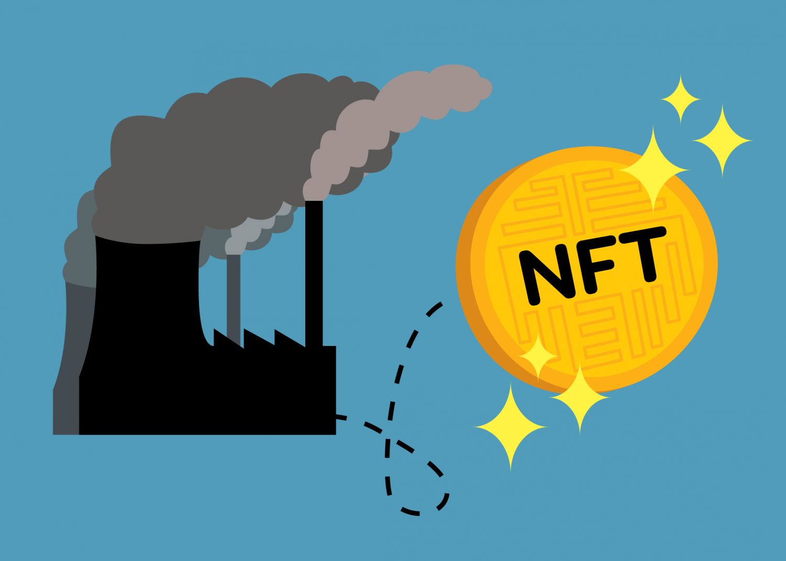

## Table of Contents

## What are NFTs and how do they relate to the environment?

NFTs, or Non-Fungible Tokens, are unique digital items that you can buy and sell online. They are like digital certificates that prove you own something special, like a piece of art, a tweet, or even a video clip. NFTs are stored on a blockchain, which is a type of digital ledger that keeps track of who owns what. Because each NFT is one-of-a-kind, it can't be swapped for another item the way you can exchange one dollar for another.

The relationship between NFTs and the environment is a bit tricky. The problem is that the blockchain technology used to create and trade NFTs uses a lot of electricity. This electricity often comes from power plants that burn fossil fuels, which release greenhouse gases into the air. These gases contribute to climate change. So, while NFTs are exciting and innovative, they also have a downside because they can harm the environment. People are working on ways to make NFTs more eco-friendly, but for now, it's something to think about when you're considering buying or selling them.

## How is the energy consumption of NFTs calculated?

The energy consumption of NFTs is calculated by looking at the energy used by the blockchain they are on. Most NFTs use the Ethereum blockchain, which uses a system called "proof of work." In this system, computers around the world solve complex math problems to add new transactions to the blockchain. Solving these problems takes a lot of electricity, and the more transactions there are, the more energy is used.

To figure out how much energy NFTs use, researchers add up the electricity used by all the computers working on the Ethereum blockchain. They then estimate how much of that energy is used for NFT transactions. This can be tricky because the blockchain is used for other things too, like regular [cryptocurrency](/wiki/cryptocurrency) transactions. But by looking at the number of NFT transactions and the energy used by the whole blockchain, they can get a good idea of the environmental impact of NFTs.

## What is the carbon footprint of creating and trading an NFT?

The carbon footprint of creating and trading an NFT can be pretty big. It's because NFTs use a lot of electricity, and this electricity often comes from burning fossil fuels like coal or gas. When we burn these fuels, they release carbon dioxide into the air, which is a big problem for the environment. Scientists have figured out that making one NFT can use as much electricity as a typical American home uses in a couple of weeks. That's a lot of energy for just one digital item!

Trading NFTs also adds to the carbon footprint. Every time an NFT is bought or sold, it uses more electricity on the blockchain. If lots of people are trading NFTs, the energy use adds up quickly. Some people are trying to find ways to make NFTs use less energy, like using different kinds of blockchains that don't need as much power. But for now, the carbon footprint of NFTs is something to think about if you're interested in buying or selling them.

## How does the blockchain technology used in NFTs contribute to environmental impact?

Blockchain technology, which is used to create and trade NFTs, can have a big impact on the environment. This is because it uses a lot of electricity. The most common type of blockchain for NFTs, called Ethereum, uses a system called "proof of work." In this system, lots of computers around the world compete to solve hard math problems. The first computer to solve the problem gets to add a new block of transactions to the blockchain. All this solving takes a lot of power, and that power often comes from burning fossil fuels like coal or gas. When we burn these fuels, they release carbon dioxide into the air, which is bad for the environment and contributes to climate change.

The more NFTs that are created and traded, the more electricity is used, and the bigger the environmental impact. Making just one NFT can use as much electricity as a typical American home uses in a couple of weeks. That's a lot of energy for something that's just digital! Every time an NFT is bought or sold, it uses more electricity on the blockchain. This means that the more people trade NFTs, the more energy they use, and the more carbon dioxide they release into the air. Some people are working on ways to make NFTs use less energy, like using different kinds of blockchains that don't need as much power. But for now, the environmental impact of NFTs is something to think about.

## What are the differences in environmental impact between various blockchain networks used for NFTs?

Different blockchain networks used for NFTs have different impacts on the environment. The biggest difference comes from how they use energy. Ethereum, which is the most popular blockchain for NFTs, uses a system called "proof of work." This system makes computers solve hard math problems to add transactions to the blockchain. Solving these problems uses a lot of electricity, which often comes from burning fossil fuels like coal or gas. This releases a lot of carbon dioxide into the air, which is bad for the environment.

Some other blockchains, like Tezos and Flow, use a different system called "proof of stake." This system doesn't need computers to solve math problems. Instead, it lets people add transactions to the blockchain based on how many coins they own. This uses a lot less electricity, so it's better for the environment. For example, making an NFT on Tezos uses much less energy than making one on Ethereum. This means that if you care about the environment, you might want to choose NFTs on blockchains that use "proof of stake" instead of "proof of work."

There are also efforts to make Ethereum more eco-friendly. Ethereum is planning to switch from "proof of work" to "proof of stake" with something called Ethereum 2.0. If this happens, it could make a big difference in how much energy NFTs use on Ethereum. But until that change happens, the environmental impact of NFTs on Ethereum will stay pretty high. So, it's important to think about which blockchain you use if you want to help the environment.

## Can NFTs be considered sustainable, and if so, under what conditions?

NFTs can be considered sustainable under certain conditions. The main thing that makes NFTs not sustainable is the high amount of energy they use. Most NFTs are made on the Ethereum blockchain, which uses a system called "proof of work." This system uses a lot of electricity because computers have to solve hard math problems to add transactions to the blockchain. If NFTs were made on blockchains that use less energy, like those that use "proof of stake," they would be more sustainable. "Proof of stake" doesn't need computers to solve math problems, so it uses a lot less electricity.

There are also other ways to make NFTs more sustainable. For example, if the electricity used to power the computers working on the blockchain came from renewable sources like wind or solar power, then the environmental impact would be much smaller. Also, if people traded fewer NFTs, or if the NFTs were used for things that have a positive impact on the environment, like funding conservation projects, then they could be seen as more sustainable. So, while NFTs are not very sustainable right now, they could be if we make some changes to how they are made and used.

## What initiatives are in place to reduce the environmental impact of NFTs?

There are several initiatives working to make NFTs more eco-friendly. One big effort is to switch from using blockchains that use "proof of work" to those that use "proof of stake." Ethereum, the most popular blockchain for NFTs, is planning to move to "proof of stake" with something called Ethereum 2.0. This change would use a lot less electricity, making NFTs more sustainable. Other blockchains like Tezos and Flow already use "proof of stake," so making NFTs on these networks is already better for the environment.

Another initiative is to use renewable energy sources to power the computers that work on blockchains. If the electricity comes from wind, solar, or other green sources, then the carbon footprint of NFTs would be much smaller. Some companies are even starting to offset the carbon emissions from their NFTs by investing in projects that help the environment, like planting trees or funding renewable energy. These efforts show that people are thinking about how to make NFTs more sustainable, even if there's still a lot of work to do.

## How do NFTs compare to other digital assets in terms of environmental impact?

NFTs have a bigger environmental impact than many other digital assets because they use a lot of electricity. Most NFTs are made on the Ethereum blockchain, which uses a system called "proof of work." This system makes computers solve hard math problems to add transactions to the blockchain. Solving these problems uses a lot of power, which often comes from burning fossil fuels like coal or gas. This releases carbon dioxide into the air, which is bad for the environment. Other digital assets, like regular cryptocurrencies or digital files stored on the internet, usually don't use as much energy.

However, not all digital assets are the same. Some cryptocurrencies, like Bitcoin, also use "proof of work" and have a big environmental impact, similar to NFTs. But other digital assets, like those on blockchains that use "proof of stake," use a lot less energy. "Proof of stake" doesn't need computers to solve math problems, so it's better for the environment. For example, if you compare an NFT on Ethereum to a digital file stored on a regular server, the NFT uses much more energy. But if you compare it to a digital asset on a "proof of stake" blockchain, the difference might be smaller. So, while NFTs often have a bigger environmental impact than many digital assets, it depends on the technology they use.

## What role do NFT marketplaces play in the environmental impact of NFTs?

NFT marketplaces play a big role in the environmental impact of NFTs because they are where people buy and sell NFTs. Every time someone makes a new NFT or trades one on these marketplaces, it uses energy on the blockchain. Most of these marketplaces use the Ethereum blockchain, which uses a lot of electricity because it makes computers solve hard math problems. This means that the more people use NFT marketplaces, the more energy is used, and the bigger the impact on the environment.

Some NFT marketplaces are trying to do things to help the environment. For example, they might use blockchains that use less energy, like those that use "proof of stake" instead of "proof of work." They might also try to offset the carbon emissions from the NFTs they sell by investing in projects that help the environment, like planting trees or funding renewable energy. So, while NFT marketplaces can make the environmental impact of NFTs worse, they can also help make it better if they choose to use greener technologies and practices.

## How can the lifecycle of an NFT, from creation to disposal, be optimized for lower environmental impact?

The lifecycle of an NFT, from creation to disposal, can be made more eco-friendly by choosing the right blockchain and energy sources. When making an NFT, it's important to use a blockchain that doesn't use too much electricity. Blockchains like Tezos and Flow use a system called "proof of stake," which uses a lot less energy than the "proof of work" system used by Ethereum. If more people make their NFTs on these greener blockchains, it would help the environment. Also, if the electricity used to power the computers working on the blockchain comes from renewable sources like wind or solar power, then the environmental impact of making an NFT would be much smaller.

After an NFT is created, the way it's traded and eventually disposed of also matters. Trading an NFT uses energy on the blockchain, so if people trade fewer NFTs, or if they use marketplaces that are trying to be more eco-friendly, it can help. Some marketplaces are starting to offset the carbon emissions from the NFTs they sell by investing in projects that help the environment. When it comes time to get rid of an NFT, instead of just deleting it, people could think about donating it to a cause that helps the environment. By making smart choices at every step of an NFT's life, from creation to disposal, we can make NFTs better for the planet.

## What are the future trends in making NFTs more environmentally friendly?

One big trend in making NFTs more environmentally friendly is moving to blockchains that use less energy. Right now, most NFTs are made on the Ethereum blockchain, which uses a lot of electricity because it makes computers solve hard math problems. But Ethereum is planning to switch to a new system called "proof of stake" with something called Ethereum 2.0. This new system doesn't need computers to solve math problems, so it uses a lot less energy. Other blockchains like Tezos and Flow already use "proof of stake," so making NFTs on these networks is already better for the environment. If more people start using these greener blockchains, it will help a lot.

Another trend is using renewable energy to power the computers that work on blockchains. If the electricity comes from wind, solar, or other green sources, then the carbon footprint of NFTs would be much smaller. Some companies are already starting to do this, and they're also trying to offset the carbon emissions from their NFTs by investing in projects that help the environment, like planting trees or funding renewable energy. These efforts show that people are thinking about how to make NFTs more sustainable, even if there's still a lot of work to do. By making smart choices about which blockchains to use and where the energy comes from, we can make NFTs better for the planet.

## How can policy and regulation influence the environmental impact of NFTs?

Policy and regulation can make a big difference in how much NFTs affect the environment. Governments can set rules that make it easier for people to use blockchains that use less energy. For example, they could give tax breaks or other rewards to companies that use "proof of stake" blockchains instead of "proof of work" ones. They could also make rules that say companies have to tell people how much energy their NFTs use, so people can make better choices about which ones to buy. By making these kinds of rules, governments can help push the whole NFT industry to be more eco-friendly.

Another way policy can help is by encouraging the use of renewable energy. Governments can make laws that say the electricity used to power the computers that work on blockchains has to come from clean sources like wind or solar power. They could also set up programs to help companies switch to using green energy. If the energy used to make and trade NFTs is cleaner, then the environmental impact of NFTs will be a lot smaller. By using policy and regulation to guide the NFT market towards greener practices, we can make NFTs better for the planet.

## References & Further Reading

[1]: "Ethereum Platform's Shift to Proof-of-Stake" - [Ethereum Foundation Blog](https://caia.org/blog/2024/12/02/prototype-profitability-how-digital-assets-capture-value)

[2]: Digiconomist's Bitcoin Energy Consumption Index - [Digiconomist](https://digiconomist.net/bitcoin-energy-consumption)

[3]: Perez, Y. & Hazen, M. (2021). "The Environmental Impact of Non-fungible Tokens (NFTs)." Journal of Environmental Economics and Policy Studies.

[4]: "Global Cryptoasset Benchmarking Study" by the Cambridge Centre for Alternative Finance - [Cambridge Centre for Alternative Finance](https://www.jbs.cam.ac.uk/faculty-research/centres/alternative-finance/publications/3rd-global-cryptoasset-benchmarking-study/)

[5]: Sedlmeir, J., Buhl, H.U., Fridgen, G., & Keller, R. (2020). "The Energy Consumption of Blockchain Technology: Beyond Myth." Business & Information Systems Engineering.