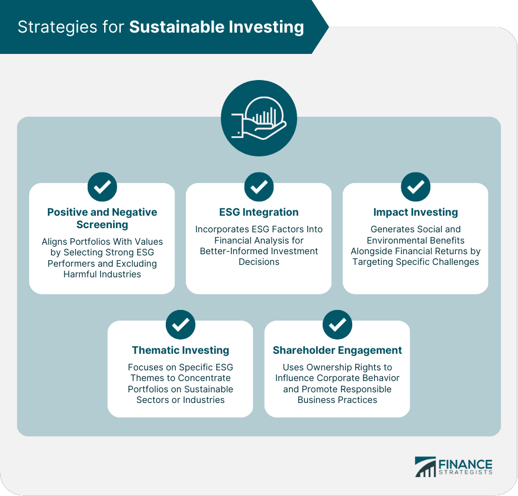

## Table of Contents

## What are Exchange-Traded Funds (ETFs) and how do they work?

Exchange-Traded Funds (ETFs) are investment funds that are traded on stock exchanges, just like individual stocks. They are designed to track the performance of a specific index, like the S&P 500, a commodity, or a basket of assets. This means that when you buy shares of an ETF, you're essentially buying a small piece of each of the assets within that fund. This can be a convenient way for investors to diversify their portfolio without having to buy each asset individually.

ETFs work by pooling money from many investors to purchase a collection of assets, which are then divided into shares. These shares can be bought and sold throughout the trading day at market prices, which can fluctuate based on supply and demand. Unlike mutual funds, which are only priced at the end of the trading day, ETFs offer more flexibility because you can trade them whenever the market is open. This makes ETFs a popular choice for both short-term traders and long-term investors looking for an easy way to gain exposure to a wide range of assets.

## Why might someone consider using ETFs for environmental investment?

Someone might consider using ETFs for environmental investment because they offer an easy way to support green initiatives. By investing in an environmental ETF, you can put your money into companies that focus on renewable energy, clean technology, or other eco-friendly practices. This means you don't have to pick individual stocks, which can be hard and risky. Instead, the ETF does the work for you by spreading your investment across many different green companies.

Another reason to use ETFs for environmental investment is that they can help you make a bigger impact. When lots of people invest in these funds, it sends a message to the market that there's a demand for sustainable practices. This can encourage more companies to go green and can help drive more money into environmentally friendly projects. Plus, ETFs often have lower fees than actively managed funds, so more of your money can go towards supporting the environment instead of paying for management costs.

## What are the basic types of environmental ETFs available in the market?

Environmental ETFs come in different types, each focusing on different parts of green investing. One common type is renewable energy ETFs. These ETFs invest in companies that produce energy from sources like wind, solar, and hydroelectric power. This helps support the shift away from fossil fuels and towards cleaner energy options. Another type is clean tech ETFs, which focus on companies that develop technologies to reduce pollution and waste. These can include firms working on electric vehicles, energy-efficient appliances, and recycling technologies.

There are also ETFs that focus on sustainable practices across different industries. These broad-based environmental ETFs might include companies from sectors like agriculture, water management, and green building. They aim to support companies that are trying to reduce their environmental impact in various ways. For example, an [ETF](/wiki/etf-trading-strategies) might invest in a company that uses sustainable farming methods or one that builds eco-friendly homes.

Lastly, some ETFs target specific environmental themes, like carbon reduction or climate change solutions. These thematic ETFs might invest in companies that work on carbon capture and storage, or those developing technologies to adapt to climate change. By investing in these ETFs, you can support efforts to tackle big environmental challenges. Each type of environmental ETF offers a way to invest in a greener future, depending on what specific issues you care about most.

## How can a beginner start investing in environmental ETFs?

If you're a beginner and want to start investing in environmental ETFs, the first step is to open a brokerage account. You can do this online with many different companies. Once your account is set up, you'll need to decide which environmental ETF you want to invest in. You can look at different ETFs that focus on things like renewable energy, clean technology, or broad environmental themes. Websites like Morningstar or the ETF provider's own site can give you information about what each ETF invests in and how it has performed.

After choosing an ETF, you can buy shares through your brokerage account. Just type in the ETF's ticker symbol and decide how much money you want to invest. Remember, you don't need a lot of money to start; many brokers let you buy fractional shares, so you can invest even small amounts. It's a good idea to keep an eye on your investment and learn more about the companies the ETF is invested in. This way, you can see how your money is helping the environment and make changes to your investments if you need to.

## What are the key factors to consider when selecting an environmental ETF?

When [picking](/wiki/asset-class-picking) an environmental ETF, you should think about what kind of green investing you want to do. Some ETFs focus on renewable energy like wind and solar power, while others might invest in clean tech or companies that use sustainable practices across different industries. Decide what environmental issues matter most to you, like reducing carbon emissions or supporting green building, and choose an ETF that matches your goals. Also, look at the ETF's holdings to make sure it includes companies you believe in and want to support.

Another important thing to consider is the performance and fees of the ETF. Check how the ETF has done over time compared to other similar funds or the market as a whole. This can give you an idea of how well it might do in the future. Also, pay attention to the expense ratio, which is how much the ETF charges you each year to manage your money. Lower fees mean more of your money goes towards supporting the environment instead of paying for management costs. By thinking about these factors, you can pick an environmental ETF that fits your values and financial goals.

## How do environmental ETFs contribute to sustainable development goals?

Environmental ETFs help with sustainable development goals by putting money into companies that work on green projects. These projects can be things like making clean energy from the sun or wind, or creating new ways to use less water and make less waste. When people invest in these ETFs, they are helping these companies grow and do more good for the planet. This supports goals like having affordable and clean energy, taking care of the earth's resources, and building strong communities that can handle climate change.

Also, by investing in environmental ETFs, people can encourage more companies to focus on being eco-friendly. When a lot of people buy these ETFs, it shows that there is a big demand for green businesses. This can push other companies to start doing more to help the environment, which can lead to even more progress towards sustainable development goals. Overall, environmental ETFs play a big role in making the world a better place for everyone by supporting and growing green initiatives.

## What are the risks associated with investing in environmental ETFs?

Investing in environmental ETFs can be risky because the companies they invest in might not do well. For example, if a company that makes solar panels has problems, it can affect the whole ETF. Also, the prices of these ETFs can go up and down a lot. This is called [volatility](/wiki/volatility-trading-strategies), and it can make your investment worth less if you need to sell it at a bad time. Another risk is that some environmental ETFs might be new or small, so they might not have a lot of money or investors. This can make them less stable and harder to sell when you want to.

Another thing to think about is that the focus on the environment might not always be the best for making money. Sometimes, companies that are good for the planet might not make as much profit as other companies. This means your investment might not grow as fast as you hope. Also, the rules and laws about the environment can change. If a government decides to make new rules, it could hurt the companies in the ETF, which would affect your investment. So, while environmental ETFs can help the planet, they also come with risks that you need to think about before investing.

## How can one evaluate the performance of an environmental ETF?

To evaluate the performance of an environmental ETF, you should first look at how much money it has made over time. You can do this by checking the ETF's total return, which shows how much the value of the ETF has gone up or down. It's a good idea to compare the ETF's returns with other similar ETFs or with the overall market. This helps you see if the ETF is doing well or not. Also, look at how much the ETF's price goes up and down, which is called volatility. If the price changes a lot, it might be riskier, but it could also mean bigger gains or losses.

Another thing to think about is how the ETF is doing compared to what it's supposed to do. Environmental ETFs usually try to follow a certain group of green companies or a specific environmental goal. Check if the ETF is actually investing in the right kinds of companies and if it's meeting its goals. You can find this information on the ETF's website or in reports from financial websites. Also, consider the fees you have to pay for the ETF. Lower fees mean more of your money stays in your pocket, so it's important to see if the ETF's costs are reasonable compared to others.

## What advanced strategies can be used to optimize returns from environmental ETFs?

To optimize returns from environmental ETFs, one advanced strategy is to use dollar-cost averaging. This means you invest a set amount of money into the ETF at regular times, like every month. By doing this, you buy more shares when the price is low and fewer when it's high, which can help you get a better average price over time. Another strategy is to rebalance your portfolio. This means you check your investments regularly and adjust them to keep the right mix of different ETFs or other investments. If one ETF is doing really well, you might sell some of it and buy more of another that's not doing as well, to keep things balanced and possibly increase your overall returns.

Another way to optimize returns is to use tax-efficient strategies. For example, you can hold your environmental ETFs in tax-advantaged accounts like an IRA or a 401(k). This can help you keep more of your earnings because you won't have to pay taxes on them right away. Also, consider using stop-loss orders to protect your investment. A stop-loss order automatically sells your ETF if its price drops to a certain level, which can help you limit your losses if the market goes down suddenly. By combining these strategies, you can work towards getting the best possible returns from your environmental ETFs while still supporting green initiatives.

## How do regulatory changes impact environmental ETFs and their strategies?

Regulatory changes can have a big impact on environmental ETFs. When governments make new rules about the environment, it can change how well the companies in the ETF do. For example, if a new law makes it harder for a solar company to operate, the value of the ETF that holds that company's stock might go down. On the other hand, if a new rule helps green companies by giving them money or making it easier for them to work, the ETF could do better. So, people who manage ETFs need to keep an eye on these changes and maybe change what companies they invest in to make sure the ETF still meets its goals.

Because of this, the people who run environmental ETFs might need to change their strategies. They might start investing in different kinds of green companies or in new areas that are helped by the new rules. They might also need to be ready to move their money around quickly if the rules change a lot. This means that investors in environmental ETFs need to stay informed about what's happening with laws and rules, so they can understand how it might affect their investments. By doing this, they can make better choices about when to buy or sell shares in the ETF.

## What role do environmental ETFs play in a diversified investment portfolio?

Environmental ETFs can be a good part of a diversified investment portfolio. They let you put money into green companies without having to pick each one yourself. This means you can spread your money across many different kinds of green businesses, like solar power or clean tech. By doing this, you lower the risk of losing money if one company does badly. It's like not putting all your eggs in one basket. Plus, having environmental ETFs in your portfolio can help balance out other investments that might be in industries that aren't so green.

Adding environmental ETFs also helps you support the environment while trying to make money. These ETFs can grow as more people care about the planet and want to invest in green companies. This can make your portfolio more stable because it's not just focused on traditional industries. It's a way to do good for the earth and still work towards your financial goals. So, environmental ETFs are a smart choice for anyone who wants a mix of different investments that can help the planet too.

## How can investors use environmental ETFs to influence corporate environmental policies?

Investors can use environmental ETFs to influence corporate environmental policies by putting their money into companies that care about the environment. When lots of people invest in these ETFs, it shows companies that there's a big demand for green practices. This can push companies to make their own environmental policies better. For example, if a company sees that investors are choosing ETFs that focus on clean energy, they might decide to invest more in solar or wind power to attract more investment.

By choosing environmental ETFs, investors send a strong message to the market. They show that they want companies to take action on issues like climate change and pollution. This can lead to more companies setting goals to reduce their carbon footprint or use less water. Over time, as more money goes into these ETFs, more companies will feel the pressure to change their ways. This can help make the whole economy more focused on sustainability and better for the planet.

## References & Further Reading

[1]: Bergstra, J., Bardenet, R., Bengio, Y., & Kégl, B. (2011). ["Algorithms for Hyper-Parameter Optimization."](https://papers.nips.cc/paper/4443-algorithms-for-hyper-parameter-optimization) Advances in Neural Information Processing Systems 24.

[2]: ["Advances in Financial Machine Learning"](https://www.amazon.com/Advances-Financial-Machine-Learning-Marcos/dp/1119482089) by Marcos Lopez de Prado

[3]: ["Sustainable Investing: Revolutions in Theory and Practice"](https://www.taylorfrancis.com/books/edit/10.4324/9781315558837/sustainable-investing-cary-krosinsky-sophie-purdom) by Cary Krosinsky and Sophie Purdom

[4]: ["Algorithmic Trading and DMA: An introduction to direct access trading strategies"](https://archive.org/details/algorithmictradi0000john) by Barry Johnson

[5]: ["Green Financial Products and Services: Managing Barriers to Market Development and Growth"](https://www.unepfi.org/publications/green-financial-products-and-services-current-trends-and-future-opportunities-in-north-america/) by Seta Alhadi et al.

[6]: ["Guide to Intelligent Data Analysis"](https://link.springer.com/book/10.1007/978-1-84882-260-3) by Michael R. Berthold and Christian Borgelt

[7]: ["Principles for Responsible Investment (PRI)."](https://www.unpri.org/about-us/what-are-the-principles-for-responsible-investment) United Nations-supported PRI

[8]: ["Sustainable Finance Disclosure Regulation (SFDR): Overview and Challenges."](https://finance.ec.europa.eu/regulation-and-supervision/financial-services-legislation/implementing-and-delegated-acts/sustainable-finance-disclosures-regulation_en) 

[9]: ["Investment Governance and the Integration of ESG Factors."](https://www.oecd.org/en/publications/investment-governance-and-the-integration-of-environmental-social-and-governance-factors_40a1430a-en.html) OECD Report

[10]: ["Machine Learning for Algorithmic Trading"](https://github.com/stefan-jansen/machine-learning-for-trading) by Stefan Jansen