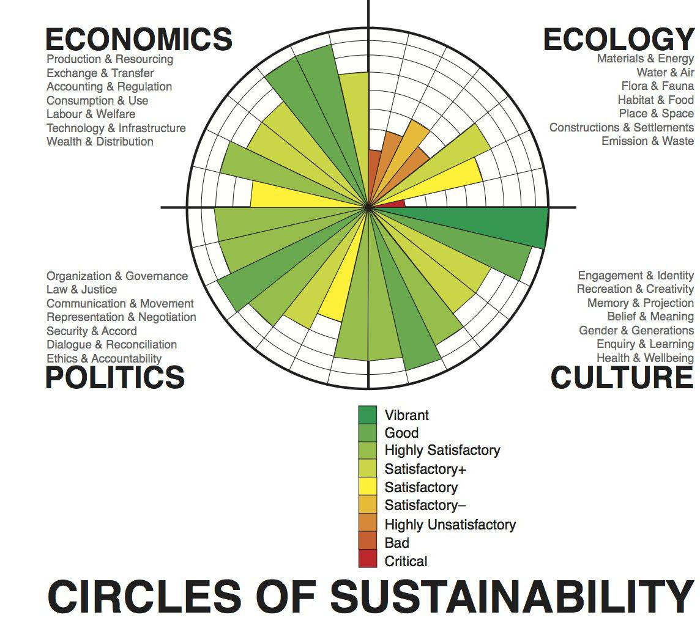

In today's rapidly changing financial landscape, themes like corporate responsibility, sustainability, ethical investing, and algorithmic trading (commonly known as algo trading) are gaining significant traction. These elements have carved distinct niches in the financial ecosystem, offering insights into how modern finance can evolve by embracing responsibility and ethics. The convergence of these themes has created a comprehensive framework prioritizing financial returns while integrating ethical and sustainable practices, heralding a transformative era in the investment world.

At the core of this transformation is the rise of Environmental, Social, and Governance (ESG) criteria, which play a pivotal role in shaping sustainable finance. ESG involves evaluating companies based on their environmental impact, social responsibility, and governance practices. This set of criteria allows investors to assess the broader implications of their investments beyond monetary gains, prompting firms to adopt more responsible and sustainable practices.



Algorithmic trading, another key component of this landscape, uses computer algorithms to execute trades based on specific criteria. When aligned with ESG criteria, algorithmic trading can enhance investment decision-making by efficiently processing large volumes of sustainability-related data. This integration not only supports ethical and sustainable goals but also maintains strong financial performance, offering a balanced approach to investing.

In this rapidly evolving environment, these concepts are playing increasingly important roles. By comprehending how these themes intertwine and influence each other, stakeholders can navigate the complexities of the financial sector, fostering a more sustainable future. Through this journey, the aim is to offer comprehensive insights into the changing dynamics of these paradigms in the financial landscape, elucidating their evolving significance and potential.

## Table of Contents

## Understanding Corporate Responsibility and Sustainability

Corporate responsibility, also known as corporate social responsibility (CSR), encompasses a company's commitment to managing its social, environmental, and economic impacts with integrity. It's a voluntary approach whereby businesses consider their influence on the world beyond mere profit generation, emphasizing accountability and transparency. This philosophy encourages companies to operate ethically and prioritize social welfare by addressing issues such as worker rights, community engagement, and philanthropy.

Sustainability extends this commitment to long-term responsible practices, ensuring that present actions do not jeopardize future generations' ability to meet their needs. It focuses on the delicate balance between economic growth, environmental care, and social well-being. In practice, sustainability involves resource efficiency, reducing emissions, and implementing renewable energy solutions.

The convergence of corporate responsibility and sustainability has become a guiding framework for businesses. Ethically-driven firms seek measures to minimize their ecological footprint, integrating strategies that promote environmental conservation like adopting eco-friendly materials, optimizing energy consumption, and supporting biodiversity. These initiatives contribute to reducing negative environmental impacts, safeguarding natural resources for the future.

Sustainable practices also encompass fostering equitable social systems. It involves developing inclusive workplace policies, ensuring fair labor practices, and actively contributing to local community development. Companies committed to these principles strive to enhance social welfare by participating in fair trade practices, engaging in ethical sourcing, and investing in community education and healthcare projects.

Sound governance practices are an integral aspect of both corporate responsibility and sustainability. Companies are encouraged to maintain robust governance structures that ensure transparency, accountability, and ethical decision-making processes. By implementing strong governance frameworks, firms can effectively uphold compliance with legal standards, promote ethical business conduct, and mitigate risks associated with unethical practices.

In summary, the integration of corporate responsibility and sustainability enables businesses to operate with a long-term vision, striving for economic viability, environmental stewardship, and societal well-being. As more companies adopt these principles, they contribute significantly to building resilient, inclusive societies and sustainable economies.

## Ethical Investing and ESG Criteria

Ethical investing is a strategy designed to align financial goals with personal values, emphasizing the evaluation of investments through Environmental, Social, and Governance ([ESG](/wiki/esg-investing)) criteria. This approach enables investors to assess the wider societal and environmental implications of their investment choices, promoting corporate accountability and encouraging more responsible business practices. 

Environmental factors consider a company's impact on the natural world, including its efforts to reduce carbon emissions, manage resources sustainably, and minimize its carbon footprint. Social criteria examine how a company manages relationships with employees, customers, and communities, focusing on labor standards, human rights, and community engagement. Governance involves scrutinizing the internal system of practices, controls, and procedures that define how a company is operated and managed, ensuring transparency, accountability, and integrity.

ESG criteria are essential for identifying and managing risks associated with investment choices. By incorporating ESG factors, investors can better evaluate a company's commitment to sustainable practices, discouraging investments in companies that do not meet high standards of corporate governance and social responsibility. This evaluation potentially leads to improved financial performance by avoiding companies that might face legal or reputational risks.

Understanding ESG not only aids investors in making informed, value-driven decisions but also plays a significant role in enhancing social welfare. By supporting companies with strong ESG performance, investors contribute to broader societal goals, such as environmental preservation and social equity. Ethical investing, therefore, represents a powerful tool for fostering change, aligning investment portfolios with values that benefit both society and the planet, while still pursuing financial returns.

## The Role of Algorithmic Trading in Sustainable Finance

Algorithmic trading, often referred to as algo trading, represents the utilization of computer systems and software to automate and execute trading decisions according to pre-established criteria. This methodology has become increasingly prominent in the context of sustainable finance, primarily due to its ability to integrate Environmental, Social, and Governance (ESG) criteria within investment strategies.

When combined with ESG metrics, [algorithmic trading](/wiki/algorithmic-trading) optimizes investment portfolios by analyzing vast quantities of sustainability-related data. This integration allows for swift and precise financial decisions that align with ethical and sustainability objectives, without compromising on performance. Algorithms can swiftly process and analyze real-time ESG data, adjusting investment strategies to reflect any changes in sustainability measures or goals. This real-time adaptation ensures that investments remain aligned with socially responsible targets and objectives.

Consider the following simplified Python example for implementing an algorithmic trading strategy that factors in an ESG score:

```python
def get_esg_score(ticker):
    # Simulated function to retrieve ESG score for given ticker
    # This would usually involve fetching data from an ESG data provider
    return esg_data_provider.get_score(ticker)

def trading_decision(ticker, esg_threshold):
    esg_score = get_esg_score(ticker)

    if esg_score > esg_threshold:
        return "buy"
    else:
        return "sell"

portfolio = ["AAPL", "TSLA", "GOOGL"]  # Sample portfolio
esg_threshold = 75                    # Example ESG threshold

for stock in portfolio:
    decision = trading_decision(stock, esg_threshold)
    print(f"{stock}: {decision}")
```

In the above illustration, a basic function `get_esg_score(ticker)` retrieves the ESG score for a given stock ticker. The trading decision is then executed based on whether the ESG score meets a specified threshold.

Furthermore, algorithmic trading facilitates the seamless integration of ESG factors by leveraging [machine learning](/wiki/machine-learning) techniques to predict future trends in sustainability-related performance and potential financial gains. Machine learning models can be trained on historical ESG data to uncover patterns and correlations that might inform future investment opportunities, thus allowing investors to stay ahead of regulatory changes and evolving sustainability standards.

By incorporating ESG data into algorithmic trading models, investors are empowered to adopt a dynamic approach that continuously aligns investments with ethical and sustainable objectives, providing a blend of financial return and societal impact. This method of trading encourages the prioritization of companies that are not only financially sound but also socially responsible and environmentally sustainable. As algorithmic trading continues to evolve within sustainable finance, it holds the potential to significantly influence investment decisions towards a more sustainable future.

## Challenges and Criticisms

Sustainable and ethical investing, while increasingly prevalent, is accompanied by several notable challenges and criticisms, which stakeholders must address to foster trust and effectiveness in this growing sector. 

One prominent issue is greenwashing, where corporations make deceptive claims about their environmental actions to entice ethically-minded investors, all while failing to implement meaningful sustainability practices. This form of corporate misrepresentation undermines genuine efforts by truly responsible companies, skewing market perceptions and potentially leading investors to inadvertently support firms that fall short of their ethical criteria.

Another significant challenge is the absence of standardized ESG (Environmental, Social, and Governance) metrics. Variations in ESG reporting practices create a fragmented landscape where investors struggle to compare company performance reliably. This inconsistency complicates investment decision-making, as the lack of uniformity in metrics can lead to varying interpretations of what constitutes a sustainable or ethical practice.

There is also ongoing debate about the financial performance of ethical investments. Some investors remain skeptical, perceiving a trade-off between ethical considerations and financial returns. However, empirical research often challenges this notion, suggesting that ethical investments can yield returns on par with, or even superior to, traditional investments. Studies indicate that, over time, companies with strong ESG performance might offer risk-adjusted returns that are competitive with non-ethical counterparts. Nevertheless, the perception of potential underperformance persists, which can deter broader adoption among financially-oriented investors. 

Addressing these challenges involves promoting transparency in corporate disclosures, developing universally accepted ESG metrics, and conducting rigorous research to clarify the financial implications of sustainable and ethical investing.

## Future Trends and Opportunities

The future of sustainable investing appears promising with several emerging trends and opportunities poised to reshape the industry. The adoption of green technologies continues to advance, enabling more environmentally friendly practices and solutions across various sectors. This progression not only aids in reducing ecological footprints but also attracts investors keen on sustainable growth, contributing to a healthier planet and robust financial returns.

Stricter regulations are anticipated to play a crucial role in shaping the future landscape. Governments and regulatory bodies worldwide are increasingly mandating sustainability disclosures, compelling companies to provide more transparent and detailed reports on their Environmental, Social, and Governance (ESG) practices. Such regulations are expected to standardize ESG reporting, thereby addressing inconsistencies that have plagued the sector. This standardization will likely lead to diminished risks of greenwashing—a deceptive practice where companies exaggerate their environmental efforts—and enhance trust in ESG metrics amongst investors.

Furthermore, innovative technologies like Artificial Intelligence (AI) and Machine Learning (ML) are set to significantly enhance ESG data analytics. These technologies offer the potential to analyze vast amounts of data quickly and accurately, providing deeper insights into ESG performance and trends. For instance, AI algorithms can process large datasets to identify patterns and predict future ESG outcomes, thus offering valuable guidance for investment strategies. Machine learning models may also be employed to refine risk assessments and forecasts, further aligning investment portfolios with sustainable objectives.

The rise of financial technologies, often referred to as fintech, is another catalyst democratizing access to sustainable investments. Platforms leveraging fintech innovations are making it easier for a wider array of investors to engage with and benefit from sustainable investment opportunities. This leveled playing field means that more individuals and institutions, irrespective of their size or investment power, can partake in the sustainable investing movement. As a result, the influx of diverse investors contributes to a more vibrant and resilient market.

In summary, the sustained growth within the field of sustainable investing is driven by technological advancements, regulatory developments, and increased investor awareness. Together, these factors are paving the way for a future where sustainable investments become a standard in the financial world, ensuring ethical and responsible economic progress.

## Conclusion

The integration of corporate responsibility, sustainability, ethical investing, and algorithmic trading is fundamentally transforming the financial landscape. By collectively advocating a balanced approach, these concepts are aligning financial objectives with ethical values, thereby promoting sustainable economic growth. As this integration deepens, the demand for innovative tools and metrics to measure and manage sustainable investments effectively is anticipated to rise, necessitating advancements in technology and data analytics to support these goals.

Investor interest in sustainability is escalating, leading to a growing emphasis on developing sophisticated, precise methodologies to assess the impact and performance of sustainable investments. Algorithmic trading, when merged with Environmental, Social, and Governance (ESG) criteria, can significantly enhance investment strategies by processing vast amounts of ESG-related data in real-time. This capability ensures that investments continuously align with socially responsible targets and ethical standards without compromising on financial performance.

This convergence represents a paradigm shift not only in investment strategies but also in societal values, emphasizing a broader global commitment to securing a sustainable future. This shift underscores an era where economic growth is pursued alongside ecological balance and social equity, fostering a resilient and ethical financial paradigm that meets the demands of current and future generations.

## References & Further Reading

[1]: Friede, G., Busch, T., & Bassen, A. (2015). ["ESG and financial performance: aggregated evidence from more than 2000 empirical studies."](https://www.tandfonline.com/doi/full/10.1080/20430795.2015.1118917) Journal of Sustainable Finance & Investment, 5(4), 210-233.

[2]: Pedersen, L. H., Fitzgibbons, S., & Pomorski, L. (2021). ["Responsible investing: The ESG-efficient frontier."](https://www.sciencedirect.com/science/article/pii/S0304405X20302853) The Journal of Finance, 76(3), 1013-1047.

[3]: Lopez de Prado, M. (2018). ["Advances in Financial Machine Learning"](https://www.amazon.com/Advances-Financial-Machine-Learning-Marcos/dp/1119482089). John Wiley & Sons.

[4]: Stefan, J. (2020). ["Machine Learning for Algorithmic Trading."](https://github.com/stefan-jansen/machine-learning-for-trading) 

[5]: Kotsantonis, S., & Serafeim, G. (2019). ["Four Things No One Will Tell You About ESG Data."](https://onlinelibrary.wiley.com/doi/abs/10.1111/jacf.12346) Harvard Business Review.

[6]: Eccles, R. G., Ioannou, I., & Serafeim, G. (2014). ["The impact of corporate sustainability on organizational processes and performance."](https://papers.ssrn.com/sol3/papers.cfm?abstract_id=1964011) Management Science, 60(11), 2835-2857.

[7]: Barton, D., & Wiseman, M. (2014). ["Focusing Capital on the Long Term."](https://hbr.org/2014/01/focusing-capital-on-the-long-term) Harvard Business Review.