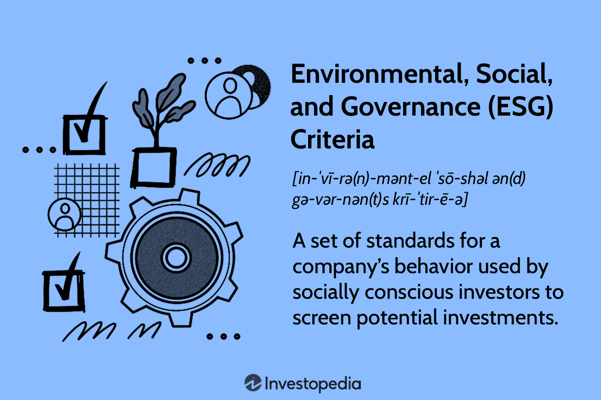

## Table of Contents

## What are Environmental, Social, and Governance (ESG) criteria?

Environmental, Social, and Governance (ESG) criteria are a set of standards used to assess a company's impact on the world around it. These criteria help investors and other stakeholders understand how a company is managing its environmental footprint, its relationships with people, and the way it is run. The environmental part looks at how a company affects the natural world, like its use of energy and resources, and its efforts to reduce pollution. The social part examines how a company treats its employees, customers, and the communities it operates in, focusing on issues like labor practices and human rights. Governance involves the company's leadership, transparency, and how it manages risks and ethical concerns.

Using ESG criteria, investors can make more informed decisions about where to put their money. Companies that score well on ESG metrics are often seen as more sustainable and responsible, which can lead to better long-term performance and fewer risks. For example, a company with strong environmental practices might be better prepared for future regulations on emissions. Similarly, a company with good social practices might have a more loyal workforce and a better reputation among consumers. Good governance can help prevent scandals and financial mismanagement. Overall, ESG criteria help create a more sustainable and ethical business environment.

## Why are ESG criteria important for businesses and investors?

ESG criteria are important for businesses because they help them understand how well they are doing in areas that matter to people and the planet. By focusing on environmental, social, and governance issues, companies can make sure they are not just making money, but also being good citizens. This can help them avoid problems like pollution fines or bad publicity from poor labor practices. It also makes them more attractive to customers and employees who care about these issues. In the long run, companies that do well on ESG measures might be more successful because they are better prepared for changes in laws and what people want.

For investors, [ESG](/wiki/esg-investing) criteria are a way to see if a company is a good investment for the long term. By looking at how a company handles environmental, social, and governance issues, investors can tell if it is likely to face big problems in the future. For example, a company that doesn't care about the environment might have to pay a lot of money later to clean up pollution. Or a company with bad governance might get into trouble with the law. By choosing companies that do well on ESG measures, investors can feel more confident that their money is being used in a way that is not only profitable but also responsible and sustainable.

## How do ESG criteria impact corporate performance and investment decisions?

ESG criteria can make a big difference in how well a company does. When a company does a good job with the environment, like using less energy or reducing waste, it can save money and avoid fines. If a company treats its workers and the community well, it can have happier employees and a better reputation, which can lead to more customers and better sales. Good governance, like having honest leaders and clear rules, helps the company avoid scandals and legal problems. All these things can help a company do better in the long run and be more successful.

For investors, ESG criteria help them decide where to put their money. If a company scores high on ESG, investors might think it's a safer and better long-term investment. They might worry less about the company getting into trouble with the law or losing customers because of bad practices. By choosing companies that care about the environment, treat people well, and have good governance, investors can feel good about their choices and might even make more money over time. ESG criteria give investors a way to see the bigger picture and make smarter decisions.

## What are some examples of environmental factors in ESG?

Environmental factors in ESG look at how a company affects the natural world. This includes things like how much energy the company uses and where it comes from. If a company uses a lot of energy from dirty sources like coal, it might be bad for the environment. But if it uses clean energy like wind or solar power, that's better. Another important thing is how the company handles waste and pollution. If it makes a lot of pollution or doesn't recycle, it can harm the environment. Companies that try to reduce waste and pollution are seen as better for the environment.

Another part of environmental factors is how the company uses resources. This means things like water and raw materials. If a company uses a lot of water or cuts down a lot of trees, it can hurt the environment. But if it tries to use less and find new ways to save resources, that's good. Also, companies that think about climate change and try to reduce their impact on the climate are seen as doing well on environmental factors. This includes things like reducing greenhouse gas emissions and planning for a future with less impact on the environment.

## What are some examples of social factors in ESG?

Social factors in ESG look at how a company treats people. This includes how it treats its workers, like making sure they are paid fairly and have safe places to work. Companies that take good care of their employees often have happier workers who do a better job. It also includes how the company treats the people in the communities where it works. If a company helps the community by giving money or helping with projects, it can make the community better and have a good reputation. But if it pollutes the area or doesn't care about the people, it can cause problems.

Another important part of social factors is how the company deals with customers and other people it works with. If a company is honest and fair with its customers, they are more likely to keep coming back. It also matters how the company handles things like human rights and diversity. If a company makes sure everyone is treated fairly and has equal chances, it can be a better place to work and do business with. All these things help make the company more successful and respected.

## What are some examples of governance factors in ESG?

Governance factors in ESG look at how a company is run and who is in charge. It's about making sure the people at the top of the company are honest and do things the right way. This includes having a board of directors that keeps an eye on what the company is doing and makes sure it follows the rules. If the leaders are clear about what they are doing and why, it helps everyone trust the company more. Good governance also means having good rules about how decisions are made and how the company handles money, so there are no surprises or problems.

Another part of governance is how the company deals with risks and ethical issues. If the company has good ways to spot and deal with problems before they get big, it can avoid a lot of trouble. This includes things like making sure the company doesn't break the law and that it does the right thing even when no one is watching. Companies with strong governance are often seen as safer and more reliable, which can help them do better in the long run.

## How can companies measure and report their ESG performance?

Companies can measure their ESG performance by using different tools and standards that help them keep track of their environmental, social, and governance activities. For the environmental part, they might measure things like how much energy they use, how much waste they produce, and their carbon emissions. They can use tools like the Global Reporting Initiative (GRI) or the Sustainability Accounting Standards Board (SASB) to help them figure out what to measure and how to do it. For social factors, companies can look at things like employee satisfaction, diversity and inclusion, and how they affect the community. They might use surveys, audits, and other ways to get this information. For governance, companies can look at how their board of directors works, how they handle risks, and their ethical practices. They can use frameworks like the International Corporate Governance Network (ICGN) to guide them.

Once companies have measured their ESG performance, they need to report it in a clear and honest way. They can do this by making ESG reports that show what they have been doing and how well they are doing it. These reports can be shared with investors, customers, and the public to show that the company cares about more than just making money. Some companies use standards like the Task Force on Climate-related Financial Disclosures (TCFD) to make sure their reports are good and useful. It's important for companies to be open about their ESG performance so people can trust them and make good decisions about working with or investing in them.

## What are the challenges companies face in implementing ESG practices?

Companies face several challenges when they try to implement ESG practices. One big challenge is the cost. It can be expensive to change how a company does things to be better for the environment or to treat workers better. For example, using clean energy or making safer workplaces might need a lot of money upfront. Another challenge is knowing what to do. There are many different rules and ways to measure ESG, and it can be hard for companies to figure out which ones to follow. This can make it confusing and take a lot of time to get right.

Another challenge is getting everyone in the company to care about ESG. Sometimes, people might not see why it's important or might not want to change how they do things. This can slow down the process and make it harder to make progress. Also, companies need to be honest about their ESG efforts. If they say they are doing things to be better but aren't really, people might not trust them. This can hurt the company's reputation and make it harder to do business.

Lastly, keeping up with ESG can be tough because things are always changing. New laws and what people expect from companies can change quickly. Companies need to keep learning and adjusting to stay on top of ESG. This means they have to be flexible and ready to change their plans as needed. It's a lot of work, but it can help companies be more successful and responsible in the long run.

## How do ESG ratings and scores work, and who provides them?

ESG ratings and scores are like grades that show how well a company is doing with environmental, social, and governance things. Different groups look at what companies do and give them a score based on how good or bad they are at these things. For example, they might look at how much pollution a company makes, how it treats its workers, and if its leaders are honest. The score helps people see which companies are doing a good job and which ones need to do better. It's like a report card that helps investors decide if they want to put their money into a company.

There are many groups that give out ESG ratings and scores. Some big ones are MSCI, Sustainalytics, and Moody's ESG Solutions. Each group might use a bit different way to figure out the scores, but they all look at similar things like how a company affects the environment, how it treats people, and how it is run. Investors and other people use these scores to see if a company is doing well in areas that matter to them. It helps them make choices about where to invest their money or which companies to do business with.

## What is the role of regulatory bodies in enforcing ESG standards?

Regulatory bodies play an important role in making sure companies follow ESG standards. These bodies, like the government or special agencies, make rules that companies have to follow about things like pollution, how they treat workers, and how they are run. If companies don't follow these rules, they can get in trouble and have to pay fines or face other punishments. This helps make sure that companies think about the environment, people, and good governance when they do business.

Regulatory bodies also help by making sure companies tell the truth about their ESG efforts. They check the reports that companies make about their environmental, social, and governance activities to make sure they are honest and correct. This helps people trust the information and make good choices about which companies to invest in or work with. By keeping an eye on companies and making sure they follow the rules, regulatory bodies help create a world where businesses are more responsible and sustainable.

## How does ESG investing differ from traditional investing?

ESG investing is different from traditional investing because it looks at more than just how much money a company can make. Traditional investing focuses mostly on a company's financial performance, like its profits and growth. Investors look at numbers and reports to decide if a company is a good investment. They want to know if the company will make them money in the future. But ESG investing adds another layer. It also looks at how a company affects the environment, how it treats people, and how well it is run. Investors who care about ESG want to put their money into companies that are not just profitable, but also good for the world.

In ESG investing, investors use special ratings and scores to help them decide where to put their money. These ratings look at things like how much pollution a company makes, how it treats its workers, and if its leaders are honest. If a company does well in these areas, it might get a high ESG score, and investors might think it's a safer and better long-term investment. Traditional investing doesn't usually look at these things. It's more about the numbers and less about the impact on the world. So, ESG investing helps investors feel good about their choices because they are supporting companies that care about more than just making money.

## What advanced strategies can investors use to optimize their ESG portfolios?

Investors can use several advanced strategies to make their ESG portfolios better. One way is to use data and tools that help them see deeper into a company's ESG performance. For example, they can use special software that looks at lots of different data to find out which companies are really doing well in areas like the environment, social issues, and how they are run. This can help them pick the best companies to invest in. Another strategy is to use something called "thematic investing," where investors focus on certain themes that match their ESG goals. For example, they might invest in companies that work on clean energy or improving health care. This way, they can make sure their money is going into areas they care about.

Another advanced strategy is to use "impact investing," which means putting money into companies that are trying to solve big problems in the world. Investors can look for companies that are making a real difference in areas like fighting climate change or helping communities. By doing this, they can feel good about their investments because they are helping to make the world a better place. Also, investors can use "active ownership," which means they can talk to the companies they invest in and try to make them do better on ESG issues. By voting on important issues and talking to company leaders, investors can help push companies to improve their environmental, social, and governance practices.

## References & Further Reading

[1]: Friede, G., Busch, T., & Bassen, A. (2015). ["ESG and financial performance: aggregated evidence from more than 2000 empirical studies."](https://www.tandfonline.com/doi/full/10.1080/20430795.2015.1118917) Journal of Sustainable Finance & Investment, 5(4), 210-233.

[2]: Pedersen, L. H., Fitzgibbons, S., & Pomorski, L. (2021). ["Responsible investing: The ESG-efficient frontier."](https://www.sciencedirect.com/science/article/pii/S0304405X20302853) The Journal of Finance, 76(3), 1013-1047.

[3]: Lopez de Prado, M. (2018). ["Advances in Financial Machine Learning"](https://www.amazon.com/Advances-Financial-Machine-Learning-Marcos/dp/1119482089). John Wiley & Sons.

[4]: Stefan, J. (2020). ["Machine Learning for Algorithmic Trading."](https://github.com/stefan-jansen/machine-learning-for-trading) 

[5]: Kotsantonis, S., & Serafeim, G. (2019). ["Four Things No One Will Tell You About ESG Data."](https://onlinelibrary.wiley.com/doi/abs/10.1111/jacf.12346) Harvard Business Review.

[6]: Eccles, R. G., Ioannou, I., & Serafeim, G. (2014). ["The impact of corporate sustainability on organizational processes and performance."](https://papers.ssrn.com/sol3/papers.cfm?abstract_id=1964011) Management Science, 60(11), 2835-2857.

[7]: Barton, D., & Wiseman, M. (2014). ["Focusing Capital on the Long Term."](https://hbr.org/2014/01/focusing-capital-on-the-long-term) Harvard Business Review.