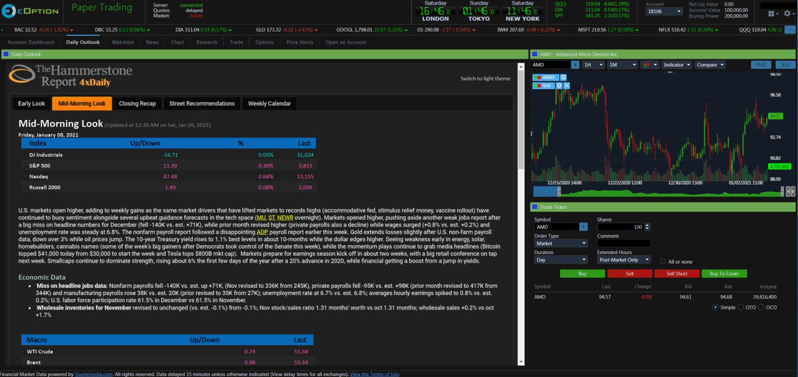

## Table of Contents

## What is the EOption platform and what are its main features?

The EOption platform is a trading platform designed for people who want to trade options and stocks. It is made by a company called EOption, which focuses on giving traders the tools they need to make smart choices. The platform is easy to use, even if you are new to trading. It helps you buy and sell options and stocks without needing a lot of money to start.

One of the main features of EOption is its low-cost trading fees. This means you can trade without spending too much on fees, which can help you keep more of your money. Another important feature is the platform's powerful tools for analyzing the market. These tools help you understand what is happening in the market so you can make better trading decisions. EOption also offers great customer support, so if you have any questions or problems, you can get help quickly.

## How does one get started with using the EOption platform?

To get started with the EOption platform, you first need to sign up for an account on their website. You will need to provide some personal information and go through a verification process to make sure everything is secure. Once your account is set up, you will need to deposit some money into it. EOption has a low minimum deposit requirement, so you don't need a lot of money to start trading.

After your account is funded, you can start using the platform to trade options and stocks. The platform is designed to be user-friendly, so even if you are new to trading, you should be able to navigate it easily. You can use the tools provided to analyze the market and make informed trading decisions. If you have any questions or need help, EOption's customer support team is available to assist you.

## What are the basic trading options available on EOption?

On EOption, you can trade both options and stocks. Options are contracts that give you the right to buy or sell a stock at a certain price before a specific date. There are two main types of options: calls and puts. A call option lets you buy a stock, while a put option lets you sell it. You can use these options to make money if you think the stock price will go up or down.

Stocks are shares in a company that you can buy and sell. When you buy a stock, you own a small part of that company. If the company does well, the value of your stock might go up, and you can sell it for a profit. EOption makes it easy to buy and sell stocks, with low fees that help you keep more of your money.

To start trading on EOption, you just need to open an account, deposit some money, and then you can start buying and selling options and stocks. The platform has tools to help you understand the market and make good choices. If you need help, the customer support team is there to answer your questions.

## How does EOption's fee structure work and how does it compare to other platforms?

EOption has a simple and low-cost fee structure. For options trading, they charge a flat fee of $0.15 per contract, which is very low compared to many other platforms. For stock trading, they charge $3 per trade, which is also competitive. There are no extra fees for account maintenance or inactivity, so you don't have to worry about hidden costs. This makes EOption a good choice for people who want to keep their trading costs low.

Compared to other platforms, EOption's fees are among the lowest. For example, some well-known platforms charge $0.65 per options contract, which is much higher than EOption's $0.15. Other platforms might have no fees for stock trades, but they often make up for it with higher options fees or other charges. EOption's straightforward and low fees make it a great option for traders who want to save money on each trade.

## What educational resources does EOption provide for new traders?

EOption provides a lot of educational resources for new traders to help them learn about options and stocks. They have a section on their website called "Learning Center" where you can find articles, videos, and guides that explain the basics of trading. These resources cover topics like what options are, how to read stock charts, and how to make a trading plan. They are designed to be easy to understand, even if you are new to trading.

In addition to the Learning Center, EOption also offers webinars and live training sessions. These are great because you can learn from experienced traders in real-time. They often talk about current market trends and give tips on how to trade successfully. EOption also has a blog where they share news and insights about the market, which can help you stay informed and make better trading decisions. All these resources are free for EOption users, so you can learn and grow as a trader without spending extra money.

## How can users manage and analyze their portfolio on EOption?

On EOption, users can manage and analyze their portfolio easily with the platform's simple tools. When you log in, you can see all your stocks and options in one place. You can check how much each investment is worth and see how it has changed over time. If you want to buy or sell something, you just need to click a few buttons. EOption also lets you set up alerts, so you get a message if the price of one of your investments goes up or down a lot. This helps you keep track of your portfolio without having to watch it all the time.

To analyze your portfolio, EOption has tools that show you charts and graphs. These help you understand how your investments are doing and what might happen next. You can look at different time periods, like a day, a week, or a month, to see how your investments have performed. EOption also has a feature called "What-If Analysis" where you can see what would happen to your portfolio if the market changes in certain ways. This can help you make better decisions about buying or selling. With these tools, you can keep your portfolio in good shape and make smart choices about your investments.

## What advanced trading tools does EOption offer to experienced traders?

EOption offers several advanced trading tools that experienced traders can use to improve their strategies. One of these tools is the "Options Scanner," which helps traders find the best options to buy or sell based on specific criteria like price, [volume](/wiki/volume-trading-strategy), and [volatility](/wiki/volatility-trading-strategies). This can save a lot of time and help traders make quick decisions. Another useful tool is the "Risk/Reward Calculator," which shows traders how much they could gain or lose on a trade. This helps traders understand the risks before they make a move.

In addition to these tools, EOption also provides a "Probability Calculator" that helps traders see how likely it is that an option will end up in the money. This can be very helpful for planning trades and managing risk. Experienced traders can also use the "Advanced Charting" feature, which offers detailed charts with many technical indicators. This helps traders analyze market trends and find the best times to buy or sell. With these advanced tools, experienced traders can make more informed decisions and improve their overall trading performance.

## How does EOption handle security and data protection for its users?

EOption takes security and data protection very seriously. They use strong encryption to keep your personal information and money safe. When you log in, you have to enter a special code that is sent to your phone or email. This helps make sure that only you can access your account. EOption also watches for any strange activity on your account, like if someone tries to log in from a new place or if there are a lot of trades happening at once. If they see something odd, they will let you know right away.

They also follow strict rules to protect your data. EOption only keeps the information they need to help you trade, and they don't share it with anyone else unless you say it's okay. They have a team that works all the time to make sure their systems are safe and to fix any problems quickly. If you ever have questions about your account's security, you can call their customer support team, who are always ready to help.

## What are the customer support options available on EOption?

EOption offers great customer support to help you with any questions or problems you might have. You can call them on the phone and talk to a real person who can help you right away. They have people working all the time, so you can call them any time of the day or night. If you don't want to call, you can also send them an email. They usually answer emails pretty quickly, so you won't have to wait long for help.

Another way to get help is by using their live chat feature on their website. This is great if you need a quick answer to a question while you are trading. You just type your question into the chat box, and someone from EOption will talk to you right away. They also have a help center on their website with lots of information and answers to common questions. So, no matter what you need help with, EOption has different ways to make sure you get the support you need.

## How does EOption's mobile app functionality compare to its desktop version?

EOption's mobile app is designed to be easy to use, just like their desktop version. You can do most of the same things on the app as you can on the desktop, like buying and selling options and stocks, checking your portfolio, and using some of the basic analysis tools. The app is great for when you are away from your computer and still want to keep an eye on your investments. It's simple to navigate, so even if you're new to trading, you should be able to use it without any trouble.

However, the desktop version of EOption has more advanced features that you won't find on the mobile app. For example, the desktop version has more detailed charting tools and the ability to do more in-depth analysis of the market. If you are an experienced trader who needs these advanced tools, you might find the desktop version more useful. But for everyday trading and keeping track of your portfolio, the mobile app works well and is very convenient.

## What are some advanced strategies that can be implemented using EOption's platform?

EOption's platform allows experienced traders to use advanced strategies like the "Iron Condor." This strategy involves selling an out-of-the-money call and put option while also buying a further out-of-the-money call and put option. The idea is to profit from the stock price staying within a certain range. Traders can use EOption's Options Scanner to find the right options and the Risk/Reward Calculator to see how much they could make or lose. This strategy can be useful for traders who think the stock won't move much in either direction.

Another advanced strategy is the "Covered Call," where you own the stock and sell call options against it. This can help you earn extra income from the premiums of the call options. With EOption's platform, you can easily set up these trades and use the Probability Calculator to see how likely it is that the stock will be called away. This strategy is good for traders who want to make some extra money on stocks they already own but don't expect the stock price to go up a lot.

## How does EOption integrate with other financial tools and services for comprehensive trading and analysis?

EOption works well with other financial tools and services to help traders get a full picture of their investments. You can use EOption's platform to trade options and stocks, and then connect it to other tools for more detailed analysis. For example, you can link EOption to popular financial software like Excel to keep track of your trades and do more complex calculations. This helps you see how your portfolio is doing and make better decisions about what to buy or sell.

Another way EOption integrates with other services is through data feeds from financial data providers like Bloomberg or Reuters. These feeds give you real-time market data, which you can use with EOption's analysis tools to understand what's happening in the market. This can help you spot trends and find good trading opportunities. By using EOption together with these other tools, you can get all the information and analysis you need to trade smarter.

## References & Further Reading

[1]: ["Understanding Options"](https://www.investopedia.com/options-basics-tutorial-4583012) by Michael Sincere

[2]: ["Options Trading Crash Course: The #1 Beginner's Guide to Make Money with Trading Options in 7 Days or Less!"](https://www.amazon.com/Options-Trading-Crash-Course-Beginners/dp/1456636103) by Frank Richmond

[3]: ["Option Volatility and Pricing: Advanced Trading Strategies and Techniques"](https://www.amazon.com/Option-Volatility-Pricing-Strategies-Techniques/dp/0071818774) by Sheldon Natenberg

[4]: Kaminski, K. (2014). ["The Cost and Value of High Frequency Trading."](https://www.sciencedirect.com/science/article/pii/S0304405X24001235) Journal of Trading, 9(3).

[5]: Woodard, C. (2020). ["Understanding Algorithmic Trading."](https://www.sec.gov/files/Algo_Trading_Report_2020.pdf) Journal of Risk and Financial Management, 13(9).