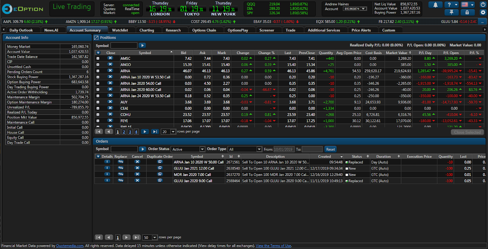

Options trading has experienced a notable surge in popularity, becoming an integral part of diverse investment strategies for individual and institutional investors alike. The appeal of options trading lies in its flexibility, enabling traders to hedge their portfolios, speculate on market movements, and generate income. As the financial markets have evolved, the demand for specialized platforms to cater to options traders has increased, bringing platforms like eOption into the spotlight.

eOption has established itself as a distinguished platform dedicated to options trading. Founded in [Year of Establishment], eOption has carved out a significant position in the financial services market. The platform is specifically designed for traders who prioritize cost-effective solutions, aligning with their core mission to provide competitive offerings in the brokerage industry. Its reputation for low-cost trading is one of the factors that set it apart from other platforms. 

The primary focus of eOption is delivering cost-effective trading solutions for options traders. This focus is evident in their innovative pricing structure that minimizes transaction costs, thereby attracting traders who seek to optimize their investment returns. By maintaining low fees, eOption has managed to appeal to both novice and seasoned traders who are conscious of every dollar spent on transactions.

Moreover, eOption integrates auto trading and algorithmic capabilities. These technological advancements in the platform allow users to automate their strategies based on predefined criteria, enhancing trading efficiency and accuracy. The auto trading functionality is particularly beneficial for traders who subscribe to trading newsletters, as it enables the execution of recommendations automatically. This feature has positioned eOption as an appealing choice for traders looking to leverage automation to capitalize on market opportunities without constant manual intervention.

## Table of Contents

## eOption Platform Features

eOption offers a comprehensive trading platform designed to cater specifically to options traders, providing a robust set of features that enhance the overall trading experience. The platform is accessible through a browser-based application, allowing users to trade without the need to download any software. This web-based interface is complemented by a mobile application, which enables traders to manage their portfolios and execute trades on the go, ensuring that trading opportunities are never missed.

One of the standout features of the eOption platform is its integration with OptionsPlay, a tool that simplifies options trading for users by providing strategic insights and trade optimization. This integration allows traders to not only view potential strategies but also understand the risk-reward dynamics of their trades, making informed decisions easier.

Customization is a key aspect of the eOption user experience. The platform provides various options for traders to tailor their interface according to personal preferences, enhancing usability and efficiency. This includes modifying dashboards, setting up watchlists, and personalizing alerts to monitor specific trading criteria in real time.

Real-time data, quotes, and charting functionalities are pivotal for active traders, and eOption delivers extensively on these fronts. The platform supports real-time streaming of quotes and offers advanced charting tools that enable traders to perform technical analysis with ease. These charting tools include a range of indicators and drawing tools, allowing users to analyze market trends and patterns effectively.

eOption also provides unique auto trading capabilities through newsletter alerts. Users can subscribe to various third-party newsletter recommendations, which can then be automatically executed through their accounts. This feature supports traders who might not have the time or expertise to identify options trading opportunities but wish to capitalize on expert insights.

The platform is equipped with a variety of tools and calculators to aid traders in crafting their strategies. These include options profit calculators, probability calculators, and options trading tutorials. These resources are designed to assist both new and seasoned traders in enhancing their trading strategies and improving their market understanding.

Overall, the eOption platform is tailored to the needs of cost-conscious options traders, offering a technology-rich environment that supports efficient and strategic trading.

## Trading Experience and Usability

eOption presents a versatile trading experience tailored for options traders while supporting various order types to accommodate different trading strategies. The platform enables users to execute market, limit, stop, and stop-limit orders, offering flexibility in how trades are initiated and executed. These order types allow traders to manage their risk and optimize their entry and exit strategies effectively.

The platform's usability extends across multiple devices, enhancing accessibility for users. eOption offers a browser-based interface and a robust mobile application, ensuring that traders can seamlessly transition between their desktop and mobile devices. This cross-device functionality is crucial for traders who require timely execution and monitoring of their positions without being tethered to a specific device.

eOption harnesses advanced trading technology to support algorithmic and auto trading, catering primarily to traders who rely on systematic strategies. The platform's integration with auto trading tools allows users to execute trades based on newsletter alerts, automating the decision-making process and enabling trades to be executed with precision and speed. This feature is particularly beneficial for users who wish to leverage third-party insights or systematic signals for their trading activities.

When it comes to account opening and initial funding, eOption offers a streamlined process designed for efficiency. Potential users can initiate their account setup through the eOption website, where they must provide necessary identification and financial information. The process is largely digital, reducing the need for cumbersome paperwork. Initial funding can be done through electronic bank transfers or via check, providing flexibility for users to choose their preferred method.

In conclusion, eOption's trading experience combines a variety of order types, cross-device usability, advanced trading technology, and an efficient account opening process to meet the demands of both novice and experienced options traders. These features make it a practical choice for traders seeking a cost-effective and technologically advanced options trading platform.

## Range of Offerings

eOption provides a diverse suite of trading instruments, catering primarily to traders focused on stocks, exchange-traded funds (ETFs), mutual funds, options, and bonds. This array of offerings allows traders to engage in a range of investment strategies, from conservative bond investments to more speculative options trading. The platform is particularly noted for its emphasis on options trading, reflecting in its branding and primary user base.

Despite this variety, eOption does present certain limitations in its offerings. The platform does not support trading in commodities, futures, or cryptocurrencies. This exclusion might be significant for traders who are looking to diversify their portfolios beyond traditional securities. The absence of these asset classes means that users seeking comprehensive investment opportunities may need to supplement eOption with additional platforms to access a complete range of investment vehicles.

Product accessibility on eOption can vary depending on the user's geographical location. For domestic (U.S.-based) accounts, the full range of eOption's financial products is available, aligning with U.S. securities regulations. International users may face restrictions, as the platform's accessibility is adjusted according to various international trading laws and compliance requirements. This means that while national users can fully utilize eOption's offerings, international users should verify the availability of specific products in their respective regions.

Overall, while eOption offers a robust selection of traditional securities and options trading capabilities, those seeking a more extensive array of trading products, particularly in commodities, futures, or cryptocurrencies, may need to consider other platforms to meet their trading needs.

## Costs and Fees

eOption offers a compelling fee structure designed to attract cost-sensitive options traders. For options trades, eOption charges a fixed commission of $0.10 per contract, with a minimum of $1.99 per trade. This pricing is significantly lower than many competitors, which typically charge around $0.65 per contract. In addition, stock trades are priced at a competitive rate of $0 per trade, making the platform cost-effective for both options and stock traders looking to minimize expenses.

Auto trading services through eOption are an attractive feature for technology-savvy investors. However, there are specific charges associated with these services, such as a $2.99 fee per trade executed through the auto trading system. Although these fees are generally lower than those imposed by other platforms, they do add to the overall cost for users who frequently utilize auto trading.

While eOption markets itself on low fees, potential users should be aware of additional charges that may arise. For instance, there is an inactivity fee applicable to accounts that do not conduct trades or maintain a certain balance over time. Users might also encounter fees for wire transfers and account maintenance, which can vary depending on the service used or account type.

A key component of eOption's revenue model is the monetization of user activity through payment for order flow (PFOF). PFOF describes the compensation a brokerage firm receives for routing orders to specific market makers. This practice allows eOption to offer competitive trade execution without directly impacting the trading fees. Although controversial, as it raises questions regarding the conflict of interest and trade execution quality, PFOF is a widely accepted practice among many brokerages and plays an integral role in keeping eOption's direct fees low.

## Security and Reliability

eOption places a strong emphasis on the security and reliability of its trading platform, ensuring the protection and trust of its users. An essential component of eOption's security infrastructure is the Securities Investor Protection Corporation (SIPC) insurance. This insurance provides coverage for up to $500,000, including a $250,000 limit for cash, in case the brokerage faces financial difficulties. Such measures reassure users that their investments are safeguarded under federal protection.

Moreover, eOption implements two-[factor](/wiki/factor-investing) authentication (2FA) to provide an additional layer of security. This method requires users to provide two forms of identification before accessing their accounts, typically combining something they know (a password) with something they have (a mobile device for OTP verification). The use of 2FA significantly reduces the risk of unauthorized access and enhances user confidence in the security protocols of the platform.

In terms of platform reliability, eOption is recognized for its consistent performance with minimal historical data breaches or system outages. The platform's technical infrastructure is reportedly robust, designed to handle high-[volume](/wiki/volume-trading-strategy) transactions and ensure seamless user experiences even during peak trading hours. This reliability is crucial for traders who rely on real-time data and quick execution of trades.

eOption also prioritizes user data protection by employing advanced encryption technologies to secure user information. These technologies ensure that sensitive data remains confidential and is not susceptible to interception or misuse. Financial safeguards are further cemented through eOption's adherence to industry standards and regulatory requirements, providing users with confidence that their assets and personal information are under vigilant protection.

Overall, eOption's comprehensive approach to security and stability instills confidence among its users. By combining federal insurance, rigorous authentication processes, reliable platform performance, and stringent data protection measures, eOption demonstrates a commitment to providing a secure and trustworthy trading environment.

## Pros and Cons

eOption has established itself as a strong contender for options traders seeking cost-effective solutions. One of its most notable strengths is the platform's low fee structure. Compared to industry standards, eOption offers highly competitive rates for options traders—often as low as $0.10 per contract with a $1.99 base fee per trade—making it an attractive choice for cost-conscious investors [1]. This affords traders the opportunity to execute frequent trades without incurring prohibitive costs.

Another significant advantage of using eOption is its ease of use. The platform's user-friendly interface, available both as a browser-based system and a mobile application, allows for straightforward navigation and customization to fit personal trading preferences. Additionally, the availability of automation features such as auto trading through newsletter alerts simplifies the trading process for users who prefer a hands-off approach to executing trades.

Despite these strengths, eOption is not without its limitations. Perhaps most evident is the platform's limited product range. While eOption supports trading in stocks, ETFs, mutual funds, options, and bonds, it does not extend its offerings to more diversified financial instruments such as commodities, futures, or cryptocurrencies. This could pose a constraint for traders who seek a broad spectrum of investment options.

Furthermore, eOption could improve its educational resources. Compared to other platforms that provide comprehensive educational materials and tutorials for traders, eOption's offerings in this area might be lacking. This shortcoming might deter beginners who require more guidance and learning resources to develop their trading skills.

When considering eOption, beginner traders may appreciate the platform's straightforward fee structure and ease of use. However, they might find the lack of educational resources a hurdle in their learning curve. On the other hand, advanced traders are likely to benefit significantly from the low fees and automation capabilities, utilizing their existing knowledge to operate effectively within the platform's limited but well-supported offerings.

Overall, while eOption is a powerful platform for certain types of traders, potential users should weigh its strengths and weaknesses against their own trading needs and objectives.

[1] https://www.brokerage-review.com/stock-brokers/commissions-fees/eoption-fees.aspx

## Conclusion

eOption stands out as a compelling platform for a diverse range of trader profiles, particularly those who prioritize cost-efficiency and automation in options trading. The platform’s competitive fee structure is one of its primary attractions for options traders who seek to minimize transaction costs without sacrificing the quality of services. This makes it particularly suitable for active options traders and those who engage in high-frequency trading.

In terms of market competitiveness, eOption maintains a strong position by offering features such as auto trading capabilities and integration with tools like OptionsPlay, which are particularly appealing for sophisticated traders who employ algorithmic strategies. While the platform has strengths in low-cost trading and automation, it presents limitations in its range of offerings, such as the absence of commodities, futures, and [cryptocurrency](/wiki/cryptocurrency) trading, which may deter traders looking to diversify into these asset classes.

Considering usability, eOption offers a user-friendly experience across various devices, enhancing its appeal to both novice and veteran traders. However, beginner traders might find the limited educational resources a drawback, potentially necessitating supplementary sources for learning the intricacies of trading.

For prospective users looking for cost-effective solutions focused on options trading, eOption is a formidable choice. It offers a balance of low trading costs and advanced trading tools, making it an ideal platform for options traders who place a premium on cost efficiency and automated trading capabilities.

## References & Further Reading

[1]: ["Understanding Options"](https://www.investopedia.com/options-basics-tutorial-4583012) by Michael Sincere

[2]: ["Options Trading Crash Course: The #1 Beginner's Guide to Make Money with Trading Options in 7 Days or Less!"](https://www.amazon.com/Options-Trading-Crash-Course-Beginners/dp/1456636103) by Frank Richmond

[3]: ["Option Volatility and Pricing: Advanced Trading Strategies and Techniques"](https://www.amazon.com/Option-Volatility-Pricing-Strategies-Techniques/dp/0071818774) by Sheldon Natenberg

[4]: Kaminski, K. (2014). ["The Cost and Value of High Frequency Trading."](https://www.sciencedirect.com/science/article/pii/S0304405X24001235) Journal of Trading, 9(3).

[5]: Woodard, C. (2020). ["Understanding Algorithmic Trading."](https://www.sec.gov/files/Algo_Trading_Report_2020.pdf) Journal of Risk and Financial Management, 13(9).