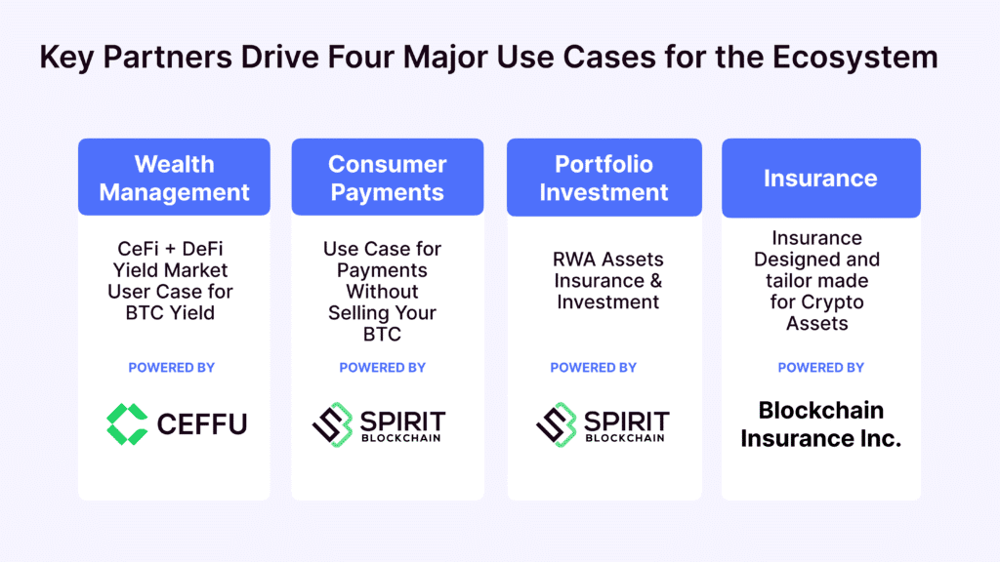

## Table of Contents

## What are EOS tokens?

EOS tokens are a type of cryptocurrency used on the EOS blockchain platform. They are used to pay for transaction fees and resources needed to run applications on the EOS network. Think of them like coins you use to pay for services on the EOS platform.

The EOS platform is designed to support decentralized applications (dApps) and aims to solve some of the scalability and usability issues found in other blockchain systems. By using EOS tokens, developers can easily deploy and manage their applications without worrying about the technical details of the blockchain. This makes it simpler for people to create and use dApps on the EOS network.

## Who created EOS tokens and why?

EOS tokens were created by a company called Block.one. The main person behind this was Dan Larimer, who is known for starting other blockchain projects like BitShares and Steem. They started working on EOS in 2017 because they wanted to make a blockchain that could handle a lot more transactions quickly and easily. They thought that other blockchains, like Bitcoin and Ethereum, were too slow and hard to use for building big applications.

The reason they created EOS tokens was to help developers build and run decentralized applications (dApps) without having to worry about the technical stuff of the blockchain. They wanted to make it simple for anyone to create and use these apps. By using EOS tokens, developers can pay for the resources they need on the EOS network, like storage and computing power. This makes it easier for people to create new kinds of apps that can work together and be used by many people at the same time.

## How are EOS tokens different from other cryptocurrencies?

EOS tokens are different from other cryptocurrencies because they are used in a special way on the EOS platform. Unlike Bitcoin or Ethereum, where you might use the coins to buy things or trade them, EOS tokens are mainly used to pay for the resources needed to run applications on the EOS network. This means that if you want to build or use an app on EOS, you need EOS tokens to cover the costs of things like storage and computing power.

Another big difference is that EOS is designed to be really fast and can handle a lot of transactions at once. Other cryptocurrencies can sometimes be slow and get crowded when too many people are using them. EOS solves this problem by using a system called Delegated Proof of Stake (DPoS), which lets the network process transactions quickly and smoothly. This makes it easier for developers to create big applications that a lot of people can use without the network getting slow.

## What is the total supply of EOS tokens?

The total supply of EOS tokens is 1,098,666,193 tokens. This number was set during the EOS Initial Coin Offering (ICO) that happened from June 2017 to June 2018. During the ICO, people could buy EOS tokens with other cryptocurrencies like Bitcoin or Ethereum.

EOS tokens are used on the EOS platform to pay for things like storage and computing power that are needed to run applications. The total supply of EOS tokens stays the same, but the way they are used can change over time as more people build and use apps on the EOS network.

## How can someone acquire EOS tokens?

Someone can acquire EOS tokens by buying them on a [cryptocurrency](/wiki/cryptocurrency) exchange. These are websites where people trade different cryptocurrencies, like Coinbase, Binance, or Kraken. You need to create an account on one of these exchanges, deposit money or another cryptocurrency, and then use that to buy EOS tokens. It's a bit like buying stocks or trading foreign currency, but with digital coins.

Another way to get EOS tokens is through a process called staking. If you already have some EOS tokens, you can stake them, which means you lock them up for a while to help secure the EOS network. In return, you might get more EOS tokens as a reward. It's like [earning](/wiki/earning-announcement) interest on your savings, but instead of a bank, you're helping the EOS network run smoothly.

## What are the primary use cases for EOS tokens?

EOS tokens are mainly used to pay for the resources needed to run applications on the EOS platform. When someone wants to build or use an app on EOS, they use EOS tokens to cover costs like storage and computing power. This makes it easy for developers to create and manage their apps without worrying about the technical details of the blockchain. It's like using coins to pay for services in a video game, but here you're paying for the resources your app needs.

Another important use for EOS tokens is staking. When you stake your EOS tokens, you lock them up for a period to help secure the EOS network. In return, you might get more EOS tokens as a reward. This is similar to earning interest on your savings, but instead of a bank, you're helping the EOS network work better. Staking encourages people to keep the network healthy and secure, which is good for everyone using EOS.

## How do EOS tokens facilitate transactions on the EOSIO blockchain?

EOS tokens help make transactions happen on the EOSIO blockchain by acting like money you use to pay for things. When someone wants to do something on the EOS network, like sending a message or running a program, they use EOS tokens to pay for the computer power and storage space they need. This makes it easy for people to use the network because they just need to have enough EOS tokens, and the system takes care of the rest.

Another way EOS tokens help is by making the network fast and smooth. The EOSIO blockchain uses a special system called Delegated Proof of Stake (DPoS), where people who have staked their EOS tokens get to vote for who runs the network. This keeps the network running well and lets it handle a lot of transactions quickly. So, when you use EOS tokens, you're not just paying for services, you're also helping keep the whole system working smoothly for everyone.

## What role do EOS tokens play in the governance of the EOS network?

EOS tokens are important for the way the EOS network is run. People who have EOS tokens can vote for who they want to be in charge of the network. These leaders are called "block producers," and they are responsible for keeping the network running smoothly. By voting, token holders get to decide who gets to be a block producer, which means they have a say in how the network works.

This voting system is called Delegated Proof of Stake (DPoS). It's a way to make sure that the people who care about the network have a voice in how it's managed. When you stake your EOS tokens, you're showing that you're committed to the network, and in return, you get to vote. This helps keep the network fair and makes sure that it stays secure and efficient for everyone who uses it.

## How does the staking mechanism work with EOS tokens?

Staking with EOS tokens means you lock up your tokens for a while to help keep the EOS network safe and running well. When you stake your EOS tokens, you're showing that you believe in the network and want to support it. In return, you get to vote for block producers, who are the people in charge of managing the network. The more EOS tokens you stake, the more votes you have, which means you have a bigger say in who runs the network.

By staking your tokens, you also have a chance to earn more EOS tokens as a reward. These rewards come from the network and are a way to thank you for helping keep everything running smoothly. It's a bit like earning interest on your savings, but instead of a bank, you're helping the EOS network. Staking is important because it encourages people to keep their tokens in the system, which makes the network more stable and secure for everyone.

## What are the security features of EOS tokens?

EOS tokens have several security features that help keep the network safe. One big feature is the way the network is run. EOS uses a system called Delegated Proof of Stake (DPoS), where people who have staked their EOS tokens vote for block producers. These block producers are responsible for keeping the network running smoothly and securely. By letting token holders vote, the system makes sure that only trusted people are in charge, which helps prevent bad actors from taking over.

Another important security feature is the way transactions are handled. EOS uses a special system to make sure transactions are quick and safe. This system checks every transaction carefully to make sure it's valid before it's added to the blockchain. This helps stop people from trying to cheat or steal tokens. Also, the network is designed to handle a lot of transactions at once, which makes it harder for attackers to slow down or mess up the network.

## How do developers use EOS tokens to deploy and manage decentralized applications (dApps)?

Developers use EOS tokens to deploy and manage decentralized applications (dApps) by paying for the resources they need on the EOS network. When a developer wants to create a dApp, they use EOS tokens to cover the costs of things like storage and computing power. This makes it easy for them to build and run their apps without having to worry about the technical details of the blockchain. It's like using money to pay for services, but here, the services are the resources needed to keep the dApp running smoothly.

EOS tokens also help developers manage their dApps because they can stake their tokens to get a say in how the network is run. By staking their EOS tokens, developers can vote for block producers, who are in charge of keeping the network safe and efficient. This means that developers have a voice in the governance of the network, which can help make sure it stays a good place to build and run dApps. Staking also lets developers earn more EOS tokens as rewards, which can be used to keep their dApps running or to grow their projects.

## What are some advanced strategies for trading and investing in EOS tokens?

One advanced strategy for trading and investing in EOS tokens is to use technical analysis. This means looking at charts and patterns to guess where the price of EOS might go next. Traders often use tools like moving averages, support and resistance levels, and indicators like the Relative Strength Index (RSI) to help them decide when to buy or sell. For example, if the price of EOS is going up and the RSI is not too high, it might be a good time to buy. But if the price is going down and the RSI is very low, it might be a good time to sell. This kind of analysis can help traders make smarter choices and maybe earn more money.

Another strategy is to pay attention to what's happening with the EOS network and the broader cryptocurrency market. This is called [fundamental analysis](/wiki/fundamental-analysis). For EOS, this could mean keeping an eye on new dApps being built on the network, changes in how the network is run, or news about the team behind EOS. If a lot of new and exciting dApps are being made, it might make the price of EOS go up because more people will want to use the network. Also, watching what big investors, called "whales," are doing can give clues about where the market might be heading. By combining technical and fundamental analysis, investors can make better decisions about when to buy or sell EOS tokens.

## References & Further Reading

[1]: Brock, W., Lakonishok, J., & LeBaron, B. (1992). ["Simple Technical Trading Rules and the Stochastic Properties of Stock Returns."](https://www.jstor.org/stable/2328994) The Journal of Finance, 47(5), 1731-1764.

[2]: "Delegated Proof of Stake (DPoS) Consensus Algorithm." ["BitShares Documentation."](https://cointelegraph.com/explained/delegated-proof-of-stake-dpos-explained)

[3]: "EOS: An Introduction to the Blockchain Operating System." [EOS.IO Technical White Paper.](https://openai.com/index/chatgpt/)

[4]: Narang, R. (2013). ["Inside the Black Box: A Simple Guide to Quantitative and High-Frequency Trading," 2nd Edition.](https://www.amazon.com/Inside-Black-Box-Quantitative-Frequency/dp/1118362411) Wiley Finance.

[5]: Gomber, P., Arndt, B., Lutat, M., & Uhle, T. (2011). ["High-Frequency Trading."](https://www.semanticscholar.org/paper/High-Frequency-Trading-Gomber-Arndt/3d0ba8179934e0a45e85a184d1ec526616e2e213) Business & Information Systems Engineering, 3(2), 59-69.