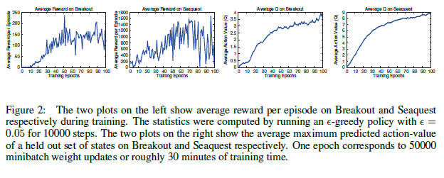

## Table of Contents

## What is episode machine learning?

Episode machine learning is a type of machine learning where the model is trained on small subsets of data called "episodes." Instead of training on the entire dataset at once, the model learns from these smaller chunks, which can help improve its ability to generalize to new, unseen data. This approach is often used in few-shot learning, where the goal is to learn new concepts quickly from just a few examples.

In episode machine learning, each episode typically consists of a support set and a query set. The support set is used to teach the model about the task at hand, while the query set is used to test how well the model has learned. For example, if the task is to recognize different types of animals, the support set might show the model a few pictures of cats and dogs, and the query set would then test the model's ability to correctly identify new pictures of cats and dogs. This method helps the model adapt quickly to new tasks by learning from limited data.

## How does episode machine learning differ from traditional machine learning?

Episode machine learning and traditional machine learning differ mainly in how they use data for training. In traditional machine learning, the model is trained on the entire dataset all at once. It sees all the data repeatedly, and through this process, it learns to recognize patterns and make predictions. For example, if you're teaching a model to recognize cats and dogs, you would show it thousands of pictures of cats and dogs, and it would learn from all these pictures together.

In contrast, episode machine learning breaks the data into small subsets called episodes. Each episode contains a support set and a query set. The model learns from the support set, which might only have a few examples, and then it's tested on the query set to see if it can apply what it learned. This method is especially useful for few-shot learning, where the goal is to learn new things quickly with very little data. So, if you're teaching the model to recognize cats and dogs, you might show it just a few pictures in each episode, and it would need to learn from these limited examples to perform well on new pictures.

This difference in training approach makes episode machine learning more adaptable to new tasks with limited data. Traditional machine learning might struggle if you suddenly need to recognize a new type of animal with only a few pictures, but episode machine learning is designed to handle such scenarios better.

## What are the key components of an episode in machine learning?

An episode in machine learning has two main parts: the support set and the query set. The support set is like a mini-lesson for the model. It shows the model a few examples of what it needs to learn. For example, if the task is to recognize cats and dogs, the support set might show the model a few pictures of cats and a few pictures of dogs. The model uses these examples to learn about the task.

The query set is like a test. After the model learns from the support set, it tries to apply what it learned to the query set. The query set has new examples that the model hasn't seen before. For example, it might show the model new pictures of cats and dogs. The model's job is to correctly identify these new pictures based on what it learned from the support set. This way, the model can show how well it can generalize from a few examples to new data.

## Can you explain the concept of an episode in the context of reinforcement learning?

In reinforcement learning, an episode refers to a complete sequence of interactions between an agent and its environment, from the start to the end of a task. Think of it like playing a game from the beginning to the end. During an episode, the agent takes actions based on its current state, receives rewards or penalties, and moves to new states until it reaches the end of the task, which could be winning the game or running out of time.

These episodes help the agent learn how to behave better over time. By going through many episodes, the agent can try different strategies, see which ones work best, and improve its policy for making decisions. Each episode gives the agent new experiences to learn from, helping it to gradually get better at the task until it can perform well consistently.

## What are some common applications of episode machine learning?

Episode machine learning is often used in few-shot learning, where the goal is to learn new things quickly from just a few examples. For example, imagine you want to teach a computer to recognize new types of flowers. With episode machine learning, you can show the computer a few pictures of the new flower, and it can learn to recognize it without needing thousands of pictures. This is really helpful in situations where you don't have a lot of data, like when you're trying to identify rare objects or new species.

Another common use of episode machine learning is in reinforcement learning, where an agent learns by interacting with an environment. Think of a robot learning to navigate a maze. Each time the robot tries to find its way from the start to the end, that's an episode. By going through many episodes, the robot can learn the best path and improve its performance. This method is useful for training robots, game-playing AI, and other systems that need to learn from trial and error.

## How do episodes help in training machine learning models?

Episodes help in training machine learning models by breaking down the learning process into smaller, manageable chunks. Instead of showing the model all the data at once, episodes allow the model to learn from a few examples at a time. This is especially useful in few-shot learning, where the goal is to teach the model new things quickly with just a few examples. For example, if you want to teach a computer to recognize a new type of flower, you can show it a few pictures of that flower in an episode, and the model can learn to identify it without needing thousands of pictures.

In reinforcement learning, episodes represent complete sequences of interactions between an agent and its environment. Each episode is like playing a game from start to finish. The agent takes actions, receives rewards or penalties, and learns from these experiences. By going through many episodes, the agent can try different strategies and improve its performance over time. This method is helpful for training robots, game-playing AI, and other systems that need to learn from trial and error.

## What metrics are used to evaluate the performance of episode-based machine learning models?

To evaluate the performance of episode-based machine learning models, common metrics include accuracy, precision, recall, and F1 score. Accuracy measures how often the model's predictions are correct. Precision looks at how many of the positive predictions the model made were actually correct, while recall checks how many of the actual positive cases the model was able to find. The F1 score is a way to combine precision and recall into one number, giving a balanced view of the model's performance. These metrics help understand how well the model is doing on the tasks it's trained for, especially in few-shot learning where the model needs to learn from just a few examples.

In reinforcement learning, where episodes are used to train agents, different metrics are often used. One common metric is the cumulative reward, which is the total reward the agent gets over an episode. If the agent's goal is to reach the end of a maze, the cumulative reward might be higher if it finds the shortest path. Another important metric is the average reward per episode, which shows how well the agent is doing over many tries. These metrics help track the agent's learning progress and see if it's getting better at the task over time.

## What are the challenges faced when implementing episode machine learning?

One of the main challenges when implementing episode machine learning is dealing with limited data. In episode machine learning, especially in few-shot learning, the model needs to learn from just a few examples. This can be tough because the model might not see enough data to understand the task fully. If the examples in the support set are not varied enough, the model might struggle to recognize new examples in the query set. This means that choosing the right examples for each episode is very important, and it can be hard to get it right every time.

Another challenge is making sure the model can generalize well. When a model learns from episodes, it needs to be able to apply what it learned to new, unseen data. Sometimes, the model might overfit to the examples it sees in the support set and not do well on the query set. This is a big problem in episode machine learning because the goal is to learn quickly from limited data. To solve this, researchers often use techniques like meta-learning, where the model learns how to learn from episodes, but finding the best way to do this can be tricky and take a lot of time.

## How can episode length impact the learning process in machine learning?

The length of an episode can have a big impact on how well a machine learning model learns. In reinforcement learning, if episodes are too short, the model might not get enough chances to explore and learn about the environment. For example, if a robot is trying to learn to navigate a maze, short episodes might mean it only gets to try a few steps before the episode ends. This can make it hard for the robot to figure out the best path. On the other hand, if episodes are too long, the model might get stuck in one part of the environment and not explore enough, which can slow down learning.

In few-shot learning, the length of an episode, meaning how many examples are in the support and query sets, also matters. If the support set is too small, the model might not have enough information to learn the task well. For instance, if you're trying to teach a computer to recognize a new type of flower with only one picture, it might not learn enough to identify it correctly. But if the support set is too large, it might start to look more like traditional machine learning, which can defeat the purpose of few-shot learning. Finding the right episode length is important for making sure the model learns quickly and effectively from limited data.

## What advanced techniques can be used to optimize episode machine learning?

One advanced technique to optimize episode machine learning is meta-learning, often called "learning to learn." In meta-learning, the model doesn't just learn from the episodes, it also learns how to learn from them. This means the model can get better at figuring out new tasks quickly, even if it only sees a few examples. For example, if you're teaching a computer to recognize new types of animals, meta-learning helps it learn how to recognize new animals faster each time. This technique is really helpful in few-shot learning because it makes the model more adaptable and efficient.

Another technique is using attention mechanisms. Attention helps the model focus on the most important parts of the data in each episode. For instance, if you're teaching a model to recognize different flowers, attention can help it focus on the unique features of each flower, like the shape of the petals or the color. This can make the model learn faster and more accurately from the limited data in each episode. By using attention, the model can better understand and remember what it learns, making it more effective at few-shot learning tasks.

## How does the concept of episodes integrate with deep learning?

In deep learning, episodes can be used to train models, especially in few-shot learning and reinforcement learning. In few-shot learning, episodes help the model learn new tasks quickly with just a few examples. Imagine you want to teach a deep learning model to recognize a new type of animal. You can show it a few pictures of that animal in an episode, and the model uses these pictures to learn. This approach is great for deep learning because it allows the model to use its deep neural networks to understand complex patterns from limited data.

In reinforcement learning, episodes are complete sequences of interactions between an agent and its environment. For example, if a robot is learning to navigate a maze, each time it goes from the start to the end of the maze is an episode. Deep learning models, like neural networks, can be used to process the information from these episodes and learn how to make better decisions over time. By going through many episodes, the deep learning model can improve its performance, getting better at the task with each try.

## What future developments can we expect in episode machine learning?

In the future, episode machine learning is likely to become even better at learning from just a few examples. Researchers are working on new ways to make models learn faster and more accurately, even when they don't have a lot of data. One exciting area is meta-learning, where the model learns how to learn from episodes. This could make it easier for machines to pick up new skills quickly, like recognizing new objects or understanding new languages. As these techniques improve, episode machine learning could be used in more places, like helping robots learn new tasks or making it easier to train AI for new jobs.

Another big development might be in how episodes are used in reinforcement learning. Right now, episodes help agents learn by trying different things and getting rewards. In the future, we might see smarter ways to design these episodes so that agents can learn even faster. For example, episodes could be made to focus on the most important parts of a task, helping the agent learn the best strategies more quickly. This could make reinforcement learning more efficient and useful for training robots, game-playing AI, and other systems that need to learn from experience.