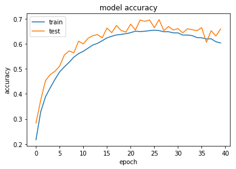

## Table of Contents

## What is an epoch in the context of machine learning?

In machine learning, an epoch refers to one complete pass through the entire training dataset. Imagine you're teaching a computer to recognize pictures of cats and dogs. You show it all your pictures once, and that's one epoch. During this pass, the model adjusts its internal parameters to better understand the data, trying to improve its performance on the task at hand.

The concept of epochs is important because it helps control how much the model learns. If you go through the dataset too few times, the model might not learn enough and perform poorly. On the other hand, if you go through it too many times, the model might start to memorize the training data too well, a problem known as overfitting. Finding the right number of epochs is a key part of training a good machine learning model.

## Why are epochs important in training machine learning models?

Epochs are important in training machine learning models because they help the model learn from the data over time. When you train a model, you show it the entire dataset once during each epoch. This gives the model a chance to adjust its internal settings, or parameters, to better understand the patterns in the data. If you only go through the data once, the model might not learn enough to make good predictions. By using multiple epochs, you allow the model to keep improving its understanding with each pass through the data.

However, the number of epochs is a balancing act. If you use too few epochs, the model won't learn enough, and its performance will be poor. This is called underfitting. On the other hand, if you use too many epochs, the model might start to memorize the training data too well, which can make it perform badly on new, unseen data. This is known as overfitting. Finding the right number of epochs helps ensure that the model learns just enough to perform well on new data without memorizing the training data.

## How does the number of epochs affect the training of a model?

The number of epochs decides how many times a model sees all the training data. If you use more epochs, the model gets more chances to learn from the data. This can make the model better at understanding patterns and making predictions. But if you use too many epochs, the model might start to remember the training data too well. This is called overfitting. When a model overfits, it might do well on the training data but not so well on new data it hasn't seen before.

On the other hand, if you use too few epochs, the model might not learn enough. This is called underfitting. An underfitted model won't be good at making predictions because it hasn't seen the data enough times to understand it well. So, finding the right number of epochs is important. It's about giving the model enough chances to learn without letting it remember the training data too much. This balance helps the model perform well on new data, which is the goal of machine learning.

## What is the difference between an epoch, a batch, and an iteration?

In machine learning, an epoch is one complete pass through the entire training dataset. Imagine you're showing your model all the pictures of cats and dogs you have, one time. That's one epoch. The model learns a bit from each picture and tries to get better at telling cats and dogs apart. If you go through all the pictures again, that's another epoch. The number of epochs you use can affect how well your model learns, but too many epochs might make it remember the pictures too well instead of learning the general idea.

A batch is a smaller part of the training data that the model looks at during training. Instead of showing the model all the pictures at once, you might show it a few pictures at a time. This group of pictures is called a batch. The size of the batch can affect how the model learns. Smaller batches might help the model learn faster, but bigger batches can make the learning smoother. You decide how big the batch should be, and the model updates its understanding after looking at each batch.

An iteration is one update of the model's parameters using one batch of data. So, if your batch size is 32 pictures, and you show the model those 32 pictures, that's one iteration. The model looks at the batch, makes some guesses, sees how wrong it was, and then tweaks its settings a bit. If you keep showing the model new batches of 32 pictures, you keep doing iterations until you've gone through all the pictures once, which is one epoch. So, the number of iterations in one epoch depends on how big your batches are and how many pictures you have in total.

## How can one determine the optimal number of epochs for training?

To find the best number of epochs for training your model, you need to keep an eye on how well the model is doing as it learns. You can do this by using something called a validation set, which is a separate part of your data that the model doesn't see during training. After each epoch, you test the model on this validation set to see how it's doing. If the model's performance on the validation set keeps getting better, you might want to keep training for more epochs. But if the performance starts to get worse, that's a sign that the model might be overfitting, and you should stop training.

A good way to figure out the right number of epochs is by using a technique called early stopping. With early stopping, you set a rule that says if the model's performance on the validation set doesn't get better for a certain number of epochs, you stop training. This helps prevent overfitting and saves time. You can also plot the model's performance over time to see how it changes with each epoch. If you see the performance start to level off or go down, that's a hint that you might have reached the optimal number of epochs.

## What are the risks of using too few epochs in model training?

If you use too few epochs when training your model, it might not learn enough from the data. This means the model won't be able to understand the patterns in the data well, which is called underfitting. When a model underfits, it can't make good predictions or decisions because it hasn't seen the data enough times to get a good grasp of it. For example, if you're trying to teach a model to tell the difference between pictures of cats and dogs, and you only show it the pictures a couple of times, it might not learn enough to tell them apart correctly.

Using too few epochs can lead to a model that performs poorly on both the training data and new data it hasn't seen before. This is because the model hasn't had enough chances to adjust its internal settings, or parameters, to fit the data well. As a result, the model might make a lot of mistakes, and you'll end up with a model that isn't very useful for the task you're trying to accomplish. Finding the right balance of epochs is important to make sure your model learns just enough to be effective.

## What problems can arise from using too many epochs?

If you use too many epochs when training your model, it might start to remember the training data too well. This is called overfitting. When a model overfits, it learns the details and noise in the training data so much that it can't handle new data well. For example, if you're teaching a model to recognize pictures of cats and dogs, and you show it the same pictures over and over again for too long, it might start to remember every little detail in those pictures instead of learning the general differences between cats and dogs. This means the model will do great on the training data but might not do well on new pictures it hasn't seen before.

Overfitting can make your model less useful because it won't be able to make good predictions on new data. To avoid this, you need to find the right number of epochs. One way to do this is by using a validation set, which is a separate part of your data that the model doesn't see during training. After each epoch, you can test the model on this validation set to see how it's doing. If the model's performance on the validation set starts to get worse, that's a sign that you might be using too many epochs and should stop training.

## How does early stopping relate to the concept of epochs?

Early stopping is a way to stop training your model at the right time to avoid using too many epochs. When you train a model, you show it all your data over and over again in epochs. But if you keep going for too long, the model might start to remember the training data too well, which is called overfitting. Early stopping helps you find the sweet spot by checking how well the model is doing on a separate set of data, called a validation set, after each epoch. If the model's performance on the validation set stops getting better or starts to get worse, early stopping tells you to stop training. This way, you can make sure your model learns just enough without overfitting.

To use early stopping, you set a rule that says if the model's performance on the validation set doesn't improve for a certain number of epochs, you should stop training. For example, you might decide to stop if the model's performance doesn't get better for 5 epochs in a row. This helps you find the right number of epochs to use without having to guess or train for too long. By using early stopping, you can save time and make sure your model works well on new data it hasn't seen before.

## Can you explain how learning rate scheduling impacts the use of epochs?

Learning rate scheduling is a way to change how fast your model learns as it goes through the epochs. The learning rate is like the size of the steps the model takes to adjust its guesses. If the learning rate is too big, the model might jump around too much and miss the best answer. If it's too small, the model might take too long to learn. By changing the learning rate over time, you can help the model learn better. For example, you might start with a big learning rate to make big changes early on, and then make it smaller later to fine-tune the model's guesses.

This scheduling can affect how many epochs you need to use. If you lower the learning rate as you go, you might need more epochs to let the model keep learning, but it can help avoid jumping over the best answer. On the other hand, if you keep the learning rate the same, you might find the right number of epochs faster, but you risk the model not learning as well. So, finding the right way to change the learning rate can help you use the right number of epochs to train your model well.

## What role do epochs play in different types of machine learning algorithms?

In supervised learning, epochs are important because they help the model learn from the labeled data. When you train a model like a neural network or a decision tree, you show it the entire dataset once during each epoch. This allows the model to adjust its parameters to better predict the correct labels. For example, if you're teaching a model to recognize handwritten digits, each epoch lets the model see all the digit images and their labels, helping it get better at guessing the right digit. The number of epochs you use can make a big difference in how well the model learns. Too few epochs might leave the model underfitting, meaning it doesn't learn enough, while too many epochs can lead to overfitting, where the model remembers the training data too well and doesn't do well on new data.

In unsupervised learning, like clustering or dimensionality reduction, epochs also play a role but in a slightly different way. Here, the model tries to find patterns or structures in the data without any labels. Each epoch allows the model to refine its understanding of the data's structure. For instance, in k-means clustering, each epoch involves assigning data points to clusters and then updating the cluster centers. The number of epochs can affect how well the model finds the right clusters. If you use too few epochs, the model might not find the best arrangement of clusters, but too many epochs might cause the model to keep changing the clusters without improving the overall grouping. Balancing the number of epochs is key to getting good results in unsupervised learning as well.

## How do you monitor and adjust epochs during the training process?

To monitor and adjust epochs during training, you need to keep an eye on how well your model is doing. You do this by using a validation set, which is a separate part of your data that the model doesn't see while it's learning. After each epoch, you test the model on this validation set to see if it's getting better at making predictions. If the model's performance on the validation set keeps improving, you might want to keep going with more epochs. But if you see the performance start to get worse, that's a sign that the model might be learning too much about the training data and not doing well on new data. This is called overfitting, and it means you should stop training.

One good way to adjust epochs is by using a technique called early stopping. With early stopping, you set a rule that says if the model's performance on the validation set doesn't get better for a certain number of epochs, you stop training. For example, you might decide to stop if the performance doesn't improve for 5 epochs in a row. This helps you find the right number of epochs without having to guess or train for too long. By using early stopping, you can make sure your model learns just enough to be good at its job without overfitting. It's like finding the perfect balance so your model can do well on new data it hasn't seen before.

## What advanced techniques exist for dynamically adjusting the number of epochs during training?

One advanced technique for dynamically adjusting the number of epochs is called learning rate scheduling combined with early stopping. Learning rate scheduling means changing how fast the model learns as it goes through the epochs. You might start with a big learning rate to make big changes early on, and then make it smaller later to fine-tune the model's guesses. Early stopping helps you stop training at the right time by checking how well the model is doing on a separate set of data, called a validation set, after each epoch. If the model's performance on the validation set stops getting better or starts to get worse, early stopping tells you to stop training. This way, you can make sure your model learns just enough without overfitting.

Another technique is called adaptive learning rate methods, like Adam or RMSprop. These methods automatically change the learning rate during training based on how the model is doing. For example, if the model is learning well, the learning rate might stay the same or get a bit smaller. But if the model is having trouble, the learning rate might get bigger to help it learn faster. These methods can help you find the right number of epochs because they adjust the learning rate to keep the model learning at a good pace. By using these adaptive methods, you can train your model for the right number of epochs without having to guess or set a fixed number ahead of time.