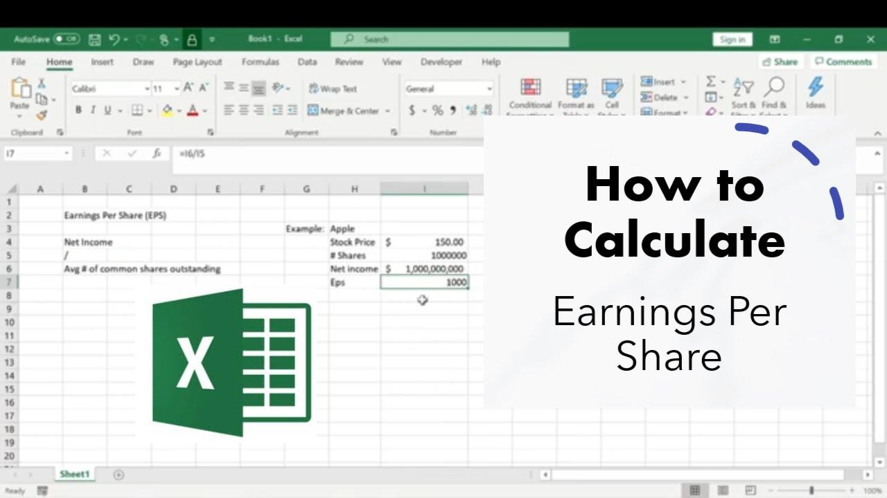

## Table of Contents

## What is EPS and why is it important for investors?

EPS stands for Earnings Per Share. It is a number that tells you how much money a company made for each share of its stock. You can find EPS by taking the company's total earnings and dividing it by the number of shares. This number is important because it shows how well a company is doing at making money for its shareholders.

Investors care about EPS because it helps them decide if a company is a good investment. If a company has a high EPS, it means the company is making a lot of money for each share, which can make the stock price go up. On the other hand, if the EPS is low or going down, it might mean the company is not doing so well, and the stock price could go down. By looking at EPS, investors can get a quick idea of a company's financial health and make better choices about buying or selling stocks.

## How do you set up an Excel spreadsheet to calculate EPS?

To set up an Excel spreadsheet to calculate EPS, start by opening a new Excel workbook. In the first column, label the cells to keep track of your data. For example, in cell A1, you can write "Total Earnings," and in cell A2, you can write "Number of Shares." Next, in cell B1, enter the total earnings of the company, and in cell B2, enter the number of shares outstanding. 

Now, to calculate the EPS, go to cell B3. In this cell, you will write a formula to divide the total earnings by the number of shares. Type "=B1/B2" into cell B3. This formula tells Excel to take the value in B1 (total earnings) and divide it by the value in B2 (number of shares). Once you press enter, the result in cell B3 will be the EPS. You can label cell A3 as "EPS" to keep your spreadsheet organized.

## What are the basic formulas needed to calculate EPS in Excel?

To calculate EPS in Excel, you need two main pieces of information: the total earnings of the company and the number of shares outstanding. In your Excel spreadsheet, you can put the total earnings in one cell, like B1, and the number of shares in another cell, like B2. These are the basic pieces of data you need to start with.

Once you have these numbers entered, you can use a simple formula to calculate the EPS. In a new cell, like B3, you type in the formula "=B1/B2". This tells Excel to take the number in B1 (total earnings) and divide it by the number in B2 (number of shares). The result that shows up in B3 is the EPS. It's that easy!

## How can you input historical financial data into Excel for EPS calculation?

To input historical financial data into Excel for EPS calculation, start by opening a new Excel workbook. In the first column, label the rows with the years or quarters you want to track, like "2020", "2021", and "2022". In the second column, label it "Total Earnings", and in the third column, label it "Number of Shares". Now, go to the company's financial reports or a financial website to find the total earnings and the number of shares for each year or quarter. Enter these numbers into the corresponding cells in your Excel sheet. For example, if 2020's total earnings were $1,000,000 and the number of shares was 100,000, you would enter "$1,000,000" in the cell under "Total Earnings" next to "2020", and "100,000" in the cell under "Number of Shares" next to "2020".

Once you have entered all the historical data, you can calculate the EPS for each year or quarter. In the fourth column, label it "EPS". In the cell next to the first year or quarter, type in the formula "=B2/C2" (assuming B2 is the total earnings cell and C2 is the number of shares cell for that year). Press enter, and Excel will calculate the EPS for that year or quarter. Copy this formula down the column to calculate the EPS for all the other years or quarters. Now you have a neat table in Excel showing the historical EPS for the company, which can help you see how the company's earnings per share have changed over time.

## What are common errors to avoid when calculating EPS in Excel?

When calculating EPS in Excel, one common mistake is not using the correct numbers for total earnings and number of shares. Make sure you are using the net income after taxes for total earnings, not just the revenue or gross profit. Also, use the average number of shares outstanding over the period, not just the number at the end of the period. If you mix these up, your EPS calculation will be wrong.

Another error to watch out for is not formatting cells correctly. If you enter numbers with commas or dollar signs, Excel might not recognize them as numbers and could give you an error in your formula. To avoid this, enter numbers without any special characters and then use Excel's formatting options to add commas or dollar signs after you've entered the data. Also, make sure you're using the right cell references in your formula. If you accidentally use the wrong cells, your EPS calculation will be off.

## How do you adjust EPS calculations for stock splits or dividends in Excel?

When a company does a stock split, it means they are dividing each share into more shares. If you want to calculate EPS for a time before the split, you need to adjust the number of shares to match what it would have been before the split. For example, if a company did a 2-for-1 split, you would divide the number of shares after the split by 2 to find out how many shares there were before the split. Then, you can use this adjusted number of shares in your EPS formula. In Excel, you can do this by creating a new column for the adjusted number of shares and using a formula to divide the post-split number of shares by the split ratio.

Dividends can also affect EPS calculations, especially if the company pays dividends in the form of additional shares (stock dividends). When this happens, you need to adjust the number of shares to account for the new shares issued. For example, if a company issues a 5% stock dividend, you would increase the number of shares by 5%. In Excel, you can create a new column for the adjusted number of shares and use a formula to multiply the original number of shares by 1.05 (which is 100% plus the 5% dividend). Once you have the adjusted number of shares, you can use it in your EPS formula to get the correct EPS.

## Can you explain how to use Excel functions like IF, VLOOKUP, or SUMIFS to enhance EPS calculations?

You can use the IF function in Excel to make your EPS calculations more flexible. For example, if you want to calculate EPS only for years when the company made a profit, you can use the IF function to check if the total earnings are positive. In your EPS formula, you could write something like "=IF(B2>0, B1/B2, 'N/A')". This means that if the total earnings in cell B2 are greater than zero, Excel will calculate the EPS by dividing the total earnings in B1 by the number of shares in B2. If the total earnings are not greater than zero, Excel will show 'N/A' instead of a negative EPS. This can help you quickly see which years were profitable.

The VLOOKUP function can be useful if you have a lot of data and want to find the EPS for a specific year or quarter. You can set up a table with years or quarters in one column and the corresponding EPS in another column. Then, you can use VLOOKUP to search for a specific year or quarter and return the EPS for that period. For example, if your table is in cells A1:B10, you could use a formula like "=VLOOKUP('2022', A1:B10, 2, FALSE)" to find the EPS for the year 2022. This can save you time if you need to look up EPS values often.

The SUMIFS function can help you calculate EPS for specific conditions. For example, if you want to calculate the total earnings for only certain quarters or years, you can use SUMIFS to add up the earnings that meet your criteria. Then, you can use this sum in your EPS calculation. For instance, if you want to calculate EPS for the first quarter of each year, you could use a formula like "=SUMIFS(EarningsRange, QuarterRange, 'Q1')/AverageShares". This would sum up all the earnings for the first quarter and then divide by the average number of shares to get the EPS for that quarter. Using SUMIFS can make your EPS calculations more precise and tailored to your needs.

## How do you project future EPS using Excel based on different growth scenarios?

To project future EPS in Excel based on different growth scenarios, you first need to set up a base EPS number. This could be the most recent EPS you have calculated. Then, you can create different growth scenarios. For example, you might want to see what happens if the company's earnings grow by 5% each year, or maybe by 10% or even 20%. In Excel, you can create columns for each scenario. In the first column, you can list the years you want to project into the future, like 2024, 2025, and so on. In the next columns, you can label them as "5% Growth", "10% Growth", and "20% Growth". 

Next, you can use Excel formulas to calculate the projected EPS for each year under each scenario. For the 5% growth scenario, you can start with the base EPS in the first year and use a formula like "=B2*1.05" to calculate the EPS for the next year. This means you take the EPS from the previous year (in cell B2) and multiply it by 1.05, which is 100% plus the 5% growth. You can copy this formula down the column to project the EPS for all the future years. Do the same for the other growth scenarios, just changing the growth rate in the formula. For example, use "=C2*1.10" for the 10% growth scenario. This way, you can easily see how different growth rates might affect the company's future EPS.

## What advanced Excel features can be used to automate and streamline EPS calculations?

To make EPS calculations easier and faster in Excel, you can use a feature called macros. Macros are like little programs that you can record or write to do a series of steps automatically. For example, you can record a macro that takes your total earnings and number of shares from certain cells, does the calculation, and puts the result in another cell. Once you have the macro, you can run it whenever you need to calculate EPS, saving you a lot of time and reducing the chance of making mistakes.

Another useful feature is data validation, which helps you make sure the numbers you enter are correct. You can set up rules to check that the total earnings and number of shares are positive numbers. If you try to enter a negative number or something that's not a number, Excel will tell you there's a problem. This can help you avoid errors in your EPS calculations. Also, using conditional formatting can highlight cells that meet certain conditions, like when the EPS is above or below a certain level, making it easier to spot trends or issues at a glance.

## How do you compare EPS across different companies using Excel?

To compare EPS across different companies in Excel, start by making a table. In the first column, list the names of the companies you want to compare. In the next columns, write down the EPS for each company for different years or quarters. You can get this information from the companies' financial reports or from financial websites. Once you have the EPS numbers in your table, you can easily see which company has a higher or lower EPS and how their EPS has changed over time.

You can also use Excel to do more detailed comparisons. For example, you can calculate the average EPS over several years for each company to see which one has been more consistent. Or, you can use a formula to find out how much the EPS has grown each year. This can help you understand if one company is growing faster than another. By using simple Excel formulas and organizing your data in a clear way, you can get a good picture of how different companies are doing in terms of EPS.

## What are some ways to visualize EPS trends over time in Excel?

To see how a company's EPS changes over time, you can make a line chart in Excel. First, put the years or quarters in one column and the EPS numbers in the next column. Then, highlight these columns and click on the 'Insert' tab to choose a line chart. This chart will show you a line that goes up and down with the EPS over time. If the line goes up, it means the EPS is getting better, and if it goes down, the EPS is getting worse. This can help you see if the company is doing well or not.

Another way to show EPS trends is by using a bar chart. Just like with the line chart, you list the years or quarters in one column and the EPS in the next. Select these columns and go to the 'Insert' tab to pick a bar chart. Each bar will show the EPS for a different year or quarter, making it easy to compare. If the bars get taller over time, it means the EPS is growing. If they get shorter, the EPS is going down. Bar charts are good for seeing the exact EPS numbers and how they change from one period to another.

## How can you integrate real-time stock data into your Excel EPS calculations?

To bring real-time stock data into your Excel EPS calculations, you can use special tools called add-ins. These add-ins can connect to financial websites or data services that provide up-to-date information about companies' earnings and number of shares. Once you install an add-in like Microsoft's Power Query or third-party tools like Bloomberg Terminal or Alpha Vantage, you can set it up to automatically pull the latest data into your Excel sheet. This means you can always have the most current total earnings and number of shares, making your EPS calculations more accurate and timely.

Once you have the real-time data in your Excel sheet, you can use it just like any other data. You can set up your EPS formula to use the latest total earnings and number of shares from the add-in. For example, if the add-in puts the latest total earnings in cell B1 and the number of shares in cell B2, your EPS formula in cell B3 would still be "=B1/B2". This way, every time you open your Excel file or refresh the data, your EPS calculation will update automatically with the newest numbers. This can help you keep track of how a company's EPS is changing in real time.

## What is EPS and why is it important?

Earnings Per Share (EPS) represents the portion of a company's earnings allocated to each outstanding share of common stock. It is a crucial metric for assessing a company's profitability and is often used as a benchmark to evaluate its financial health. Calculated as:

$$
\text{EPS} = \frac{\text{Net Income} - \text{Preferred Dividends}}{\text{Average Outstanding Shares}}
$$

EPS provides insight into how much profit a company is generating for each share of stock, which is fundamental for investors and traders. A higher EPS indicates greater profitability, suggesting that a company is well-positioned to distribute higher dividends or reinvest in growth opportunities. Consequently, companies reporting consistent EPS growth over time often demonstrate favorable financial performance and hold a competitive advantage within their markets.

For investors, EPS is a key figure in comparative analysis, allowing them to assess the profitability of companies in the same industry. They can directly compare EPS values to gauge which company is delivering better returns on each share. In [algorithmic trading](/wiki/algorithmic-trading), EPS metrics are integrated into models to evaluate stocks and execute buy or sell decisions based on profitability trends. Thus, understanding EPS and its implications is essential for making informed investment and trading decisions.

## How do you calculate EPS in Excel?

The Earnings Per Share (EPS) metric is a fundamental tool in assessing a company's profitability per share of stock. Calculating EPS using Excel involves a straightforward set of operations that allow investors and traders to evaluate financial performance effectively. The standard formula for EPS is:

$$
\text{EPS} = \frac{\text{Net Income} - \text{Preferred Dividends}}{\text{Number of Common Shares Outstanding}}
$$

To perform this calculation efficiently in Excel, follow these steps:

1. **Input Your Data**: Begin by entering your required financial data into adjacent cells. Place the Net Income in cell B3, Preferred Dividends in B4, and Common Shares Outstanding in B5.

2. **Calculate Net Income After Preferred Dividends**: In cell B6, calculate the difference between Net Income and Preferred Dividends. Use the formula:
$$
   =B3-B4

$$

3. **Calculate EPS**: Next, calculate the EPS by dividing the result in B6 by the number of common shares outstanding. Place this formula in another cell (for example, B7):
$$
   =B6/B5

$$

4. **Dynamic Calculations**: Leverage dynamic Excel functions for real-time analysis and to ensure that EPS calculations update automatically with any changes in input data. This approach is beneficial when looking to analyze trends over time or evaluate different financial scenarios.

Ensuring accuracy in input data is crucial for precise EPS calculations. Dynamic Excel features allow for adjustments automatically, providing a real-time view of a company's earnings per share across different periods or conditions. These calculations can be further customized and integrated into broader financial models for both individual analysis and algorithmic trading applications.

## How can you automate EPS calculations step-by-step?

To automate Earnings Per Share (EPS) calculations in Excel effectively, it is essential to organize and execute several key steps, ensuring dynamic data handling and real-time analysis. Here is a comprehensive guide:

1. **Setting Up the Excel Sheet:**
   Begin by structuring your Excel sheet to accommodate historical financial data for various stocks. Create columns for essential inputs such as the net income, preferred dividends, and the number of common shares outstanding. Input these data points for each stock you are analyzing. For example, fill net income in column B, preferred dividends in column C, and the number of shares in column D.

2. **Using Dynamic Excel Functions:**
   Utilize built-in Excel functions to process this data efficiently. You can use the `IF` function to handle conditions, the `VLOOKUP` function to pull relevant data based on specific criteria, and the `AVERAGE` function to compute averages over a desired range of data. For instance, the EPS formula in Excel might look like this: 
$$
   \text{EPS} = \frac{(\text{Net Income} - \text{Preferred Dividends})}{\text{Number of Common Shares Outstanding}}

$$
   In Excel, this can be written as: `= (B2 - C2) / D2`.

3. **Automating with Macros and VBA:**
   To automate calculations and data updates, you can leverage Excel macros or write scripts using Visual Basic for Applications (VBA). Creating a macro can save time by automating repetitive tasks. For instance, a simple VBA script can be used to update EPS values across multiple rows:

   ```vba
   Sub CalculateEPS()
       Dim i As Integer
       Dim lastRow As Integer
       lastRow = Cells(Rows.Count, 2).End(xlUp).Row
       For i = 2 To lastRow
           Cells(i, 5).Value = (Cells(i, 2).Value - Cells(i, 3).Value) / Cells(i, 4).Value
       Next i
   End Sub
   ```
   This script calculates EPS for each row and stores it in column E.

4. **Creating an Interactive Dashboard:**
   To visualize EPS trends over time, set up an interactive dashboard in Excel. Use charts and tables to represent data visually, which aids in making informed, data-driven trading decisions. Excel features like PivotTables and slicers can enhance interactivity, allowing you to filter and segment data conveniently.

5. **Validating and Updating Data:**
   Regularly validate your data by cross-referencing with reliable financial databases to ensure accuracy. Integrate real-time data feeds where possible, using platforms like Microsoft Power Query to pull updated information directly into Excel. This integration ensures your calculations are based on the latest data, providing a robust foundation for trading strategies.

By following these steps, you can automate EPS calculations in Excel, combining the power of dynamic data processing and visualization to improve your trading decisions. Continuous validation and updating of data are crucial, ensuring that your models remain aligned with current market conditions.

## References & Further Reading

[1]: ["Fundamentals of Corporate Finance"](https://www.pearson.com/en-us/subject-catalog/p/fundamentals-of-corporate-finance/P200000009821/9780137852581) by Richard A. Brealey, Stewart C. Myers, and Alan J. Marcus

[2]: ["Advances in Financial Machine Learning"](https://www.amazon.com/Advances-Financial-Machine-Learning-Marcos/dp/1119482089) by Marcos Lopez de Prado

[3]: ["Quantitative Trading: How to Build Your Own Algorithmic Trading Business"](https://github.com/LucindaYa/quant-resources/blob/master/Quantitative%20Trading%20How%20to%20Build%20Your%20Own%20Algorithmic%20Trading%20Business.pdf) by Ernest P. Chan

[4]: ["Principles of Financial Modelling: Model Design and Best Practices Using Excel and VBA"](https://onlinelibrary.wiley.com/doi/book/10.1002/9781118903933) by Michael Rees

[5]: ["Financial Modeling"](https://en.wikipedia.org/wiki/Financial_modeling) by Simon Benninga