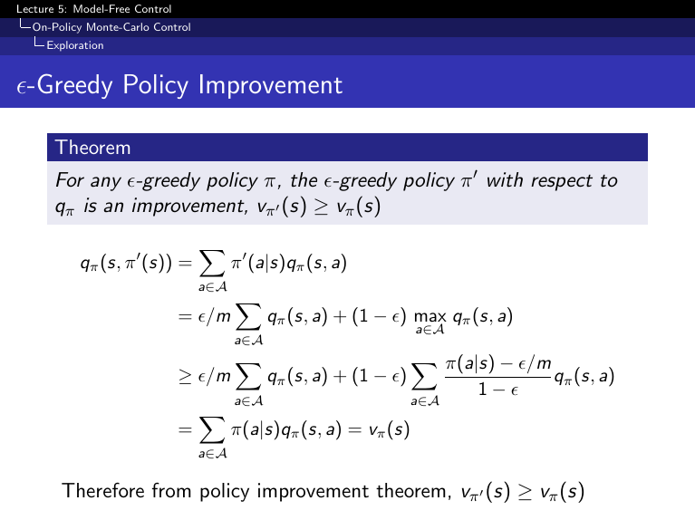

## Table of Contents

## What is the Epsilon Greedy Policy in machine learning?

The Epsilon Greedy Policy is a simple strategy used in reinforcement learning and multi-armed bandit problems to balance exploration and exploitation. In this policy, you choose the best known action most of the time, but you also try other actions sometimes to see if they might be better. The 'epsilon' in the name refers to a small probability (usually between 0 and 1) that determines how often you explore new actions instead of sticking with what you think is the best action.

Here's how it works: Imagine you have a set of actions, and you want to find the best one. With the Epsilon Greedy Policy, you set a value for epsilon, say 0.1. This means that 10% of the time, you will randomly choose any action to explore, and the other 90% of the time, you will choose the action that has given you the best results so far. Over time, as you learn more about which actions are better, you keep updating your knowledge and adjusting your choices. This method helps ensure that you don't miss out on potentially better options while still making good use of what you've already learned.

## How does the Epsilon Greedy Policy work?

The Epsilon Greedy Policy is a way to make choices in machine learning when you're trying to find the best action out of many options. Imagine you're playing a game where you have different buttons to press, and you want to figure out which button gives you the most points. With the Epsilon Greedy Policy, you set a small number called epsilon, which is usually between 0 and 1. This number decides how often you'll try a random button instead of the one you think is the best. For example, if epsilon is 0.1, you'll press a random button 10% of the time and the best button you know 90% of the time.

As you keep playing the game, you learn more about which buttons are good and which are not. Every time you press a button, you update your knowledge about how good that button is. If you find a new button that's better than the one you thought was the best, you start pressing that one more often. The Epsilon Greedy Policy helps you balance between sticking with what you know works well (exploitation) and trying new things to see if they might be even better (exploration). This way, you don't miss out on potentially better options while still using what you've learned so far.

## What is the role of the epsilon parameter in the Epsilon Greedy Policy?

The epsilon parameter in the Epsilon Greedy Policy is a small number between 0 and 1 that decides how often you should try new things instead of sticking with what you already know. If epsilon is set to 0.1, that means 10% of the time you will choose a random action, and the other 90% of the time you will choose the action that has given you the best results so far. This helps you explore new options without completely ignoring what you've learned.

By adjusting the value of epsilon, you can control the balance between exploring new actions and exploiting the best known action. A higher epsilon means more exploration, which is useful when you're still learning about the different options. A lower epsilon means more exploitation, which is good when you're pretty sure you know which action is the best. This flexibility makes the Epsilon Greedy Policy a useful tool in machine learning for finding the best actions over time.

## What are the advantages of using the Epsilon Greedy Policy?

The Epsilon Greedy Policy is great because it helps you find the best action without getting stuck on one choice too soon. By setting a small chance to try new things, you keep learning about all the options. This means you won't miss out on a better action just because you started with a different one. It's like always having a little bit of curiosity to explore, which can lead to finding even better ways to do things.

Another advantage is that it's really simple to understand and use. You just need to pick a number for epsilon, and the rest is easy. This makes it a good choice for many different kinds of problems, from games to business decisions. Plus, you can change the epsilon value if you want to explore more or less, giving you control over how much you want to try new things versus sticking with what you know works.

## What are the potential drawbacks of the Epsilon Greedy Policy?

One potential drawback of the Epsilon Greedy Policy is that it can be too random. Because you always have a chance to pick a random action, you might keep trying actions that you already know are not good. This can slow down your learning because you're wasting time on actions that don't help you find the best one. If epsilon is too high, you might spend too much time exploring and not enough time using what you've learned.

Another issue is that the Epsilon Greedy Policy might not be the best choice for all situations. For example, if the difference between the best action and the second-best action is very small, the policy might not be able to tell them apart quickly. This can lead to a lot of switching back and forth between actions, which can be frustrating and inefficient. You might need to adjust the epsilon value a lot to find the right balance, and even then, it might not work as well as other methods in some cases.

## How does the Epsilon Greedy Policy compare to other exploration strategies like UCB and Thompson Sampling?

The Epsilon Greedy Policy is a simple way to balance exploring new actions and using what you've learned. It works by setting a small chance, called epsilon, to try a random action instead of the best one you know. This means you might keep trying actions that aren't good, which can slow down your learning. On the other hand, the Upper Confidence Bound (UCB) strategy is smarter about exploring. UCB uses a formula to decide which action to try next, based on how good the action has been and how much you still need to learn about it. This can help you find the best action faster because it focuses more on actions that might be good but you're not sure about yet. The formula for UCB is $$ UCB_i = \bar{x}_i + \sqrt{\frac{2 \ln n}{n_i}} $$, where $$\bar{x}_i$$ is the average reward for action $$i$$, $$n$$ is the total number of actions taken, and $$n_i$$ is the number of times action $$i$$ has been chosen.

Thompson Sampling is another exploration strategy that's different from Epsilon Greedy. Instead of using a fixed chance to explore, Thompson Sampling uses probability to decide which action to take. It does this by keeping track of how likely each action is to be the best one, based on what you've seen so far. Then, it randomly picks an action according to those probabilities. This means you're more likely to try actions that might be good, but you still get to explore other options. Thompson Sampling can be more efficient than Epsilon Greedy because it uses all the information you have to make smarter choices about what to try next. Both UCB and Thompson Sampling can be better at finding the best action quickly, but they can also be more complicated to use than the simple Epsilon Greedy Policy.

## Can you explain how to implement the Epsilon Greedy Policy in a simple Python code?

To implement the Epsilon Greedy Policy in Python, you can create a function that decides which action to take based on a random number and the epsilon value. Let's say you have a list of actions, and you want to choose the best one most of the time but also try other actions sometimes. You can use the `random` module to generate a random number between 0 and 1. If this number is less than epsilon, you choose a random action from your list. Otherwise, you choose the action that has the highest value so far.

Here is a simple example of how to implement this in Python:

```python
import random

def epsilon_greedy_policy(actions, epsilon, best_action):
    if random.random() < epsilon:
        return random.choice(actions)
    else:
        return best_action

# Example usage
actions = ['A', 'B', 'C', 'D']
epsilon = 0.1
best_action = 'A'  # Assume 'A' is the best action known so far

chosen_action = epsilon_greedy_policy(actions, epsilon, best_action)
print(f"Chosen action: {chosen_action}")
```

In this code, the `epsilon_greedy_policy` function takes a list of actions, the epsilon value, and the current best action as inputs. It uses `random.random()` to generate a number between 0 and 1. If this number is less than epsilon, it returns a randomly chosen action from the list. If not, it returns the best action. This simple approach allows you to balance exploration and exploitation in your decision-making process.

## How does the choice of epsilon value affect the performance of the Epsilon Greedy Policy?

The choice of the epsilon value in the Epsilon Greedy Policy directly impacts how often you explore new actions versus sticking with the best known action. A higher epsilon value means you'll explore more often, which can be good when you're just starting out and need to learn about all the different actions. For example, if epsilon is set to 0.3, you'll try a random action 30% of the time. This can help you find the best action faster, especially if there are many actions to choose from. But if epsilon is too high, you might keep trying actions that you know are not good, which can slow down your learning.

On the other hand, a lower epsilon value means you'll explore less and exploit the best known action more often. If epsilon is set to 0.01, you'll only try a random action 1% of the time. This can be good when you're pretty sure you know which action is the best and want to use that knowledge to get the best results. But if epsilon is too low, you might miss out on finding an even better action because you're not exploring enough. So, choosing the right epsilon value is all about finding the right balance between exploring new possibilities and using what you've already learned.

## What are some practical applications of the Epsilon Greedy Policy in real-world scenarios?

The Epsilon Greedy Policy is used in many real-world situations where you need to make choices and learn from them. For example, in online advertising, companies use this policy to decide which ads to show to users. They might have many different ads, and they want to find out which one gets the most clicks. By setting a small chance (epsilon) to show a random ad instead of the one that's been doing well, they can keep trying new ads to see if they work better. This helps them find the best ad over time without missing out on potentially good ads they haven't tried yet.

Another practical use of the Epsilon Greedy Policy is in recommendation systems, like those used by streaming services or e-commerce websites. These systems suggest items or content to users based on their past behavior. To improve their recommendations, they might use the Epsilon Greedy Policy to occasionally show a random item instead of the one they think the user will like the most. This way, they can explore new items and see if users like them, which helps the system learn and improve its recommendations. By balancing exploration and exploitation, these systems can provide better suggestions to users over time.

## How can the Epsilon Greedy Policy be adapted for multi-armed bandit problems?

The Epsilon Greedy Policy works well for multi-armed bandit problems, which are situations where you have to choose between different options (called arms) to get the best result. In this case, you set a small number called epsilon, which decides how often you try a random arm instead of the one you think is the best. If epsilon is 0.1, you'll try a random arm 10% of the time and the best arm you know 90% of the time. As you keep choosing arms and seeing what happens, you learn more about which ones are good and which ones are not. You update your knowledge every time you choose an arm, so you can keep getting better at picking the best one.

To use the Epsilon Greedy Policy in a multi-armed bandit problem, you can write a simple Python function. This function will take the list of arms, the epsilon value, and the current best arm as inputs. It will use a random number to decide whether to explore a new arm or exploit the best one you know. Here's how you might code it:

```python
import random

def epsilon_greedy_policy(arms, epsilon, best_arm):
    if random.random() < epsilon:
        return random.choice(arms)
    else:
        return best_arm

# Example usage
arms = ['Arm1', 'Arm2', 'Arm3', 'Arm4']
epsilon = 0.1
best_arm = 'Arm1'  # Assume 'Arm1' is the best arm known so far

chosen_arm = epsilon_greedy_policy(arms, epsilon, best_arm)
print(f"Chosen arm: {chosen_arm}")
```

This code shows how to balance between trying new arms and using what you've learned to pick the best one. By adjusting the epsilon value, you can control how much you want to explore new arms versus sticking with the best one you know.

## What are some advanced techniques for dynamically adjusting the epsilon value over time?

One advanced technique for dynamically adjusting the epsilon value over time is called epsilon decay. This method starts with a higher epsilon value when you're just beginning to learn about the different options, so you explore more. Over time, as you gather more information and start to understand which options are good, you slowly decrease the epsilon value. This means you explore less and use what you've learned more often. A common way to do this is to use a formula like $$ \epsilon = \epsilon_{\text{initial}} \times \text{decay_rate}^{\text{time_step}} $$, where $$\epsilon_{\text{initial}}$$ is the starting epsilon value, $$\text{decay_rate}$$ is a number between 0 and 1, and $$\text{time_step}$$ is how many times you've made a choice. This way, you balance exploring new things at the start and using what you know later on.

Another technique is to use an adaptive epsilon, which changes based on how well you're doing. If you're not finding the best option quickly, you might increase epsilon to explore more. If you're doing well and think you've found a good option, you might decrease epsilon to use that option more often. This can be done by keeping track of how often you choose the best option and adjusting epsilon based on that. For example, if you notice you're not choosing the best option often enough, you might increase epsilon a little bit. This helps you keep finding new, potentially better options while still using what you've learned.

## How can the Epsilon Greedy Policy be integrated into more complex reinforcement learning algorithms?

The Epsilon Greedy Policy can be integrated into more complex reinforcement learning algorithms by using it as a way to choose actions during the learning process. In algorithms like Q-learning or SARSA, you have a table or function that keeps track of how good each action is in different situations. The Epsilon Greedy Policy helps you decide whether to try a new action or use the best action you know based on this table. You set a small chance, called epsilon, to try a random action. If you're just starting out, you might set epsilon to a higher value so you explore more. As you learn more about which actions are good, you can slowly decrease epsilon to use what you've learned more often. This helps the algorithm find the best actions over time without missing out on potentially better options.

One way to adjust epsilon over time is to use epsilon decay. This means starting with a higher epsilon and slowly decreasing it as you learn more. You can use a formula like $$ \epsilon = \epsilon_{\text{initial}} \times \text{decay_rate}^{\text{time_step}} $$ to do this. Here, $$\epsilon_{\text{initial}}$$ is the starting epsilon value, $$\text{decay_rate}$$ is a number between 0 and 1, and $$\text{time_step}$$ is how many times you've made a choice. This way, you explore more at the beginning when you don't know much, and use what you've learned more as time goes on. Another way to adjust epsilon is to make it adaptive based on how well you're doing. If you're not finding the best actions quickly, you might increase epsilon to explore more. If you're doing well, you might decrease epsilon to use the best actions more often. This helps you keep finding new, potentially better actions while still using what you've learned.