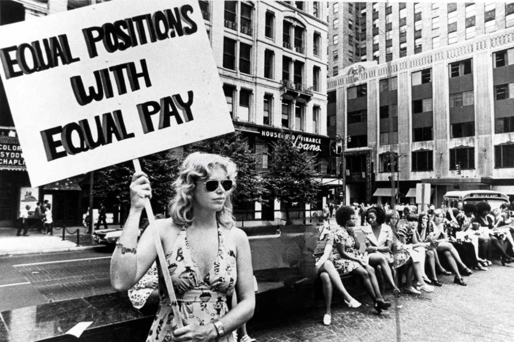

Workplace discrimination continues to present a formidable barrier to achieving genuine employment equality across various industries. Discrimination can occur when individuals are treated unfavorably based on attributes such as race, gender, age, or disability. Addressing these issues is of paramount importance, and the Equal Employment Opportunity Commission (EEOC) serves as a central authority in combatting such biases. The EEOC enforces federal laws designed to ensure fair treatment in the workplace, providing a framework through which complaints are investigated and violators held accountable. 

In parallel, the rise of algorithmic trading within financial sectors has introduced complex dynamics to workplace environments, raising concerns about potential biases these technologies might perpetuate. Algorithmic trading, characterized by the use of computer algorithms to automate trading decisions, can inadvertently embed or amplify existing prejudices. This dual focus on traditional discrimination and emerging challenges necessitated by technological advancements outlines the modern landscape of employment equality efforts.



This article examines these intersecting issues, highlighting the crucial roles played by both regulatory bodies like the EEOC in enforcing anti-discrimination laws and the importance of scrutinizing advancements such as algorithmic trading for potential biases. As we progress further into the digital age, ensuring that such technologies contribute positively to equitable employment practices becomes an essential aspect of ongoing equality initiatives.

## Table of Contents

## Understanding Workplace Discrimination

Workplace discrimination involves treating individuals unfavorably because of personal characteristics that are protected by law. This may include biases based on race, gender, age, disability, religion, national origin, or other attributes. Such discrimination can manifest in various forms within the workplace, including during hiring, promotions, salary determinations, job assignments, and terminations.

The Equal Employment Opportunity Commission (EEOC) is the primary federal agency responsible for enforcing laws related to workplace discrimination in the United States. Established under the Civil Rights Act of 1964, the EEOC enforces statutes including, but not limited to, Title VII of the Civil Rights Act, the Americans with Disabilities Act (ADA), and the Age Discrimination in Employment Act (ADEA). These laws prohibit discrimination and are designed to ensure that all individuals have equal opportunities in employment, irrespective of their personal characteristics.

Discrimination in the workplace can be both direct and indirect. Direct discrimination involves explicit actions or policies that treat a person less favorably because of a specific characteristic. For example, if an employer refuses to hire women for certain jobs, it constitutes direct gender discrimination. Indirect discrimination occurs when a policy or practice appears neutral but disproportionately affects a particular group. For instance, requiring all employees to work on Saturdays may indirectly discriminate against individuals who observe the Sabbath on that day, particularly affecting certain religious groups.

To address these issues, the EEOC investigates complaints of discrimination and has the authority to bring lawsuits against employers who violate anti-discrimination laws. The EEOC also provides guidance and education to employers and employees to help prevent discrimination through training programs, policy development assistance, and public outreach initiatives.

Despite these efforts, workplace discrimination remains a significant challenge. It can lead to various negative outcomes, including reduced employee morale, lower productivity, and higher turnover rates. Moreover, discrimination can have a lasting impact on the affected individuals, perpetuating economic disparities and societal inequities. Addressing workplace discrimination requires a multifaceted approach, including stringent enforcement of legal protections and proactive measures by employers to promote an inclusive environment.

## The Role of the Equal Employment Opportunity Commission (EEOC)

The Equal Employment Opportunity Commission (EEOC) is a federal agency established to enforce laws that prevent workplace discrimination in the United States. Its primary objective is to protect employees and job applicants from discrimination based on characteristics such as race, color, religion, sex, national origin, age, disability, or genetic information. The EEOC plays a critical role in upholding the principles of fairness and equality in employment practices.

One of the core functions of the EEOC is to investigate complaints of discrimination filed by employees or job applicants. When an individual believes they have been subjected to discriminatory practices, they can file a charge with the EEOC. Upon receipt of a charge, the EEOC conducts a thorough investigation to determine whether there has been a violation of the relevant employment laws. If the investigation reveals evidence of discrimination, the EEOC may seek to resolve the issue through mediation or direct negotiation with the employer.

If mediation fails, and the evidence substantiates the claim, the EEOC has the authority to bring lawsuits against employers who are found to have violated anti-discrimination laws. These lawsuits may seek remedies such as back pay, reinstatement, or changes in employer policies to prevent future discrimination. By pursuing legal action, the EEOC not only aims to obtain justice for affected individuals but also seeks to deter and correct discriminatory practices in workplaces.

In addition to its enforcement activities, the EEOC provides training and education to both employers and employees to promote best practices in preventing workplace discrimination. The agency offers resources such as workshops, webinars, and online tools designed to educate participants about their rights and responsibilities under employment discrimination laws. These educational initiatives are crucial in equipping organizations with the knowledge needed to cultivate inclusive and equitable work environments.

The EEOC's dual approach of enforcement and education serves to empower individuals and organizations to take active steps against discrimination. While the Commission ensures compliance through investigations and legal proceedings, its educational programs aim to prevent discriminatory practices from occurring in the first place. By fulfilling these roles, the EEOC strives to create a more equitable landscape for all employees and job applicants.

## Algorithmic Trading and Employment Equality

Algorithmic trading, often used in financial markets, is the execution of trades by predetermined criteria without human intervention. This automation is driven by algorithms that can process vast amounts of data at high speed to make trading decisions. While beneficial for efficiency and removing certain types of human error, algorithmic processes can also unintentionally replicate or even exacerbate existing biases in employment opportunities.

One significant concern is that unchecked algorithms, if based on biased historical data or flawed assumptions, may perpetuate disparities. For example, if an algorithm is trained on data that reflects historical discrimination, it might replicate those patterns by prioritizing candidates from specific demographics over others, thereby maintaining rather than bridging employment gaps. This situation can arise when algorithms are not properly scrutinized for biases in their decision-making processes. Consequently, organizations employing algorithmic systems must exercise diligence to ensure that these algorithms function equitably.

The U.S. Equal Employment Opportunity Commission (EEOC) recognizes these potential issues and scrutinizes how such technologies relate to existing anti-discrimination laws. The Commission engages with developers and employers to understand how algorithms are applied in employment settings and ensures compliance with laws such as the Civil Rights Act and the Americans with Disabilities Act. By overseeing these practices, the EEOC aims to prevent the reinforcement of inequities that could otherwise be overlooked when technological systems are implemented without proper oversight or understanding.

In formalizing guidelines and preparing interventions, the EEOC seeks to harmonize technological advancement with employment equality. This oversight includes examining algorithmic parameters and evaluating their outcomes to ascertain whether they foster inclusive and fair hiring processes. Such efforts are critical in ensuring that technological progress does not compromise the fundamental principles of employment equality and that innovative solutions are aligned with legal and ethical standards.

## Challenges and Opportunities with AI in Employment

Artificial Intelligence (AI) and algorithmic tools present significant opportunities to enhance employment practices, particularly by mitigating human biases in recruiting decisions. Through the use of [machine learning](/wiki/machine-learning) models, organizations can potentially analyze large datasets more objectively than humans, identifying candidates who best match job requirements without the influence of personal prejudice. For example, AI algorithms can employ natural language processing (NLP) tools to parse resumes and identify key skills and experiences without consideration of demographic information, which can help in promoting diversity.

Despite these promising applications, AI systems also present challenges in maintaining employment equality. If algorithms are trained on biased historical data, they may perpetuate or even amplify existing disparities. A study by ProPublica highlighted such risks with predictive policing algorithms where biased data led to biased outcomes. In the employment context, AI systems could inadvertently favor candidates from dominant demographic groups if past hiring data reflects such trends.

The lack of transparency in AI decision-making processes further complicates these challenges. Algorithms often operate as "black boxes," where their decision-making criteria are not accessible or understandable to users. This opaqueness can make it difficult to identify and correct bias, leading to systemic discrimination. 

Given these concerns, the Equal Employment Opportunity Commission (EEOC) has undertaken initiatives to address AI-induced biases. The EEOC aims to ensure that AI tools comply with anti-discrimination laws, promoting fairness in employment practices. This includes guidance for organizations on auditing AI systems to detect biases and implementing corrective measures. The EEOC also encourages collaboration with AI developers to create transparent and inclusive algorithms.

To summarize, while AI offers significant potential to improve equality in employment decisions, it also necessitates diligent oversight to prevent systemic biases. The role of the EEOC is crucial in establishing standards and practices that ensure AI tools contribute positively to workplace equality.

## Best Practices for Ensuring Equity in Algorithmic Decisions

Ensuring equity in algorithmic decisions requires a comprehensive approach involving the evaluation, collaboration, and ongoing management of algorithms used in various workplace applications. This process begins with the thorough examination of algorithms for potential biases that could adversely affect employment decisions. Such biases can arise from historical data that algorithms may use, inadvertently perpetuating existing disparities or introducing new forms of discrimination.

To identify and mitigate biases, organizations should employ diverse datasets during the testing phase. Techniques such as fairness-aware machine learning should be utilized to address possible discrimination in algorithmic outcomes. These methods include pre-processing data to reduce bias, employing fairness constraints during model training, and post-processing results to enhance equitable outcomes.

Collaboration between developers and employers is crucial to ensuring fairness in AI applications. Developers, who possess technical expertise, must work closely with employers, who understand the organizational and societal context, to design algorithms that are not only efficient but also equitable. This partnership should involve stakeholders from diverse backgrounds, to provide various perspectives and insights into potential algorithmic biases.

Ongoing monitoring and adjustment of algorithms are essential to maintain compliance with EEOC guidelines and ensure that any unintentional bias is addressed promptly. This involves the implementation of a feedback loop where algorithmic performance is continually assessed against fairness metrics and legal standards. Regular audits and updates can ensure that the algorithms remain aligned with ethical guidelines and workforce equality objectives.

In practice, organizations might implement the following Python-based approach to evaluate algorithms for fairness:

```python
from fairlearn.metrics import demographic_parity_difference
from fairlearn.reductions import ExponentiatedGradient, DemographicParity

def evaluate_model_fairness(predictor, X, y_true):
    preds = predictor.predict(X)
    dp_difference = demographic_parity_difference(y_true, preds)

    if dp_difference > acceptable_threshold:
        print(f"Bias detected: Demographic Parity Difference is {dp_difference}")
        # Adjust model with ExponentiatedGradient
        mitigator = ExponentiatedGradient(
            estimator=predictor,
            constraints=DemographicParity()
        )
        mitigator.fit(X, y_true)
        preds = mitigator.predict(X)
        new_dp_difference = demographic_parity_difference(y_true, preds)
        print(f"Adjusted Demographic Parity Difference is {new_dp_difference}")
    else:
        print("Model is within acceptable fairness limits.")
```

In this example, the code evaluates a given model's predictions for biases using the demographic parity difference metric. It demonstrates how collaborative efforts can incorporate technical solutions and organizational goals to ensure equitable algorithmic practices.

While algorithms have the potential to drive efficiency and objectivity, ensuring that they promote fairness and equity is vital for fostering inclusive workplaces. Through rigorous testing, collaborative development, and continual oversight, organizations can leverage technology responsibly and ethically.

## Conclusion

Achieving employment equality demands unwavering enforcement of anti-discrimination laws, alongside a conscientious deployment of technological solutions. The Equal Employment Opportunity Commission (EEOC) continues to be instrumental in leading businesses toward equitable employment practices by providing critical oversight, education, and legal interventions. As [algorithmic trading](/wiki/algorithmic-trading) and [artificial intelligence](/wiki/ai-artificial-intelligence) (AI) become increasingly integrated into workplace operations, their potential impact on employment equality necessitates careful scrutiny.

Algorithmic systems are capable of transforming workplace dynamics, offering both challenges and opportunities in promoting fairness. While these technologies hold promise for reducing human bias in hiring and promotion decisions, they also pose risks of perpetuating systemic discrimination if not properly managed. It is therefore essential for organizations to commit to rigorous evaluation and testing of algorithms for biases, ensuring alignment with established anti-discrimination laws.

The EEOC's proactive approach in studying and addressing AI-related biases reflects the need for ongoing vigilance. Through collaboration with developers and employers, the EEOC aids in crafting frameworks that uphold fairness and compliance with legal standards. As these technologies continue to evolve, the outcomes they produce in terms of workplace equality must be closely examined to ensure they contribute to an equitable employment landscape.

## References & Further Reading

[1]: U.S. Equal Employment Opportunity Commission. ["Laws Enforced by the EEOC."](https://www.eeoc.gov/youth/what-laws-does-eeoc-enforce) 

[2]: Barocas, S., Hardt, M., & Narayanan, A. (2019). ["Fairness and Machine Learning: Limitations and Opportunities."](https://www.semanticscholar.org/paper/Fairness-and-Machine-Learning-Limitations-and-Barocas-Hardt/bae7f0b3448a3eac77886f2a683c0cf9256bb8bf) 

[3]: Whittaker, M., Alper, M., Bennett, C. L., Hendren, S., Kaziunas, E., Mills, M., & Wolfe, R. (2019). ["Disability, Bias, and AI."](https://ainowinstitute.org/publication/disabilitybiasai-2019) AI Now Institute.

[4]: ProPublica. ["Machine Bias: There’s Software Used Across the Country to Predict Future Criminals. And it’s Biased Against Blacks."](https://www.propublica.org/article/machine-bias-risk-assessments-in-criminal-sentencing) 

[5]: Martin, K., & Irvine, J. M. (2020). ["The Bias of 'Big Data'."](https://kirstenmartin.net/all-papers/) Harvard Business Review.