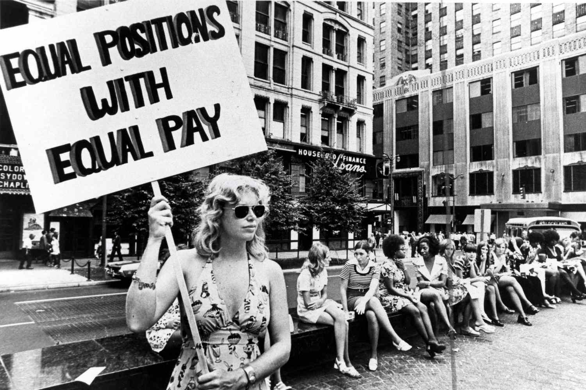

## Table of Contents

## What is the Equal Pay Act of 1963?

The Equal Pay Act of 1963 is a law in the United States that says men and women should get the same pay for doing the same job. It was made to stop companies from paying women less money just because they are women. This law helps make sure everyone gets treated fairly at work.

Before this law, many women were paid less than men for doing the same work. The Equal Pay Act changed that by making it illegal to have different pay for men and women doing equal work. It was a big step towards equal rights for women in the workplace.

## Why was the Equal Pay Act of 1963 introduced?

The Equal Pay Act of 1963 was introduced because many women were being paid less than men for doing the same jobs. This was not fair, and it made life harder for women who needed to support themselves and their families. People wanted to change this unfair situation, so they pushed for a law that would make sure everyone got paid the same for the same work, no matter if they were a man or a woman.

At the time, there were many movements fighting for equal rights for women. The Equal Pay Act was part of these efforts to make society more fair. By making it a law that men and women had to be paid equally for equal work, the government took a big step towards helping women have the same opportunities and respect as men in the workplace. This law was a key part of the larger fight for gender equality.

## What are the key provisions of the Equal Pay Act of 1963?

The Equal Pay Act of 1963 says that men and women should get the same pay if they do the same kind of work. This means that if a man and a woman are doing jobs that need the same skills, effort, and responsibility, they should earn the same amount of money. The law also covers jobs that are done under similar working conditions. This rule helps make sure that companies can't pay women less just because they are women.

There are some exceptions to the rule, though. Companies can pay different amounts if the difference is based on things like seniority, how good someone is at their job, how much they work, or other reasons that are not about being a man or a woman. But these reasons have to be fair and not just excuses to pay women less. The Equal Pay Act helps make the workplace more fair by making sure pay is based on what people do, not who they are.

## How does the Equal Pay Act of 1963 define 'equal work'?

The Equal Pay Act of 1963 says that 'equal work' means jobs that need the same skills, effort, and responsibility. This means that if a man and a woman are doing jobs that are very similar, they should get paid the same amount of money. The law looks at what people do at work, not who they are, to decide if their work is equal.

The law also says that the jobs should be done under similar working conditions to be considered equal work. This means that if two people are doing the same kind of job in similar places or under similar rules, they should be paid the same. The Equal Pay Act helps make sure that pay is fair by looking at these things to see if work is equal.

## What exceptions does the Equal Pay Act of 1963 allow for pay differences?

The Equal Pay Act of 1963 allows for pay differences if they are based on certain fair reasons. These reasons include seniority, which means how long someone has been working at a company. If someone has been there longer, they might get paid more. Another reason is merit, which means how well someone does their job. If someone is really good at their job, they can be paid more than someone who is not as good.

Another reason for pay differences is the quantity or quality of work. This means if someone works more hours or does better work, they can get paid more. The last reason is any [factor](/wiki/factor-investing) other than sex. This means that as long as the reason for paying someone more is not because they are a man or a woman, it can be okay. These exceptions make sure that pay differences are fair and not just because of someone's gender.

## How has the Equal Pay Act of 1963 impacted wage equality in the United States?

The Equal Pay Act of 1963 has helped make wage equality better in the United States. Before the law, it was common for women to get paid less than men for doing the same job. The law made it illegal to pay women less just because they are women. This has led to more fairness in pay over time. Many women now get paid the same as men for doing the same work, which helps them support themselves and their families better.

However, even with the Equal Pay Act, there is still work to be done. Some women still earn less than men for the same jobs. This can happen because of things like how jobs are valued or because of discrimination that is hard to see. The law has made a big difference, but people keep working to make sure everyone gets paid fairly, no matter if they are a man or a woman. The Equal Pay Act was an important step, but the fight for equal pay continues.

## What are the enforcement mechanisms of the Equal Pay Act of 1963?

The Equal Pay Act of 1963 is enforced by the U.S. Department of Labor and the Equal Employment Opportunity Commission (EEOC). If someone thinks they are not getting paid the same as someone else for doing the same job because of their gender, they can file a complaint with the EEOC. The EEOC then looks into the complaint to see if the law was broken. If they find that the Equal Pay Act was not followed, they can help the person who filed the complaint get back pay and other things they lost because of the pay difference.

If the EEOC cannot solve the problem, the person can also take their case to court. In court, they can ask for money to make up for what they lost and to punish the company for breaking the law. This can include back pay, which is the money they should have been paid all along, and sometimes even more money as a penalty. These enforcement mechanisms help make sure companies follow the Equal Pay Act and treat everyone fairly when it comes to pay.

## How does the Equal Pay Act of 1963 relate to other civil rights legislation?

The Equal Pay Act of 1963 is part of a bigger push for civil rights in the United States. It came at a time when many people were fighting for equal rights for everyone, no matter their race, gender, or other differences. The law works alongside other important civil rights legislation, like the Civil Rights Act of 1964, which made it illegal to treat people unfairly because of their race, color, religion, sex, or national origin. Both laws help make sure everyone is treated fairly and have the same opportunities.

The Equal Pay Act specifically focuses on making sure men and women get paid the same for doing the same work. This is a key part of gender equality, which is also covered by the Civil Rights Act of 1964. Together, these laws help create a fairer society by tackling different kinds of discrimination. While the Equal Pay Act deals with pay differences, other civil rights laws address broader issues of discrimination in areas like employment, housing, and education. By working together, these laws help build a more equal and just society.

## What are some notable court cases that have interpreted the Equal Pay Act of 1963?

One important court case about the Equal Pay Act is Corning Glass Works v. Brennan in 1974. In this case, the Supreme Court said that the Equal Pay Act means companies can't pay women less just because they are women. At Corning Glass Works, men and women were doing the same job but women were paid less. The court decided that this was not fair and that the company had to pay women the same as men for doing the same work. This case helped make the Equal Pay Act stronger and clearer.

Another big case is Ledbetter v. Goodyear Tire & Rubber Co. in 2007. Lilly Ledbetter, a woman who worked at Goodyear, found out she was paid less than men doing the same job. She sued the company, but the Supreme Court said she waited too long to file her complaint. This decision made it harder for people to fight pay discrimination. But it led to the Lilly Ledbetter Fair Pay Act in 2009, which changed the law to make it easier for people to challenge unfair pay. These cases show how courts help shape and explain the Equal Pay Act to make sure it works to protect people's rights.

## How have amendments and subsequent laws affected the implementation of the Equal Pay Act of 1963?

The Equal Pay Act of 1963 has been affected by other laws and changes over time. One big change came with the Lilly Ledbetter Fair Pay Act of 2009. This law made it easier for people to fight pay discrimination. Before, if someone didn't find out they were paid less right away, they might not be able to do anything about it. The Lilly Ledbetter Fair Pay Act changed that by saying the time to file a complaint starts over each time someone gets a paycheck that is unfair. This helps more people stand up for their rights and get paid fairly.

Another important law is the Civil Rights Act of 1991. This law added to the Equal Pay Act by allowing people to get more money if they win a case about unfair pay. It also made it easier to show that a company was discriminating on purpose. These changes help make sure that the Equal Pay Act works better to stop companies from paying women less just because they are women. Together, these laws and amendments have made the Equal Pay Act stronger and more effective in fighting for equal pay.

## What are the current challenges and criticisms facing the Equal Pay Act of 1963?

Even though the Equal Pay Act of 1963 has helped make things fairer, there are still some problems with it. One big challenge is that it can be hard to prove that someone is being paid less because of their gender. Companies might say they pay different amounts for other reasons, like how long someone has worked there or how good they are at their job. It can be tough to show that these reasons are not fair or are just excuses to pay women less. This makes it harder for people to use the law to fight for equal pay.

Another criticism is that the Equal Pay Act doesn't cover all kinds of pay differences. For example, it might not help if women are paid less because they are more likely to work in certain jobs that pay less. This is called the "gender pay gap." Some people think the law should do more to fix these bigger problems. Even with the Equal Pay Act, women still often earn less than men overall. This shows that while the law has made things better, there is still work to do to make sure everyone gets paid fairly.

## What future reforms are being discussed to enhance the effectiveness of the Equal Pay Act of 1963?

People are talking about different ways to make the Equal Pay Act of 1963 work better. One idea is to make it easier for people to see if they are being paid less than others for doing the same job. This could mean making companies share information about what they pay their workers. If everyone can see the pay differences, it might be easier to spot when someone is being paid less because they are a woman. Another idea is to make the rules about what counts as "equal work" clearer. This would help people know for sure if they should be paid the same as someone else.

Another big change people are discussing is to do more about the overall gender pay gap. Even though the Equal Pay Act helps when men and women do the same job, it doesn't fix the problem that women often work in jobs that pay less. Some people want the law to do more to make sure all jobs are valued fairly, no matter who usually works in them. This could help close the gap between what men and women earn overall. By making these changes, the Equal Pay Act could work better to make sure everyone gets paid fairly.

## References & Further Reading

[1]: ["The Equal Pay Act of 1963"](https://www.eeoc.gov/statutes/equal-pay-act-1963) - U.S. Equal Employment Opportunity Commission.

[2]: Blau, F. D., & Kahn, L. M. (2000). ["Gender Differences in Pay."](https://www.jstor.org/stable/2647076) National Bureau of Economic Research.

[3]: Goldin, C. (2014). ["A Grand Gender Convergence: Its Last Chapter"](https://scholar.harvard.edu/files/goldin/files/goldin_aeapress_2014_1.pdf). Journal of Economic Perspectives, 27(4), 109-126.

[4]: Bessen, J. E. (2019). ["AI and Jobs: The Role of Demand"](https://www.nber.org/papers/w24235). National Bureau of Economic Research Working Paper Series.

[5]: Cowgill, B., Dell'Acqua, F., & Deng, S. (2020). ["Biased Programmers? Or Biased Data? A Field Experiment in Operationalizing AI Ethics."](https://papers.ssrn.com/sol3/papers.cfm?abstract_id=3615404) Social Science Research Network.